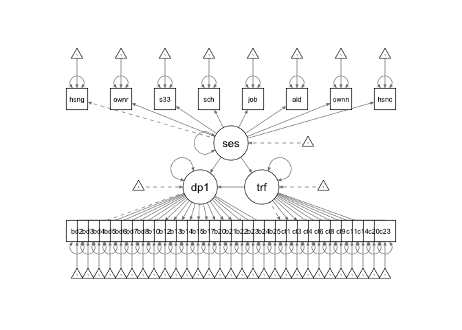

drak\_ct
================
Tatini Mal-Sarkar
12/24/2018

Loading the data
================

``` r
drak = read_csv("/Users/tatinimal-sarkar/Documents/mph2/practicum/thesis/data/KerryDataRequestV2_visit1_c.csv") %>% 
  select(-ASSIST_Tobacco_Score:-opioids_preg_any,
         -AQ1a:-AQ14b,
         -pdiq1_afr:-pdiq13_xho,
         -leq1_1_afr:-leq51_2_xho,
         -ipvq1_afr:-ipvq17_xho,
         -epdsq1_afr:-epdsq10_xho,
         -bdiq1_afr:-bdiq25_2_xho,
         -srqq1_afr:-srqq20_xho) %>% 
  mutate(ethnicity = as.numeric(ethnicity > 1),
         clinic = as.numeric(Clinic > 1),
         bdi = bdiq2 + bdiq3 + bdiq4 + bdiq5 + bdiq6 + bdiq7 + bdiq8 + bdiq10 + bdiq12 + bdiq13 + bdiq14 + bdiq15 + bdiq17 + bdiq20 + bdiq21 + bdiq22_1 + bdiq23_1 + bdiq24_1 + bdiq25_1,
         revsum9 = 5 - sumses9) %>% 
  filter(SESaQ31_1 != 6,
         SESaQ34_1 != 4) %>% 
  mutate(housing = as.numeric(SESaQ31_1 > 2),
         owner = as.numeric(SESaQ34_1 == 1),
         ses = revsum9 + housing + owner + sumses33) %>% 
  select(-Clinic) %>% 
  mutate(kids = 5 - SESaQ1,
         people = 20 - SESaQ2,
         adults = 3 - SESaQ3_1,
         school = SESaQ14 - 2,
         job = 6 - SESaQ15_1,
         aid = 1 - SESaQ16,
         ownincome = SESaQ18,
         houseincome = SESaQ19
         ) %>%
  filter(
         job != -3,
         ownincome != 99,
         ownincome != 9999,
         houseincome != 99,
         houseincome != 9999) %>% 
  mutate(ses = housing + owner + sumses33 + school + job + aid + ownincome + houseincome,
         bdi = bdiq2 + bdiq3 + bdiq4 + bdiq5 + bdiq6 + bdiq7 + bdiq8 + bdiq10 + bdiq12 + bdiq13 + bdiq14 + bdiq15 + bdiq17 + bdiq20 + bdiq21 + bdiq22_1 + bdiq23_1 + bdiq24_1 + bdiq25_1)
```

    ## Parsed with column specification:
    ## cols(
    ##   .default = col_character(),
    ##   shortpid = col_integer(),
    ##   mother_age_at_enrolment = col_double(),
    ##   SESaQ1 = col_integer(),
    ##   SESaQ2 = col_integer(),
    ##   SESaQ3_1 = col_integer(),
    ##   SESaQ3_2 = col_integer(),
    ##   SESaQ4_1 = col_integer(),
    ##   SESaQ4_2 = col_integer(),
    ##   SESaQ5 = col_integer(),
    ##   SESaQ6_1 = col_integer(),
    ##   SESaQ6_2 = col_integer(),
    ##   SESaQ7 = col_integer(),
    ##   SESaQ8_1 = col_integer(),
    ##   SESaQ8_2 = col_integer(),
    ##   SESaQ9_1 = col_integer(),
    ##   SESaQ9_2 = col_integer(),
    ##   SESaQ9_3 = col_integer(),
    ##   SESaQ9_4 = col_integer(),
    ##   SESaQ9_5 = col_integer(),
    ##   SESaQ9_6 = col_integer()
    ##   # ... with 421 more columns
    ## )

    ## See spec(...) for full column specifications.

Socioeconomic status and depression
===================================

``` r
model <- 'ses =~ housing + owner + sumses33 + school + job + aid + ownincome + houseincome 
depf1 =~ bdiq2 + bdiq3 + bdiq4 + bdiq5 + bdiq6 + bdiq7 + bdiq8 + bdiq10 + bdiq12 + bdiq13 + bdiq14 + bdiq15 + bdiq17 + bdiq20 + bdiq21 + bdiq22_1 + bdiq23_1 + bdiq24_1 + bdiq25_1

depf1 ~ ses '

fit <- sem(model, data = drak, missing = 'fiml.x', group = "clinic")
```

    ## Warning in lav_object_post_check(object): lavaan WARNING: some estimated ov
    ## variances are negative

``` r
summary(fit)
```

    ## lavaan 0.6-3 ended normally after 134 iterations
    ## 
    ##   Optimization method                           NLMINB
    ##   Number of free parameters                        164
    ## 
    ##   Number of observations per group         
    ##   0                                                542
    ##   1                                                424
    ##   Number of missing patterns per group     
    ##   0                                                 12
    ##   1                                                  5
    ## 
    ##   Estimator                                         ML
    ##   Model Fit Test Statistic                    2591.920
    ##   Degrees of freedom                               646
    ##   P-value (Chi-square)                           0.000
    ## 
    ## Chi-square for each group:
    ## 
    ##   0                                           1441.797
    ##   1                                           1150.122
    ## 
    ## Parameter Estimates:
    ## 
    ##   Information                                 Observed
    ##   Observed information based on                Hessian
    ##   Standard Errors                             Standard
    ## 
    ## 
    ## Group 1 [0]:
    ## 
    ## Latent Variables:
    ##                    Estimate  Std.Err  z-value  P(>|z|)
    ##   ses =~                                              
    ##     housing           1.000                           
    ##     owner             0.277    0.054    5.093    0.000
    ##     sumses33          4.270    0.563    7.582    0.000
    ##     school            0.559    0.101    5.525    0.000
    ##     job              -0.066    0.235   -0.283    0.777
    ##     aid               0.098    0.067    1.457    0.145
    ##     ownincome        -0.005    0.055   -0.095    0.924
    ##     houseincome       0.061    0.099    0.621    0.534
    ##   depf1 =~                                            
    ##     bdiq2             1.000                           
    ##     bdiq3             1.155    0.091   12.628    0.000
    ##     bdiq4             1.493    0.109   13.636    0.000
    ##     bdiq5             0.938    0.082   11.490    0.000
    ##     bdiq6             1.347    0.100   13.485    0.000
    ##     bdiq7             1.229    0.094   13.032    0.000
    ##     bdiq8             1.582    0.121   13.109    0.000
    ##     bdiq10            1.220    0.105   11.595    0.000
    ##     bdiq12            1.240    0.094   13.187    0.000
    ##     bdiq13            1.291    0.093   13.847    0.000
    ##     bdiq14            1.232    0.088   13.989    0.000
    ##     bdiq15            1.287    0.094   13.663    0.000
    ##     bdiq17            1.020    0.088   11.548    0.000
    ##     bdiq20            1.305    0.100   12.991    0.000
    ##     bdiq21            1.259    0.124   10.191    0.000
    ##     bdiq22_1          0.057    0.020    2.835    0.005
    ##     bdiq23_1          0.041    0.013    3.187    0.001
    ##     bdiq24_1          0.018    0.008    2.324    0.020
    ##     bdiq25_1          0.014    0.006    2.179    0.029
    ## 
    ## Regressions:
    ##                    Estimate  Std.Err  z-value  P(>|z|)
    ##   depf1 ~                                             
    ##     ses              -0.195    0.061   -3.192    0.001
    ## 
    ## Intercepts:
    ##                    Estimate  Std.Err  z-value  P(>|z|)
    ##    .housing           0.561    0.021   26.312    0.000
    ##    .owner             0.247    0.019   13.342    0.000
    ##    .sumses33          4.319    0.078   55.588    0.000
    ##    .school            2.345    0.033   70.128    0.000
    ##    .job               2.293    0.075   30.616    0.000
    ##    .aid               0.511    0.021   23.802    0.000
    ##    .ownincome         1.212    0.018   66.846    0.000
    ##    .houseincome       1.662    0.029   57.538    0.000
    ##    .bdiq2             0.359    0.030   12.021    0.000
    ##    .bdiq3             0.428    0.033   12.947    0.000
    ##    .bdiq4             0.618    0.038   16.423    0.000
    ##    .bdiq5             0.374    0.030   12.661    0.000
    ##    .bdiq6             0.405    0.035   11.733    0.000
    ##    .bdiq7             0.404    0.033   12.222    0.000
    ##    .bdiq8             0.577    0.042   13.674    0.000
    ##    .bdiq10            0.480    0.038   12.571    0.000
    ##    .bdiq12            0.482    0.033   14.663    0.000
    ##    .bdiq13            0.420    0.032   13.152    0.000
    ##    .bdiq14            0.335    0.030   11.084    0.000
    ##    .bdiq15            0.464    0.032   14.374    0.000
    ##    .bdiq17            0.444    0.032   13.844    0.000
    ##    .bdiq20            0.524    0.035   14.979    0.000
    ##    .bdiq21            0.638    0.046   13.928    0.000
    ##    .bdiq22_1          0.037    0.008    4.560    0.000
    ##    .bdiq23_1          0.015    0.005    2.852    0.004
    ##    .bdiq24_1          0.006    0.003    1.739    0.082
    ##    .bdiq25_1          0.004    0.003    1.418    0.156
    ##     ses               0.000                           
    ##    .depf1             0.000                           
    ## 
    ## Variances:
    ##                    Estimate  Std.Err  z-value  P(>|z|)
    ##    .housing           0.107    0.019    5.715    0.000
    ##    .owner             0.175    0.011   16.083    0.000
    ##    .sumses33          0.721    0.325    2.221    0.026
    ##    .school            0.562    0.035   16.187    0.000
    ##    .job               3.041    0.185   16.461    0.000
    ##    .aid               0.249    0.015   16.422    0.000
    ##    .ownincome         0.178    0.011   16.462    0.000
    ##    .houseincome       0.452    0.027   16.451    0.000
    ##    .bdiq2             0.304    0.019   15.601    0.000
    ##    .bdiq3             0.351    0.023   15.480    0.000
    ##    .bdiq4             0.368    0.025   14.945    0.000
    ##    .bdiq5             0.314    0.020   15.721    0.000
    ##    .bdiq6             0.321    0.021   14.968    0.000
    ##    .bdiq7             0.320    0.021   15.210    0.000
    ##    .bdiq8             0.513    0.034   15.225    0.000
    ##    .bdiq10            0.522    0.033   15.720    0.000
    ##    .bdiq12            0.309    0.020   15.179    0.000
    ##    .bdiq13            0.252    0.017   14.759    0.000
    ##    .bdiq14            0.222    0.015   14.715    0.000
    ##    .bdiq15            0.266    0.018   14.822    0.000
    ##    .bdiq17            0.368    0.023   15.683    0.000
    ##    .bdiq20            0.357    0.023   15.185    0.000
    ##    .bdiq21            0.845    0.053   15.921    0.000
    ##    .bdiq22_1          0.035    0.002   16.363    0.000
    ##    .bdiq23_1          0.014    0.001   16.357    0.000
    ##    .bdiq24_1          0.006    0.000   16.355    0.000
    ##    .bdiq25_1          0.004    0.000   16.372    0.000
    ##     ses               0.140    0.022    6.312    0.000
    ##    .depf1             0.173    0.023    7.543    0.000
    ## 
    ## 
    ## Group 2 [1]:
    ## 
    ## Latent Variables:
    ##                    Estimate  Std.Err  z-value  P(>|z|)
    ##   ses =~                                              
    ##     housing           1.000                           
    ##     owner            -0.128    0.079   -1.614    0.107
    ##     sumses33          4.930    0.442   11.141    0.000
    ##     school            0.899    0.120    7.493    0.000
    ##     job               0.457    0.198    2.312    0.021
    ##     aid               0.339    0.082    4.125    0.000
    ##     ownincome         0.293    0.078    3.743    0.000
    ##     houseincome       0.598    0.128    4.673    0.000
    ##   depf1 =~                                            
    ##     bdiq2             1.000                           
    ##     bdiq3             1.050    0.100   10.489    0.000
    ##     bdiq4             1.048    0.098   10.649    0.000
    ##     bdiq5             0.893    0.085   10.454    0.000
    ##     bdiq6             1.269    0.129    9.837    0.000
    ##     bdiq7             0.942    0.092   10.204    0.000
    ##     bdiq8             1.364    0.126   10.854    0.000
    ##     bdiq10            1.236    0.142    8.675    0.000
    ##     bdiq12            1.052    0.104   10.085    0.000
    ##     bdiq13            1.077    0.110    9.833    0.000
    ##     bdiq14            0.987    0.095   10.422    0.000
    ##     bdiq15            0.726    0.093    7.796    0.000
    ##     bdiq17            0.756    0.097    7.757    0.000
    ##     bdiq20            0.578    0.093    6.191    0.000
    ##     bdiq21            0.636    0.116    5.486    0.000
    ##     bdiq22_1          0.294    0.044    6.648    0.000
    ##     bdiq23_1          0.275    0.039    6.956    0.000
    ##     bdiq24_1          0.207    0.037    5.578    0.000
    ##     bdiq25_1          0.224    0.038    5.842    0.000
    ## 
    ## Regressions:
    ##                    Estimate  Std.Err  z-value  P(>|z|)
    ##   depf1 ~                                             
    ##     ses              -0.078    0.071   -1.096    0.273
    ## 
    ## Intercepts:
    ##                    Estimate  Std.Err  z-value  P(>|z|)
    ##    .housing           0.684    0.023   30.292    0.000
    ##    .owner             0.469    0.024   19.365    0.000
    ##    .sumses33          5.317    0.075   70.933    0.000
    ##    .school            2.366    0.038   62.646    0.000
    ##    .job               3.340    0.063   53.101    0.000
    ##    .aid               0.492    0.024   20.236    0.000
    ##    .ownincome         1.276    0.025   51.886    0.000
    ##    .houseincome       1.962    0.040   49.077    0.000
    ##    .bdiq2             0.368    0.035   10.600    0.000
    ##    .bdiq3             0.396    0.037   10.812    0.000
    ##    .bdiq4             0.540    0.035   15.256    0.000
    ##    .bdiq5             0.429    0.030   14.131    0.000
    ##    .bdiq6             0.528    0.047   11.290    0.000
    ##    .bdiq7             0.335    0.033   10.030    0.000
    ##    .bdiq8             0.474    0.044   10.718    0.000
    ##    .bdiq10            0.673    0.052   12.832    0.000
    ##    .bdiq12            0.514    0.037   13.958    0.000
    ##    .bdiq13            0.545    0.040   13.632    0.000
    ##    .bdiq14            0.337    0.034    9.897    0.000
    ##    .bdiq15            0.729    0.035   20.655    0.000
    ##    .bdiq17            0.825    0.037   22.542    0.000
    ##    .bdiq20            0.877    0.036   24.235    0.000
    ##    .bdiq21            0.939    0.046   20.514    0.000
    ##    .bdiq22_1          0.144    0.017    8.449    0.000
    ##    .bdiq23_1          0.109    0.015    7.191    0.000
    ##    .bdiq24_1          0.099    0.015    6.833    0.000
    ##    .bdiq25_1          0.106    0.015    7.101    0.000
    ##     ses               0.000                           
    ##    .depf1             0.000                           
    ## 
    ## Variances:
    ##                    Estimate  Std.Err  z-value  P(>|z|)
    ##    .housing           0.116    0.010   11.434    0.000
    ##    .owner             0.247    0.017   14.550    0.000
    ##    .sumses33         -0.054    0.199   -0.273    0.785
    ##    .school            0.524    0.037   14.341    0.000
    ##    .job               1.656    0.114   14.561    0.000
    ##    .aid               0.238    0.017   14.348    0.000
    ##    .ownincome         0.248    0.017   14.524    0.000
    ##    .houseincome       0.642    0.044   14.476    0.000
    ##    .bdiq2             0.322    0.024   13.338    0.000
    ##    .bdiq3             0.361    0.027   13.350    0.000
    ##    .bdiq4             0.324    0.024   13.243    0.000
    ##    .bdiq5             0.240    0.018   13.296    0.000
    ##    .bdiq6             0.624    0.046   13.573    0.000
    ##    .bdiq7             0.305    0.023   13.449    0.000
    ##    .bdiq8             0.478    0.037   13.078    0.000
    ##    .bdiq10            0.876    0.063   13.879    0.000
    ##    .bdiq12            0.366    0.027   13.394    0.000
    ##    .bdiq13            0.458    0.034   13.581    0.000
    ##    .bdiq14            0.308    0.023   13.325    0.000
    ##    .bdiq15            0.428    0.030   14.061    0.000
    ##    .bdiq17            0.461    0.033   14.060    0.000
    ##    .bdiq20            0.493    0.034   14.290    0.000
    ##    .bdiq21            0.811    0.056   14.370    0.000
    ##    .bdiq22_1          0.107    0.008   14.212    0.000
    ##    .bdiq23_1          0.083    0.006   14.173    0.000
    ##    .bdiq24_1          0.081    0.006   14.321    0.000
    ##    .bdiq25_1          0.086    0.006   14.316    0.000
    ##     ses               0.100    0.014    7.128    0.000
    ##    .depf1             0.188    0.029    6.537    0.000

Socioeconomic status, depression, and 1-factor childhood trauma
===============================================================

``` r
model <- 'ses =~ housing + owner + sumses33 + school + job + aid + ownincome + houseincome
depf1 =~ bdiq2 + bdiq3 + bdiq4 + bdiq5 + bdiq6 + bdiq7 + bdiq8 + bdiq10 + bdiq12 + bdiq13 + bdiq14 + bdiq15 + bdiq17 + bdiq20 + bdiq21 + bdiq22_1 + bdiq23_1 + bdiq24_1 + bdiq25_1
trauf =~ ctq1 + ctq3 + ctq4 + ctq6 + ctq8 + ctq9 + ctq11 + ctq14 + ctq20 + ctq23 

depf1 ~ b*trauf + c*ses
trauf ~ a*ses

indirect := a*b
total := c + (a*b)
'

fit <- sem(model, drak, missing = 'fiml.x', group = "clinic")
summary(fit)
```

    ## lavaan 0.6-3 ended normally after 174 iterations
    ## 
    ##   Optimization method                           NLMINB
    ##   Number of free parameters                        228
    ## 
    ##   Number of observations per group         
    ##   0                                                542
    ##   1                                                424
    ##   Number of missing patterns per group     
    ##   0                                                 17
    ##   1                                                  6
    ## 
    ##   Estimator                                         ML
    ##   Model Fit Test Statistic                    4063.596
    ##   Degrees of freedom                              1252
    ##   P-value (Chi-square)                           0.000
    ## 
    ## Chi-square for each group:
    ## 
    ##   0                                           2198.173
    ##   1                                           1865.423
    ## 
    ## Parameter Estimates:
    ## 
    ##   Information                                 Observed
    ##   Observed information based on                Hessian
    ##   Standard Errors                             Standard
    ## 
    ## 
    ## Group 1 [0]:
    ## 
    ## Latent Variables:
    ##                    Estimate  Std.Err  z-value  P(>|z|)
    ##   ses =~                                              
    ##     housing           1.000                           
    ##     owner             0.275    0.054    5.051    0.000
    ##     sumses33          4.292    0.550    7.805    0.000
    ##     school            0.564    0.101    5.598    0.000
    ##     job              -0.070    0.234   -0.301    0.764
    ##     aid               0.096    0.067    1.434    0.151
    ##     ownincome        -0.005    0.055   -0.089    0.929
    ##     houseincome       0.062    0.098    0.634    0.526
    ##   depf1 =~                                            
    ##     bdiq2             1.000                           
    ##     bdiq3             1.154    0.091   12.650    0.000
    ##     bdiq4             1.489    0.109   13.653    0.000
    ##     bdiq5             0.935    0.081   11.493    0.000
    ##     bdiq6             1.344    0.100   13.500    0.000
    ##     bdiq7             1.227    0.094   13.051    0.000
    ##     bdiq8             1.578    0.120   13.122    0.000
    ##     bdiq10            1.220    0.105   11.626    0.000
    ##     bdiq12            1.237    0.094   13.201    0.000
    ##     bdiq13            1.290    0.093   13.872    0.000
    ##     bdiq14            1.231    0.088   14.017    0.000
    ##     bdiq15            1.287    0.094   13.692    0.000
    ##     bdiq17            1.018    0.088   11.557    0.000
    ##     bdiq20            1.304    0.100   13.019    0.000
    ##     bdiq21            1.256    0.123   10.191    0.000
    ##     bdiq22_1          0.057    0.020    2.848    0.004
    ##     bdiq23_1          0.041    0.013    3.179    0.001
    ##     bdiq24_1          0.018    0.008    2.303    0.021
    ##     bdiq25_1          0.014    0.006    2.169    0.030
    ##   trauf =~                                            
    ##     ctq1              1.000                           
    ##     ctq3              0.979    0.216    4.524    0.000
    ##     ctq4              1.390    0.288    4.828    0.000
    ##     ctq6              0.819    0.171    4.786    0.000
    ##     ctq8              1.102    0.222    4.959    0.000
    ##     ctq9              1.565    0.306    5.122    0.000
    ##     ctq11             1.571    0.290    5.407    0.000
    ##     ctq14             1.729    0.330    5.233    0.000
    ##     ctq20             1.470    0.293    5.015    0.000
    ##     ctq23             1.347    0.266    5.074    0.000
    ## 
    ## Regressions:
    ##                    Estimate  Std.Err  z-value  P(>|z|)
    ##   depf1 ~                                             
    ##     trauf      (b)    0.293    0.088    3.316    0.001
    ##     ses        (c)   -0.167    0.060   -2.792    0.005
    ##   trauf ~                                             
    ##     ses        (a)   -0.098    0.046   -2.122    0.034
    ## 
    ## Intercepts:
    ##                    Estimate  Std.Err  z-value  P(>|z|)
    ##    .housing           0.561    0.021   26.312    0.000
    ##    .owner             0.247    0.019   13.342    0.000
    ##    .sumses33          4.319    0.078   55.592    0.000
    ##    .school            2.345    0.033   70.128    0.000
    ##    .job               2.293    0.075   30.616    0.000
    ##    .aid               0.511    0.021   23.802    0.000
    ##    .ownincome         1.212    0.018   66.846    0.000
    ##    .houseincome       1.662    0.029   57.538    0.000
    ##    .bdiq2             0.359    0.030   12.019    0.000
    ##    .bdiq3             0.428    0.033   12.944    0.000
    ##    .bdiq4             0.618    0.038   16.420    0.000
    ##    .bdiq5             0.374    0.030   12.658    0.000
    ##    .bdiq6             0.405    0.035   11.730    0.000
    ##    .bdiq7             0.403    0.033   12.219    0.000
    ##    .bdiq8             0.577    0.042   13.671    0.000
    ##    .bdiq10            0.480    0.038   12.569    0.000
    ##    .bdiq12            0.482    0.033   14.661    0.000
    ##    .bdiq13            0.420    0.032   13.149    0.000
    ##    .bdiq14            0.335    0.030   11.082    0.000
    ##    .bdiq15            0.464    0.032   14.372    0.000
    ##    .bdiq17            0.444    0.032   13.842    0.000
    ##    .bdiq20            0.524    0.035   14.976    0.000
    ##    .bdiq21            0.638    0.046   13.926    0.000
    ##    .bdiq22_1          0.037    0.008    4.559    0.000
    ##    .bdiq23_1          0.015    0.005    2.851    0.004
    ##    .bdiq24_1          0.006    0.003    1.738    0.082
    ##    .bdiq25_1          0.004    0.003    1.418    0.156
    ##    .ctq1              1.590    0.043   36.975    0.000
    ##    .ctq3              1.395    0.038   36.692    0.000
    ##    .ctq4              1.408    0.043   32.772    0.000
    ##    .ctq6              1.160    0.028   41.885    0.000
    ##    .ctq8              1.201    0.031   39.048    0.000
    ##    .ctq9              1.263    0.039   32.142    0.000
    ##    .ctq11             1.240    0.035   35.421    0.000
    ##    .ctq14             1.351    0.041   33.248    0.000
    ##    .ctq20             1.205    0.035   34.389    0.000
    ##    .ctq23             1.188    0.032   37.388    0.000
    ##     ses               0.000                           
    ##    .depf1             0.000                           
    ##    .trauf             0.000                           
    ## 
    ## Variances:
    ##                    Estimate  Std.Err  z-value  P(>|z|)
    ##    .housing           0.107    0.018    5.941    0.000
    ##    .owner             0.176    0.011   16.106    0.000
    ##    .sumses33          0.708    0.316    2.240    0.025
    ##    .school            0.562    0.035   16.180    0.000
    ##    .job               3.041    0.185   16.461    0.000
    ##    .aid               0.249    0.015   16.425    0.000
    ##    .ownincome         0.178    0.011   16.462    0.000
    ##    .houseincome       0.452    0.027   16.452    0.000
    ##    .bdiq2             0.303    0.019   15.599    0.000
    ##    .bdiq3             0.351    0.023   15.481    0.000
    ##    .bdiq4             0.369    0.025   14.953    0.000
    ##    .bdiq5             0.315    0.020   15.725    0.000
    ##    .bdiq6             0.322    0.021   14.976    0.000
    ##    .bdiq7             0.320    0.021   15.213    0.000
    ##    .bdiq8             0.514    0.034   15.232    0.000
    ##    .bdiq10            0.521    0.033   15.718    0.000
    ##    .bdiq12            0.310    0.020   15.187    0.000
    ##    .bdiq13            0.251    0.017   14.761    0.000
    ##    .bdiq14            0.222    0.015   14.716    0.000
    ##    .bdiq15            0.266    0.018   14.821    0.000
    ##    .bdiq17            0.368    0.023   15.686    0.000
    ##    .bdiq20            0.356    0.023   15.185    0.000
    ##    .bdiq21            0.845    0.053   15.923    0.000
    ##    .bdiq22_1          0.035    0.002   16.363    0.000
    ##    .bdiq23_1          0.014    0.001   16.357    0.000
    ##    .bdiq24_1          0.006    0.000   16.356    0.000
    ##    .bdiq25_1          0.004    0.000   16.373    0.000
    ##    .ctq1              0.916    0.058   15.863    0.000
    ##    .ctq3              0.702    0.045   15.703    0.000
    ##    .ctq4              0.835    0.055   15.190    0.000
    ##    .ctq6              0.357    0.023   15.428    0.000
    ##    .ctq8              0.410    0.028   14.883    0.000
    ##    .ctq9              0.629    0.045   14.025    0.000
    ##    .ctq11             0.456    0.035   13.126    0.000
    ##    .ctq14             0.642    0.047   13.718    0.000
    ##    .ctq20             0.482    0.038   12.578    0.000
    ##    .ctq23             0.393    0.032   12.456    0.000
    ##     ses               0.139    0.022    6.431    0.000
    ##    .depf1             0.166    0.022    7.534    0.000
    ##    .trauf             0.083    0.028    2.918    0.004
    ## 
    ## 
    ## Group 2 [1]:
    ## 
    ## Latent Variables:
    ##                    Estimate  Std.Err  z-value  P(>|z|)
    ##   ses =~                                              
    ##     housing           1.000                           
    ##     owner            -0.135    0.079   -1.701    0.089
    ##     sumses33          4.816    0.419   11.496    0.000
    ##     school            0.902    0.120    7.509    0.000
    ##     job               0.458    0.198    2.312    0.021
    ##     aid               0.349    0.082    4.265    0.000
    ##     ownincome         0.298    0.078    3.800    0.000
    ##     houseincome       0.605    0.128    4.733    0.000
    ##   depf1 =~                                            
    ##     bdiq2             1.000                           
    ##     bdiq3             1.063    0.100   10.659    0.000
    ##     bdiq4             1.039    0.097   10.657    0.000
    ##     bdiq5             0.894    0.085   10.534    0.000
    ##     bdiq6             1.278    0.128    9.958    0.000
    ##     bdiq7             0.935    0.092   10.213    0.000
    ##     bdiq8             1.362    0.125   10.922    0.000
    ##     bdiq10            1.225    0.141    8.670    0.000
    ##     bdiq12            1.039    0.103   10.068    0.000
    ##     bdiq13            1.065    0.109    9.818    0.000
    ##     bdiq14            0.979    0.094   10.433    0.000
    ##     bdiq15            0.711    0.092    7.709    0.000
    ##     bdiq17            0.749    0.097    7.746    0.000
    ##     bdiq20            0.576    0.093    6.211    0.000
    ##     bdiq21            0.621    0.115    5.399    0.000
    ##     bdiq22_1          0.297    0.044    6.742    0.000
    ##     bdiq23_1          0.276    0.039    7.025    0.000
    ##     bdiq24_1          0.209    0.037    5.660    0.000
    ##     bdiq25_1          0.225    0.038    5.904    0.000
    ##   trauf =~                                            
    ##     ctq1              1.000                           
    ##     ctq3              1.370    0.219    6.249    0.000
    ##     ctq4              0.720    0.136    5.304    0.000
    ##     ctq6              0.503    0.098    5.117    0.000
    ##     ctq8              1.372    0.212    6.471    0.000
    ##     ctq9              0.702    0.115    6.121    0.000
    ##     ctq11             0.890    0.145    6.122    0.000
    ##     ctq14             1.655    0.251    6.584    0.000
    ##     ctq20             0.652    0.121    5.411    0.000
    ##     ctq23             0.489    0.092    5.308    0.000
    ## 
    ## Regressions:
    ##                    Estimate  Std.Err  z-value  P(>|z|)
    ##   depf1 ~                                             
    ##     trauf             0.401    0.076    5.299    0.000
    ##     ses              -0.017    0.067   -0.260    0.795
    ##   trauf ~                                             
    ##     ses              -0.156    0.093   -1.676    0.094
    ## 
    ## Intercepts:
    ##                    Estimate  Std.Err  z-value  P(>|z|)
    ##    .housing           0.684    0.023   30.292    0.000
    ##    .owner             0.469    0.024   19.365    0.000
    ##    .sumses33          5.317    0.075   70.939    0.000
    ##    .school            2.366    0.038   62.646    0.000
    ##    .job               3.340    0.063   53.100    0.000
    ##    .aid               0.492    0.024   20.236    0.000
    ##    .ownincome         1.276    0.025   51.886    0.000
    ##    .houseincome       1.962    0.040   49.078    0.000
    ##    .bdiq2             0.368    0.035   10.600    0.000
    ##    .bdiq3             0.396    0.037   10.812    0.000
    ##    .bdiq4             0.540    0.035   15.256    0.000
    ##    .bdiq5             0.429    0.030   14.131    0.000
    ##    .bdiq6             0.528    0.047   11.290    0.000
    ##    .bdiq7             0.335    0.033   10.030    0.000
    ##    .bdiq8             0.474    0.044   10.718    0.000
    ##    .bdiq10            0.673    0.052   12.831    0.000
    ##    .bdiq12            0.514    0.037   13.958    0.000
    ##    .bdiq13            0.545    0.040   13.632    0.000
    ##    .bdiq14            0.337    0.034    9.897    0.000
    ##    .bdiq15            0.729    0.035   20.655    0.000
    ##    .bdiq17            0.825    0.037   22.542    0.000
    ##    .bdiq20            0.877    0.036   24.235    0.000
    ##    .bdiq21            0.939    0.046   20.514    0.000
    ##    .bdiq22_1          0.144    0.017    8.449    0.000
    ##    .bdiq23_1          0.109    0.015    7.191    0.000
    ##    .bdiq24_1          0.099    0.015    6.834    0.000
    ##    .bdiq25_1          0.106    0.015    7.102    0.000
    ##    .ctq1              1.836    0.064   28.837    0.000
    ##    .ctq3              1.809    0.061   29.642    0.000
    ##    .ctq4              1.347    0.047   28.912    0.000
    ##    .ctq6              1.184    0.033   35.351    0.000
    ##    .ctq8              1.506    0.056   26.852    0.000
    ##    .ctq9              1.156    0.031   37.392    0.000
    ##    .ctq11             1.283    0.038   33.352    0.000
    ##    .ctq14             2.347    0.064   36.429    0.000
    ##    .ctq20             1.284    0.038   33.693    0.000
    ##    .ctq23             1.175    0.030   39.656    0.000
    ##     ses               0.000                           
    ##    .depf1             0.000                           
    ##    .trauf             0.000                           
    ## 
    ## Variances:
    ##                    Estimate  Std.Err  z-value  P(>|z|)
    ##    .housing           0.114    0.010   11.458    0.000
    ##    .owner             0.247    0.017   14.547    0.000
    ##    .sumses33          0.009    0.188    0.049    0.961
    ##    .school            0.522    0.036   14.311    0.000
    ##    .job               1.656    0.114   14.556    0.000
    ##    .aid               0.237    0.017   14.328    0.000
    ##    .ownincome         0.247    0.017   14.516    0.000
    ##    .houseincome       0.640    0.044   14.466    0.000
    ##    .bdiq2             0.321    0.024   13.360    0.000
    ##    .bdiq3             0.354    0.027   13.312    0.000
    ##    .bdiq4             0.326    0.025   13.297    0.000
    ##    .bdiq5             0.239    0.018   13.316    0.000
    ##    .bdiq6             0.618    0.046   13.566    0.000
    ##    .bdiq7             0.306    0.023   13.493    0.000
    ##    .bdiq8             0.476    0.036   13.109    0.000
    ##    .bdiq10            0.880    0.063   13.906    0.000
    ##    .bdiq12            0.370    0.027   13.454    0.000
    ##    .bdiq13            0.461    0.034   13.625    0.000
    ##    .bdiq14            0.310    0.023   13.378    0.000
    ##    .bdiq15            0.432    0.031   14.094    0.000
    ##    .bdiq17            0.462    0.033   14.081    0.000
    ##    .bdiq20            0.493    0.034   14.297    0.000
    ##    .bdiq21            0.814    0.057   14.382    0.000
    ##    .bdiq22_1          0.107    0.008   14.211    0.000
    ##    .bdiq23_1          0.082    0.006   14.177    0.000
    ##    .bdiq24_1          0.081    0.006   14.321    0.000
    ##    .bdiq25_1          0.085    0.006   14.317    0.000
    ##    .ctq1              1.464    0.106   13.832    0.000
    ##    .ctq3              1.108    0.087   12.743    0.000
    ##    .ctq4              0.790    0.057   13.831    0.000
    ##    .ctq6              0.412    0.030   13.914    0.000
    ##    .ctq8              0.859    0.070   12.287    0.000
    ##    .ctq9              0.281    0.023   12.442    0.000
    ##    .ctq11             0.429    0.035   12.337    0.000
    ##    .ctq14             1.072    0.091   11.806    0.000
    ##    .ctq20             0.508    0.038   13.438    0.000
    ##    .ctq23             0.311    0.023   13.496    0.000
    ##     ses               0.102    0.014    7.264    0.000
    ##    .depf1             0.150    0.023    6.398    0.000
    ##    .trauf             0.249    0.069    3.615    0.000
    ## 
    ## Defined Parameters:
    ##                    Estimate  Std.Err  z-value  P(>|z|)
    ##     indirect         -0.029    0.015   -1.964    0.049
    ##     total            -0.196    0.061   -3.219    0.001

``` r
semPaths(fit, title = FALSE, curvePivot = TRUE)
```



Socioeconomic status, depression, and 2-factor childhood trauma
===============================================================

``` r
model <- 'ses =~ housing + owner + sumses33 + school + job + aid + ownincome + houseincome
depf1 =~ bdiq2 + bdiq3 + bdiq4 + bdiq5 + bdiq6 + bdiq7 + bdiq8 + bdiq10 + bdiq12 + bdiq13 + bdiq14 + bdiq15 + bdiq17 + bdiq20 + bdiq21 + bdiq22_1 + bdiq23_1 + bdiq24_1 + bdiq25_1
trauf1 =~ ctq3 + ctq4 + ctq8 + ctq9 + ctq11 + ctq12 + ctq14 + ctq15 + ctq17 + ctq18+ ctq25 
trauf2 =~ ctq20 + ctq21 + ctq23 + ctq24 + ctq27

depf1 ~ c*trauf1 + d*trauf2 + e*ses
trauf1 ~ a*ses 
trauf2 ~ b*ses

indirect := a*c + b*d
total := e + (a*c + b*d)
'

fit <- sem(model, drak, missing = 'fiml.x', group = "clinic")
summary(fit)
```

    ## lavaan 0.6-3 ended normally after 189 iterations
    ## 
    ##   Optimization method                           NLMINB
    ##   Number of free parameters                        268
    ## 
    ##   Number of observations per group         
    ##   0                                                542
    ##   1                                                424
    ##   Number of missing patterns per group     
    ##   0                                                 19
    ##   1                                                  8
    ## 
    ##   Estimator                                         ML
    ##   Model Fit Test Statistic                    4916.118
    ##   Degrees of freedom                              1710
    ##   P-value (Chi-square)                           0.000
    ## 
    ## Chi-square for each group:
    ## 
    ##   0                                           2475.638
    ##   1                                           2440.480
    ## 
    ## Parameter Estimates:
    ## 
    ##   Information                                 Observed
    ##   Observed information based on                Hessian
    ##   Standard Errors                             Standard
    ## 
    ## 
    ## Group 1 [0]:
    ## 
    ## Latent Variables:
    ##                    Estimate  Std.Err  z-value  P(>|z|)
    ##   ses =~                                              
    ##     housing           1.000                           
    ##     owner             0.276    0.055    5.024    0.000
    ##     sumses33          4.348    0.543    8.012    0.000
    ##     school            0.567    0.100    5.645    0.000
    ##     job              -0.060    0.233   -0.258    0.796
    ##     aid               0.093    0.067    1.390    0.164
    ##     ownincome        -0.004    0.055   -0.068    0.946
    ##     houseincome       0.067    0.097    0.696    0.487
    ##   depf1 =~                                            
    ##     bdiq2             1.000                           
    ##     bdiq3             1.153    0.091   12.641    0.000
    ##     bdiq4             1.489    0.109   13.651    0.000
    ##     bdiq5             0.935    0.081   11.495    0.000
    ##     bdiq6             1.343    0.100   13.496    0.000
    ##     bdiq7             1.226    0.094   13.043    0.000
    ##     bdiq8             1.577    0.120   13.117    0.000
    ##     bdiq10            1.221    0.105   11.632    0.000
    ##     bdiq12            1.238    0.094   13.212    0.000
    ##     bdiq13            1.288    0.093   13.862    0.000
    ##     bdiq14            1.231    0.088   14.012    0.000
    ##     bdiq15            1.288    0.094   13.696    0.000
    ##     bdiq17            1.021    0.088   11.580    0.000
    ##     bdiq20            1.305    0.100   13.026    0.000
    ##     bdiq21            1.256    0.123   10.194    0.000
    ##     bdiq22_1          0.057    0.020    2.849    0.004
    ##     bdiq23_1          0.041    0.013    3.176    0.001
    ##     bdiq24_1          0.018    0.008    2.301    0.021
    ##     bdiq25_1          0.014    0.006    2.161    0.031
    ##   trauf1 =~                                           
    ##     ctq3              1.000                           
    ##     ctq4              1.470    0.301    4.882    0.000
    ##     ctq8              1.084    0.219    4.954    0.000
    ##     ctq9              2.141    0.389    5.508    0.000
    ##     ctq11             2.346    0.410    5.717    0.000
    ##     ctq12             2.588    0.480    5.397    0.000
    ##     ctq14             2.049    0.367    5.590    0.000
    ##     ctq15             2.427    0.425    5.714    0.000
    ##     ctq17             2.092    0.367    5.703    0.000
    ##     ctq18             2.388    0.443    5.388    0.000
    ##     ctq25             2.311    0.411    5.619    0.000
    ##   trauf2 =~                                           
    ##     ctq20             1.000                           
    ##     ctq21             0.921    0.040   23.277    0.000
    ##     ctq23             0.825    0.041   20.377    0.000
    ##     ctq24             0.552    0.042   13.061    0.000
    ##     ctq27             0.513    0.048   10.603    0.000
    ## 
    ## Regressions:
    ##                    Estimate  Std.Err  z-value  P(>|z|)
    ##   depf1 ~                                             
    ##     trauf1     (c)    0.197    0.096    2.048    0.041
    ##     trauf2     (d)    0.087    0.031    2.789    0.005
    ##     ses        (e)   -0.176    0.059   -2.999    0.003
    ##   trauf1 ~                                            
    ##     ses        (a)   -0.051    0.036   -1.436    0.151
    ##   trauf2 ~                                            
    ##     ses        (b)   -0.157    0.095   -1.645    0.100
    ## 
    ## Intercepts:
    ##                    Estimate  Std.Err  z-value  P(>|z|)
    ##    .housing           0.561    0.021   26.312    0.000
    ##    .owner             0.247    0.019   13.342    0.000
    ##    .sumses33          4.319    0.078   55.590    0.000
    ##    .school            2.345    0.033   70.128    0.000
    ##    .job               2.293    0.075   30.616    0.000
    ##    .aid               0.511    0.021   23.802    0.000
    ##    .ownincome         1.212    0.018   66.846    0.000
    ##    .houseincome       1.662    0.029   57.538    0.000
    ##    .bdiq2             0.359    0.030   12.043    0.000
    ##    .bdiq3             0.428    0.033   12.973    0.000
    ##    .bdiq4             0.618    0.038   16.467    0.000
    ##    .bdiq5             0.374    0.029   12.682    0.000
    ##    .bdiq6             0.405    0.034   11.763    0.000
    ##    .bdiq7             0.403    0.033   12.250    0.000
    ##    .bdiq8             0.577    0.042   13.706    0.000
    ##    .bdiq10            0.480    0.038   12.592    0.000
    ##    .bdiq12            0.482    0.033   14.698    0.000
    ##    .bdiq13            0.420    0.032   13.188    0.000
    ##    .bdiq14            0.336    0.030   11.115    0.000
    ##    .bdiq15            0.464    0.032   14.413    0.000
    ##    .bdiq17            0.444    0.032   13.868    0.000
    ##    .bdiq20            0.524    0.035   15.014    0.000
    ##    .bdiq21            0.638    0.046   13.945    0.000
    ##    .bdiq22_1          0.037    0.008    4.559    0.000
    ##    .bdiq23_1          0.015    0.005    2.852    0.004
    ##    .bdiq24_1          0.006    0.003    1.738    0.082
    ##    .bdiq25_1          0.004    0.003    1.418    0.156
    ##    .ctq3              1.396    0.038   36.693    0.000
    ##    .ctq4              1.408    0.043   32.771    0.000
    ##    .ctq8              1.201    0.031   39.050    0.000
    ##    .ctq9              1.264    0.039   32.154    0.000
    ##    .ctq11             1.240    0.035   35.422    0.000
    ##    .ctq12             2.142    0.053   40.265    0.000
    ##    .ctq14             1.351    0.041   33.250    0.000
    ##    .ctq15             1.283    0.039   32.506    0.000
    ##    .ctq17             1.200    0.033   36.020    0.000
    ##    .ctq18             1.556    0.051   30.672    0.000
    ##    .ctq25             1.339    0.042   31.922    0.000
    ##    .ctq20             1.205    0.035   34.386    0.000
    ##    .ctq21             1.190    0.032   36.666    0.000
    ##    .ctq23             1.189    0.032   37.385    0.000
    ##    .ctq24             1.174    0.030   38.747    0.000
    ##    .ctq27             1.187    0.033   35.552    0.000
    ##     ses               0.000                           
    ##    .depf1             0.000                           
    ##    .trauf1            0.000                           
    ##    .trauf2            0.000                           
    ## 
    ## Variances:
    ##                    Estimate  Std.Err  z-value  P(>|z|)
    ##    .housing           0.109    0.017    6.276    0.000
    ##    .owner             0.176    0.011   16.101    0.000
    ##    .sumses33          0.676    0.311    2.171    0.030
    ##    .school            0.562    0.035   16.179    0.000
    ##    .job               3.041    0.185   16.461    0.000
    ##    .aid               0.249    0.015   16.429    0.000
    ##    .ownincome         0.178    0.011   16.462    0.000
    ##    .houseincome       0.452    0.027   16.451    0.000
    ##    .bdiq2             0.303    0.019   15.600    0.000
    ##    .bdiq3             0.352    0.023   15.484    0.000
    ##    .bdiq4             0.369    0.025   14.954    0.000
    ##    .bdiq5             0.315    0.020   15.725    0.000
    ##    .bdiq6             0.322    0.022   14.979    0.000
    ##    .bdiq7             0.320    0.021   15.217    0.000
    ##    .bdiq8             0.515    0.034   15.235    0.000
    ##    .bdiq10            0.521    0.033   15.717    0.000
    ##    .bdiq12            0.309    0.020   15.182    0.000
    ##    .bdiq13            0.252    0.017   14.769    0.000
    ##    .bdiq14            0.223    0.015   14.720    0.000
    ##    .bdiq15            0.265    0.018   14.817    0.000
    ##    .bdiq17            0.367    0.023   15.680    0.000
    ##    .bdiq20            0.356    0.023   15.182    0.000
    ##    .bdiq21            0.845    0.053   15.923    0.000
    ##    .bdiq22_1          0.035    0.002   16.363    0.000
    ##    .bdiq23_1          0.014    0.001   16.357    0.000
    ##    .bdiq24_1          0.006    0.000   16.356    0.000
    ##    .bdiq25_1          0.004    0.000   16.373    0.000
    ##    .ctq3              0.723    0.045   16.155    0.000
    ##    .ctq4              0.868    0.055   15.920    0.000
    ##    .ctq8              0.442    0.028   15.897    0.000
    ##    .ctq9              0.562    0.038   14.732    0.000
    ##    .ctq11             0.335    0.026   12.988    0.000
    ##    .ctq12             1.129    0.074   15.210    0.000
    ##    .ctq14             0.643    0.043   15.051    0.000
    ##    .ctq15             0.491    0.035   13.905    0.000
    ##    .ctq17             0.338    0.024   13.779    0.000
    ##    .ctq18             1.049    0.069   15.302    0.000
    ##    .ctq25             0.630    0.043   14.662    0.000
    ##    .ctq20             0.174    0.017   10.105    0.000
    ##    .ctq21             0.154    0.015   10.314    0.000
    ##    .ctq23             0.212    0.017   12.731    0.000
    ##    .ctq24             0.347    0.022   15.436    0.000
    ##    .ctq27             0.472    0.030   15.805    0.000
    ##     ses               0.137    0.021    6.534    0.000
    ##    .depf1             0.165    0.022    7.550    0.000
    ##    .trauf1            0.059    0.020    2.972    0.003
    ##    .trauf2            0.486    0.041   11.879    0.000
    ## 
    ## 
    ## Group 2 [1]:
    ## 
    ## Latent Variables:
    ##                    Estimate  Std.Err  z-value  P(>|z|)
    ##   ses =~                                              
    ##     housing           1.000                           
    ##     owner            -0.136    0.079   -1.712    0.087
    ##     sumses33          4.806    0.419   11.463    0.000
    ##     school            0.902    0.120    7.507    0.000
    ##     job               0.458    0.198    2.311    0.021
    ##     aid               0.350    0.082    4.268    0.000
    ##     ownincome         0.298    0.079    3.799    0.000
    ##     houseincome       0.606    0.128    4.734    0.000
    ##   depf1 =~                                            
    ##     bdiq2             1.000                           
    ##     bdiq3             1.060    0.099   10.684    0.000
    ##     bdiq4             1.037    0.097   10.692    0.000
    ##     bdiq5             0.888    0.084   10.532    0.000
    ##     bdiq6             1.275    0.128    9.982    0.000
    ##     bdiq7             0.932    0.091   10.234    0.000
    ##     bdiq8             1.355    0.124   10.931    0.000
    ##     bdiq10            1.221    0.141    8.686    0.000
    ##     bdiq12            1.034    0.103   10.079    0.000
    ##     bdiq13            1.060    0.108    9.824    0.000
    ##     bdiq14            0.975    0.093   10.445    0.000
    ##     bdiq15            0.710    0.092    7.733    0.000
    ##     bdiq17            0.746    0.096    7.749    0.000
    ##     bdiq20            0.572    0.092    6.194    0.000
    ##     bdiq21            0.626    0.115    5.457    0.000
    ##     bdiq22_1          0.297    0.044    6.778    0.000
    ##     bdiq23_1          0.276    0.039    7.058    0.000
    ##     bdiq24_1          0.210    0.037    5.698    0.000
    ##     bdiq25_1          0.226    0.038    5.952    0.000
    ##   trauf1 =~                                           
    ##     ctq3              1.000                           
    ##     ctq4              0.466    0.090    5.185    0.000
    ##     ctq8              1.076    0.131    8.214    0.000
    ##     ctq9              0.641    0.076    8.422    0.000
    ##     ctq11             0.917    0.104    8.822    0.000
    ##     ctq12             1.090    0.135    8.095    0.000
    ##     ctq14             1.332    0.155    8.617    0.000
    ##     ctq15             0.992    0.111    8.896    0.000
    ##     ctq17             0.919    0.104    8.804    0.000
    ##     ctq18             1.397    0.153    9.109    0.000
    ##     ctq25             1.264    0.142    8.915    0.000
    ##   trauf2 =~                                           
    ##     ctq20             1.000                           
    ##     ctq21             0.957    0.051   18.834    0.000
    ##     ctq23             0.849    0.046   18.449    0.000
    ##     ctq24             0.949    0.053   17.802    0.000
    ##     ctq27             0.922    0.049   18.781    0.000
    ## 
    ## Regressions:
    ##                    Estimate  Std.Err  z-value  P(>|z|)
    ##   depf1 ~                                             
    ##     trauf1            0.296    0.053    5.568    0.000
    ##     trauf2            0.053    0.040    1.326    0.185
    ##     ses              -0.037    0.066   -0.562    0.574
    ##   trauf1 ~                                            
    ##     ses              -0.130    0.102   -1.278    0.201
    ##   trauf2 ~                                            
    ##     ses              -0.095    0.098   -0.970    0.332
    ## 
    ## Intercepts:
    ##                    Estimate  Std.Err  z-value  P(>|z|)
    ##    .housing           0.684    0.023   30.292    0.000
    ##    .owner             0.469    0.024   19.365    0.000
    ##    .sumses33          5.317    0.075   70.941    0.000
    ##    .school            2.366    0.038   62.646    0.000
    ##    .job               3.340    0.063   53.101    0.000
    ##    .aid               0.492    0.024   20.236    0.000
    ##    .ownincome         1.276    0.025   51.886    0.000
    ##    .houseincome       1.962    0.040   49.077    0.000
    ##    .bdiq2             0.368    0.035   10.645    0.000
    ##    .bdiq3             0.396    0.036   10.859    0.000
    ##    .bdiq4             0.540    0.035   15.323    0.000
    ##    .bdiq5             0.429    0.030   14.193    0.000
    ##    .bdiq6             0.528    0.047   11.333    0.000
    ##    .bdiq7             0.335    0.033   10.070    0.000
    ##    .bdiq8             0.474    0.044   10.769    0.000
    ##    .bdiq10            0.673    0.052   12.866    0.000
    ##    .bdiq12            0.514    0.037   14.015    0.000
    ##    .bdiq13            0.545    0.040   13.681    0.000
    ##    .bdiq14            0.337    0.034    9.939    0.000
    ##    .bdiq15            0.729    0.035   20.698    0.000
    ##    .bdiq17            0.825    0.037   22.589    0.000
    ##    .bdiq20            0.877    0.036   24.265    0.000
    ##    .bdiq21            0.939    0.046   20.534    0.000
    ##    .bdiq22_1          0.144    0.017    8.462    0.000
    ##    .bdiq23_1          0.109    0.015    7.203    0.000
    ##    .bdiq24_1          0.099    0.015    6.840    0.000
    ##    .bdiq25_1          0.106    0.015    7.109    0.000
    ##    .ctq3              1.809    0.061   29.642    0.000
    ##    .ctq4              1.347    0.047   28.912    0.000
    ##    .ctq8              1.505    0.056   26.838    0.000
    ##    .ctq9              1.156    0.031   37.392    0.000
    ##    .ctq11             1.283    0.038   33.353    0.000
    ##    .ctq12             1.764    0.056   31.597    0.000
    ##    .ctq14             2.347    0.064   36.429    0.000
    ##    .ctq15             1.290    0.042   30.664    0.000
    ##    .ctq17             1.242    0.038   32.644    0.000
    ##    .ctq18             1.731    0.060   28.938    0.000
    ##    .ctq25             1.547    0.055   27.996    0.000
    ##    .ctq20             1.283    0.038   33.707    0.000
    ##    .ctq21             1.198    0.032   37.313    0.000
    ##    .ctq23             1.175    0.030   39.701    0.000
    ##    .ctq24             1.193    0.034   34.906    0.000
    ##    .ctq27             1.167    0.031   37.622    0.000
    ##     ses               0.000                           
    ##    .depf1             0.000                           
    ##    .trauf1            0.000                           
    ##    .trauf2            0.000                           
    ## 
    ## Variances:
    ##                    Estimate  Std.Err  z-value  P(>|z|)
    ##    .housing           0.114    0.010   11.443    0.000
    ##    .owner             0.247    0.017   14.547    0.000
    ##    .sumses33          0.015    0.190    0.077    0.939
    ##    .school            0.521    0.036   14.302    0.000
    ##    .job               1.656    0.114   14.556    0.000
    ##    .aid               0.237    0.017   14.321    0.000
    ##    .ownincome         0.247    0.017   14.512    0.000
    ##    .houseincome       0.640    0.044   14.461    0.000
    ##    .bdiq2             0.319    0.024   13.349    0.000
    ##    .bdiq3             0.354    0.027   13.315    0.000
    ##    .bdiq4             0.326    0.024   13.295    0.000
    ##    .bdiq5             0.240    0.018   13.332    0.000
    ##    .bdiq6             0.617    0.046   13.566    0.000
    ##    .bdiq7             0.306    0.023   13.494    0.000
    ##    .bdiq8             0.478    0.036   13.123    0.000
    ##    .bdiq10            0.880    0.063   13.905    0.000
    ##    .bdiq12            0.370    0.028   13.460    0.000
    ##    .bdiq13            0.462    0.034   13.631    0.000
    ##    .bdiq14            0.311    0.023   13.385    0.000
    ##    .bdiq15            0.431    0.031   14.093    0.000
    ##    .bdiq17            0.462    0.033   14.083    0.000
    ##    .bdiq20            0.493    0.034   14.300    0.000
    ##    .bdiq21            0.813    0.057   14.378    0.000
    ##    .bdiq22_1          0.106    0.007   14.207    0.000
    ##    .bdiq23_1          0.082    0.006   14.173    0.000
    ##    .bdiq24_1          0.081    0.006   14.318    0.000
    ##    .bdiq25_1          0.085    0.006   14.313    0.000
    ##    .ctq3              1.216    0.088   13.870    0.000
    ##    .ctq4              0.841    0.059   14.347    0.000
    ##    .ctq8              0.912    0.067   13.558    0.000
    ##    .ctq9              0.256    0.019   13.248    0.000
    ##    .ctq11             0.322    0.027   12.125    0.000
    ##    .ctq12             0.890    0.066   13.511    0.000
    ##    .ctq14             1.115    0.085   13.175    0.000
    ##    .ctq15             0.392    0.031   12.519    0.000
    ##    .ctq17             0.306    0.025   12.086    0.000
    ##    .ctq18             0.808    0.065   12.514    0.000
    ##    .ctq25             0.715    0.056   12.708    0.000
    ##    .ctq20             0.253    0.020   12.606    0.000
    ##    .ctq21             0.107    0.010   10.462    0.000
    ##    .ctq23             0.111    0.010   11.427    0.000
    ##    .ctq24             0.170    0.014   12.003    0.000
    ##    .ctq27             0.101    0.010   10.548    0.000
    ##     ses               0.102    0.014    7.270    0.000
    ##    .depf1             0.154    0.024    6.519    0.000
    ##    .trauf1            0.361    0.074    4.896    0.000
    ##    .trauf2            0.360    0.040    9.096    0.000
    ## 
    ## Defined Parameters:
    ##                    Estimate  Std.Err  z-value  P(>|z|)
    ##     indirect         -0.024    0.012   -1.940    0.052
    ##     total            -0.200    0.060   -3.327    0.001

Plot of CTQ by SES category
===========================

``` r
drak_plot = drak %>% 
  mutate(ctq = ctq1 + ctq3 + ctq4 + ctq6 + ctq8 + ctq9 + ctq11 + ctq14 + ctq20 + ctq23,
         ses = housing + owner + sumses33 + school + job + aid + ownincome + houseincome,
         ses1 = ses <= 5,
         ses2 = ses > 5 & ses <= 10,
         ses3 = ses > 10 & ses <= 15,
         ses4 = ses > 15 & ses <= 20,
         ses5 = ses > 20 & ses <= 25,
         ses6 = ses > 25) %>%
  gather(ses1:ses6, key = "sescat", value = "bin") %>% 
  filter(bin == TRUE) %>% 
  select(-bin) %>% 
  group_by(sescat) %>% 
  summarize(mean_ctq = mean(ctq, na.rm = TRUE),
            sd_ctq = sd(ctq, na.rm = TRUE)) %>% 
  ungroup() %>% 
  ggplot(aes(x = sescat, y = mean_ctq)) + 
  geom_bar(stat = "identity") +
  geom_errorbar(aes(ymin = mean_ctq - sd_ctq, ymax = mean_ctq + sd_ctq), width = 0.2) +
  labs(x = "Category of socioeconomic status",
       y = "Childhood trauma")
```

Plot with extended CTQ
======================

``` r
drakplot2 = drak %>% 
  mutate(ctq2rev = 6 - ctq2,
         ctq5rev = 6 - ctq5,
         ctq7rev = 6 - ctq7,
         ctq10rev = 6 - ctq10,
         ctq13rev = 6 - ctq13,
         ctq16rev = 6 - ctq16,
         ctq19rev = 6 - ctq19,
         ctq22rev = 6 - ctq22,
         ctq26rev = 6 - ctq26,
         ctq28rev = 6 - ctq28,
         ctq = ctq1 + ctq2rev + ctq3 + ctq4 + ctq5rev + ctq6 + ctq7rev + ctq8 + ctq9 + ctq10rev + ctq11 + ctq12 + ctq13rev + ctq14 + ctq15 + ctq16rev + ctq17 + ctq18 + ctq19rev + ctq20 + ctq21 + ctq22rev + ctq23 + ctq24 + ctq25 + ctq26rev + ctq27 + ctq28rev,
         ses = housing + owner + sumses33 + school + job + aid + ownincome + houseincome,
         ses1 = ses <= 5,
         ses2 = ses > 5 & ses <= 10,
         ses3 = ses > 10 & ses <= 15,
         ses4 = ses > 15 & ses <= 20,
         ses5 = ses > 20 & ses <= 25,
         ses6 = ses > 25) %>%
  gather(ses1:ses6, key = "sescat", value = "bin") %>% 
  filter(bin == TRUE) %>% 
  select(-bin) %>% 
  group_by(sescat) %>% 
  summarize(mean_ctq = mean(ctq, na.rm = TRUE),
            sd_ctq = sd(ctq, na.rm = TRUE)) %>% 
  ungroup() %>% 
  ggplot(aes(x = sescat, y = mean_ctq)) + 
  geom_bar(stat = "identity") +
  geom_errorbar(aes(ymin = mean_ctq - sd_ctq, ymax = mean_ctq + sd_ctq), width = 0.2) +
  labs(x = "Category of socioeconomic status",
       y = "Childhood trauma") 
```

Socioeconomic status and 2-factor childhood trauma
==================================================

``` r
model <- 'ses =~ housing + owner + sumses33 + school + job + aid + ownincome + houseincome
trauf1 =~ ctq3 + ctq4 + ctq8 + ctq9 + ctq11 + ctq12 + ctq14 + ctq15 + ctq17 + ctq18+ ctq25 
trauf2 =~ ctq20 + ctq21 + ctq23 + ctq24 + ctq27 

trauf1 ~ ses
trauf2 ~ ses'

fit <- sem(model, drak, missing = 'fiml.x', group = "clinic")
```

    ## Warning in lav_object_post_check(object): lavaan WARNING: some estimated ov
    ## variances are negative

``` r
summary(fit)
```

    ## lavaan 0.6-3 ended normally after 126 iterations
    ## 
    ##   Optimization method                           NLMINB
    ##   Number of free parameters                        150
    ## 
    ##   Number of observations per group         
    ##   0                                                542
    ##   1                                                424
    ##   Number of missing patterns per group     
    ##   0                                                 10
    ##   1                                                  7
    ## 
    ##   Estimator                                         ML
    ##   Model Fit Test Statistic                    2084.021
    ##   Degrees of freedom                               498
    ##   P-value (Chi-square)                           0.000
    ## 
    ## Chi-square for each group:
    ## 
    ##   0                                            981.233
    ##   1                                           1102.788
    ## 
    ## Parameter Estimates:
    ## 
    ##   Information                                 Observed
    ##   Observed information based on                Hessian
    ##   Standard Errors                             Standard
    ## 
    ## 
    ## Group 1 [0]:
    ## 
    ## Latent Variables:
    ##                    Estimate  Std.Err  z-value  P(>|z|)
    ##   ses =~                                              
    ##     housing           1.000                           
    ##     owner             0.254    0.054    4.672    0.000
    ##     sumses33          3.491    0.622    5.610    0.000
    ##     school            0.484    0.124    3.894    0.000
    ##     job              -0.266    0.233   -1.142    0.254
    ##     aid               0.129    0.059    2.169    0.030
    ##     ownincome        -0.040    0.054   -0.742    0.458
    ##     houseincome      -0.036    0.103   -0.347    0.728
    ##   trauf1 =~                                           
    ##     ctq3              1.000                           
    ##     ctq4              1.481    0.300    4.941    0.000
    ##     ctq8              1.104    0.219    5.033    0.000
    ##     ctq9              2.122    0.382    5.557    0.000
    ##     ctq11             2.299    0.399    5.766    0.000
    ##     ctq12             2.595    0.476    5.456    0.000
    ##     ctq14             2.040    0.362    5.633    0.000
    ##     ctq15             2.373    0.413    5.748    0.000
    ##     ctq17             2.079    0.361    5.756    0.000
    ##     ctq18             2.378    0.438    5.434    0.000
    ##     ctq25             2.367    0.415    5.698    0.000
    ##   trauf2 =~                                           
    ##     ctq20             1.000                           
    ##     ctq21             0.913    0.039   23.282    0.000
    ##     ctq23             0.834    0.041   20.441    0.000
    ##     ctq24             0.578    0.043   13.580    0.000
    ##     ctq27             0.515    0.049   10.609    0.000
    ## 
    ## Regressions:
    ##                    Estimate  Std.Err  z-value  P(>|z|)
    ##   trauf1 ~                                            
    ##     ses              -0.030    0.035   -0.849    0.396
    ##   trauf2 ~                                            
    ##     ses              -0.120    0.090   -1.325    0.185
    ## 
    ## Covariances:
    ##                    Estimate  Std.Err  z-value  P(>|z|)
    ##  .trauf1 ~~                                           
    ##    .trauf2            0.080    0.016    4.967    0.000
    ## 
    ## Intercepts:
    ##                    Estimate  Std.Err  z-value  P(>|z|)
    ##    .housing           0.561    0.021   26.312    0.000
    ##    .owner             0.247    0.019   13.342    0.000
    ##    .sumses33          4.319    0.078   55.588    0.000
    ##    .school            2.345    0.033   70.128    0.000
    ##    .job               2.293    0.075   30.616    0.000
    ##    .aid               0.511    0.021   23.802    0.000
    ##    .ownincome         1.212    0.018   66.846    0.000
    ##    .houseincome       1.662    0.029   57.538    0.000
    ##    .ctq3              1.396    0.038   36.693    0.000
    ##    .ctq4              1.408    0.043   32.773    0.000
    ##    .ctq8              1.201    0.031   39.051    0.000
    ##    .ctq9              1.264    0.039   32.155    0.000
    ##    .ctq11             1.240    0.035   35.424    0.000
    ##    .ctq12             2.142    0.053   40.266    0.000
    ##    .ctq14             1.351    0.041   33.251    0.000
    ##    .ctq15             1.283    0.039   32.507    0.000
    ##    .ctq17             1.200    0.033   36.024    0.000
    ##    .ctq18             1.557    0.051   30.673    0.000
    ##    .ctq25             1.339    0.042   31.926    0.000
    ##    .ctq20             1.206    0.035   34.409    0.000
    ##    .ctq21             1.191    0.032   36.688    0.000
    ##    .ctq23             1.189    0.032   37.406    0.000
    ##    .ctq24             1.174    0.030   38.760    0.000
    ##    .ctq27             1.187    0.033   35.561    0.000
    ##     ses               0.000                           
    ##    .trauf1            0.000                           
    ##    .trauf2            0.000                           
    ## 
    ## Variances:
    ##                    Estimate  Std.Err  z-value  P(>|z|)
    ##    .housing           0.075    0.030    2.503    0.012
    ##    .owner             0.175    0.011   16.207    0.000
    ##    .sumses33          1.181    0.370    3.188    0.001
    ##    .school            0.566    0.036   15.822    0.000
    ##    .job               3.029    0.185   16.408    0.000
    ##    .aid               0.247    0.015   16.372    0.000
    ##    .ownincome         0.178    0.011   16.446    0.000
    ##    .houseincome       0.452    0.027   16.452    0.000
    ##    .ctq3              0.722    0.045   16.165    0.000
    ##    .ctq4              0.865    0.054   15.924    0.000
    ##    .ctq8              0.439    0.028   15.889    0.000
    ##    .ctq9              0.563    0.038   14.817    0.000
    ##    .ctq11             0.345    0.026   13.304    0.000
    ##    .ctq12             1.123    0.074   15.232    0.000
    ##    .ctq14             0.643    0.043   15.117    0.000
    ##    .ctq15             0.503    0.036   14.133    0.000
    ##    .ctq17             0.338    0.024   13.894    0.000
    ##    .ctq18             1.048    0.068   15.352    0.000
    ##    .ctq25             0.611    0.042   14.544    0.000
    ##    .ctq20             0.177    0.017   10.373    0.000
    ##    .ctq21             0.164    0.015   10.968    0.000
    ##    .ctq23             0.207    0.016   12.632    0.000
    ##    .ctq24             0.333    0.022   15.250    0.000
    ##    .ctq27             0.472    0.030   15.811    0.000
    ##     ses               0.171    0.033    5.183    0.000
    ##    .trauf1            0.060    0.020    3.001    0.003
    ##    .trauf2            0.483    0.041   11.832    0.000
    ## 
    ## 
    ## Group 2 [1]:
    ## 
    ## Latent Variables:
    ##                    Estimate  Std.Err  z-value  P(>|z|)
    ##   ses =~                                              
    ##     housing           1.000                           
    ##     owner            -0.133    0.079   -1.677    0.094
    ##     sumses33          4.846    0.427   11.357    0.000
    ##     school            0.901    0.120    7.503    0.000
    ##     job               0.459    0.198    2.315    0.021
    ##     aid               0.346    0.082    4.217    0.000
    ##     ownincome         0.297    0.078    3.784    0.000
    ##     houseincome       0.603    0.128    4.719    0.000
    ##   trauf1 =~                                           
    ##     ctq3              1.000                           
    ##     ctq4              0.475    0.094    5.063    0.000
    ##     ctq8              1.110    0.139    7.981    0.000
    ##     ctq9              0.643    0.080    8.081    0.000
    ##     ctq11             0.951    0.111    8.598    0.000
    ##     ctq12             1.097    0.141    7.789    0.000
    ##     ctq14             1.338    0.162    8.244    0.000
    ##     ctq15             1.091    0.124    8.798    0.000
    ##     ctq17             0.949    0.111    8.563    0.000
    ##     ctq18             1.394    0.161    8.679    0.000
    ##     ctq25             1.371    0.156    8.774    0.000
    ##   trauf2 =~                                           
    ##     ctq20             1.000                           
    ##     ctq21             0.949    0.050   18.955    0.000
    ##     ctq23             0.845    0.045   18.603    0.000
    ##     ctq24             0.946    0.053   17.974    0.000
    ##     ctq27             0.916    0.048   18.935    0.000
    ## 
    ## Regressions:
    ##                    Estimate  Std.Err  z-value  P(>|z|)
    ##   trauf1 ~                                            
    ##     ses              -0.131    0.097   -1.341    0.180
    ##   trauf2 ~                                            
    ##     ses              -0.093    0.097   -0.957    0.338
    ## 
    ## Covariances:
    ##                    Estimate  Std.Err  z-value  P(>|z|)
    ##  .trauf1 ~~                                           
    ##    .trauf2            0.172    0.028    6.227    0.000
    ## 
    ## Intercepts:
    ##                    Estimate  Std.Err  z-value  P(>|z|)
    ##    .housing           0.684    0.023   30.292    0.000
    ##    .owner             0.469    0.024   19.365    0.000
    ##    .sumses33          5.318    0.075   70.945    0.000
    ##    .school            2.366    0.038   62.646    0.000
    ##    .job               3.340    0.063   53.101    0.000
    ##    .aid               0.492    0.024   20.236    0.000
    ##    .ownincome         1.276    0.025   51.886    0.000
    ##    .houseincome       1.962    0.040   49.077    0.000
    ##    .ctq3              1.809    0.061   29.642    0.000
    ##    .ctq4              1.347    0.047   28.912    0.000
    ##    .ctq8              1.505    0.056   26.836    0.000
    ##    .ctq9              1.156    0.031   37.392    0.000
    ##    .ctq11             1.283    0.038   33.352    0.000
    ##    .ctq12             1.764    0.056   31.597    0.000
    ##    .ctq14             2.347    0.064   36.429    0.000
    ##    .ctq15             1.290    0.042   30.666    0.000
    ##    .ctq17             1.242    0.038   32.643    0.000
    ##    .ctq18             1.731    0.060   28.938    0.000
    ##    .ctq25             1.547    0.055   27.996    0.000
    ##    .ctq20             1.283    0.038   33.707    0.000
    ##    .ctq21             1.198    0.032   37.313    0.000
    ##    .ctq23             1.175    0.030   39.700    0.000
    ##    .ctq24             1.193    0.034   34.906    0.000
    ##    .ctq27             1.167    0.031   37.622    0.000
    ##     ses               0.000                           
    ##    .trauf1            0.000                           
    ##    .trauf2            0.000                           
    ## 
    ## Variances:
    ##                    Estimate  Std.Err  z-value  P(>|z|)
    ##    .housing           0.115    0.010   11.419    0.000
    ##    .owner             0.247    0.017   14.548    0.000
    ##    .sumses33         -0.008    0.192   -0.041    0.967
    ##    .school            0.522    0.036   14.322    0.000
    ##    .job               1.656    0.114   14.557    0.000
    ##    .aid               0.238    0.017   14.329    0.000
    ##    .ownincome         0.247    0.017   14.518    0.000
    ##    .houseincome       0.641    0.044   14.469    0.000
    ##    .ctq3              1.241    0.089   13.953    0.000
    ##    .ctq4              0.844    0.059   14.363    0.000
    ##    .ctq8              0.916    0.067   13.602    0.000
    ##    .ctq9              0.265    0.020   13.332    0.000
    ##    .ctq11             0.322    0.026   12.209    0.000
    ##    .ctq12             0.915    0.067   13.596    0.000
    ##    .ctq14             1.155    0.086   13.371    0.000
    ##    .ctq15             0.348    0.029   11.885    0.000
    ##    .ctq17             0.309    0.025   12.225    0.000
    ##    .ctq18             0.862    0.067   12.844    0.000
    ##    .ctq25             0.660    0.054   12.288    0.000
    ##    .ctq20             0.249    0.020   12.595    0.000
    ##    .ctq21             0.109    0.010   10.648    0.000
    ##    .ctq23             0.110    0.010   11.513    0.000
    ##    .ctq24             0.169    0.014   12.047    0.000
    ##    .ctq27             0.102    0.010   10.652    0.000
    ##     ses               0.101    0.014    7.218    0.000
    ##    .trauf1            0.336    0.071    4.709    0.000
    ##    .trauf2            0.364    0.040    9.173    0.000

Socioeconomic status and 1-factor childhood trauma
==================================================

``` r
model <- 'ses =~ housing + owner + sumses33 + school + job + aid + ownincome + houseincome
trauf =~ ctq1 + ctq3 + ctq4 + ctq6 + ctq8 + ctq9 + ctq11 + ctq14 + ctq20 + ctq23 

trauf ~ ses '

fit <- sem(model, drak, missing = 'fiml.x', group = "clinic")
summary(fit)
```

    ## lavaan 0.6-3 ended normally after 108 iterations
    ## 
    ##   Optimization method                           NLMINB
    ##   Number of free parameters                        110
    ## 
    ##   Number of observations per group         
    ##   0                                                542
    ##   1                                                424
    ##   Number of missing patterns per group     
    ##   0                                                  7
    ##   1                                                  5
    ## 
    ##   Estimator                                         ML
    ##   Model Fit Test Statistic                    1696.783
    ##   Degrees of freedom                               268
    ##   P-value (Chi-square)                           0.000
    ## 
    ## Chi-square for each group:
    ## 
    ##   0                                            914.337
    ##   1                                            782.446
    ## 
    ## Parameter Estimates:
    ## 
    ##   Information                                 Observed
    ##   Observed information based on                Hessian
    ##   Standard Errors                             Standard
    ## 
    ## 
    ## Group 1 [0]:
    ## 
    ## Latent Variables:
    ##                    Estimate  Std.Err  z-value  P(>|z|)
    ##   ses =~                                              
    ##     housing           1.000                           
    ##     owner             0.255    0.054    4.765    0.000
    ##     sumses33          3.549    0.593    5.984    0.000
    ##     school            0.494    0.119    4.146    0.000
    ##     job              -0.258    0.233   -1.107    0.268
    ##     aid               0.127    0.060    2.109    0.035
    ##     ownincome        -0.037    0.054   -0.685    0.493
    ##     houseincome      -0.029    0.102   -0.285    0.776
    ##   trauf =~                                            
    ##     ctq1              1.000                           
    ##     ctq3              1.036    0.238    4.344    0.000
    ##     ctq4              1.497    0.322    4.643    0.000
    ##     ctq6              0.865    0.189    4.573    0.000
    ##     ctq8              1.188    0.250    4.756    0.000
    ##     ctq9              1.693    0.345    4.904    0.000
    ##     ctq11             1.695    0.329    5.153    0.000
    ##     ctq14             1.827    0.368    4.964    0.000
    ##     ctq20             1.549    0.325    4.761    0.000
    ##     ctq23             1.433    0.297    4.830    0.000
    ## 
    ## Regressions:
    ##                    Estimate  Std.Err  z-value  P(>|z|)
    ##   trauf ~                                             
    ##     ses              -0.078    0.042   -1.846    0.065
    ## 
    ## Intercepts:
    ##                    Estimate  Std.Err  z-value  P(>|z|)
    ##    .housing           0.561    0.021   26.312    0.000
    ##    .owner             0.247    0.019   13.342    0.000
    ##    .sumses33          4.319    0.078   55.590    0.000
    ##    .school            2.345    0.033   70.128    0.000
    ##    .job               2.293    0.075   30.616    0.000
    ##    .aid               0.511    0.021   23.802    0.000
    ##    .ownincome         1.212    0.018   66.846    0.000
    ##    .houseincome       1.662    0.029   57.538    0.000
    ##    .ctq1              1.590    0.043   36.976    0.000
    ##    .ctq3              1.395    0.038   36.692    0.000
    ##    .ctq4              1.408    0.043   32.772    0.000
    ##    .ctq6              1.160    0.028   41.884    0.000
    ##    .ctq8              1.201    0.031   39.049    0.000
    ##    .ctq9              1.263    0.039   32.141    0.000
    ##    .ctq11             1.240    0.035   35.422    0.000
    ##    .ctq14             1.351    0.041   33.249    0.000
    ##    .ctq20             1.205    0.035   34.391    0.000
    ##    .ctq23             1.188    0.032   37.390    0.000
    ##     ses               0.000                           
    ##    .trauf             0.000                           
    ## 
    ## Variances:
    ##                    Estimate  Std.Err  z-value  P(>|z|)
    ##    .housing           0.078    0.028    2.813    0.005
    ##    .owner             0.175    0.011   16.207    0.000
    ##    .sumses33          1.147    0.352    3.255    0.001
    ##    .school            0.565    0.036   15.907    0.000
    ##    .job               3.030    0.185   16.415    0.000
    ##    .aid               0.247    0.015   16.377    0.000
    ##    .ownincome         0.178    0.011   16.449    0.000
    ##    .houseincome       0.452    0.027   16.456    0.000
    ##    .ctq1              0.926    0.058   15.948    0.000
    ##    .ctq3              0.703    0.045   15.703    0.000
    ##    .ctq4              0.831    0.055   15.141    0.000
    ##    .ctq6              0.358    0.023   15.438    0.000
    ##    .ctq8              0.408    0.028   14.817    0.000
    ##    .ctq9              0.622    0.045   13.880    0.000
    ##    .ctq11             0.451    0.035   12.930    0.000
    ##    .ctq14             0.646    0.047   13.765    0.000
    ##    .ctq20             0.486    0.039   12.591    0.000
    ##    .ctq23             0.394    0.032   12.365    0.000
    ##     ses               0.168    0.031    5.456    0.000
    ##    .trauf             0.073    0.027    2.740    0.006
    ## 
    ## 
    ## Group 2 [1]:
    ## 
    ## Latent Variables:
    ##                    Estimate  Std.Err  z-value  P(>|z|)
    ##   ses =~                                              
    ##     housing           1.000                           
    ##     owner            -0.135    0.079   -1.706    0.088
    ##     sumses33          4.808    0.418   11.499    0.000
    ##     school            0.902    0.120    7.510    0.000
    ##     job               0.459    0.198    2.314    0.021
    ##     aid               0.350    0.082    4.271    0.000
    ##     ownincome         0.298    0.078    3.805    0.000
    ##     houseincome       0.606    0.128    4.740    0.000
    ##   trauf =~                                            
    ##     ctq1              1.000                           
    ##     ctq3              1.402    0.231    6.070    0.000
    ##     ctq4              0.732    0.142    5.165    0.000
    ##     ctq6              0.528    0.104    5.071    0.000
    ##     ctq8              1.427    0.226    6.308    0.000
    ##     ctq9              0.746    0.125    5.984    0.000
    ##     ctq11             0.942    0.158    5.968    0.000
    ##     ctq14             1.622    0.257    6.311    0.000
    ##     ctq20             0.666    0.127    5.260    0.000
    ##     ctq23             0.486    0.096    5.084    0.000
    ## 
    ## Regressions:
    ##                    Estimate  Std.Err  z-value  P(>|z|)
    ##   trauf ~                                             
    ##     ses              -0.150    0.091   -1.648    0.099
    ## 
    ## Intercepts:
    ##                    Estimate  Std.Err  z-value  P(>|z|)
    ##    .housing           0.684    0.023   30.292    0.000
    ##    .owner             0.469    0.024   19.365    0.000
    ##    .sumses33          5.317    0.075   70.945    0.000
    ##    .school            2.366    0.038   62.646    0.000
    ##    .job               3.340    0.063   53.101    0.000
    ##    .aid               0.492    0.024   20.236    0.000
    ##    .ownincome         1.276    0.025   51.886    0.000
    ##    .houseincome       1.962    0.040   49.078    0.000
    ##    .ctq1              1.836    0.064   28.838    0.000
    ##    .ctq3              1.809    0.061   29.642    0.000
    ##    .ctq4              1.347    0.047   28.912    0.000
    ##    .ctq6              1.184    0.033   35.351    0.000
    ##    .ctq8              1.506    0.056   26.850    0.000
    ##    .ctq9              1.156    0.031   37.392    0.000
    ##    .ctq11             1.283    0.038   33.352    0.000
    ##    .ctq14             2.347    0.064   36.429    0.000
    ##    .ctq20             1.284    0.038   33.691    0.000
    ##    .ctq23             1.175    0.030   39.656    0.000
    ##     ses               0.000                           
    ##    .trauf             0.000                           
    ## 
    ## Variances:
    ##                    Estimate  Std.Err  z-value  P(>|z|)
    ##    .housing           0.114    0.010   11.433    0.000
    ##    .owner             0.247    0.017   14.546    0.000
    ##    .sumses33          0.014    0.188    0.073    0.942
    ##    .school            0.522    0.036   14.312    0.000
    ##    .job               1.656    0.114   14.556    0.000
    ##    .aid               0.237    0.017   14.324    0.000
    ##    .ownincome         0.247    0.017   14.516    0.000
    ##    .houseincome       0.640    0.044   14.467    0.000
    ##    .ctq1              1.477    0.107   13.822    0.000
    ##    .ctq3              1.110    0.088   12.610    0.000
    ##    .ctq4              0.792    0.057   13.775    0.000
    ##    .ctq6              0.409    0.030   13.838    0.000
    ##    .ctq8              0.846    0.070   12.013    0.000
    ##    .ctq9              0.272    0.023   12.040    0.000
    ##    .ctq11             0.416    0.035   11.907    0.000
    ##    .ctq14             1.132    0.094   12.044    0.000
    ##    .ctq20             0.508    0.038   13.352    0.000
    ##    .ctq23             0.315    0.023   13.487    0.000
    ##     ses               0.102    0.014    7.266    0.000
    ##    .trauf             0.236    0.068    3.486    0.000

Cleaning dataset for logistic regressions
=========================================

``` r
drak_log = drak %>% 
  mutate(bdiq16 = as.numeric(str_sub(bdiq16, 0, 1)),
         bdiq18 = as.numeric(str_sub(bdiq18, 0, 1)),
         bdi = bdiq1 + bdiq2 + bdiq3 + bdiq4 + bdiq5 + bdiq6 + bdiq7 + bdiq8 + bdiq9 + bdiq10 + bdiq11 + bdiq12 + bdiq13 + bdiq14 + bdiq15 + bdiq16 + bdiq17 + bdiq18 + bdiq19 + bdiq20 + bdiq21,
         mild_dep = bdi > 13 & bdi < 20,
         mod_dep = bdi > 19 & bdi < 29,
         sev_dep = bdi > 28,
         all_dep = bdi > 13,
         ctq2rev = 6 - ctq2,
         ctq5rev = 6 - ctq5,
         ctq7rev = 6 - ctq7,
         ctq10rev = 6 - ctq10,
         ctq13rev = 6 - ctq13,
         ctq16rev = 6 - ctq16,
         ctq19rev = 6 - ctq19,
         ctq22rev = 6 - ctq22,
         ctq26rev = 6 - ctq26,
         ctq28rev = 6 - ctq28,
         ctq = ctq1 + ctq3 + ctq4 + ctq6 + ctq8 + ctq9 + ctq11 + ctq14 + ctq20 + ctq23,
         ses = housing + owner + sumses33 + school + job + aid + ownincome + houseincome)
```

Site differences in depression, childhood trauma, SES, health risk behavior, health profile
===========================================================================================

``` r
drak_log %>% 
  group_by(clinic) %>% 
  summarize(total = n(),
            mild = sum(mild_dep, na.rm = TRUE),
            moderate = sum(mod_dep, na.rm = TRUE),
            severe = sum(sev_dep, na.rm = TRUE),
            all = sum(all_dep, na.rm = TRUE))
```

    ## # A tibble: 2 x 6
    ##   clinic total  mild moderate severe   all
    ##    <dbl> <int> <int>    <int>  <int> <int>
    ## 1      0   542    53       51     41   145
    ## 2      1   424    72       58     30   160

Logistic regression of severe depression on childhood trauma, adjusted for age and clinic
=========================================================================================

``` r
mylogit = glm(sev_dep ~ ctq + mother_age_at_enrolment + clinic, data = drak_log, family = "binomial")

summary(mylogit)
```

    ## 
    ## Call:
    ## glm(formula = sev_dep ~ ctq + mother_age_at_enrolment + clinic, 
    ##     family = "binomial", data = drak_log)
    ## 
    ## Deviance Residuals: 
    ##     Min       1Q   Median       3Q      Max  
    ## -1.0823  -0.3861  -0.3479  -0.3291   2.4971  
    ## 
    ## Coefficients:
    ##                          Estimate Std. Error z value Pr(>|z|)    
    ## (Intercept)             -3.572770   0.688342  -5.190 2.10e-07 ***
    ## ctq                      0.081917   0.018976   4.317 1.58e-05 ***
    ## mother_age_at_enrolment -0.002938   0.022465  -0.131    0.896    
    ## clinic                  -0.240266   0.262643  -0.915    0.360    
    ## ---
    ## Signif. codes:  0 '***' 0.001 '**' 0.01 '*' 0.05 '.' 0.1 ' ' 1
    ## 
    ## (Dispersion parameter for binomial family taken to be 1)
    ## 
    ##     Null deviance: 494.29  on 946  degrees of freedom
    ## Residual deviance: 478.07  on 943  degrees of freedom
    ##   (19 observations deleted due to missingness)
    ## AIC: 486.07
    ## 
    ## Number of Fisher Scoring iterations: 5

``` r
confint(mylogit)
```

    ## Waiting for profiling to be done...

    ##                               2.5 %      97.5 %
    ## (Intercept)             -4.93602010 -2.23141965
    ## ctq                      0.04373603  0.11874642
    ## mother_age_at_enrolment -0.04795040  0.04034936
    ## clinic                  -0.76296692  0.27056514

``` r
exp(coef(mylogit))
```

    ##             (Intercept)                     ctq mother_age_at_enrolment 
    ##              0.02807797              1.08536562              0.99706655 
    ##                  clinic 
    ##              0.78641900

``` r
exp(cbind(OR = coef(mylogit), confint(mylogit)))
```

    ## Waiting for profiling to be done...

    ##                                 OR      2.5 %    97.5 %
    ## (Intercept)             0.02807797 0.00718313 0.1073759
    ## ctq                     1.08536562 1.04470655 1.1260843
    ## mother_age_at_enrolment 0.99706655 0.95318107 1.0411745
    ## clinic                  0.78641900 0.46628096 1.3107050

Logistic regression of severe depression on SES, adjusted for age and clinic
============================================================================

``` r
mylogit = glm(sev_dep ~ ses + mother_age_at_enrolment + clinic, data = drak_log, family = "binomial")

summary(mylogit)
```

    ## 
    ## Call:
    ## glm(formula = sev_dep ~ ses + mother_age_at_enrolment + clinic, 
    ##     family = "binomial", data = drak_log)
    ## 
    ## Deviance Residuals: 
    ##     Min       1Q   Median       3Q      Max  
    ## -0.6884  -0.4260  -0.3648  -0.2998   2.6654  
    ## 
    ## Coefficients:
    ##                          Estimate Std. Error z value Pr(>|z|)    
    ## (Intercept)             -0.500613   0.771502  -0.649 0.516415    
    ## ses                     -0.138163   0.037107  -3.723 0.000197 ***
    ## mother_age_at_enrolment -0.009555   0.022235  -0.430 0.667396    
    ## clinic                   0.257031   0.276250   0.930 0.352150    
    ## ---
    ## Signif. codes:  0 '***' 0.001 '**' 0.01 '*' 0.05 '.' 0.1 ' ' 1
    ## 
    ## (Dispersion parameter for binomial family taken to be 1)
    ## 
    ##     Null deviance: 499.21  on 945  degrees of freedom
    ## Residual deviance: 484.29  on 942  degrees of freedom
    ##   (20 observations deleted due to missingness)
    ## AIC: 492.29
    ## 
    ## Number of Fisher Scoring iterations: 5

``` r
confint(mylogit)
```

    ## Waiting for profiling to be done...

    ##                               2.5 %      97.5 %
    ## (Intercept)             -2.01414507  1.01531974
    ## ses                     -0.21210117 -0.06641656
    ## mother_age_at_enrolment -0.05409128  0.03329193
    ## clinic                  -0.28949020  0.79712893

``` r
exp(coef(mylogit))
```

    ##             (Intercept)                     ses mother_age_at_enrolment 
    ##               0.6061587               0.8709567               0.9904906 
    ##                  clinic 
    ##               1.2930848

``` r
exp(cbind(OR = coef(mylogit), confint(mylogit)))
```

    ## Waiting for profiling to be done...

    ##                                OR     2.5 %   97.5 %
    ## (Intercept)             0.6061587 0.1334344 2.760246
    ## ses                     0.8709567 0.8088829 0.935741
    ## mother_age_at_enrolment 0.9904906 0.9473456 1.033852
    ## clinic                  1.2930848 0.7486451 2.219160

Logistic regression of severe depression on SES, adjusted for CTQ, age, and clinic
==================================================================================

``` r
mylogit = glm(sev_dep ~ ses + ctq + mother_age_at_enrolment + clinic, data = drak_log, family = "binomial")

summary(mylogit)
```

    ## 
    ## Call:
    ## glm(formula = sev_dep ~ ses + ctq + mother_age_at_enrolment + 
    ##     clinic, family = "binomial", data = drak_log)
    ## 
    ## Deviance Residuals: 
    ##     Min       1Q   Median       3Q      Max  
    ## -1.0708  -0.4136  -0.3421  -0.2806   2.6858  
    ## 
    ## Coefficients:
    ##                          Estimate Std. Error z value Pr(>|z|)    
    ## (Intercept)             -1.720500   0.857383  -2.007 0.044783 *  
    ## ses                     -0.121525   0.037905  -3.206 0.001346 ** 
    ## ctq                      0.071810   0.019823   3.623 0.000292 ***
    ## mother_age_at_enrolment -0.009884   0.022980  -0.430 0.667126    
    ## clinic                   0.078967   0.286289   0.276 0.782678    
    ## ---
    ## Signif. codes:  0 '***' 0.001 '**' 0.01 '*' 0.05 '.' 0.1 ' ' 1
    ## 
    ## (Dispersion parameter for binomial family taken to be 1)
    ## 
    ##     Null deviance: 488.14  on 939  degrees of freedom
    ## Residual deviance: 463.52  on 935  degrees of freedom
    ##   (26 observations deleted due to missingness)
    ## AIC: 473.52
    ## 
    ## Number of Fisher Scoring iterations: 5

``` r
confint(mylogit)
```

    ## Waiting for profiling to be done...

    ##                               2.5 %      97.5 %
    ## (Intercept)             -3.40748754 -0.03978474
    ## ses                     -0.19703501 -0.04817924
    ## ctq                      0.03151806  0.10988295
    ## mother_age_at_enrolment -0.05595535  0.03437231
    ## clinic                  -0.48762598  0.63846357

``` r
exp(coef(mylogit))
```

    ##             (Intercept)                     ses                     ctq 
    ##               0.1789766               0.8855688               1.0744510 
    ## mother_age_at_enrolment                  clinic 
    ##               0.9901650               1.0821691

``` r
exp(cbind(OR = coef(mylogit), confint(mylogit)))
```

    ## Waiting for profiling to be done...

    ##                                OR      2.5 %    97.5 %
    ## (Intercept)             0.1789766 0.03312432 0.9609963
    ## ses                     0.8855688 0.82116188 0.9529630
    ## ctq                     1.0744510 1.03202002 1.1161474
    ## mother_age_at_enrolment 0.9901650 0.94558135 1.0349699
    ## clinic                  1.0821691 0.61408251 1.8935693

Logistic regression of moderate depression on SES, adjusted for age and clinic
==============================================================================

``` r
mylogit = glm(mod_dep ~ ses + mother_age_at_enrolment + clinic, data = drak_log, family = "binomial")

summary(mylogit)
```

    ## 
    ## Call:
    ## glm(formula = mod_dep ~ ses + mother_age_at_enrolment + clinic, 
    ##     family = "binomial", data = drak_log)
    ## 
    ## Deviance Residuals: 
    ##     Min       1Q   Median       3Q      Max  
    ## -0.8465  -0.5375  -0.4614  -0.3717   2.4884  
    ## 
    ## Coefficients:
    ##                         Estimate Std. Error z value Pr(>|z|)   
    ## (Intercept)              0.08786    0.65443   0.134  0.89320   
    ## ses                     -0.08267    0.03026  -2.733  0.00628 **
    ## mother_age_at_enrolment -0.04777    0.01962  -2.435  0.01489 * 
    ## clinic                   0.56706    0.22551   2.515  0.01192 * 
    ## ---
    ## Signif. codes:  0 '***' 0.001 '**' 0.01 '*' 0.05 '.' 0.1 ' ' 1
    ## 
    ## (Dispersion parameter for binomial family taken to be 1)
    ## 
    ##     Null deviance: 671.92  on 945  degrees of freedom
    ## Residual deviance: 654.25  on 942  degrees of freedom
    ##   (20 observations deleted due to missingness)
    ## AIC: 662.25
    ## 
    ## Number of Fisher Scoring iterations: 5

``` r
confint(mylogit)
```

    ## Waiting for profiling to be done...

    ##                               2.5 %      97.5 %
    ## (Intercept)             -1.19097325  1.37782311
    ## ses                     -0.14262195 -0.02387048
    ## mother_age_at_enrolment -0.08715451 -0.01011867
    ## clinic                   0.12648372  1.01221303

``` r
exp(coef(mylogit))
```

    ##             (Intercept)                     ses mother_age_at_enrolment 
    ##               1.0918345               0.9206508               0.9533519 
    ##                  clinic 
    ##               1.7630816

``` r
exp(cbind(OR = coef(mylogit), confint(mylogit)))
```

    ## Waiting for profiling to be done...

    ##                                OR     2.5 %    97.5 %
    ## (Intercept)             1.0918345 0.3039253 3.9662581
    ## ses                     0.9206508 0.8670818 0.9764122
    ## mother_age_at_enrolment 0.9533519 0.9165355 0.9899324
    ## clinic                  1.7630816 1.1348310 2.7516839

Logistic regression of moderate depression on SES, adjusted for CTQ, age, and clinic
====================================================================================

``` r
mylogit = glm(mod_dep ~ ses + ctq + mother_age_at_enrolment + clinic, data = drak_log, family = "binomial")

summary(mylogit)
```

    ## 
    ## Call:
    ## glm(formula = mod_dep ~ ses + ctq + mother_age_at_enrolment + 
    ##     clinic, family = "binomial", data = drak_log)
    ## 
    ## Deviance Residuals: 
    ##     Min       1Q   Median       3Q      Max  
    ## -1.1811  -0.5269  -0.4408  -0.3580   2.5555  
    ## 
    ## Coefficients:
    ##                         Estimate Std. Error z value Pr(>|z|)    
    ## (Intercept)             -0.81017    0.71658  -1.131 0.258219    
    ## ses                     -0.07285    0.03066  -2.376 0.017486 *  
    ## ctq                      0.05877    0.01742   3.374 0.000742 ***
    ## mother_age_at_enrolment -0.04811    0.01990  -2.417 0.015637 *  
    ## clinic                   0.40507    0.23081   1.755 0.079258 .  
    ## ---
    ## Signif. codes:  0 '***' 0.001 '**' 0.01 '*' 0.05 '.' 0.1 ' ' 1
    ## 
    ## (Dispersion parameter for binomial family taken to be 1)
    ## 
    ##     Null deviance: 670.46  on 939  degrees of freedom
    ## Residual deviance: 642.67  on 935  degrees of freedom
    ##   (26 observations deleted due to missingness)
    ## AIC: 652.67
    ## 
    ## Number of Fisher Scoring iterations: 5

``` r
confint(mylogit)
```

    ## Waiting for profiling to be done...

    ##                               2.5 %      97.5 %
    ## (Intercept)             -2.21422703  0.59895549
    ## ses                     -0.13357847 -0.01324061
    ## ctq                      0.02374875  0.09243654
    ## mother_age_at_enrolment -0.08808462 -0.00992250
    ## clinic                  -0.04653433  0.85999356

``` r
exp(coef(mylogit))
```

    ##             (Intercept)                     ses                     ctq 
    ##               0.4447822               0.9297401               1.0605289 
    ## mother_age_at_enrolment                  clinic 
    ##               0.9530271               1.4994095

``` r
exp(cbind(OR = coef(mylogit), confint(mylogit)))
```

    ## Waiting for profiling to be done...

    ##                                OR     2.5 %    97.5 %
    ## (Intercept)             0.4447822 0.1092379 1.8202166
    ## ses                     0.9297401 0.8749588 0.9868467
    ## ctq                     1.0605289 1.0240330 1.0968435
    ## mother_age_at_enrolment 0.9530271 0.9156834 0.9901266
    ## clinic                  1.4994095 0.9545318 2.3631455

Logistic regression of mild depression on SES, adjusted for age and clinic
==========================================================================

``` r
mylogit = glm(mild_dep ~ ses + mother_age_at_enrolment + clinic, data = drak_log, family = "binomial")

summary(mylogit)
```

    ## 
    ## Call:
    ## glm(formula = mild_dep ~ ses + mother_age_at_enrolment + clinic, 
    ##     family = "binomial", data = drak_log)
    ## 
    ## Deviance Residuals: 
    ##     Min       1Q   Median       3Q      Max  
    ## -0.8256  -0.5816  -0.4879  -0.4121   2.2805  
    ## 
    ## Coefficients:
    ##                         Estimate Std. Error z value Pr(>|z|)    
    ## (Intercept)             -0.81952    0.61100  -1.341 0.179834    
    ## ses                     -0.06319    0.02811  -2.248 0.024595 *  
    ## mother_age_at_enrolment -0.02091    0.01781  -1.174 0.240526    
    ## clinic                   0.76242    0.21333   3.574 0.000352 ***
    ## ---
    ## Signif. codes:  0 '***' 0.001 '**' 0.01 '*' 0.05 '.' 0.1 ' ' 1
    ## 
    ## (Dispersion parameter for binomial family taken to be 1)
    ## 
    ##     Null deviance: 734.91  on 945  degrees of freedom
    ## Residual deviance: 718.35  on 942  degrees of freedom
    ##   (20 observations deleted due to missingness)
    ## AIC: 726.35
    ## 
    ## Number of Fisher Scoring iterations: 5

``` r
confint(mylogit)
```

    ## Waiting for profiling to be done...

    ##                              2.5 %       97.5 %
    ## (Intercept)             -2.0181365  0.379915932
    ## ses                     -0.1188075 -0.008465765
    ## mother_age_at_enrolment -0.0564533  0.013495006
    ## clinic                   0.3471074  1.184770972

``` r
exp(coef(mylogit))
```

    ##             (Intercept)                     ses mother_age_at_enrolment 
    ##               0.4406448               0.9387634               0.9793084 
    ##                  clinic 
    ##               2.1434645

``` r
exp(cbind(OR = coef(mylogit), confint(mylogit)))
```

    ## Waiting for profiling to be done...

    ##                                OR     2.5 %   97.5 %
    ## (Intercept)             0.4406448 0.1329029 1.462162
    ## ses                     0.9387634 0.8879787 0.991570
    ## mother_age_at_enrolment 0.9793084 0.9451106 1.013586
    ## clinic                  2.1434645 1.4149687 3.269938

Logistic regression of mild depression on SES, adjusted for CTQ, age, and clinic
================================================================================

``` r
mylogit = glm(mild_dep ~ ses + ctq + mother_age_at_enrolment + clinic, data = drak_log, family = "binomial")

summary(mylogit)
```

    ## 
    ## Call:
    ## glm(formula = mild_dep ~ ses + ctq + mother_age_at_enrolment + 
    ##     clinic, family = "binomial", data = drak_log)
    ## 
    ## Deviance Residuals: 
    ##     Min       1Q   Median       3Q      Max  
    ## -1.1188  -0.5663  -0.4718  -0.4007   2.3195  
    ## 
    ## Coefficients:
    ##                         Estimate Std. Error z value Pr(>|z|)   
    ## (Intercept)             -1.65024    0.67439  -2.447  0.01440 * 
    ## ses                     -0.05370    0.02848  -1.886  0.05930 . 
    ## ctq                      0.05272    0.01677   3.143  0.00167 **
    ## mother_age_at_enrolment -0.02046    0.01802  -1.135  0.25623   
    ## clinic                   0.62105    0.21782   2.851  0.00436 **
    ## ---
    ## Signif. codes:  0 '***' 0.001 '**' 0.01 '*' 0.05 '.' 0.1 ' ' 1
    ## 
    ## (Dispersion parameter for binomial family taken to be 1)
    ## 
    ##     Null deviance: 733.22  on 939  degrees of freedom
    ## Residual deviance: 707.89  on 935  degrees of freedom
    ##   (26 observations deleted due to missingness)
    ## AIC: 717.89
    ## 
    ## Number of Fisher Scoring iterations: 5

``` r
confint(mylogit)
```

    ## Waiting for profiling to be done...

    ##                               2.5 %       97.5 %
    ## (Intercept)             -2.97623802 -0.328995406
    ## ses                     -0.11001127  0.001753498
    ## ctq                      0.01904659  0.085152839
    ## mother_age_at_enrolment -0.05641565  0.014334358
    ## clinic                   0.19637751  1.051715164

``` r
exp(coef(mylogit))
```

    ##             (Intercept)                     ses                     ctq 
    ##               0.1920031               0.9477128               1.0541351 
    ## mother_age_at_enrolment                  clinic 
    ##               0.9797505               1.8608721

``` r
exp(cbind(OR = coef(mylogit), confint(mylogit)))
```

    ## Waiting for profiling to be done...

    ##                                OR      2.5 %    97.5 %
    ## (Intercept)             0.1920031 0.05098428 0.7196463
    ## ses                     0.9477128 0.89582404 1.0017550
    ## ctq                     1.0541351 1.01922913 1.0888835
    ## mother_age_at_enrolment 0.9797505 0.94514621 1.0144376
    ## clinic                  1.8608721 1.21698624 2.8625567

Logistic regression of all depression on SES, adjusted for age and clinic
=========================================================================

``` r
mylogit = glm(all_dep ~ ses + mother_age_at_enrolment + clinic, data = drak_log, family = "binomial")

summary(mylogit)
```

    ## 
    ## Call:
    ## glm(formula = all_dep ~ ses + mother_age_at_enrolment + clinic, 
    ##     family = "binomial", data = drak_log)
    ## 
    ## Deviance Residuals: 
    ##     Min       1Q   Median       3Q      Max  
    ## -1.4594  -0.9081  -0.7165   1.2949   2.0591  
    ## 
    ## Coefficients:
    ##                         Estimate Std. Error z value Pr(>|z|)    
    ## (Intercept)              1.50416    0.45576   3.300 0.000966 ***
    ## ses                     -0.11795    0.02126  -5.549 2.87e-08 ***
    ## mother_age_at_enrolment -0.03578    0.01303  -2.746 0.006036 ** 
    ## clinic                   0.76876    0.15855   4.849 1.24e-06 ***
    ## ---
    ## Signif. codes:  0 '***' 0.001 '**' 0.01 '*' 0.05 '.' 0.1 ' ' 1
    ## 
    ## (Dispersion parameter for binomial family taken to be 1)
    ## 
    ##     Null deviance: 1184.9  on 945  degrees of freedom
    ## Residual deviance: 1133.3  on 942  degrees of freedom
    ##   (20 observations deleted due to missingness)
    ## AIC: 1141.3
    ## 
    ## Number of Fisher Scoring iterations: 4

``` r
confint(mylogit)
```

    ## Waiting for profiling to be done...

    ##                               2.5 %      97.5 %
    ## (Intercept)              0.61751627  2.40572659
    ## ses                     -0.16018345 -0.07677774
    ## mother_age_at_enrolment -0.06158095 -0.01045845
    ## clinic                   0.45992696  1.08190300

``` r
exp(coef(mylogit))
```

    ##             (Intercept)                     ses mother_age_at_enrolment 
    ##               4.5003545               0.8887368               0.9648568 
    ##                  clinic 
    ##               2.1570825

``` r
exp(cbind(OR = coef(mylogit), confint(mylogit)))
```

    ## Waiting for profiling to be done...

    ##                                OR     2.5 %     97.5 %
    ## (Intercept)             4.5003545 1.8543167 11.0864826
    ## ses                     0.8887368 0.8519875  0.9260957
    ## mother_age_at_enrolment 0.9648568 0.9402768  0.9895961
    ## clinic                  2.1570825 1.5839583  2.9502886

Logistic regression of all depression on SES, adjusted for CTQ, age, and clinic
===============================================================================

``` r
mylogit = glm(all_dep ~ ses + ctq + mother_age_at_enrolment + clinic, data = drak_log, family = "binomial")

summary(mylogit)
```

    ## 
    ## Call:
    ## glm(formula = all_dep ~ ses + ctq + mother_age_at_enrolment + 
    ##     clinic, family = "binomial", data = drak_log)
    ## 
    ## Deviance Residuals: 
    ##     Min       1Q   Median       3Q      Max  
    ## -2.2007  -0.8482  -0.6624   1.1988   2.0864  
    ## 
    ## Coefficients:
    ##                         Estimate Std. Error z value Pr(>|z|)    
    ## (Intercept)              0.02963    0.51634   0.057 0.954233    
    ## ses                     -0.10457    0.02198  -4.759 1.95e-06 ***
    ## ctq                      0.10102    0.01552   6.511 7.48e-11 ***
    ## mother_age_at_enrolment -0.03738    0.01347  -2.775 0.005523 ** 
    ## clinic                   0.55691    0.16583   3.358 0.000784 ***
    ## ---
    ## Signif. codes:  0 '***' 0.001 '**' 0.01 '*' 0.05 '.' 0.1 ' ' 1
    ## 
    ## (Dispersion parameter for binomial family taken to be 1)
    ## 
    ##     Null deviance: 1177.3  on 939  degrees of freedom
    ## Residual deviance: 1079.5  on 935  degrees of freedom
    ##   (26 observations deleted due to missingness)
    ## AIC: 1089.5
    ## 
    ## Number of Fisher Scoring iterations: 4

``` r
confint(mylogit)
```

    ## Waiting for profiling to be done...

    ##                               2.5 %      97.5 %
    ## (Intercept)             -0.98306896  1.04306102
    ## ses                     -0.14818199 -0.06195618
    ## ctq                      0.07125682  0.13216702
    ## mother_age_at_enrolment -0.06406639 -0.01121496
    ## clinic                   0.23285462  0.88344802

``` r
exp(coef(mylogit))
```

    ##             (Intercept)                     ses                     ctq 
    ##               1.0300769               0.9007095               1.1062994 
    ## mother_age_at_enrolment                  clinic 
    ##               0.9633147               1.7452646

``` r
exp(cbind(OR = coef(mylogit), confint(mylogit)))
```

    ## Waiting for profiling to be done...

    ##                                OR     2.5 %    97.5 %
    ## (Intercept)             1.0300769 0.3741611 2.8378906
    ## ses                     0.9007095 0.8622742 0.9399241
    ## ctq                     1.1062994 1.0738570 1.1412989
    ## mother_age_at_enrolment 0.9633147 0.9379427 0.9888477
    ## clinic                  1.7452646 1.2621980 2.4192269

Logistic regression of all depression on CTQ, adjusted for age and clinic
=========================================================================

``` r
mylogit = glm(all_dep ~ ctq + mother_age_at_enrolment + clinic, data = drak_log, family = "binomial")

summary(mylogit)
```

    ## 
    ## Call:
    ## glm(formula = all_dep ~ ctq + mother_age_at_enrolment + clinic, 
    ##     family = "binomial", data = drak_log)
    ## 
    ## Deviance Residuals: 
    ##     Min       1Q   Median       3Q      Max  
    ## -2.0739  -0.8324  -0.7103   1.2186   1.9646  
    ## 
    ## Coefficients:
    ##                         Estimate Std. Error z value Pr(>|z|)    
    ## (Intercept)             -1.52001    0.41431  -3.669 0.000244 ***
    ## ctq                      0.10956    0.01547   7.083 1.41e-12 ***
    ## mother_age_at_enrolment -0.03395    0.01321  -2.570 0.010157 *  
    ## clinic                   0.25142    0.14876   1.690 0.091020 .  
    ## ---
    ## Signif. codes:  0 '***' 0.001 '**' 0.01 '*' 0.05 '.' 0.1 ' ' 1
    ## 
    ## (Dispersion parameter for binomial family taken to be 1)
    ## 
    ##     Null deviance: 1187.2  on 946  degrees of freedom
    ## Residual deviance: 1110.9  on 943  degrees of freedom
    ##   (19 observations deleted due to missingness)
    ## AIC: 1118.9
    ## 
    ## Number of Fisher Scoring iterations: 4

``` r
confint(mylogit)
```

    ## Waiting for profiling to be done...

    ##                               2.5 %       97.5 %
    ## (Intercept)             -2.33829229 -0.712584186
    ## ctq                      0.07993122  0.140627599
    ## mother_age_at_enrolment -0.06010974 -0.008284327
    ## clinic                  -0.04079542  0.542732993

``` r
exp(coef(mylogit))
```

    ##             (Intercept)                     ctq mother_age_at_enrolment 
    ##               0.2187100               1.1157887               0.9666195 
    ##                  clinic 
    ##               1.2858440

``` r
exp(cbind(OR = coef(mylogit), confint(mylogit)))
```

    ## Waiting for profiling to be done...

    ##                                OR      2.5 %    97.5 %
    ## (Intercept)             0.2187100 0.09649228 0.4903753
    ## ctq                     1.1157887 1.08321256 1.1509959
    ## mother_age_at_enrolment 0.9666195 0.94166119 0.9917499
    ## clinic                  1.2858440 0.96002551 1.7207031

Logistic regression of mild depression on CTQ, adjusted for age and clinic
==========================================================================

``` r
mylogit = glm(mild_dep ~ ctq + mother_age_at_enrolment + clinic, data = drak_log, family = "binomial")

summary(mylogit)
```

    ## 
    ## Call:
    ## glm(formula = mild_dep ~ ctq + mother_age_at_enrolment + clinic, 
    ##     family = "binomial", data = drak_log)
    ## 
    ## Deviance Residuals: 
    ##     Min       1Q   Median       3Q      Max  
    ## -1.1112  -0.5597  -0.4731  -0.4145   2.3284  
    ## 
    ## Coefficients:
    ##                         Estimate Std. Error z value Pr(>|z|)    
    ## (Intercept)             -2.33518    0.54397  -4.293 1.76e-05 ***
    ## ctq                      0.05563    0.01642   3.388 0.000704 ***
    ## mother_age_at_enrolment -0.02228    0.01787  -1.247 0.212497    
    ## clinic                   0.46743    0.19982   2.339 0.019323 *  
    ## ---
    ## Signif. codes:  0 '***' 0.001 '**' 0.01 '*' 0.05 '.' 0.1 ' ' 1
    ## 
    ## (Dispersion parameter for binomial family taken to be 1)
    ## 
    ##     Null deviance: 738.97  on 946  degrees of freedom
    ## Residual deviance: 716.89  on 943  degrees of freedom
    ##   (19 observations deleted due to missingness)
    ## AIC: 724.89
    ## 
    ## Number of Fisher Scoring iterations: 5

``` r
confint(mylogit)
```

    ## Waiting for profiling to be done...

    ##                               2.5 %      97.5 %
    ## (Intercept)             -3.40643738 -1.27072497
    ## ctq                      0.02272563  0.08744364
    ## mother_age_at_enrolment -0.05796201  0.01220913
    ## clinic                   0.07712680  0.86197658

``` r
exp(coef(mylogit))
```

    ##             (Intercept)                     ctq mother_age_at_enrolment 
    ##              0.09679323              1.05720323              0.97796638 
    ##                  clinic 
    ##              1.59589119

``` r
exp(cbind(OR = coef(mylogit), confint(mylogit)))
```

    ## Waiting for profiling to be done...

    ##                                 OR      2.5 %    97.5 %
    ## (Intercept)             0.09679323 0.03315912 0.2806281
    ## ctq                     1.05720323 1.02298582 1.0913808
    ## mother_age_at_enrolment 0.97796638 0.94368579 1.0122840
    ## clinic                  1.59589119 1.08017903 2.3678363

Logistic regression of moderate depression on CTQ, adjusted for age and clinic
==============================================================================

``` r
mylogit = glm(mod_dep ~ ctq + mother_age_at_enrolment + clinic, data = drak_log, family = "binomial")

summary(mylogit)
```

    ## 
    ## Call:
    ## glm(formula = mod_dep ~ ctq + mother_age_at_enrolment + clinic, 
    ##     family = "binomial", data = drak_log)
    ## 
    ## Deviance Residuals: 
    ##     Min       1Q   Median       3Q      Max  
    ## -1.1644  -0.5200  -0.4500  -0.3812   2.4820  
    ## 
    ## Coefficients:
    ##                         Estimate Std. Error z value Pr(>|z|)    
    ## (Intercept)             -1.87260    0.57600  -3.251 0.001150 ** 
    ## ctq                      0.06197    0.01703   3.640 0.000273 ***
    ## mother_age_at_enrolment -0.04482    0.01958  -2.289 0.022098 *  
    ## clinic                   0.21006    0.21100   0.996 0.319467    
    ## ---
    ## Signif. codes:  0 '***' 0.001 '**' 0.01 '*' 0.05 '.' 0.1 ' ' 1
    ## 
    ## (Dispersion parameter for binomial family taken to be 1)
    ## 
    ##     Null deviance: 676.25  on 946  degrees of freedom
    ## Residual deviance: 655.12  on 943  degrees of freedom
    ##   (19 observations deleted due to missingness)
    ## AIC: 663.12
    ## 
    ## Number of Fisher Scoring iterations: 5

``` r
confint(mylogit)
```

    ## Waiting for profiling to be done...

    ##                               2.5 %       97.5 %
    ## (Intercept)             -3.00298567 -0.741411855
    ## ctq                      0.02780833  0.094956874
    ## mother_age_at_enrolment -0.08414623 -0.007238684
    ## clinic                  -0.20399680  0.624985997

``` r
exp(coef(mylogit))
```

    ##             (Intercept)                     ctq mother_age_at_enrolment 
    ##               0.1537240               1.0639315               0.9561688 
    ##                  clinic 
    ##               1.2337559

``` r
exp(cbind(OR = coef(mylogit), confint(mylogit)))
```

    ## Waiting for profiling to be done...

    ##                                OR      2.5 %    97.5 %
    ## (Intercept)             0.1537240 0.04963864 0.4764408
    ## ctq                     1.0639315 1.02819859 1.0996114
    ## mother_age_at_enrolment 0.9561688 0.91929682 0.9927875
    ## clinic                  1.2337559 0.81546498 1.8682198

Logistic regression of severe depression on CTQ, adjusted for age and clinic
============================================================================

``` r
mylogit = glm(sev_dep ~ ctq + mother_age_at_enrolment + clinic, data = drak_log, family = "binomial")

summary(mylogit)
```

    ## 
    ## Call:
    ## glm(formula = sev_dep ~ ctq + mother_age_at_enrolment + clinic, 
    ##     family = "binomial", data = drak_log)
    ## 
    ## Deviance Residuals: 
    ##     Min       1Q   Median       3Q      Max  
    ## -1.0823  -0.3861  -0.3479  -0.3291   2.4971  
    ## 
    ## Coefficients:
    ##                          Estimate Std. Error z value Pr(>|z|)    
    ## (Intercept)             -3.572770   0.688342  -5.190 2.10e-07 ***
    ## ctq                      0.081917   0.018976   4.317 1.58e-05 ***
    ## mother_age_at_enrolment -0.002938   0.022465  -0.131    0.896    
    ## clinic                  -0.240266   0.262643  -0.915    0.360    
    ## ---
    ## Signif. codes:  0 '***' 0.001 '**' 0.01 '*' 0.05 '.' 0.1 ' ' 1
    ## 
    ## (Dispersion parameter for binomial family taken to be 1)
    ## 
    ##     Null deviance: 494.29  on 946  degrees of freedom
    ## Residual deviance: 478.07  on 943  degrees of freedom
    ##   (19 observations deleted due to missingness)
    ## AIC: 486.07
    ## 
    ## Number of Fisher Scoring iterations: 5

``` r
confint(mylogit)
```

    ## Waiting for profiling to be done...

    ##                               2.5 %      97.5 %
    ## (Intercept)             -4.93602010 -2.23141965
    ## ctq                      0.04373603  0.11874642
    ## mother_age_at_enrolment -0.04795040  0.04034936
    ## clinic                  -0.76296692  0.27056514

``` r
exp(coef(mylogit))
```

    ##             (Intercept)                     ctq mother_age_at_enrolment 
    ##              0.02807797              1.08536562              0.99706655 
    ##                  clinic 
    ##              0.78641900

``` r
exp(cbind(OR = coef(mylogit), confint(mylogit)))
```

    ## Waiting for profiling to be done...

    ##                                 OR      2.5 %    97.5 %
    ## (Intercept)             0.02807797 0.00718313 0.1073759
    ## ctq                     1.08536562 1.04470655 1.1260843
    ## mother_age_at_enrolment 0.99706655 0.95318107 1.0411745
    ## clinic                  0.78641900 0.46628096 1.3107050

1-factor childhood trauma and SES
=================================

``` r
model <- 'ses =~ housing + owner + sumses33 + school + job + aid + ownincome + houseincome
trauf =~ ctq1 + ctq3 + ctq4 + ctq6 + ctq8 + ctq9 + ctq11 + ctq14 + ctq20 + ctq23 

ses ~ trauf
'

fit <- sem(model, drak_log, missing = 'fiml.x', group = "clinic")
summary(fit)
```

    ## lavaan 0.6-3 ended normally after 111 iterations
    ## 
    ##   Optimization method                           NLMINB
    ##   Number of free parameters                        110
    ## 
    ##   Number of observations per group         
    ##   0                                                542
    ##   1                                                424
    ##   Number of missing patterns per group     
    ##   0                                                  7
    ##   1                                                  5
    ## 
    ##   Estimator                                         ML
    ##   Model Fit Test Statistic                    1696.783
    ##   Degrees of freedom                               268
    ##   P-value (Chi-square)                           0.000
    ## 
    ## Chi-square for each group:
    ## 
    ##   0                                            914.337
    ##   1                                            782.446
    ## 
    ## Parameter Estimates:
    ## 
    ##   Information                                 Observed
    ##   Observed information based on                Hessian
    ##   Standard Errors                             Standard
    ## 
    ## 
    ## Group 1 [0]:
    ## 
    ## Latent Variables:
    ##                    Estimate  Std.Err  z-value  P(>|z|)
    ##   ses =~                                              
    ##     housing           1.000                           
    ##     owner             0.255    0.054    4.766    0.000
    ##     sumses33          3.549    0.593    5.984    0.000
    ##     school            0.494    0.119    4.146    0.000
    ##     job              -0.258    0.233   -1.107    0.268
    ##     aid               0.127    0.060    2.109    0.035
    ##     ownincome        -0.037    0.054   -0.685    0.493
    ##     houseincome      -0.029    0.102   -0.285    0.776
    ##   trauf =~                                            
    ##     ctq1              1.000                           
    ##     ctq3              1.036    0.238    4.343    0.000
    ##     ctq4              1.497    0.322    4.643    0.000
    ##     ctq6              0.865    0.189    4.572    0.000
    ##     ctq8              1.188    0.250    4.756    0.000
    ##     ctq9              1.693    0.345    4.904    0.000
    ##     ctq11             1.695    0.329    5.153    0.000
    ##     ctq14             1.827    0.368    4.964    0.000
    ##     ctq20             1.549    0.325    4.761    0.000
    ##     ctq23             1.433    0.297    4.830    0.000
    ## 
    ## Regressions:
    ##                    Estimate  Std.Err  z-value  P(>|z|)
    ##   ses ~                                               
    ##     trauf            -0.178    0.090   -1.971    0.049
    ## 
    ## Intercepts:
    ##                    Estimate  Std.Err  z-value  P(>|z|)
    ##    .housing           0.561    0.021   26.312    0.000
    ##    .owner             0.247    0.019   13.342    0.000
    ##    .sumses33          4.319    0.078   55.590    0.000
    ##    .school            2.345    0.033   70.128    0.000
    ##    .job               2.293    0.075   30.616    0.000
    ##    .aid               0.511    0.021   23.802    0.000
    ##    .ownincome         1.212    0.018   66.846    0.000
    ##    .houseincome       1.662    0.029   57.538    0.000
    ##    .ctq1              1.590    0.043   36.976    0.000
    ##    .ctq3              1.395    0.038   36.692    0.000
    ##    .ctq4              1.408    0.043   32.772    0.000
    ##    .ctq6              1.160    0.028   41.884    0.000
    ##    .ctq8              1.201    0.031   39.049    0.000
    ##    .ctq9              1.263    0.039   32.141    0.000
    ##    .ctq11             1.240    0.035   35.422    0.000
    ##    .ctq14             1.351    0.041   33.249    0.000
    ##    .ctq20             1.205    0.035   34.391    0.000
    ##    .ctq23             1.188    0.032   37.390    0.000
    ##    .ses               0.000                           
    ##     trauf             0.000                           
    ## 
    ## Variances:
    ##                    Estimate  Std.Err  z-value  P(>|z|)
    ##    .housing           0.078    0.028    2.813    0.005
    ##    .owner             0.175    0.011   16.207    0.000
    ##    .sumses33          1.147    0.352    3.255    0.001
    ##    .school            0.565    0.036   15.907    0.000
    ##    .job               3.030    0.185   16.415    0.000
    ##    .aid               0.247    0.015   16.377    0.000
    ##    .ownincome         0.178    0.011   16.449    0.000
    ##    .houseincome       0.452    0.027   16.456    0.000
    ##    .ctq1              0.926    0.058   15.948    0.000
    ##    .ctq3              0.703    0.045   15.703    0.000
    ##    .ctq4              0.831    0.055   15.141    0.000
    ##    .ctq6              0.358    0.023   15.438    0.000
    ##    .ctq8              0.408    0.028   14.817    0.000
    ##    .ctq9              0.622    0.045   13.880    0.000
    ##    .ctq11             0.451    0.035   12.931    0.000
    ##    .ctq14             0.646    0.047   13.765    0.000
    ##    .ctq20             0.486    0.039   12.591    0.000
    ##    .ctq23             0.394    0.032   12.365    0.000
    ##    .ses               0.166    0.031    5.369    0.000
    ##     trauf             0.074    0.027    2.741    0.006
    ## 
    ## 
    ## Group 2 [1]:
    ## 
    ## Latent Variables:
    ##                    Estimate  Std.Err  z-value  P(>|z|)
    ##   ses =~                                              
    ##     housing           1.000                           
    ##     owner            -0.135    0.079   -1.706    0.088
    ##     sumses33          4.808    0.418   11.499    0.000
    ##     school            0.902    0.120    7.510    0.000
    ##     job               0.459    0.198    2.314    0.021
    ##     aid               0.350    0.082    4.271    0.000
    ##     ownincome         0.298    0.078    3.805    0.000
    ##     houseincome       0.606    0.128    4.740    0.000
    ##   trauf =~                                            
    ##     ctq1              1.000                           
    ##     ctq3              1.402    0.231    6.070    0.000
    ##     ctq4              0.732    0.142    5.165    0.000
    ##     ctq6              0.528    0.104    5.071    0.000
    ##     ctq8              1.427    0.226    6.308    0.000
    ##     ctq9              0.746    0.125    5.984    0.000
    ##     ctq11             0.942    0.158    5.968    0.000
    ##     ctq14             1.622    0.257    6.312    0.000
    ##     ctq20             0.666    0.127    5.260    0.000
    ##     ctq23             0.486    0.096    5.084    0.000
    ## 
    ## Regressions:
    ##                    Estimate  Std.Err  z-value  P(>|z|)
    ##   ses ~                                               
    ##     trauf            -0.064    0.039   -1.639    0.101
    ## 
    ## Intercepts:
    ##                    Estimate  Std.Err  z-value  P(>|z|)
    ##    .housing           0.684    0.023   30.292    0.000
    ##    .owner             0.469    0.024   19.365    0.000
    ##    .sumses33          5.317    0.075   70.945    0.000
    ##    .school            2.366    0.038   62.646    0.000
    ##    .job               3.340    0.063   53.101    0.000
    ##    .aid               0.492    0.024   20.236    0.000
    ##    .ownincome         1.276    0.025   51.886    0.000
    ##    .houseincome       1.962    0.040   49.078    0.000
    ##    .ctq1              1.836    0.064   28.838    0.000
    ##    .ctq3              1.809    0.061   29.642    0.000
    ##    .ctq4              1.347    0.047   28.912    0.000
    ##    .ctq6              1.184    0.033   35.351    0.000
    ##    .ctq8              1.506    0.056   26.850    0.000
    ##    .ctq9              1.156    0.031   37.392    0.000
    ##    .ctq11             1.283    0.038   33.352    0.000
    ##    .ctq14             2.347    0.064   36.429    0.000
    ##    .ctq20             1.284    0.038   33.691    0.000
    ##    .ctq23             1.175    0.030   39.656    0.000
    ##    .ses               0.000                           
    ##     trauf             0.000                           
    ## 
    ## Variances:
    ##                    Estimate  Std.Err  z-value  P(>|z|)
    ##    .housing           0.114    0.010   11.433    0.000
    ##    .owner             0.247    0.017   14.546    0.000
    ##    .sumses33          0.014    0.188    0.073    0.942
    ##    .school            0.522    0.036   14.312    0.000
    ##    .job               1.656    0.114   14.556    0.000
    ##    .aid               0.237    0.017   14.324    0.000
    ##    .ownincome         0.247    0.017   14.516    0.000
    ##    .houseincome       0.640    0.044   14.467    0.000
    ##    .ctq1              1.477    0.107   13.822    0.000
    ##    .ctq3              1.110    0.088   12.610    0.000
    ##    .ctq4              0.792    0.057   13.775    0.000
    ##    .ctq6              0.409    0.030   13.838    0.000
    ##    .ctq8              0.846    0.070   12.013    0.000
    ##    .ctq9              0.272    0.023   12.040    0.000
    ##    .ctq11             0.416    0.035   11.907    0.000
    ##    .ctq14             1.132    0.094   12.044    0.000
    ##    .ctq20             0.508    0.038   13.352    0.000
    ##    .ctq23             0.315    0.023   13.487    0.000
    ##    .ses               0.101    0.014    7.329    0.000
    ##     trauf             0.239    0.069    3.481    0.000

SES and depression
==================

``` r
model <- 'ses =~ housing + owner + sumses33 + school + job + aid + ownincome + houseincome
depf1 =~ bdiq2 + bdiq3 + bdiq4 + bdiq5 + bdiq6 + bdiq7 + bdiq8 + bdiq10 + bdiq12 + bdiq13 + bdiq14 + bdiq15 + bdiq17 + bdiq20 + bdiq21 + bdiq22_1 + bdiq23_1 + bdiq24_1 + bdiq25_1

depf1 ~ ses
'

fit <- sem(model, drak_log, missing = 'fiml.x', group = "clinic")
```

    ## Warning in lav_object_post_check(object): lavaan WARNING: some estimated ov
    ## variances are negative

``` r
summary(fit)
```

    ## lavaan 0.6-3 ended normally after 134 iterations
    ## 
    ##   Optimization method                           NLMINB
    ##   Number of free parameters                        164
    ## 
    ##   Number of observations per group         
    ##   0                                                542
    ##   1                                                424
    ##   Number of missing patterns per group     
    ##   0                                                 12
    ##   1                                                  5
    ## 
    ##   Estimator                                         ML
    ##   Model Fit Test Statistic                    2591.920
    ##   Degrees of freedom                               646
    ##   P-value (Chi-square)                           0.000
    ## 
    ## Chi-square for each group:
    ## 
    ##   0                                           1441.797
    ##   1                                           1150.122
    ## 
    ## Parameter Estimates:
    ## 
    ##   Information                                 Observed
    ##   Observed information based on                Hessian
    ##   Standard Errors                             Standard
    ## 
    ## 
    ## Group 1 [0]:
    ## 
    ## Latent Variables:
    ##                    Estimate  Std.Err  z-value  P(>|z|)
    ##   ses =~                                              
    ##     housing           1.000                           
    ##     owner             0.277    0.054    5.093    0.000
    ##     sumses33          4.270    0.563    7.582    0.000
    ##     school            0.559    0.101    5.525    0.000
    ##     job              -0.066    0.235   -0.283    0.777
    ##     aid               0.098    0.067    1.457    0.145
    ##     ownincome        -0.005    0.055   -0.095    0.924
    ##     houseincome       0.061    0.099    0.621    0.534
    ##   depf1 =~                                            
    ##     bdiq2             1.000                           
    ##     bdiq3             1.155    0.091   12.628    0.000
    ##     bdiq4             1.493    0.109   13.636    0.000
    ##     bdiq5             0.938    0.082   11.490    0.000
    ##     bdiq6             1.347    0.100   13.485    0.000
    ##     bdiq7             1.229    0.094   13.032    0.000
    ##     bdiq8             1.582    0.121   13.109    0.000
    ##     bdiq10            1.220    0.105   11.595    0.000
    ##     bdiq12            1.240    0.094   13.187    0.000
    ##     bdiq13            1.291    0.093   13.847    0.000
    ##     bdiq14            1.232    0.088   13.989    0.000
    ##     bdiq15            1.287    0.094   13.663    0.000
    ##     bdiq17            1.020    0.088   11.548    0.000
    ##     bdiq20            1.305    0.100   12.991    0.000
    ##     bdiq21            1.259    0.124   10.191    0.000
    ##     bdiq22_1          0.057    0.020    2.835    0.005
    ##     bdiq23_1          0.041    0.013    3.187    0.001
    ##     bdiq24_1          0.018    0.008    2.324    0.020
    ##     bdiq25_1          0.014    0.006    2.179    0.029
    ## 
    ## Regressions:
    ##                    Estimate  Std.Err  z-value  P(>|z|)
    ##   depf1 ~                                             
    ##     ses              -0.195    0.061   -3.192    0.001
    ## 
    ## Intercepts:
    ##                    Estimate  Std.Err  z-value  P(>|z|)
    ##    .housing           0.561    0.021   26.312    0.000
    ##    .owner             0.247    0.019   13.342    0.000
    ##    .sumses33          4.319    0.078   55.588    0.000
    ##    .school            2.345    0.033   70.128    0.000
    ##    .job               2.293    0.075   30.616    0.000
    ##    .aid               0.511    0.021   23.802    0.000
    ##    .ownincome         1.212    0.018   66.846    0.000
    ##    .houseincome       1.662    0.029   57.538    0.000
    ##    .bdiq2             0.359    0.030   12.021    0.000
    ##    .bdiq3             0.428    0.033   12.947    0.000
    ##    .bdiq4             0.618    0.038   16.423    0.000
    ##    .bdiq5             0.374    0.030   12.661    0.000
    ##    .bdiq6             0.405    0.035   11.733    0.000
    ##    .bdiq7             0.404    0.033   12.222    0.000
    ##    .bdiq8             0.577    0.042   13.674    0.000
    ##    .bdiq10            0.480    0.038   12.571    0.000
    ##    .bdiq12            0.482    0.033   14.663    0.000
    ##    .bdiq13            0.420    0.032   13.152    0.000
    ##    .bdiq14            0.335    0.030   11.084    0.000
    ##    .bdiq15            0.464    0.032   14.374    0.000
    ##    .bdiq17            0.444    0.032   13.844    0.000
    ##    .bdiq20            0.524    0.035   14.979    0.000
    ##    .bdiq21            0.638    0.046   13.928    0.000
    ##    .bdiq22_1          0.037    0.008    4.560    0.000
    ##    .bdiq23_1          0.015    0.005    2.852    0.004
    ##    .bdiq24_1          0.006    0.003    1.739    0.082
    ##    .bdiq25_1          0.004    0.003    1.418    0.156
    ##     ses               0.000                           
    ##    .depf1             0.000                           
    ## 
    ## Variances:
    ##                    Estimate  Std.Err  z-value  P(>|z|)
    ##    .housing           0.107    0.019    5.715    0.000
    ##    .owner             0.175    0.011   16.083    0.000
    ##    .sumses33          0.721    0.325    2.221    0.026
    ##    .school            0.562    0.035   16.187    0.000
    ##    .job               3.041    0.185   16.461    0.000
    ##    .aid               0.249    0.015   16.422    0.000
    ##    .ownincome         0.178    0.011   16.462    0.000
    ##    .houseincome       0.452    0.027   16.451    0.000
    ##    .bdiq2             0.304    0.019   15.601    0.000
    ##    .bdiq3             0.351    0.023   15.480    0.000
    ##    .bdiq4             0.368    0.025   14.945    0.000
    ##    .bdiq5             0.314    0.020   15.721    0.000
    ##    .bdiq6             0.321    0.021   14.968    0.000
    ##    .bdiq7             0.320    0.021   15.210    0.000
    ##    .bdiq8             0.513    0.034   15.225    0.000
    ##    .bdiq10            0.522    0.033   15.720    0.000
    ##    .bdiq12            0.309    0.020   15.179    0.000
    ##    .bdiq13            0.252    0.017   14.759    0.000
    ##    .bdiq14            0.222    0.015   14.715    0.000
    ##    .bdiq15            0.266    0.018   14.822    0.000
    ##    .bdiq17            0.368    0.023   15.683    0.000
    ##    .bdiq20            0.357    0.023   15.185    0.000
    ##    .bdiq21            0.845    0.053   15.921    0.000
    ##    .bdiq22_1          0.035    0.002   16.363    0.000
    ##    .bdiq23_1          0.014    0.001   16.357    0.000
    ##    .bdiq24_1          0.006    0.000   16.355    0.000
    ##    .bdiq25_1          0.004    0.000   16.372    0.000
    ##     ses               0.140    0.022    6.312    0.000
    ##    .depf1             0.173    0.023    7.543    0.000
    ## 
    ## 
    ## Group 2 [1]:
    ## 
    ## Latent Variables:
    ##                    Estimate  Std.Err  z-value  P(>|z|)
    ##   ses =~                                              
    ##     housing           1.000                           
    ##     owner            -0.128    0.079   -1.614    0.107
    ##     sumses33          4.930    0.442   11.141    0.000
    ##     school            0.899    0.120    7.493    0.000
    ##     job               0.457    0.198    2.312    0.021
    ##     aid               0.339    0.082    4.125    0.000
    ##     ownincome         0.293    0.078    3.743    0.000
    ##     houseincome       0.598    0.128    4.673    0.000
    ##   depf1 =~                                            
    ##     bdiq2             1.000                           
    ##     bdiq3             1.050    0.100   10.489    0.000
    ##     bdiq4             1.048    0.098   10.649    0.000
    ##     bdiq5             0.893    0.085   10.454    0.000
    ##     bdiq6             1.269    0.129    9.837    0.000
    ##     bdiq7             0.942    0.092   10.204    0.000
    ##     bdiq8             1.364    0.126   10.854    0.000
    ##     bdiq10            1.236    0.142    8.675    0.000
    ##     bdiq12            1.052    0.104   10.085    0.000
    ##     bdiq13            1.077    0.110    9.833    0.000
    ##     bdiq14            0.987    0.095   10.422    0.000
    ##     bdiq15            0.726    0.093    7.796    0.000
    ##     bdiq17            0.756    0.097    7.757    0.000
    ##     bdiq20            0.578    0.093    6.191    0.000
    ##     bdiq21            0.636    0.116    5.486    0.000
    ##     bdiq22_1          0.294    0.044    6.648    0.000
    ##     bdiq23_1          0.275    0.039    6.956    0.000
    ##     bdiq24_1          0.207    0.037    5.578    0.000
    ##     bdiq25_1          0.224    0.038    5.842    0.000
    ## 
    ## Regressions:
    ##                    Estimate  Std.Err  z-value  P(>|z|)
    ##   depf1 ~                                             
    ##     ses              -0.078    0.071   -1.096    0.273
    ## 
    ## Intercepts:
    ##                    Estimate  Std.Err  z-value  P(>|z|)
    ##    .housing           0.684    0.023   30.292    0.000
    ##    .owner             0.469    0.024   19.365    0.000
    ##    .sumses33          5.317    0.075   70.933    0.000
    ##    .school            2.366    0.038   62.646    0.000
    ##    .job               3.340    0.063   53.101    0.000
    ##    .aid               0.492    0.024   20.236    0.000
    ##    .ownincome         1.276    0.025   51.886    0.000
    ##    .houseincome       1.962    0.040   49.077    0.000
    ##    .bdiq2             0.368    0.035   10.600    0.000
    ##    .bdiq3             0.396    0.037   10.812    0.000
    ##    .bdiq4             0.540    0.035   15.256    0.000
    ##    .bdiq5             0.429    0.030   14.131    0.000
    ##    .bdiq6             0.528    0.047   11.290    0.000
    ##    .bdiq7             0.335    0.033   10.030    0.000
    ##    .bdiq8             0.474    0.044   10.718    0.000
    ##    .bdiq10            0.673    0.052   12.832    0.000
    ##    .bdiq12            0.514    0.037   13.958    0.000
    ##    .bdiq13            0.545    0.040   13.632    0.000
    ##    .bdiq14            0.337    0.034    9.897    0.000
    ##    .bdiq15            0.729    0.035   20.655    0.000
    ##    .bdiq17            0.825    0.037   22.542    0.000
    ##    .bdiq20            0.877    0.036   24.235    0.000
    ##    .bdiq21            0.939    0.046   20.514    0.000
    ##    .bdiq22_1          0.144    0.017    8.449    0.000
    ##    .bdiq23_1          0.109    0.015    7.191    0.000
    ##    .bdiq24_1          0.099    0.015    6.833    0.000
    ##    .bdiq25_1          0.106    0.015    7.101    0.000
    ##     ses               0.000                           
    ##    .depf1             0.000                           
    ## 
    ## Variances:
    ##                    Estimate  Std.Err  z-value  P(>|z|)
    ##    .housing           0.116    0.010   11.434    0.000
    ##    .owner             0.247    0.017   14.550    0.000
    ##    .sumses33         -0.054    0.199   -0.273    0.785
    ##    .school            0.524    0.037   14.341    0.000
    ##    .job               1.656    0.114   14.561    0.000
    ##    .aid               0.238    0.017   14.348    0.000
    ##    .ownincome         0.248    0.017   14.524    0.000
    ##    .houseincome       0.642    0.044   14.476    0.000
    ##    .bdiq2             0.322    0.024   13.338    0.000
    ##    .bdiq3             0.361    0.027   13.350    0.000
    ##    .bdiq4             0.324    0.024   13.243    0.000
    ##    .bdiq5             0.240    0.018   13.296    0.000
    ##    .bdiq6             0.624    0.046   13.573    0.000
    ##    .bdiq7             0.305    0.023   13.449    0.000
    ##    .bdiq8             0.478    0.037   13.078    0.000
    ##    .bdiq10            0.876    0.063   13.879    0.000
    ##    .bdiq12            0.366    0.027   13.394    0.000
    ##    .bdiq13            0.458    0.034   13.581    0.000
    ##    .bdiq14            0.308    0.023   13.325    0.000
    ##    .bdiq15            0.428    0.030   14.061    0.000
    ##    .bdiq17            0.461    0.033   14.060    0.000
    ##    .bdiq20            0.493    0.034   14.290    0.000
    ##    .bdiq21            0.811    0.056   14.370    0.000
    ##    .bdiq22_1          0.107    0.008   14.212    0.000
    ##    .bdiq23_1          0.083    0.006   14.173    0.000
    ##    .bdiq24_1          0.081    0.006   14.321    0.000
    ##    .bdiq25_1          0.086    0.006   14.316    0.000
    ##     ses               0.100    0.014    7.128    0.000
    ##    .depf1             0.188    0.029    6.537    0.000

SES (3-pronged) and depression
==============================

``` r
model <- 'ed =~ school
assets =~ housing + owner + sumses33
income =~ job + aid + ownincome + houseincome
depf1 =~ bdiq2 + bdiq3 + bdiq4 + bdiq5 + bdiq6 + bdiq7 + bdiq8 + bdiq10 + bdiq12 + bdiq13 + bdiq14 + bdiq15 + bdiq17 + bdiq20 + bdiq21 + bdiq22_1 + bdiq23_1 + bdiq24_1 + bdiq25_1

depf1 ~ a*ed + b*assets + c*income

ed := a
assets := b
income := c
total := a + b + c
'

fit <- sem(model, drak_log, missing = 'fiml.x', group = "clinic")
```

    ## Warning in lav_object_post_check(object): lavaan WARNING: some estimated ov
    ## variances are negative

``` r
summary(fit)
```

    ## lavaan 0.6-3 ended normally after 208 iterations
    ## 
    ##   Optimization method                           NLMINB
    ##   Number of free parameters                        172
    ## 
    ##   Number of observations per group         
    ##   0                                                542
    ##   1                                                424
    ##   Number of missing patterns per group     
    ##   0                                                 12
    ##   1                                                  5
    ## 
    ##   Estimator                                         ML
    ##   Model Fit Test Statistic                    1983.868
    ##   Degrees of freedom                               638
    ##   P-value (Chi-square)                           0.000
    ## 
    ## Chi-square for each group:
    ## 
    ##   0                                           1031.876
    ##   1                                            951.992
    ## 
    ## Parameter Estimates:
    ## 
    ##   Information                                 Observed
    ##   Observed information based on                Hessian
    ##   Standard Errors                             Standard
    ## 
    ## 
    ## Group 1 [0]:
    ## 
    ## Latent Variables:
    ##                    Estimate  Std.Err  z-value  P(>|z|)
    ##   ed =~                                               
    ##     school            1.000                           
    ##   assets =~                                           
    ##     housing           1.000                           
    ##     owner             0.276    0.054    5.074    0.000
    ##     sumses33          4.270    0.533    8.007    0.000
    ##   income =~                                           
    ##     job               1.000                           
    ##     aid              -0.064    0.023   -2.801    0.005
    ##     ownincome         0.298    0.026   11.306    0.000
    ##     houseincome       0.443    0.040   11.101    0.000
    ##   depf1 =~                                            
    ##     bdiq2             1.000                           
    ##     bdiq3             1.155    0.091   12.655    0.000
    ##     bdiq4             1.491    0.109   13.658    0.000
    ##     bdiq5             0.937    0.081   11.503    0.000
    ##     bdiq6             1.343    0.100   13.492    0.000
    ##     bdiq7             1.226    0.094   13.042    0.000
    ##     bdiq8             1.578    0.120   13.113    0.000
    ##     bdiq10            1.219    0.105   11.608    0.000
    ##     bdiq12            1.238    0.094   13.202    0.000
    ##     bdiq13            1.291    0.093   13.880    0.000
    ##     bdiq14            1.233    0.088   14.020    0.000
    ##     bdiq15            1.285    0.094   13.676    0.000
    ##     bdiq17            1.019    0.088   11.558    0.000
    ##     bdiq20            1.302    0.100   13.003    0.000
    ##     bdiq21            1.256    0.123   10.191    0.000
    ##     bdiq22_1          0.057    0.020    2.830    0.005
    ##     bdiq23_1          0.041    0.013    3.175    0.001
    ##     bdiq24_1          0.018    0.008    2.319    0.020
    ##     bdiq25_1          0.014    0.006    2.190    0.029
    ## 
    ## Regressions:
    ##                    Estimate  Std.Err  z-value  P(>|z|)
    ##   depf1 ~                                             
    ##     ed         (a)   -0.041    0.025   -1.660    0.097
    ##     assets     (b)   -0.170    0.059   -2.895    0.004
    ##     income     (c)   -0.097    0.021   -4.696    0.000
    ## 
    ## Covariances:
    ##                    Estimate  Std.Err  z-value  P(>|z|)
    ##   ed ~~                                               
    ##     assets            0.076    0.015    5.051    0.000
    ##     income            0.016    0.042    0.392    0.695
    ##   assets ~~                                           
    ##     income           -0.001    0.024   -0.062    0.950
    ## 
    ## Intercepts:
    ##                    Estimate  Std.Err  z-value  P(>|z|)
    ##    .school            2.345    0.033   70.128    0.000
    ##    .housing           0.561    0.021   26.312    0.000
    ##    .owner             0.247    0.019   13.342    0.000
    ##    .sumses33          4.319    0.078   55.592    0.000
    ##    .job               2.293    0.075   30.616    0.000
    ##    .aid               0.511    0.021   23.802    0.000
    ##    .ownincome         1.212    0.018   66.846    0.000
    ##    .houseincome       1.662    0.029   57.538    0.000
    ##    .bdiq2             0.359    0.030   12.019    0.000
    ##    .bdiq3             0.428    0.033   12.945    0.000
    ##    .bdiq4             0.618    0.038   16.422    0.000
    ##    .bdiq5             0.374    0.030   12.659    0.000
    ##    .bdiq6             0.405    0.035   11.731    0.000
    ##    .bdiq7             0.403    0.033   12.220    0.000
    ##    .bdiq8             0.576    0.042   13.669    0.000
    ##    .bdiq10            0.480    0.038   12.567    0.000
    ##    .bdiq12            0.482    0.033   14.658    0.000
    ##    .bdiq13            0.420    0.032   13.147    0.000
    ##    .bdiq14            0.335    0.030   11.079    0.000
    ##    .bdiq15            0.464    0.032   14.369    0.000
    ##    .bdiq17            0.444    0.032   13.840    0.000
    ##    .bdiq20            0.524    0.035   14.974    0.000
    ##    .bdiq21            0.637    0.046   13.923    0.000
    ##    .bdiq22_1          0.037    0.008    4.559    0.000
    ##    .bdiq23_1          0.015    0.005    2.851    0.004
    ##    .bdiq24_1          0.006    0.003    1.738    0.082
    ##    .bdiq25_1          0.004    0.003    1.418    0.156
    ##     ed                0.000                           
    ##     assets            0.000                           
    ##     income            0.000                           
    ##    .depf1             0.000                           
    ## 
    ## Variances:
    ##                    Estimate  Std.Err  z-value  P(>|z|)
    ##    .school            0.000                           
    ##    .housing           0.107    0.018    6.002    0.000
    ##    .owner             0.175    0.011   16.092    0.000
    ##    .sumses33          0.717    0.306    2.341    0.019
    ##    .job               1.850    0.146   12.656    0.000
    ##    .aid               0.245    0.015   16.340    0.000
    ##    .ownincome         0.073    0.009    8.363    0.000
    ##    .houseincome       0.219    0.021   10.382    0.000
    ##    .bdiq2             0.303    0.019   15.602    0.000
    ##    .bdiq3             0.351    0.023   15.481    0.000
    ##    .bdiq4             0.368    0.025   14.950    0.000
    ##    .bdiq5             0.314    0.020   15.725    0.000
    ##    .bdiq6             0.322    0.022   14.984    0.000
    ##    .bdiq7             0.320    0.021   15.219    0.000
    ##    .bdiq8             0.515    0.034   15.237    0.000
    ##    .bdiq10            0.522    0.033   15.723    0.000
    ##    .bdiq12            0.309    0.020   15.187    0.000
    ##    .bdiq13            0.251    0.017   14.756    0.000
    ##    .bdiq14            0.222    0.015   14.714    0.000
    ##    .bdiq15            0.266    0.018   14.835    0.000
    ##    .bdiq17            0.368    0.023   15.687    0.000
    ##    .bdiq20            0.357    0.023   15.193    0.000
    ##    .bdiq21            0.845    0.053   15.924    0.000
    ##    .bdiq22_1          0.035    0.002   16.363    0.000
    ##    .bdiq23_1          0.014    0.001   16.357    0.000
    ##    .bdiq24_1          0.006    0.000   16.356    0.000
    ##    .bdiq25_1          0.004    0.000   16.372    0.000
    ##     ed                0.606    0.037   16.462    0.000
    ##     assets            0.140    0.021    6.552    0.000
    ##     income            1.191    0.174    6.848    0.000
    ##    .depf1             0.161    0.021    7.507    0.000
    ## 
    ## 
    ## Group 2 [1]:
    ## 
    ## Latent Variables:
    ##                    Estimate  Std.Err  z-value  P(>|z|)
    ##   ed =~                                               
    ##     school            1.000                           
    ##   assets =~                                           
    ##     housing           1.000                           
    ##     owner             0.029    0.073    0.397    0.691
    ##     sumses33         11.650    4.969    2.345    0.019
    ##   income =~                                           
    ##     job               1.000                           
    ##     aid               0.072    0.040    1.775    0.076
    ##     ownincome         0.693    0.089    7.807    0.000
    ##     houseincome       0.584    0.080    7.333    0.000
    ##   depf1 =~                                            
    ##     bdiq2             1.000                           
    ##     bdiq3             1.049    0.100   10.514    0.000
    ##     bdiq4             1.044    0.098   10.649    0.000
    ##     bdiq5             0.892    0.085   10.473    0.000
    ##     bdiq6             1.273    0.129    9.881    0.000
    ##     bdiq7             0.938    0.092   10.196    0.000
    ##     bdiq8             1.363    0.125   10.875    0.000
    ##     bdiq10            1.232    0.142    8.676    0.000
    ##     bdiq12            1.052    0.104   10.105    0.000
    ##     bdiq13            1.075    0.109    9.843    0.000
    ##     bdiq14            0.987    0.094   10.446    0.000
    ##     bdiq15            0.719    0.093    7.750    0.000
    ##     bdiq17            0.750    0.097    7.723    0.000
    ##     bdiq20            0.572    0.093    6.143    0.000
    ##     bdiq21            0.635    0.116    5.488    0.000
    ##     bdiq22_1          0.294    0.044    6.659    0.000
    ##     bdiq23_1          0.276    0.039    6.990    0.000
    ##     bdiq24_1          0.208    0.037    5.609    0.000
    ##     bdiq25_1          0.224    0.038    5.847    0.000
    ## 
    ## Regressions:
    ##                    Estimate  Std.Err  z-value  P(>|z|)
    ##   depf1 ~                                             
    ##     ed               -0.059    0.031   -1.926    0.054
    ##     assets           -0.015    0.060   -0.244    0.807
    ##     income           -0.062    0.038   -1.603    0.109
    ## 
    ## Covariances:
    ##                    Estimate  Std.Err  z-value  P(>|z|)
    ##   ed ~~                                               
    ##     assets            0.036    0.019    1.904    0.057
    ##     income            0.138    0.036    3.782    0.000
    ##   assets ~~                                           
    ##     income            0.022    0.012    1.889    0.059
    ## 
    ## Intercepts:
    ##                    Estimate  Std.Err  z-value  P(>|z|)
    ##    .school            2.366    0.038   62.646    0.000
    ##    .housing           0.684    0.023   30.292    0.000
    ##    .owner             0.469    0.024   19.365    0.000
    ##    .sumses33          5.318    0.075   70.975    0.000
    ##    .job               3.340    0.063   53.100    0.000
    ##    .aid               0.492    0.024   20.228    0.000
    ##    .ownincome         1.276    0.025   51.886    0.000
    ##    .houseincome       1.962    0.040   49.078    0.000
    ##    .bdiq2             0.368    0.035   10.600    0.000
    ##    .bdiq3             0.396    0.037   10.812    0.000
    ##    .bdiq4             0.540    0.035   15.256    0.000
    ##    .bdiq5             0.429    0.030   14.131    0.000
    ##    .bdiq6             0.528    0.047   11.290    0.000
    ##    .bdiq7             0.335    0.033   10.030    0.000
    ##    .bdiq8             0.474    0.044   10.718    0.000
    ##    .bdiq10            0.673    0.052   12.831    0.000
    ##    .bdiq12            0.514    0.037   13.958    0.000
    ##    .bdiq13            0.545    0.040   13.632    0.000
    ##    .bdiq14            0.337    0.034    9.897    0.000
    ##    .bdiq15            0.729    0.035   20.655    0.000
    ##    .bdiq17            0.825    0.037   22.541    0.000
    ##    .bdiq20            0.877    0.036   24.235    0.000
    ##    .bdiq21            0.939    0.046   20.514    0.000
    ##    .bdiq22_1          0.144    0.017    8.449    0.000
    ##    .bdiq23_1          0.109    0.015    7.191    0.000
    ##    .bdiq24_1          0.099    0.015    6.834    0.000
    ##    .bdiq25_1          0.106    0.015    7.102    0.000
    ##     ed                0.000                           
    ##     assets            0.000                           
    ##     income            0.000                           
    ##    .depf1             0.000                           
    ## 
    ## Variances:
    ##                    Estimate  Std.Err  z-value  P(>|z|)
    ##    .school            0.000                           
    ##    .housing           0.174    0.021    8.296    0.000
    ##    .owner             0.249    0.017   14.562    0.000
    ##    .sumses33         -3.347    2.356   -1.421    0.155
    ##    .job               1.225    0.093   13.200    0.000
    ##    .aid               0.248    0.017   14.508    0.000
    ##    .ownincome         0.039    0.028    1.377    0.169
    ##    .houseincome       0.523    0.042   12.412    0.000
    ##    .bdiq2             0.321    0.024   13.335    0.000
    ##    .bdiq3             0.361    0.027   13.349    0.000
    ##    .bdiq4             0.325    0.025   13.250    0.000
    ##    .bdiq5             0.240    0.018   13.299    0.000
    ##    .bdiq6             0.621    0.046   13.560    0.000
    ##    .bdiq7             0.306    0.023   13.460    0.000
    ##    .bdiq8             0.477    0.036   13.080    0.000
    ##    .bdiq10            0.877    0.063   13.883    0.000
    ##    .bdiq12            0.366    0.027   13.394    0.000
    ##    .bdiq13            0.458    0.034   13.584    0.000
    ##    .bdiq14            0.308    0.023   13.325    0.000
    ##    .bdiq15            0.430    0.031   14.070    0.000
    ##    .bdiq17            0.462    0.033   14.068    0.000
    ##    .bdiq20            0.494    0.035   14.296    0.000
    ##    .bdiq21            0.811    0.056   14.370    0.000
    ##    .bdiq22_1          0.107    0.008   14.212    0.000
    ##    .bdiq23_1          0.083    0.006   14.170    0.000
    ##    .bdiq24_1          0.081    0.006   14.318    0.000
    ##    .bdiq25_1          0.086    0.006   14.316    0.000
    ##     ed                0.605    0.042   14.560    0.000
    ##     assets            0.042    0.019    2.176    0.030
    ##     income            0.452    0.088    5.148    0.000
    ##    .depf1             0.185    0.028    6.548    0.000
    ## 
    ## Defined Parameters:
    ##                    Estimate  Std.Err  z-value  P(>|z|)
    ##     ed               -0.041    0.025   -1.660    0.097
    ##     assets           -0.170    0.059   -2.895    0.004
    ##     income           -0.097    0.021   -4.696    0.000
    ##     total            -0.308    0.062   -4.971    0.000

SES (3-pronged), 1-factor childhood trauma, and depression
==========================================================

``` r
model <- 'ed =~ school
assets =~ housing + owner + sumses33
income =~ job + aid + ownincome + houseincome
depf1 =~ bdiq2 + bdiq3 + bdiq4 + bdiq5 + bdiq6 + bdiq7 + bdiq8 + bdiq10 + bdiq12 + bdiq13 + bdiq14 + bdiq15 + bdiq17 + bdiq20 + bdiq21 + bdiq22_1 + bdiq23_1 + bdiq24_1 + bdiq25_1
trauf =~ ctq1 + ctq3 + ctq4 + ctq6 + ctq8 + ctq9 + ctq11 + ctq14 + ctq20 + ctq23 

depf1 ~ a*trauf + b*ed + c*assets + d*income
ed ~ e*trauf
assets ~ f*trauf
income ~ g*trauf

indirect := e*b + f*c + g*d
total := a + (e*b + f*c + g*d)
'

fit <- sem(model, drak_log, missing = 'fiml.x', group = "clinic")
```

    ## Warning in lav_object_post_check(object): lavaan WARNING: some estimated ov
    ## variances are negative

``` r
summary(fit)
```

    ## lavaan 0.6-3 ended normally after 232 iterations
    ## 
    ##   Optimization method                           NLMINB
    ##   Number of free parameters                        234
    ## 
    ##   Number of observations per group         
    ##   0                                                542
    ##   1                                                424
    ##   Number of missing patterns per group     
    ##   0                                                 17
    ##   1                                                  6
    ## 
    ##   Estimator                                         ML
    ##   Model Fit Test Statistic                    3546.265
    ##   Degrees of freedom                              1246
    ##   P-value (Chi-square)                           0.000
    ## 
    ## Chi-square for each group:
    ## 
    ##   0                                           1808.466
    ##   1                                           1737.799
    ## 
    ## Parameter Estimates:
    ## 
    ##   Information                                 Observed
    ##   Observed information based on                Hessian
    ##   Standard Errors                             Standard
    ## 
    ## 
    ## Group 1 [0]:
    ## 
    ## Latent Variables:
    ##                    Estimate  Std.Err  z-value  P(>|z|)
    ##   ed =~                                               
    ##     school            1.000                           
    ##   assets =~                                           
    ##     housing           1.000                           
    ##     owner             0.272    0.053    5.137    0.000
    ##     sumses33          3.988    0.596    6.694    0.000
    ##   income =~                                           
    ##     job               1.000                           
    ##     aid              -0.065    0.023   -2.834    0.005
    ##     ownincome         0.296    0.026   11.316    0.000
    ##     houseincome       0.442    0.040   11.081    0.000
    ##   depf1 =~                                            
    ##     bdiq2             1.000                           
    ##     bdiq3             1.154    0.091   12.673    0.000
    ##     bdiq4             1.488    0.109   13.671    0.000
    ##     bdiq5             0.934    0.081   11.504    0.000
    ##     bdiq6             1.341    0.099   13.504    0.000
    ##     bdiq7             1.225    0.094   13.058    0.000
    ##     bdiq8             1.575    0.120   13.123    0.000
    ##     bdiq10            1.219    0.105   11.638    0.000
    ##     bdiq12            1.235    0.094   13.213    0.000
    ##     bdiq13            1.290    0.093   13.902    0.000
    ##     bdiq14            1.232    0.088   14.045    0.000
    ##     bdiq15            1.285    0.094   13.703    0.000
    ##     bdiq17            1.017    0.088   11.564    0.000
    ##     bdiq20            1.302    0.100   13.029    0.000
    ##     bdiq21            1.253    0.123   10.190    0.000
    ##     bdiq22_1          0.057    0.020    2.843    0.004
    ##     bdiq23_1          0.041    0.013    3.167    0.002
    ##     bdiq24_1          0.018    0.008    2.300    0.021
    ##     bdiq25_1          0.014    0.006    2.180    0.029
    ##   trauf =~                                            
    ##     ctq1              1.000                           
    ##     ctq3              0.948    0.211    4.496    0.000
    ##     ctq4              1.386    0.284    4.873    0.000
    ##     ctq6              0.814    0.169    4.823    0.000
    ##     ctq8              1.090    0.218    4.994    0.000
    ##     ctq9              1.549    0.300    5.161    0.000
    ##     ctq11             1.548    0.284    5.445    0.000
    ##     ctq14             1.687    0.321    5.256    0.000
    ##     ctq20             1.477    0.292    5.063    0.000
    ##     ctq23             1.350    0.264    5.121    0.000
    ## 
    ## Regressions:
    ##                    Estimate  Std.Err  z-value  P(>|z|)
    ##   depf1 ~                                             
    ##     trauf      (a)    0.280    0.086    3.241    0.001
    ##     ed         (b)   -0.029    0.025   -1.195    0.232
    ##     assets     (c)   -0.138    0.058   -2.364    0.018
    ##     income     (d)   -0.097    0.020   -4.756    0.000
    ##   ed ~                                                
    ##     trauf      (e)   -0.488    0.155   -3.155    0.002
    ##   assets ~                                            
    ##     trauf      (f)   -0.179    0.080   -2.243    0.025
    ##   income ~                                            
    ##     trauf      (g)   -0.032    0.216   -0.148    0.882
    ## 
    ## Intercepts:
    ##                    Estimate  Std.Err  z-value  P(>|z|)
    ##    .school            2.345    0.033   70.128    0.000
    ##    .housing           0.561    0.021   26.312    0.000
    ##    .owner             0.247    0.019   13.342    0.000
    ##    .sumses33          4.319    0.078   55.597    0.000
    ##    .job               2.293    0.075   30.616    0.000
    ##    .aid               0.511    0.021   23.802    0.000
    ##    .ownincome         1.212    0.018   66.846    0.000
    ##    .houseincome       1.662    0.029   57.538    0.000
    ##    .bdiq2             0.359    0.030   12.023    0.000
    ##    .bdiq3             0.428    0.033   12.949    0.000
    ##    .bdiq4             0.618    0.038   16.430    0.000
    ##    .bdiq5             0.374    0.030   12.662    0.000
    ##    .bdiq6             0.405    0.035   11.736    0.000
    ##    .bdiq7             0.403    0.033   12.224    0.000
    ##    .bdiq8             0.576    0.042   13.674    0.000
    ##    .bdiq10            0.480    0.038   12.570    0.000
    ##    .bdiq12            0.482    0.033   14.665    0.000
    ##    .bdiq13            0.420    0.032   13.154    0.000
    ##    .bdiq14            0.335    0.030   11.085    0.000
    ##    .bdiq15            0.464    0.032   14.376    0.000
    ##    .bdiq17            0.444    0.032   13.844    0.000
    ##    .bdiq20            0.524    0.035   14.980    0.000
    ##    .bdiq21            0.637    0.046   13.926    0.000
    ##    .bdiq22_1          0.037    0.008    4.559    0.000
    ##    .bdiq23_1          0.015    0.005    2.851    0.004
    ##    .bdiq24_1          0.006    0.003    1.738    0.082
    ##    .bdiq25_1          0.004    0.003    1.418    0.156
    ##    .ctq1              1.589    0.043   36.970    0.000
    ##    .ctq3              1.395    0.038   36.686    0.000
    ##    .ctq4              1.408    0.043   32.765    0.000
    ##    .ctq6              1.160    0.028   41.878    0.000
    ##    .ctq8              1.201    0.031   39.040    0.000
    ##    .ctq9              1.263    0.039   32.132    0.000
    ##    .ctq11             1.240    0.035   35.410    0.000
    ##    .ctq14             1.351    0.041   33.238    0.000
    ##    .ctq20             1.205    0.035   34.377    0.000
    ##    .ctq23             1.188    0.032   37.375    0.000
    ##    .ed                0.000                           
    ##    .assets            0.000                           
    ##    .income            0.000                           
    ##    .depf1             0.000                           
    ##     trauf             0.000                           
    ## 
    ## Variances:
    ##                    Estimate  Std.Err  z-value  P(>|z|)
    ##    .school            0.000                           
    ##    .housing           0.097    0.022    4.311    0.000
    ##    .owner             0.175    0.011   16.093    0.000
    ##    .sumses33          0.883    0.349    2.532    0.011
    ##    .job               1.844    0.146   12.587    0.000
    ##    .aid               0.245    0.015   16.341    0.000
    ##    .ownincome         0.073    0.009    8.488    0.000
    ##    .houseincome       0.218    0.021   10.376    0.000
    ##    .bdiq2             0.303    0.019   15.601    0.000
    ##    .bdiq3             0.351    0.023   15.483    0.000
    ##    .bdiq4             0.369    0.025   14.958    0.000
    ##    .bdiq5             0.315    0.020   15.729    0.000
    ##    .bdiq6             0.323    0.022   14.991    0.000
    ##    .bdiq7             0.320    0.021   15.222    0.000
    ##    .bdiq8             0.515    0.034   15.243    0.000
    ##    .bdiq10            0.521    0.033   15.721    0.000
    ##    .bdiq12            0.310    0.020   15.194    0.000
    ##    .bdiq13            0.251    0.017   14.759    0.000
    ##    .bdiq14            0.222    0.015   14.715    0.000
    ##    .bdiq15            0.266    0.018   14.833    0.000
    ##    .bdiq17            0.368    0.023   15.691    0.000
    ##    .bdiq20            0.356    0.023   15.191    0.000
    ##    .bdiq21            0.846    0.053   15.927    0.000
    ##    .bdiq22_1          0.035    0.002   16.363    0.000
    ##    .bdiq23_1          0.014    0.001   16.357    0.000
    ##    .bdiq24_1          0.006    0.000   16.356    0.000
    ##    .bdiq25_1          0.004    0.000   16.373    0.000
    ##    .ctq1              0.915    0.058   15.857    0.000
    ##    .ctq3              0.706    0.045   15.745    0.000
    ##    .ctq4              0.833    0.055   15.174    0.000
    ##    .ctq6              0.356    0.023   15.428    0.000
    ##    .ctq8              0.411    0.028   14.896    0.000
    ##    .ctq9              0.630    0.045   14.048    0.000
    ##    .ctq11             0.459    0.035   13.186    0.000
    ##    .ctq14             0.650    0.047   13.835    0.000
    ##    .ctq20             0.477    0.038   12.465    0.000
    ##    .ctq23             0.390    0.032   12.378    0.000
    ##    .ed                0.586    0.036   16.239    0.000
    ##    .assets            0.147    0.025    5.779    0.000
    ##    .income            1.198    0.175    6.857    0.000
    ##    .depf1             0.155    0.021    7.487    0.000
    ##     trauf             0.085    0.029    2.947    0.003
    ## 
    ## 
    ## Group 2 [1]:
    ## 
    ## Latent Variables:
    ##                    Estimate  Std.Err  z-value  P(>|z|)
    ##   ed =~                                               
    ##     school            1.000                           
    ##   assets =~                                           
    ##     housing           1.000                           
    ##     owner            -0.167    0.071   -2.360    0.018
    ##     sumses33          1.599    0.539    2.967    0.003
    ##   income =~                                           
    ##     job               1.000                           
    ##     aid               0.058    0.037    1.572    0.116
    ##     ownincome         1.111    0.301    3.694    0.000
    ##     houseincome       0.555    0.076    7.325    0.000
    ##   depf1 =~                                            
    ##     bdiq2             1.000                           
    ##     bdiq3             1.063    0.100   10.669    0.000
    ##     bdiq4             1.038    0.097   10.658    0.000
    ##     bdiq5             0.893    0.085   10.542    0.000
    ##     bdiq6             1.281    0.128    9.985    0.000
    ##     bdiq7             0.933    0.091   10.207    0.000
    ##     bdiq8             1.361    0.125   10.930    0.000
    ##     bdiq10            1.224    0.141    8.675    0.000
    ##     bdiq12            1.040    0.103   10.086    0.000
    ##     bdiq13            1.065    0.108    9.826    0.000
    ##     bdiq14            0.979    0.094   10.445    0.000
    ##     bdiq15            0.707    0.092    7.675    0.000
    ##     bdiq17            0.746    0.097    7.727    0.000
    ##     bdiq20            0.572    0.093    6.172    0.000
    ##     bdiq21            0.620    0.115    5.395    0.000
    ##     bdiq22_1          0.296    0.044    6.736    0.000
    ##     bdiq23_1          0.276    0.039    7.045    0.000
    ##     bdiq24_1          0.209    0.037    5.667    0.000
    ##     bdiq25_1          0.225    0.038    5.896    0.000
    ##   trauf =~                                            
    ##     ctq1              1.000                           
    ##     ctq3              1.347    0.212    6.356    0.000
    ##     ctq4              0.720    0.133    5.424    0.000
    ##     ctq6              0.498    0.096    5.202    0.000
    ##     ctq8              1.332    0.203    6.550    0.000
    ##     ctq9              0.684    0.110    6.206    0.000
    ##     ctq11             0.866    0.140    6.204    0.000
    ##     ctq14             1.601    0.240    6.664    0.000
    ##     ctq20             0.649    0.118    5.522    0.000
    ##     ctq23             0.487    0.090    5.415    0.000
    ## 
    ## Regressions:
    ##                    Estimate  Std.Err  z-value  P(>|z|)
    ##   depf1 ~                                             
    ##     trauf             0.391    0.074    5.308    0.000
    ##     ed               -0.015    0.028   -0.516    0.606
    ##     assets            0.037    0.035    1.057    0.291
    ##     income           -0.032    0.033   -0.961    0.336
    ##   ed ~                                                
    ##     trauf            -0.331    0.092   -3.600    0.000
    ##   assets ~                                            
    ##     trauf            -0.070    0.052   -1.342    0.180
    ##   income ~                                            
    ##     trauf            -0.052    0.056   -0.918    0.359
    ## 
    ## Intercepts:
    ##                    Estimate  Std.Err  z-value  P(>|z|)
    ##    .school            2.366    0.038   62.646    0.000
    ##    .housing           0.684    0.023   30.292    0.000
    ##    .owner             0.469    0.024   19.365    0.000
    ##    .sumses33          5.321    0.075   71.016    0.000
    ##    .job               3.340    0.063   53.100    0.000
    ##    .aid               0.492    0.024   20.227    0.000
    ##    .ownincome         1.276    0.025   51.886    0.000
    ##    .houseincome       1.962    0.040   49.078    0.000
    ##    .bdiq2             0.368    0.035   10.601    0.000
    ##    .bdiq3             0.396    0.037   10.813    0.000
    ##    .bdiq4             0.540    0.035   15.258    0.000
    ##    .bdiq5             0.429    0.030   14.133    0.000
    ##    .bdiq6             0.528    0.047   11.291    0.000
    ##    .bdiq7             0.335    0.033   10.031    0.000
    ##    .bdiq8             0.474    0.044   10.719    0.000
    ##    .bdiq10            0.673    0.052   12.831    0.000
    ##    .bdiq12            0.514    0.037   13.960    0.000
    ##    .bdiq13            0.545    0.040   13.633    0.000
    ##    .bdiq14            0.337    0.034    9.898    0.000
    ##    .bdiq15            0.729    0.035   20.656    0.000
    ##    .bdiq17            0.825    0.037   22.543    0.000
    ##    .bdiq20            0.877    0.036   24.235    0.000
    ##    .bdiq21            0.939    0.046   20.515    0.000
    ##    .bdiq22_1          0.144    0.017    8.450    0.000
    ##    .bdiq23_1          0.109    0.015    7.192    0.000
    ##    .bdiq24_1          0.099    0.015    6.834    0.000
    ##    .bdiq25_1          0.106    0.015    7.102    0.000
    ##    .ctq1              1.836    0.064   28.837    0.000
    ##    .ctq3              1.809    0.061   29.642    0.000
    ##    .ctq4              1.347    0.047   28.912    0.000
    ##    .ctq6              1.184    0.033   35.351    0.000
    ##    .ctq8              1.506    0.056   26.853    0.000
    ##    .ctq9              1.156    0.031   37.392    0.000
    ##    .ctq11             1.283    0.038   33.352    0.000
    ##    .ctq14             2.347    0.064   36.429    0.000
    ##    .ctq20             1.284    0.038   33.695    0.000
    ##    .ctq23             1.175    0.030   39.655    0.000
    ##    .ed                0.000                           
    ##    .assets            0.000                           
    ##    .income            0.000                           
    ##    .depf1             0.000                           
    ##     trauf             0.000                           
    ## 
    ## Variances:
    ##                    Estimate  Std.Err  z-value  P(>|z|)
    ##    .school            0.000                           
    ##    .housing          -0.091    0.101   -0.895    0.371
    ##    .owner             0.241    0.017   14.416    0.000
    ##    .sumses33          1.585    0.280    5.656    0.000
    ##    .job               1.383    0.118   11.720    0.000
    ##    .aid               0.249    0.017   14.559    0.000
    ##    .ownincome        -0.107    0.091   -1.175    0.240
    ##    .houseincome       0.587    0.046   12.627    0.000
    ##    .bdiq2             0.320    0.024   13.359    0.000
    ##    .bdiq3             0.354    0.027   13.313    0.000
    ##    .bdiq4             0.326    0.025   13.301    0.000
    ##    .bdiq5             0.239    0.018   13.318    0.000
    ##    .bdiq6             0.616    0.045   13.557    0.000
    ##    .bdiq7             0.307    0.023   13.498    0.000
    ##    .bdiq8             0.476    0.036   13.111    0.000
    ##    .bdiq10            0.880    0.063   13.906    0.000
    ##    .bdiq12            0.369    0.027   13.449    0.000
    ##    .bdiq13            0.461    0.034   13.626    0.000
    ##    .bdiq14            0.310    0.023   13.378    0.000
    ##    .bdiq15            0.433    0.031   14.098    0.000
    ##    .bdiq17            0.463    0.033   14.083    0.000
    ##    .bdiq20            0.493    0.035   14.301    0.000
    ##    .bdiq21            0.814    0.057   14.383    0.000
    ##    .bdiq22_1          0.107    0.008   14.213    0.000
    ##    .bdiq23_1          0.082    0.006   14.174    0.000
    ##    .bdiq24_1          0.081    0.006   14.320    0.000
    ##    .bdiq25_1          0.085    0.006   14.318    0.000
    ##    .ctq1              1.454    0.105   13.797    0.000
    ##    .ctq3              1.105    0.087   12.736    0.000
    ##    .ctq4              0.784    0.057   13.798    0.000
    ##    .ctq6              0.411    0.030   13.907    0.000
    ##    .ctq8              0.868    0.070   12.360    0.000
    ##    .ctq9              0.283    0.023   12.495    0.000
    ##    .ctq11             0.431    0.035   12.406    0.000
    ##    .ctq14             1.089    0.091   11.937    0.000
    ##    .ctq20             0.504    0.038   13.398    0.000
    ##    .ctq23             0.309    0.023   13.457    0.000
    ##    .ed                0.576    0.040   14.331    0.000
    ##    .assets            0.305    0.103    2.978    0.003
    ##    .income            0.294    0.095    3.093    0.002
    ##    .depf1             0.149    0.023    6.406    0.000
    ##     trauf             0.262    0.071    3.690    0.000
    ## 
    ## Defined Parameters:
    ##                    Estimate  Std.Err  z-value  P(>|z|)
    ##     indirect          0.042    0.028    1.508    0.132
    ##     total             0.322    0.090    3.570    0.000

Socioeconomic status, 1-factor childhood trauma, and depression
===============================================================

``` r
model <- 'ses =~ housing + owner + sumses33 + school + job + aid + ownincome + houseincome
depf1 =~ bdiq2 + bdiq3 + bdiq4 + bdiq5 + bdiq6 + bdiq7 + bdiq8 + bdiq10 + bdiq12 + bdiq13 + bdiq14 + bdiq15 + bdiq17 + bdiq20 + bdiq21 + bdiq22_1 + bdiq23_1 + bdiq24_1 + bdiq25_1
trauf =~ ctq1 + ctq3 + ctq4 + ctq6 + ctq8 + ctq9 + ctq11 + ctq14 + ctq20 + ctq23 

depf1 ~ a*trauf + b*ses
ses ~ c*trauf

indirect := b*c
total := a + (b*c)
'

fit <- sem(model, drak_log, missing = 'fiml.x', group = "clinic")
summary(fit)
```

    ## lavaan 0.6-3 ended normally after 162 iterations
    ## 
    ##   Optimization method                           NLMINB
    ##   Number of free parameters                        228
    ## 
    ##   Number of observations per group         
    ##   0                                                542
    ##   1                                                424
    ##   Number of missing patterns per group     
    ##   0                                                 17
    ##   1                                                  6
    ## 
    ##   Estimator                                         ML
    ##   Model Fit Test Statistic                    4063.596
    ##   Degrees of freedom                              1252
    ##   P-value (Chi-square)                           0.000
    ## 
    ## Chi-square for each group:
    ## 
    ##   0                                           2198.173
    ##   1                                           1865.423
    ## 
    ## Parameter Estimates:
    ## 
    ##   Information                                 Observed
    ##   Observed information based on                Hessian
    ##   Standard Errors                             Standard
    ## 
    ## 
    ## Group 1 [0]:
    ## 
    ## Latent Variables:
    ##                    Estimate  Std.Err  z-value  P(>|z|)
    ##   ses =~                                              
    ##     housing           1.000                           
    ##     owner             0.275    0.054    5.052    0.000
    ##     sumses33          4.292    0.550    7.805    0.000
    ##     school            0.564    0.101    5.598    0.000
    ##     job              -0.070    0.234   -0.301    0.764
    ##     aid               0.096    0.067    1.434    0.151
    ##     ownincome        -0.005    0.055   -0.089    0.929
    ##     houseincome       0.062    0.098    0.634    0.526
    ##   depf1 =~                                            
    ##     bdiq2             1.000                           
    ##     bdiq3             1.154    0.091   12.650    0.000
    ##     bdiq4             1.489    0.109   13.653    0.000
    ##     bdiq5             0.935    0.081   11.493    0.000
    ##     bdiq6             1.344    0.100   13.500    0.000
    ##     bdiq7             1.227    0.094   13.051    0.000
    ##     bdiq8             1.578    0.120   13.122    0.000
    ##     bdiq10            1.220    0.105   11.626    0.000
    ##     bdiq12            1.237    0.094   13.201    0.000
    ##     bdiq13            1.290    0.093   13.872    0.000
    ##     bdiq14            1.231    0.088   14.017    0.000
    ##     bdiq15            1.287    0.094   13.692    0.000
    ##     bdiq17            1.018    0.088   11.557    0.000
    ##     bdiq20            1.304    0.100   13.019    0.000
    ##     bdiq21            1.256    0.123   10.192    0.000
    ##     bdiq22_1          0.057    0.020    2.848    0.004
    ##     bdiq23_1          0.041    0.013    3.179    0.001
    ##     bdiq24_1          0.018    0.008    2.303    0.021
    ##     bdiq25_1          0.014    0.006    2.169    0.030
    ##   trauf =~                                            
    ##     ctq1              1.000                           
    ##     ctq3              0.979    0.216    4.523    0.000
    ##     ctq4              1.390    0.288    4.828    0.000
    ##     ctq6              0.819    0.171    4.786    0.000
    ##     ctq8              1.102    0.222    4.959    0.000
    ##     ctq9              1.565    0.306    5.122    0.000
    ##     ctq11             1.571    0.290    5.407    0.000
    ##     ctq14             1.729    0.330    5.232    0.000
    ##     ctq20             1.470    0.293    5.014    0.000
    ##     ctq23             1.347    0.266    5.074    0.000
    ## 
    ## Regressions:
    ##                    Estimate  Std.Err  z-value  P(>|z|)
    ##   depf1 ~                                             
    ##     trauf      (a)    0.293    0.088    3.316    0.001
    ##     ses        (b)   -0.167    0.060   -2.792    0.005
    ##   ses ~                                               
    ##     trauf      (c)   -0.163    0.076   -2.132    0.033
    ## 
    ## Intercepts:
    ##                    Estimate  Std.Err  z-value  P(>|z|)
    ##    .housing           0.561    0.021   26.312    0.000
    ##    .owner             0.247    0.019   13.342    0.000
    ##    .sumses33          4.319    0.078   55.592    0.000
    ##    .school            2.345    0.033   70.128    0.000
    ##    .job               2.293    0.075   30.616    0.000
    ##    .aid               0.511    0.021   23.802    0.000
    ##    .ownincome         1.212    0.018   66.846    0.000
    ##    .houseincome       1.662    0.029   57.538    0.000
    ##    .bdiq2             0.359    0.030   12.019    0.000
    ##    .bdiq3             0.428    0.033   12.944    0.000
    ##    .bdiq4             0.618    0.038   16.420    0.000
    ##    .bdiq5             0.374    0.030   12.658    0.000
    ##    .bdiq6             0.405    0.035   11.730    0.000
    ##    .bdiq7             0.403    0.033   12.219    0.000
    ##    .bdiq8             0.577    0.042   13.671    0.000
    ##    .bdiq10            0.480    0.038   12.569    0.000
    ##    .bdiq12            0.482    0.033   14.661    0.000
    ##    .bdiq13            0.420    0.032   13.149    0.000
    ##    .bdiq14            0.335    0.030   11.082    0.000
    ##    .bdiq15            0.464    0.032   14.371    0.000
    ##    .bdiq17            0.444    0.032   13.842    0.000
    ##    .bdiq20            0.524    0.035   14.976    0.000
    ##    .bdiq21            0.638    0.046   13.926    0.000
    ##    .bdiq22_1          0.037    0.008    4.559    0.000
    ##    .bdiq23_1          0.015    0.005    2.851    0.004
    ##    .bdiq24_1          0.006    0.003    1.738    0.082
    ##    .bdiq25_1          0.004    0.003    1.418    0.156
    ##    .ctq1              1.590    0.043   36.975    0.000
    ##    .ctq3              1.395    0.038   36.692    0.000
    ##    .ctq4              1.408    0.043   32.772    0.000
    ##    .ctq6              1.160    0.028   41.885    0.000
    ##    .ctq8              1.201    0.031   39.048    0.000
    ##    .ctq9              1.263    0.039   32.142    0.000
    ##    .ctq11             1.240    0.035   35.421    0.000
    ##    .ctq14             1.351    0.041   33.248    0.000
    ##    .ctq20             1.205    0.035   34.389    0.000
    ##    .ctq23             1.188    0.032   37.388    0.000
    ##    .ses               0.000                           
    ##    .depf1             0.000                           
    ##     trauf             0.000                           
    ## 
    ## Variances:
    ##                    Estimate  Std.Err  z-value  P(>|z|)
    ##    .housing           0.107    0.018    5.941    0.000
    ##    .owner             0.176    0.011   16.106    0.000
    ##    .sumses33          0.708    0.316    2.240    0.025
    ##    .school            0.562    0.035   16.180    0.000
    ##    .job               3.041    0.185   16.461    0.000
    ##    .aid               0.249    0.015   16.425    0.000
    ##    .ownincome         0.178    0.011   16.462    0.000
    ##    .houseincome       0.452    0.027   16.452    0.000
    ##    .bdiq2             0.303    0.019   15.599    0.000
    ##    .bdiq3             0.351    0.023   15.481    0.000
    ##    .bdiq4             0.369    0.025   14.953    0.000
    ##    .bdiq5             0.315    0.020   15.725    0.000
    ##    .bdiq6             0.322    0.021   14.976    0.000
    ##    .bdiq7             0.320    0.021   15.213    0.000
    ##    .bdiq8             0.514    0.034   15.232    0.000
    ##    .bdiq10            0.521    0.033   15.718    0.000
    ##    .bdiq12            0.310    0.020   15.187    0.000
    ##    .bdiq13            0.251    0.017   14.761    0.000
    ##    .bdiq14            0.222    0.015   14.716    0.000
    ##    .bdiq15            0.266    0.018   14.821    0.000
    ##    .bdiq17            0.368    0.023   15.686    0.000
    ##    .bdiq20            0.356    0.023   15.185    0.000
    ##    .bdiq21            0.845    0.053   15.923    0.000
    ##    .bdiq22_1          0.035    0.002   16.363    0.000
    ##    .bdiq23_1          0.014    0.001   16.357    0.000
    ##    .bdiq24_1          0.006    0.000   16.356    0.000
    ##    .bdiq25_1          0.004    0.000   16.373    0.000
    ##    .ctq1              0.916    0.058   15.863    0.000
    ##    .ctq3              0.702    0.045   15.703    0.000
    ##    .ctq4              0.835    0.055   15.190    0.000
    ##    .ctq6              0.357    0.023   15.428    0.000
    ##    .ctq8              0.410    0.028   14.883    0.000
    ##    .ctq9              0.629    0.045   14.025    0.000
    ##    .ctq11             0.456    0.035   13.126    0.000
    ##    .ctq14             0.642    0.047   13.718    0.000
    ##    .ctq20             0.482    0.038   12.578    0.000
    ##    .ctq23             0.393    0.032   12.456    0.000
    ##    .ses               0.137    0.021    6.416    0.000
    ##    .depf1             0.166    0.022    7.534    0.000
    ##     trauf             0.084    0.029    2.919    0.004
    ## 
    ## 
    ## Group 2 [1]:
    ## 
    ## Latent Variables:
    ##                    Estimate  Std.Err  z-value  P(>|z|)
    ##   ses =~                                              
    ##     housing           1.000                           
    ##     owner            -0.135    0.079   -1.701    0.089
    ##     sumses33          4.816    0.419   11.496    0.000
    ##     school            0.902    0.120    7.509    0.000
    ##     job               0.458    0.198    2.311    0.021
    ##     aid               0.349    0.082    4.265    0.000
    ##     ownincome         0.298    0.078    3.800    0.000
    ##     houseincome       0.605    0.128    4.733    0.000
    ##   depf1 =~                                            
    ##     bdiq2             1.000                           
    ##     bdiq3             1.063    0.100   10.659    0.000
    ##     bdiq4             1.039    0.097   10.657    0.000
    ##     bdiq5             0.894    0.085   10.534    0.000
    ##     bdiq6             1.278    0.128    9.958    0.000
    ##     bdiq7             0.935    0.092   10.213    0.000
    ##     bdiq8             1.362    0.125   10.922    0.000
    ##     bdiq10            1.225    0.141    8.670    0.000
    ##     bdiq12            1.039    0.103   10.068    0.000
    ##     bdiq13            1.065    0.109    9.818    0.000
    ##     bdiq14            0.979    0.094   10.433    0.000
    ##     bdiq15            0.711    0.092    7.708    0.000
    ##     bdiq17            0.749    0.097    7.746    0.000
    ##     bdiq20            0.576    0.093    6.211    0.000
    ##     bdiq21            0.621    0.115    5.399    0.000
    ##     bdiq22_1          0.297    0.044    6.742    0.000
    ##     bdiq23_1          0.276    0.039    7.025    0.000
    ##     bdiq24_1          0.209    0.037    5.660    0.000
    ##     bdiq25_1          0.225    0.038    5.904    0.000
    ##   trauf =~                                            
    ##     ctq1              1.000                           
    ##     ctq3              1.370    0.219    6.249    0.000
    ##     ctq4              0.720    0.136    5.303    0.000
    ##     ctq6              0.503    0.098    5.116    0.000
    ##     ctq8              1.372    0.212    6.470    0.000
    ##     ctq9              0.702    0.115    6.120    0.000
    ##     ctq11             0.890    0.145    6.121    0.000
    ##     ctq14             1.655    0.251    6.583    0.000
    ##     ctq20             0.652    0.121    5.410    0.000
    ##     ctq23             0.490    0.092    5.307    0.000
    ## 
    ## Regressions:
    ##                    Estimate  Std.Err  z-value  P(>|z|)
    ##   depf1 ~                                             
    ##     trauf             0.401    0.076    5.299    0.000
    ##     ses              -0.017    0.067   -0.261    0.794
    ##   ses ~                                               
    ##     trauf            -0.063    0.038   -1.664    0.096
    ## 
    ## Intercepts:
    ##                    Estimate  Std.Err  z-value  P(>|z|)
    ##    .housing           0.684    0.023   30.292    0.000
    ##    .owner             0.469    0.024   19.365    0.000
    ##    .sumses33          5.317    0.075   70.939    0.000
    ##    .school            2.366    0.038   62.646    0.000
    ##    .job               3.340    0.063   53.100    0.000
    ##    .aid               0.492    0.024   20.236    0.000
    ##    .ownincome         1.276    0.025   51.886    0.000
    ##    .houseincome       1.962    0.040   49.077    0.000
    ##    .bdiq2             0.368    0.035   10.600    0.000
    ##    .bdiq3             0.396    0.037   10.812    0.000
    ##    .bdiq4             0.540    0.035   15.256    0.000
    ##    .bdiq5             0.429    0.030   14.131    0.000
    ##    .bdiq6             0.528    0.047   11.290    0.000
    ##    .bdiq7             0.335    0.033   10.030    0.000
    ##    .bdiq8             0.474    0.044   10.718    0.000
    ##    .bdiq10            0.673    0.052   12.831    0.000
    ##    .bdiq12            0.514    0.037   13.958    0.000
    ##    .bdiq13            0.545    0.040   13.632    0.000
    ##    .bdiq14            0.337    0.034    9.897    0.000
    ##    .bdiq15            0.729    0.035   20.655    0.000
    ##    .bdiq17            0.825    0.037   22.542    0.000
    ##    .bdiq20            0.877    0.036   24.235    0.000
    ##    .bdiq21            0.939    0.046   20.514    0.000
    ##    .bdiq22_1          0.144    0.017    8.449    0.000
    ##    .bdiq23_1          0.109    0.015    7.191    0.000
    ##    .bdiq24_1          0.099    0.015    6.834    0.000
    ##    .bdiq25_1          0.106    0.015    7.102    0.000
    ##    .ctq1              1.836    0.064   28.838    0.000
    ##    .ctq3              1.809    0.061   29.642    0.000
    ##    .ctq4              1.347    0.047   28.912    0.000
    ##    .ctq6              1.184    0.033   35.351    0.000
    ##    .ctq8              1.506    0.056   26.852    0.000
    ##    .ctq9              1.156    0.031   37.392    0.000
    ##    .ctq11             1.283    0.038   33.352    0.000
    ##    .ctq14             2.347    0.064   36.429    0.000
    ##    .ctq20             1.284    0.038   33.693    0.000
    ##    .ctq23             1.175    0.030   39.656    0.000
    ##    .ses               0.000                           
    ##    .depf1             0.000                           
    ##     trauf             0.000                           
    ## 
    ## Variances:
    ##                    Estimate  Std.Err  z-value  P(>|z|)
    ##    .housing           0.114    0.010   11.458    0.000
    ##    .owner             0.247    0.017   14.547    0.000
    ##    .sumses33          0.009    0.188    0.049    0.961
    ##    .school            0.522    0.036   14.311    0.000
    ##    .job               1.656    0.114   14.556    0.000
    ##    .aid               0.237    0.017   14.328    0.000
    ##    .ownincome         0.247    0.017   14.516    0.000
    ##    .houseincome       0.640    0.044   14.466    0.000
    ##    .bdiq2             0.321    0.024   13.360    0.000
    ##    .bdiq3             0.354    0.027   13.312    0.000
    ##    .bdiq4             0.326    0.025   13.297    0.000
    ##    .bdiq5             0.239    0.018   13.316    0.000
    ##    .bdiq6             0.618    0.046   13.566    0.000
    ##    .bdiq7             0.306    0.023   13.493    0.000
    ##    .bdiq8             0.476    0.036   13.109    0.000
    ##    .bdiq10            0.880    0.063   13.905    0.000
    ##    .bdiq12            0.370    0.027   13.454    0.000
    ##    .bdiq13            0.461    0.034   13.625    0.000
    ##    .bdiq14            0.310    0.023   13.378    0.000
    ##    .bdiq15            0.432    0.031   14.094    0.000
    ##    .bdiq17            0.462    0.033   14.081    0.000
    ##    .bdiq20            0.493    0.034   14.297    0.000
    ##    .bdiq21            0.814    0.057   14.382    0.000
    ##    .bdiq22_1          0.107    0.008   14.211    0.000
    ##    .bdiq23_1          0.082    0.006   14.177    0.000
    ##    .bdiq24_1          0.081    0.006   14.321    0.000
    ##    .bdiq25_1          0.085    0.006   14.317    0.000
    ##    .ctq1              1.464    0.106   13.832    0.000
    ##    .ctq3              1.108    0.087   12.743    0.000
    ##    .ctq4              0.790    0.057   13.831    0.000
    ##    .ctq6              0.412    0.030   13.914    0.000
    ##    .ctq8              0.859    0.070   12.287    0.000
    ##    .ctq9              0.281    0.023   12.442    0.000
    ##    .ctq11             0.429    0.035   12.337    0.000
    ##    .ctq14             1.072    0.091   11.806    0.000
    ##    .ctq20             0.508    0.038   13.438    0.000
    ##    .ctq23             0.311    0.023   13.497    0.000
    ##    .ses               0.101    0.014    7.328    0.000
    ##    .depf1             0.150    0.023    6.398    0.000
    ##     trauf             0.251    0.070    3.609    0.000
    ## 
    ## Defined Parameters:
    ##                    Estimate  Std.Err  z-value  P(>|z|)
    ##     indirect          0.027    0.015    1.779    0.075
    ##     total             0.320    0.091    3.526    0.000

Socioeconomic status, physical neglect, and depression
======================================================

``` r
model <- 'ses =~ housing + owner + sumses33 + school + job + aid + ownincome + houseincome
depf1 =~ bdiq2 + bdiq3 + bdiq4 + bdiq5 + bdiq6 + bdiq7 + bdiq8 + bdiq10 + bdiq12 + bdiq13 + bdiq14 + bdiq15 + bdiq17 + bdiq20 + bdiq21 + bdiq22_1 + bdiq23_1 + bdiq24_1 + bdiq25_1
physneg =~ ctq2rev + ctq26rev + ctq6 + ctq1 + ctq4

depf1 ~ a*physneg + b*ses
ses ~ c*physneg

indirect := b*c
total := a + (b*c)
'

fit <- sem(model, drak_log, missing = 'fiml.x', group = "clinic")
summary(fit)
```

    ## lavaan 0.6-3 ended normally after 137 iterations
    ## 
    ##   Optimization method                           NLMINB
    ##   Number of free parameters                        198
    ## 
    ##   Number of observations per group         
    ##   0                                                542
    ##   1                                                424
    ##   Number of missing patterns per group     
    ##   0                                                 17
    ##   1                                                  6
    ## 
    ##   Estimator                                         ML
    ##   Model Fit Test Statistic                    3020.993
    ##   Degrees of freedom                               922
    ##   P-value (Chi-square)                           0.000
    ## 
    ## Chi-square for each group:
    ## 
    ##   0                                           1676.635
    ##   1                                           1344.358
    ## 
    ## Parameter Estimates:
    ## 
    ##   Information                                 Observed
    ##   Observed information based on                Hessian
    ##   Standard Errors                             Standard
    ## 
    ## 
    ## Group 1 [0]:
    ## 
    ## Latent Variables:
    ##                    Estimate  Std.Err  z-value  P(>|z|)
    ##   ses =~                                              
    ##     housing           1.000                           
    ##     owner             0.278    0.054    5.118    0.000
    ##     sumses33          4.234    0.552    7.668    0.000
    ##     school            0.559    0.101    5.520    0.000
    ##     job              -0.071    0.235   -0.304    0.761
    ##     aid               0.099    0.067    1.484    0.138
    ##     ownincome        -0.006    0.055   -0.100    0.921
    ##     houseincome       0.058    0.098    0.593    0.553
    ##   depf1 =~                                            
    ##     bdiq2             1.000                           
    ##     bdiq3             1.156    0.092   12.623    0.000
    ##     bdiq4             1.494    0.110   13.630    0.000
    ##     bdiq5             0.936    0.082   11.461    0.000
    ##     bdiq6             1.347    0.100   13.469    0.000
    ##     bdiq7             1.228    0.094   13.010    0.000
    ##     bdiq8             1.586    0.121   13.120    0.000
    ##     bdiq10            1.221    0.105   11.591    0.000
    ##     bdiq12            1.239    0.094   13.167    0.000
    ##     bdiq13            1.293    0.093   13.847    0.000
    ##     bdiq14            1.232    0.088   13.971    0.000
    ##     bdiq15            1.289    0.094   13.659    0.000
    ##     bdiq17            1.021    0.088   11.539    0.000
    ##     bdiq20            1.311    0.101   13.022    0.000
    ##     bdiq21            1.264    0.124   10.215    0.000
    ##     bdiq22_1          0.058    0.020    2.881    0.004
    ##     bdiq23_1          0.041    0.013    3.166    0.002
    ##     bdiq24_1          0.019    0.008    2.368    0.018
    ##     bdiq25_1          0.014    0.006    2.190    0.029
    ##   physneg =~                                          
    ##     ctq2rev           1.000                           
    ##     ctq26rev          1.451    0.234    6.193    0.000
    ##     ctq6              0.556    0.112    4.984    0.000
    ##     ctq1              0.923    0.206    4.483    0.000
    ##     ctq4              0.364    0.149    2.445    0.015
    ## 
    ## Regressions:
    ##                    Estimate  Std.Err  z-value  P(>|z|)
    ##   depf1 ~                                             
    ##     physneg    (a)    0.453    0.093    4.867    0.000
    ##     ses        (b)   -0.128    0.060   -2.129    0.033
    ##   ses ~                                               
    ##     physneg    (c)   -0.112    0.061   -1.835    0.066
    ## 
    ## Intercepts:
    ##                    Estimate  Std.Err  z-value  P(>|z|)
    ##    .housing           0.561    0.021   26.312    0.000
    ##    .owner             0.247    0.019   13.342    0.000
    ##    .sumses33          4.319    0.078   55.587    0.000
    ##    .school            2.345    0.033   70.128    0.000
    ##    .job               2.293    0.075   30.616    0.000
    ##    .aid               0.511    0.021   23.802    0.000
    ##    .ownincome         1.212    0.018   66.846    0.000
    ##    .houseincome       1.662    0.029   57.538    0.000
    ##    .bdiq2             0.359    0.030   12.016    0.000
    ##    .bdiq3             0.427    0.033   12.941    0.000
    ##    .bdiq4             0.618    0.038   16.417    0.000
    ##    .bdiq5             0.374    0.030   12.655    0.000
    ##    .bdiq6             0.405    0.035   11.726    0.000
    ##    .bdiq7             0.403    0.033   12.215    0.000
    ##    .bdiq8             0.576    0.042   13.669    0.000
    ##    .bdiq10            0.480    0.038   12.566    0.000
    ##    .bdiq12            0.482    0.033   14.658    0.000
    ##    .bdiq13            0.420    0.032   13.147    0.000
    ##    .bdiq14            0.335    0.030   11.078    0.000
    ##    .bdiq15            0.464    0.032   14.369    0.000
    ##    .bdiq17            0.444    0.032   13.839    0.000
    ##    .bdiq20            0.524    0.035   14.974    0.000
    ##    .bdiq21            0.637    0.046   13.923    0.000
    ##    .bdiq22_1          0.037    0.008    4.559    0.000
    ##    .bdiq23_1          0.015    0.005    2.852    0.004
    ##    .bdiq24_1          0.006    0.003    1.739    0.082
    ##    .bdiq25_1          0.004    0.003    1.418    0.156
    ##    .ctq2rev           1.328    0.037   35.498    0.000
    ##    .ctq26rev          1.632    0.053   30.786    0.000
    ##    .ctq6              1.161    0.028   41.895    0.000
    ##    .ctq1              1.590    0.043   36.975    0.000
    ##    .ctq4              1.408    0.043   32.761    0.000
    ##    .ses               0.000                           
    ##    .depf1             0.000                           
    ##     physneg           0.000                           
    ## 
    ## Variances:
    ##                    Estimate  Std.Err  z-value  P(>|z|)
    ##    .housing           0.106    0.019    5.676    0.000
    ##    .owner             0.175    0.011   16.092    0.000
    ##    .sumses33          0.743    0.318    2.337    0.019
    ##    .school            0.562    0.035   16.182    0.000
    ##    .job               3.041    0.185   16.461    0.000
    ##    .aid               0.248    0.015   16.421    0.000
    ##    .ownincome         0.178    0.011   16.462    0.000
    ##    .houseincome       0.452    0.027   16.452    0.000
    ##    .bdiq2             0.304    0.019   15.612    0.000
    ##    .bdiq3             0.351    0.023   15.489    0.000
    ##    .bdiq4             0.368    0.025   14.960    0.000
    ##    .bdiq5             0.315    0.020   15.734    0.000
    ##    .bdiq6             0.322    0.021   14.989    0.000
    ##    .bdiq7             0.321    0.021   15.229    0.000
    ##    .bdiq8             0.512    0.034   15.228    0.000
    ##    .bdiq10            0.522    0.033   15.728    0.000
    ##    .bdiq12            0.310    0.020   15.200    0.000
    ##    .bdiq13            0.251    0.017   14.769    0.000
    ##    .bdiq14            0.223    0.015   14.738    0.000
    ##    .bdiq15            0.266    0.018   14.837    0.000
    ##    .bdiq17            0.368    0.023   15.691    0.000
    ##    .bdiq20            0.354    0.023   15.178    0.000
    ##    .bdiq21            0.843    0.053   15.922    0.000
    ##    .bdiq22_1          0.035    0.002   16.362    0.000
    ##    .bdiq23_1          0.014    0.001   16.357    0.000
    ##    .bdiq24_1          0.006    0.000   16.355    0.000
    ##    .bdiq25_1          0.004    0.000   16.372    0.000
    ##    .ctq2rev           0.574    0.049   11.770    0.000
    ##    .ctq26rev          1.130    0.097   11.665    0.000
    ##    .ctq6              0.358    0.025   14.212    0.000
    ##    .ctq1              0.846    0.063   13.531    0.000
    ##    .ctq4              0.973    0.060   16.089    0.000
    ##    .ses               0.138    0.022    6.362    0.000
    ##    .depf1             0.136    0.020    6.930    0.000
    ##     physneg           0.181    0.045    3.982    0.000
    ## 
    ## 
    ## Group 2 [1]:
    ## 
    ## Latent Variables:
    ##                    Estimate  Std.Err  z-value  P(>|z|)
    ##   ses =~                                              
    ##     housing           1.000                           
    ##     owner            -0.134    0.079   -1.695    0.090
    ##     sumses33          4.830    0.418   11.556    0.000
    ##     school            0.902    0.120    7.501    0.000
    ##     job               0.459    0.198    2.315    0.021
    ##     aid               0.348    0.082    4.257    0.000
    ##     ownincome         0.297    0.078    3.796    0.000
    ##     houseincome       0.605    0.128    4.727    0.000
    ##   depf1 =~                                            
    ##     bdiq2             1.000                           
    ##     bdiq3             1.054    0.100   10.500    0.000
    ##     bdiq4             1.043    0.098   10.595    0.000
    ##     bdiq5             0.894    0.086   10.446    0.000
    ##     bdiq6             1.275    0.129    9.856    0.000
    ##     bdiq7             0.945    0.093   10.211    0.000
    ##     bdiq8             1.369    0.126   10.862    0.000
    ##     bdiq10            1.237    0.143    8.673    0.000
    ##     bdiq12            1.059    0.105   10.118    0.000
    ##     bdiq13            1.085    0.110    9.871    0.000
    ##     bdiq14            0.988    0.095   10.413    0.000
    ##     bdiq15            0.725    0.093    7.778    0.000
    ##     bdiq17            0.754    0.098    7.732    0.000
    ##     bdiq20            0.577    0.093    6.176    0.000
    ##     bdiq21            0.631    0.116    5.439    0.000
    ##     bdiq22_1          0.295    0.044    6.658    0.000
    ##     bdiq23_1          0.277    0.040    6.998    0.000
    ##     bdiq24_1          0.209    0.037    5.619    0.000
    ##     bdiq25_1          0.224    0.038    5.831    0.000
    ##   physneg =~                                          
    ##     ctq2rev           1.000                           
    ##     ctq26rev          1.797    0.252    7.146    0.000
    ##     ctq6              0.647    0.134    4.822    0.000
    ##     ctq1              1.553    0.267    5.809    0.000
    ##     ctq4              1.023    0.200    5.109    0.000
    ## 
    ## Regressions:
    ##                    Estimate  Std.Err  z-value  P(>|z|)
    ##   depf1 ~                                             
    ##     physneg           0.470    0.093    5.064    0.000
    ##     ses              -0.015    0.070   -0.208    0.835
    ##   ses ~                                               
    ##     physneg          -0.092    0.056   -1.651    0.099
    ## 
    ## Intercepts:
    ##                    Estimate  Std.Err  z-value  P(>|z|)
    ##    .housing           0.684    0.023   30.292    0.000
    ##    .owner             0.469    0.024   19.365    0.000
    ##    .sumses33          5.317    0.075   70.911    0.000
    ##    .school            2.366    0.038   62.646    0.000
    ##    .job               3.340    0.063   53.101    0.000
    ##    .aid               0.492    0.024   20.236    0.000
    ##    .ownincome         1.276    0.025   51.886    0.000
    ##    .houseincome       1.962    0.040   49.078    0.000
    ##    .bdiq2             0.368    0.035   10.600    0.000
    ##    .bdiq3             0.396    0.037   10.812    0.000
    ##    .bdiq4             0.540    0.035   15.256    0.000
    ##    .bdiq5             0.429    0.030   14.131    0.000
    ##    .bdiq6             0.528    0.047   11.290    0.000
    ##    .bdiq7             0.335    0.033   10.030    0.000
    ##    .bdiq8             0.474    0.044   10.718    0.000
    ##    .bdiq10            0.673    0.052   12.836    0.000
    ##    .bdiq12            0.514    0.037   13.958    0.000
    ##    .bdiq13            0.545    0.040   13.632    0.000
    ##    .bdiq14            0.337    0.034    9.897    0.000
    ##    .bdiq15            0.729    0.035   20.655    0.000
    ##    .bdiq17            0.825    0.037   22.542    0.000
    ##    .bdiq20            0.877    0.036   24.235    0.000
    ##    .bdiq21            0.939    0.046   20.514    0.000
    ##    .bdiq22_1          0.144    0.017    8.449    0.000
    ##    .bdiq23_1          0.109    0.015    7.191    0.000
    ##    .bdiq24_1          0.099    0.015    6.833    0.000
    ##    .bdiq25_1          0.106    0.015    7.101    0.000
    ##    .ctq2rev           1.399    0.038   36.944    0.000
    ##    .ctq26rev          1.748    0.053   33.007    0.000
    ##    .ctq6              1.184    0.033   35.351    0.000
    ##    .ctq1              1.836    0.064   28.833    0.000
    ##    .ctq4              1.347    0.047   28.912    0.000
    ##    .ses               0.000                           
    ##    .depf1             0.000                           
    ##     physneg           0.000                           
    ## 
    ## Variances:
    ##                    Estimate  Std.Err  z-value  P(>|z|)
    ##    .housing           0.115    0.010   11.529    0.000
    ##    .owner             0.247    0.017   14.548    0.000
    ##    .sumses33          0.001    0.188    0.007    0.994
    ##    .school            0.522    0.036   14.301    0.000
    ##    .job               1.656    0.114   14.557    0.000
    ##    .aid               0.238    0.017   14.335    0.000
    ##    .ownincome         0.247    0.017   14.517    0.000
    ##    .houseincome       0.641    0.044   14.468    0.000
    ##    .bdiq2             0.323    0.024   13.366    0.000
    ##    .bdiq3             0.360    0.027   13.362    0.000
    ##    .bdiq4             0.327    0.025   13.293    0.000
    ##    .bdiq5             0.241    0.018   13.323    0.000
    ##    .bdiq6             0.623    0.046   13.583    0.000
    ##    .bdiq7             0.305    0.023   13.464    0.000
    ##    .bdiq8             0.477    0.036   13.097    0.000
    ##    .bdiq10            0.877    0.063   13.892    0.000
    ##    .bdiq12            0.364    0.027   13.397    0.000
    ##    .bdiq13            0.456    0.034   13.581    0.000
    ##    .bdiq14            0.309    0.023   13.352    0.000
    ##    .bdiq15            0.429    0.030   14.074    0.000
    ##    .bdiq17            0.462    0.033   14.075    0.000
    ##    .bdiq20            0.493    0.034   14.297    0.000
    ##    .bdiq21            0.813    0.057   14.377    0.000
    ##    .bdiq22_1          0.107    0.008   14.217    0.000
    ##    .bdiq23_1          0.082    0.006   14.175    0.000
    ##    .bdiq24_1          0.081    0.006   14.322    0.000
    ##    .bdiq25_1          0.086    0.006   14.321    0.000
    ##    .ctq2rev           0.455    0.039   11.754    0.000
    ##    .ctq26rev          0.697    0.081    8.637    0.000
    ##    .ctq6              0.412    0.031   13.239    0.000
    ##    .ctq1              1.348    0.111   12.174    0.000
    ##    .ctq4              0.761    0.060   12.630    0.000
    ##    .ses               0.100    0.014    7.338    0.000
    ##    .depf1             0.154    0.025    6.267    0.000
    ##     physneg           0.152    0.036    4.244    0.000
    ## 
    ## Defined Parameters:
    ##                    Estimate  Std.Err  z-value  P(>|z|)
    ##     indirect          0.014    0.008    1.700    0.089
    ##     total             0.467    0.094    4.963    0.000

SES and depression
==================

``` r
model <- 'ses =~ housing + owner + sumses33 + school + job + aid + ownincome + houseincome
depf1 =~ bdiq2 + bdiq3 + bdiq4 + bdiq5 + bdiq6 + bdiq7 + bdiq8 + bdiq10 + bdiq12 + bdiq13 + bdiq14 + bdiq15 + bdiq17 + bdiq20 + bdiq21 + bdiq22_1 + bdiq23_1 + bdiq24_1 + bdiq25_1
trauf =~ MPSSQ1 + MPSSQ2 + MPSSQ3 + MPSSQ4 + MPSSQ5 + MPSSQ6 + MPSSQ7 + MPSSQ8 + MPSSQ9 + MPSSQ10 + MPSSQ11 + MPSSQ12 + MPSSQ13 + MPSSQ14 + MPSSQ15 + MPSSQ16 + MPSSQ17 + MPSSQ18 

depf1 ~ ses
'

fit <- sem(model, drak_log, missing = 'fiml.x', group = "clinic")
```

    ## Warning in lav_object_post_check(object): lavaan WARNING: some estimated ov
    ## variances are negative

``` r
summary(fit)
```

    ## lavaan 0.6-3 ended normally after 158 iterations
    ## 
    ##   Optimization method                           NLMINB
    ##   Number of free parameters                        274
    ## 
    ##   Number of observations per group         
    ##   0                                                542
    ##   1                                                424
    ##   Number of missing patterns per group     
    ##   0                                                 17
    ##   1                                                  8
    ## 
    ##   Estimator                                         ML
    ##   Model Fit Test Statistic                    4558.729
    ##   Degrees of freedom                              1886
    ##   P-value (Chi-square)                           0.000
    ## 
    ## Chi-square for each group:
    ## 
    ##   0                                           2411.568
    ##   1                                           2147.161
    ## 
    ## Parameter Estimates:
    ## 
    ##   Information                                 Observed
    ##   Observed information based on                Hessian
    ##   Standard Errors                             Standard
    ## 
    ## 
    ## Group 1 [0]:
    ## 
    ## Latent Variables:
    ##                    Estimate  Std.Err  z-value  P(>|z|)
    ##   ses =~                                              
    ##     housing           1.000                           
    ##     owner             0.278    0.054    5.131    0.000
    ##     sumses33          4.211    0.574    7.335    0.000
    ##     school            0.556    0.102    5.456    0.000
    ##     job              -0.074    0.236   -0.315    0.753
    ##     aid               0.100    0.067    1.495    0.135
    ##     ownincome        -0.006    0.056   -0.116    0.907
    ##     houseincome       0.056    0.100    0.556    0.578
    ##   depf1 =~                                            
    ##     bdiq2             1.000                           
    ##     bdiq3             1.155    0.091   12.627    0.000
    ##     bdiq4             1.493    0.109   13.636    0.000
    ##     bdiq5             0.938    0.082   11.490    0.000
    ##     bdiq6             1.347    0.100   13.484    0.000
    ##     bdiq7             1.229    0.094   13.032    0.000
    ##     bdiq8             1.582    0.121   13.109    0.000
    ##     bdiq10            1.220    0.105   11.594    0.000
    ##     bdiq12            1.240    0.094   13.187    0.000
    ##     bdiq13            1.291    0.093   13.847    0.000
    ##     bdiq14            1.232    0.088   13.989    0.000
    ##     bdiq15            1.287    0.094   13.662    0.000
    ##     bdiq17            1.021    0.088   11.548    0.000
    ##     bdiq20            1.305    0.100   12.991    0.000
    ##     bdiq21            1.259    0.124   10.191    0.000
    ##     bdiq22_1          0.057    0.020    2.836    0.005
    ##     bdiq23_1          0.041    0.013    3.187    0.001
    ##     bdiq24_1          0.018    0.008    2.324    0.020
    ##     bdiq25_1          0.014    0.006    2.178    0.029
    ##   trauf =~                                            
    ##     MPSSQ1            1.000                           
    ##     MPSSQ2            1.055    0.089   11.897    0.000
    ##     MPSSQ3            1.078    0.099   10.893    0.000
    ##     MPSSQ4            1.014    0.093   10.892    0.000
    ##     MPSSQ5            0.993    0.097   10.261    0.000
    ##     MPSSQ6            0.979    0.095   10.289    0.000
    ##     MPSSQ7            0.949    0.091   10.439    0.000
    ##     MPSSQ8            1.021    0.091   11.183    0.000
    ##     MPSSQ9            1.113    0.089   12.445    0.000
    ##     MPSSQ10           1.105    0.095   11.634    0.000
    ##     MPSSQ11           1.180    0.096   12.321    0.000
    ##     MPSSQ12           1.101    0.095   11.573    0.000
    ##     MPSSQ13           0.949    0.091   10.414    0.000
    ##     MPSSQ14           0.976    0.085   11.501    0.000
    ##     MPSSQ15           0.972    0.091   10.648    0.000
    ##     MPSSQ16           1.083    0.091   11.950    0.000
    ##     MPSSQ17           1.001    0.091   11.005    0.000
    ##     MPSSQ18           0.582    0.096    6.030    0.000
    ## 
    ## Regressions:
    ##                    Estimate  Std.Err  z-value  P(>|z|)
    ##   depf1 ~                                             
    ##     ses              -0.193    0.062   -3.129    0.002
    ## 
    ## Covariances:
    ##                    Estimate  Std.Err  z-value  P(>|z|)
    ##   ses ~~                                              
    ##     trauf             0.010    0.024    0.422    0.673
    ## 
    ## Intercepts:
    ##                    Estimate  Std.Err  z-value  P(>|z|)
    ##    .housing           0.561    0.021   26.312    0.000
    ##    .owner             0.247    0.019   13.342    0.000
    ##    .sumses33          4.319    0.078   55.588    0.000
    ##    .school            2.345    0.033   70.128    0.000
    ##    .job               2.293    0.075   30.616    0.000
    ##    .aid               0.511    0.021   23.802    0.000
    ##    .ownincome         1.212    0.018   66.846    0.000
    ##    .houseincome       1.662    0.029   57.538    0.000
    ##    .bdiq2             0.359    0.030   12.021    0.000
    ##    .bdiq3             0.428    0.033   12.947    0.000
    ##    .bdiq4             0.618    0.038   16.423    0.000
    ##    .bdiq5             0.374    0.030   12.661    0.000
    ##    .bdiq6             0.405    0.035   11.733    0.000
    ##    .bdiq7             0.404    0.033   12.222    0.000
    ##    .bdiq8             0.577    0.042   13.674    0.000
    ##    .bdiq10            0.480    0.038   12.571    0.000
    ##    .bdiq12            0.482    0.033   14.663    0.000
    ##    .bdiq13            0.420    0.032   13.152    0.000
    ##    .bdiq14            0.336    0.030   11.084    0.000
    ##    .bdiq15            0.464    0.032   14.374    0.000
    ##    .bdiq17            0.444    0.032   13.844    0.000
    ##    .bdiq20            0.524    0.035   14.979    0.000
    ##    .bdiq21            0.638    0.046   13.928    0.000
    ##    .bdiq22_1          0.037    0.008    4.560    0.000
    ##    .bdiq23_1          0.015    0.005    2.852    0.004
    ##    .bdiq24_1          0.006    0.003    1.739    0.082
    ##    .bdiq25_1          0.004    0.003    1.418    0.156
    ##    .MPSSQ1            1.980    0.073   27.295    0.000
    ##    .MPSSQ2            1.667    0.073   22.801    0.000
    ##    .MPSSQ3            1.620    0.080   20.208    0.000
    ##    .MPSSQ4            1.859    0.076   24.513    0.000
    ##    .MPSSQ5            1.726    0.078   22.195    0.000
    ##    .MPSSQ6            1.793    0.076   23.452    0.000
    ##    .MPSSQ7            1.526    0.073   20.899    0.000
    ##    .MPSSQ8            1.573    0.074   21.257    0.000
    ##    .MPSSQ9            1.535    0.074   20.788    0.000
    ##    .MPSSQ10           1.609    0.077   20.776    0.000
    ##    .MPSSQ11           1.550    0.079   19.734    0.000
    ##    .MPSSQ12           1.509    0.077   19.544    0.000
    ##    .MPSSQ13           1.521    0.073   20.933    0.000
    ##    .MPSSQ14           1.408    0.069   20.387    0.000
    ##    .MPSSQ15           1.447    0.073   19.714    0.000
    ##    .MPSSQ16           1.417    0.074   19.098    0.000
    ##    .MPSSQ17           1.405    0.074   19.083    0.000
    ##    .MPSSQ18           1.910    0.072   26.541    0.000
    ##     ses               0.000                           
    ##    .depf1             0.000                           
    ##     trauf             0.000                           
    ## 
    ## Variances:
    ##                    Estimate  Std.Err  z-value  P(>|z|)
    ##    .housing           0.105    0.020    5.370    0.000
    ##    .owner             0.175    0.011   16.079    0.000
    ##    .sumses33          0.757    0.332    2.280    0.023
    ##    .school            0.562    0.035   16.184    0.000
    ##    .job               3.040    0.185   16.460    0.000
    ##    .aid               0.248    0.015   16.417    0.000
    ##    .ownincome         0.178    0.011   16.462    0.000
    ##    .houseincome       0.452    0.027   16.452    0.000
    ##    .bdiq2             0.304    0.019   15.601    0.000
    ##    .bdiq3             0.352    0.023   15.480    0.000
    ##    .bdiq4             0.368    0.025   14.945    0.000
    ##    .bdiq5             0.314    0.020   15.721    0.000
    ##    .bdiq6             0.321    0.021   14.968    0.000
    ##    .bdiq7             0.320    0.021   15.209    0.000
    ##    .bdiq8             0.513    0.034   15.225    0.000
    ##    .bdiq10            0.522    0.033   15.720    0.000
    ##    .bdiq12            0.309    0.020   15.179    0.000
    ##    .bdiq13            0.251    0.017   14.758    0.000
    ##    .bdiq14            0.222    0.015   14.715    0.000
    ##    .bdiq15            0.266    0.018   14.822    0.000
    ##    .bdiq17            0.368    0.023   15.683    0.000
    ##    .bdiq20            0.357    0.023   15.185    0.000
    ##    .bdiq21            0.845    0.053   15.921    0.000
    ##    .bdiq22_1          0.035    0.002   16.363    0.000
    ##    .bdiq23_1          0.014    0.001   16.357    0.000
    ##    .bdiq24_1          0.006    0.000   16.355    0.000
    ##    .bdiq25_1          0.004    0.000   16.372    0.000
    ##    .MPSSQ1            0.425    0.047    9.101    0.000
    ##    .MPSSQ2            0.368    0.041    9.032    0.000
    ##    .MPSSQ3            0.544    0.059    9.252    0.000
    ##    .MPSSQ4            0.492    0.053    9.210    0.000
    ##    .MPSSQ5            0.574    0.062    9.330    0.000
    ##    .MPSSQ6            0.549    0.059    9.303    0.000
    ##    .MPSSQ7            0.490    0.053    9.315    0.000
    ##    .MPSSQ8            0.433    0.047    9.188    0.000
    ##    .MPSSQ9            0.315    0.036    8.835    0.000
    ##    .MPSSQ10           0.429    0.047    9.083    0.000
    ##    .MPSSQ11           0.362    0.041    8.821    0.000
    ##    .MPSSQ12           0.426    0.047    9.055    0.000
    ##    .MPSSQ13           0.479    0.052    9.291    0.000
    ##    .MPSSQ14           0.349    0.038    9.084    0.000
    ##    .MPSSQ15           0.474    0.051    9.280    0.000
    ##    .MPSSQ16           0.361    0.040    8.973    0.000
    ##    .MPSSQ17           0.446    0.048    9.219    0.000
    ##    .MPSSQ18           0.759    0.080    9.488    0.000
    ##     ses               0.141    0.023    6.183    0.000
    ##    .depf1             0.173    0.023    7.542    0.000
    ##     trauf             0.585    0.095    6.151    0.000
    ## 
    ## 
    ## Group 2 [1]:
    ## 
    ## Latent Variables:
    ##                    Estimate  Std.Err  z-value  P(>|z|)
    ##   ses =~                                              
    ##     housing           1.000                           
    ##     owner            -0.134    0.079   -1.699    0.089
    ##     sumses33          4.836    0.411   11.756    0.000
    ##     school            0.904    0.120    7.524    0.000
    ##     job               0.455    0.198    2.294    0.022
    ##     aid               0.349    0.082    4.273    0.000
    ##     ownincome         0.298    0.079    3.794    0.000
    ##     houseincome       0.605    0.128    4.734    0.000
    ##   depf1 =~                                            
    ##     bdiq2             1.000                           
    ##     bdiq3             1.050    0.100   10.490    0.000
    ##     bdiq4             1.048    0.098   10.649    0.000
    ##     bdiq5             0.893    0.085   10.455    0.000
    ##     bdiq6             1.269    0.129    9.837    0.000
    ##     bdiq7             0.942    0.092   10.204    0.000
    ##     bdiq8             1.364    0.126   10.855    0.000
    ##     bdiq10            1.236    0.142    8.675    0.000
    ##     bdiq12            1.052    0.104   10.085    0.000
    ##     bdiq13            1.077    0.110    9.833    0.000
    ##     bdiq14            0.987    0.095   10.422    0.000
    ##     bdiq15            0.726    0.093    7.796    0.000
    ##     bdiq17            0.756    0.097    7.757    0.000
    ##     bdiq20            0.578    0.093    6.190    0.000
    ##     bdiq21            0.636    0.116    5.487    0.000
    ##     bdiq22_1          0.294    0.044    6.648    0.000
    ##     bdiq23_1          0.275    0.039    6.956    0.000
    ##     bdiq24_1          0.207    0.037    5.578    0.000
    ##     bdiq25_1          0.224    0.038    5.842    0.000
    ##   trauf =~                                            
    ##     MPSSQ1            1.000                           
    ##     MPSSQ2            0.803    0.134    5.977    0.000
    ##     MPSSQ3            0.876    0.138    6.363    0.000
    ##     MPSSQ4            1.004    0.153    6.576    0.000
    ##     MPSSQ5            1.084    0.154    7.047    0.000
    ##     MPSSQ6            1.078    0.157    6.864    0.000
    ##     MPSSQ7            0.636    0.111    5.754    0.000
    ##     MPSSQ8            1.019    0.141    7.208    0.000
    ##     MPSSQ9            1.158    0.151    7.666    0.000
    ##     MPSSQ10           0.982    0.144    6.826    0.000
    ##     MPSSQ11           1.016    0.150    6.778    0.000
    ##     MPSSQ12           1.058    0.150    7.035    0.000
    ##     MPSSQ13           1.158    0.155    7.476    0.000
    ##     MPSSQ14           1.091    0.144    7.565    0.000
    ##     MPSSQ15           0.992    0.147    6.756    0.000
    ##     MPSSQ16           1.135    0.147    7.748    0.000
    ##     MPSSQ17           0.978    0.140    7.011    0.000
    ##     MPSSQ18           0.985    0.169    5.829    0.000
    ## 
    ## Regressions:
    ##                    Estimate  Std.Err  z-value  P(>|z|)
    ##   depf1 ~                                             
    ##     ses              -0.082    0.072   -1.144    0.253
    ## 
    ## Covariances:
    ##                    Estimate  Std.Err  z-value  P(>|z|)
    ##   ses ~~                                              
    ##     trauf            -0.052    0.022   -2.398    0.016
    ## 
    ## Intercepts:
    ##                    Estimate  Std.Err  z-value  P(>|z|)
    ##    .housing           0.684    0.023   30.292    0.000
    ##    .owner             0.469    0.024   19.365    0.000
    ##    .sumses33          5.316    0.075   70.910    0.000
    ##    .school            2.366    0.038   62.646    0.000
    ##    .job               3.340    0.063   53.100    0.000
    ##    .aid               0.492    0.024   20.236    0.000
    ##    .ownincome         1.276    0.025   51.886    0.000
    ##    .houseincome       1.962    0.040   49.078    0.000
    ##    .bdiq2             0.368    0.035   10.600    0.000
    ##    .bdiq3             0.396    0.037   10.812    0.000
    ##    .bdiq4             0.540    0.035   15.256    0.000
    ##    .bdiq5             0.429    0.030   14.131    0.000
    ##    .bdiq6             0.528    0.047   11.290    0.000
    ##    .bdiq7             0.335    0.033   10.030    0.000
    ##    .bdiq8             0.474    0.044   10.718    0.000
    ##    .bdiq10            0.673    0.052   12.832    0.000
    ##    .bdiq12            0.514    0.037   13.958    0.000
    ##    .bdiq13            0.545    0.040   13.632    0.000
    ##    .bdiq14            0.337    0.034    9.897    0.000
    ##    .bdiq15            0.729    0.035   20.655    0.000
    ##    .bdiq17            0.825    0.037   22.542    0.000
    ##    .bdiq20            0.877    0.036   24.235    0.000
    ##    .bdiq21            0.939    0.046   20.514    0.000
    ##    .bdiq22_1          0.144    0.017    8.449    0.000
    ##    .bdiq23_1          0.109    0.015    7.191    0.000
    ##    .bdiq24_1          0.099    0.015    6.833    0.000
    ##    .bdiq25_1          0.106    0.015    7.101    0.000
    ##    .MPSSQ1            1.377    0.092   14.912    0.000
    ##    .MPSSQ2            0.723    0.083    8.713    0.000
    ##    .MPSSQ3            0.886    0.085   10.456    0.000
    ##    .MPSSQ4            1.313    0.094   14.009    0.000
    ##    .MPSSQ5            1.235    0.092   13.404    0.000
    ##    .MPSSQ6            1.062    0.093   11.383    0.000
    ##    .MPSSQ7            0.464    0.068    6.807    0.000
    ##    .MPSSQ8            0.788    0.082    9.556    0.000
    ##    .MPSSQ9            0.884    0.087   10.144    0.000
    ##    .MPSSQ10           0.823    0.085    9.651    0.000
    ##    .MPSSQ11           0.910    0.089   10.191    0.000
    ##    .MPSSQ12           1.019    0.089   11.390    0.000
    ##    .MPSSQ13           1.092    0.091   12.021    0.000
    ##    .MPSSQ14           0.854    0.083   10.344    0.000
    ##    .MPSSQ15           0.845    0.088    9.634    0.000
    ##    .MPSSQ16           0.840    0.084   10.058    0.000
    ##    .MPSSQ17           0.794    0.083    9.578    0.000
    ##    .MPSSQ18           1.982    0.105   18.961    0.000
    ##     ses               0.000                           
    ##    .depf1             0.000                           
    ##     trauf             0.000                           
    ## 
    ## Variances:
    ##                    Estimate  Std.Err  z-value  P(>|z|)
    ##    .housing           0.115    0.010   11.664    0.000
    ##    .owner             0.247    0.017   14.549    0.000
    ##    .sumses33         -0.000    0.183   -0.001    0.999
    ##    .school            0.522    0.036   14.340    0.000
    ##    .job               1.656    0.114   14.556    0.000
    ##    .aid               0.238    0.017   14.346    0.000
    ##    .ownincome         0.247    0.017   14.517    0.000
    ##    .houseincome       0.641    0.044   14.474    0.000
    ##    .bdiq2             0.322    0.024   13.338    0.000
    ##    .bdiq3             0.361    0.027   13.350    0.000
    ##    .bdiq4             0.324    0.024   13.243    0.000
    ##    .bdiq5             0.240    0.018   13.296    0.000
    ##    .bdiq6             0.624    0.046   13.574    0.000
    ##    .bdiq7             0.305    0.023   13.450    0.000
    ##    .bdiq8             0.478    0.037   13.077    0.000
    ##    .bdiq10            0.876    0.063   13.879    0.000
    ##    .bdiq12            0.366    0.027   13.394    0.000
    ##    .bdiq13            0.458    0.034   13.581    0.000
    ##    .bdiq14            0.308    0.023   13.325    0.000
    ##    .bdiq15            0.428    0.030   14.062    0.000
    ##    .bdiq17            0.461    0.033   14.060    0.000
    ##    .bdiq20            0.493    0.034   14.290    0.000
    ##    .bdiq21            0.811    0.056   14.369    0.000
    ##    .bdiq22_1          0.107    0.008   14.212    0.000
    ##    .bdiq23_1          0.083    0.006   14.173    0.000
    ##    .bdiq24_1          0.081    0.006   14.321    0.000
    ##    .bdiq25_1          0.086    0.006   14.316    0.000
    ##    .MPSSQ1            0.706    0.090    7.890    0.000
    ##    .MPSSQ2            0.646    0.081    8.015    0.000
    ##    .MPSSQ3            0.639    0.080    8.004    0.000
    ##    .MPSSQ4            0.749    0.094    7.957    0.000
    ##    .MPSSQ5            0.631    0.081    7.834    0.000
    ##    .MPSSQ6            0.667    0.085    7.882    0.000
    ##    .MPSSQ7            0.458    0.056    8.103    0.000
    ##    .MPSSQ8            0.460    0.059    7.733    0.000
    ##    .MPSSQ9            0.428    0.057    7.515    0.000
    ##    .MPSSQ10           0.560    0.071    7.880    0.000
    ##    .MPSSQ11           0.625    0.079    7.906    0.000
    ##    .MPSSQ12           0.589    0.075    7.841    0.000
    ##    .MPSSQ13           0.522    0.068    7.673    0.000
    ##    .MPSSQ14           0.391    0.052    7.541    0.000
    ##    .MPSSQ15           0.609    0.077    7.924    0.000
    ##    .MPSSQ16           0.368    0.050    7.421    0.000
    ##    .MPSSQ17           0.508    0.065    7.841    0.000
    ##    .MPSSQ18           0.960    0.125    7.690    0.000
    ##     ses               0.101    0.014    7.305    0.000
    ##    .depf1             0.188    0.029    6.537    0.000
    ##     trauf             0.479    0.119    4.032    0.000

Socioeconomic status, PTSD, and depression
==========================================

``` r
model <- 'ses =~ housing + owner + sumses33 + school + job + aid + ownincome + houseincome
depf1 =~ bdiq2 + bdiq3 + bdiq4 + bdiq5 + bdiq6 + bdiq7 + bdiq8 + bdiq10 + bdiq12 + bdiq13 + bdiq14 + bdiq15 + bdiq17 + bdiq20 + bdiq21 + bdiq22_1 + bdiq23_1 + bdiq24_1 + bdiq25_1
trauf =~ MPSSQ1 + MPSSQ2 + MPSSQ3 + MPSSQ4 + MPSSQ5 + MPSSQ6 + MPSSQ7 + MPSSQ8 + MPSSQ9 + MPSSQ10 + MPSSQ11 + MPSSQ12 + MPSSQ13 + MPSSQ14 + MPSSQ15 + MPSSQ16 + MPSSQ17 + MPSSQ18 

depf1 ~ a*ses + b*trauf
trauf ~ c*ses

indirect := b*c
total := a + (b*c)
'

fit <- sem(model, drak_log, missing = 'fiml.x', group = "clinic")
```

    ## Warning in lav_object_post_check(object): lavaan WARNING: some estimated ov
    ## variances are negative

``` r
summary(fit)
```

    ## lavaan 0.6-3 ended normally after 150 iterations
    ## 
    ##   Optimization method                           NLMINB
    ##   Number of free parameters                        276
    ## 
    ##   Number of observations per group         
    ##   0                                                542
    ##   1                                                424
    ##   Number of missing patterns per group     
    ##   0                                                 17
    ##   1                                                  8
    ## 
    ##   Estimator                                         ML
    ##   Model Fit Test Statistic                    4512.532
    ##   Degrees of freedom                              1884
    ##   P-value (Chi-square)                           0.000
    ## 
    ## Chi-square for each group:
    ## 
    ##   0                                           2408.150
    ##   1                                           2104.382
    ## 
    ## Parameter Estimates:
    ## 
    ##   Information                                 Observed
    ##   Observed information based on                Hessian
    ##   Standard Errors                             Standard
    ## 
    ## 
    ## Group 1 [0]:
    ## 
    ## Latent Variables:
    ##                    Estimate  Std.Err  z-value  P(>|z|)
    ##   ses =~                                              
    ##     housing           1.000                           
    ##     owner             0.277    0.054    5.104    0.000
    ##     sumses33          4.252    0.579    7.343    0.000
    ##     school            0.558    0.102    5.493    0.000
    ##     job              -0.069    0.236   -0.293    0.770
    ##     aid               0.098    0.067    1.465    0.143
    ##     ownincome        -0.006    0.056   -0.102    0.919
    ##     houseincome       0.060    0.100    0.597    0.551
    ##   depf1 =~                                            
    ##     bdiq2             1.000                           
    ##     bdiq3             1.155    0.091   12.632    0.000
    ##     bdiq4             1.493    0.109   13.643    0.000
    ##     bdiq5             0.937    0.082   11.490    0.000
    ##     bdiq6             1.346    0.100   13.486    0.000
    ##     bdiq7             1.228    0.094   13.032    0.000
    ##     bdiq8             1.582    0.121   13.115    0.000
    ##     bdiq10            1.219    0.105   11.590    0.000
    ##     bdiq12            1.239    0.094   13.185    0.000
    ##     bdiq13            1.291    0.093   13.855    0.000
    ##     bdiq14            1.232    0.088   13.992    0.000
    ##     bdiq15            1.287    0.094   13.671    0.000
    ##     bdiq17            1.020    0.088   11.550    0.000
    ##     bdiq20            1.304    0.100   12.994    0.000
    ##     bdiq21            1.259    0.123   10.199    0.000
    ##     bdiq22_1          0.057    0.020    2.827    0.005
    ##     bdiq23_1          0.041    0.013    3.191    0.001
    ##     bdiq24_1          0.019    0.008    2.341    0.019
    ##     bdiq25_1          0.014    0.006    2.170    0.030
    ##   trauf =~                                            
    ##     MPSSQ1            1.000                           
    ##     MPSSQ2            1.055    0.089   11.903    0.000
    ##     MPSSQ3            1.078    0.099   10.897    0.000
    ##     MPSSQ4            1.014    0.093   10.890    0.000
    ##     MPSSQ5            0.993    0.097   10.265    0.000
    ##     MPSSQ6            0.978    0.095   10.283    0.000
    ##     MPSSQ7            0.949    0.091   10.447    0.000
    ##     MPSSQ8            1.021    0.091   11.182    0.000
    ##     MPSSQ9            1.113    0.089   12.450    0.000
    ##     MPSSQ10           1.105    0.095   11.635    0.000
    ##     MPSSQ11           1.180    0.096   12.319    0.000
    ##     MPSSQ12           1.100    0.095   11.566    0.000
    ##     MPSSQ13           0.948    0.091   10.410    0.000
    ##     MPSSQ14           0.976    0.085   11.505    0.000
    ##     MPSSQ15           0.971    0.091   10.648    0.000
    ##     MPSSQ16           1.082    0.091   11.940    0.000
    ##     MPSSQ17           1.000    0.091   11.002    0.000
    ##     MPSSQ18           0.580    0.096    6.013    0.000
    ## 
    ## Regressions:
    ##                    Estimate  Std.Err  z-value  P(>|z|)
    ##   depf1 ~                                             
    ##     ses        (a)   -0.190    0.063   -3.023    0.003
    ##     trauf      (b)   -0.073    0.039   -1.847    0.065
    ##   trauf ~                                             
    ##     ses        (c)    0.066    0.162    0.404    0.686
    ## 
    ## Intercepts:
    ##                    Estimate  Std.Err  z-value  P(>|z|)
    ##    .housing           0.561    0.021   26.312    0.000
    ##    .owner             0.247    0.019   13.342    0.000
    ##    .sumses33          4.319    0.078   55.588    0.000
    ##    .school            2.345    0.033   70.128    0.000
    ##    .job               2.293    0.075   30.616    0.000
    ##    .aid               0.511    0.021   23.802    0.000
    ##    .ownincome         1.212    0.018   66.846    0.000
    ##    .houseincome       1.662    0.029   57.538    0.000
    ##    .bdiq2             0.359    0.030   12.021    0.000
    ##    .bdiq3             0.428    0.033   12.947    0.000
    ##    .bdiq4             0.618    0.038   16.423    0.000
    ##    .bdiq5             0.374    0.030   12.661    0.000
    ##    .bdiq6             0.405    0.035   11.733    0.000
    ##    .bdiq7             0.404    0.033   12.222    0.000
    ##    .bdiq8             0.577    0.042   13.674    0.000
    ##    .bdiq10            0.480    0.038   12.571    0.000
    ##    .bdiq12            0.482    0.033   14.663    0.000
    ##    .bdiq13            0.420    0.032   13.152    0.000
    ##    .bdiq14            0.335    0.030   11.084    0.000
    ##    .bdiq15            0.464    0.032   14.374    0.000
    ##    .bdiq17            0.444    0.032   13.844    0.000
    ##    .bdiq20            0.524    0.035   14.979    0.000
    ##    .bdiq21            0.638    0.046   13.928    0.000
    ##    .bdiq22_1          0.037    0.008    4.560    0.000
    ##    .bdiq23_1          0.015    0.005    2.852    0.004
    ##    .bdiq24_1          0.006    0.003    1.739    0.082
    ##    .bdiq25_1          0.004    0.003    1.418    0.156
    ##    .MPSSQ1            2.002    0.073   27.324    0.000
    ##    .MPSSQ2            1.691    0.074   22.878    0.000
    ##    .MPSSQ3            1.644    0.081   20.320    0.000
    ##    .MPSSQ4            1.882    0.077   24.587    0.000
    ##    .MPSSQ5            1.748    0.078   22.293    0.000
    ##    .MPSSQ6            1.815    0.077   23.543    0.000
    ##    .MPSSQ7            1.548    0.074   21.007    0.000
    ##    .MPSSQ8            1.596    0.075   21.356    0.000
    ##    .MPSSQ9            1.560    0.075   20.880    0.000
    ##    .MPSSQ10           1.634    0.078   20.876    0.000
    ##    .MPSSQ11           1.577    0.079   19.839    0.000
    ##    .MPSSQ12           1.534    0.078   19.658    0.000
    ##    .MPSSQ13           1.542    0.073   21.040    0.000
    ##    .MPSSQ14           1.430    0.070   20.493    0.000
    ##    .MPSSQ15           1.469    0.074   19.831    0.000
    ##    .MPSSQ16           1.441    0.075   19.215    0.000
    ##    .MPSSQ17           1.427    0.074   19.205    0.000
    ##    .MPSSQ18           1.923    0.072   26.663    0.000
    ##     ses               0.000                           
    ##    .depf1             0.000                           
    ##    .trauf             0.000                           
    ## 
    ## Variances:
    ##                    Estimate  Std.Err  z-value  P(>|z|)
    ##    .housing           0.106    0.019    5.490    0.000
    ##    .owner             0.175    0.011   16.073    0.000
    ##    .sumses33          0.731    0.334    2.187    0.029
    ##    .school            0.562    0.035   16.186    0.000
    ##    .job               3.041    0.185   16.461    0.000
    ##    .aid               0.249    0.015   16.419    0.000
    ##    .ownincome         0.178    0.011   16.462    0.000
    ##    .houseincome       0.452    0.027   16.451    0.000
    ##    .bdiq2             0.304    0.019   15.600    0.000
    ##    .bdiq3             0.351    0.023   15.480    0.000
    ##    .bdiq4             0.368    0.025   14.944    0.000
    ##    .bdiq5             0.315    0.020   15.722    0.000
    ##    .bdiq6             0.322    0.021   14.971    0.000
    ##    .bdiq7             0.320    0.021   15.212    0.000
    ##    .bdiq8             0.513    0.034   15.224    0.000
    ##    .bdiq10            0.522    0.033   15.722    0.000
    ##    .bdiq12            0.310    0.020   15.183    0.000
    ##    .bdiq13            0.251    0.017   14.757    0.000
    ##    .bdiq14            0.223    0.015   14.718    0.000
    ##    .bdiq15            0.266    0.018   14.820    0.000
    ##    .bdiq17            0.368    0.023   15.684    0.000
    ##    .bdiq20            0.357    0.023   15.187    0.000
    ##    .bdiq21            0.844    0.053   15.920    0.000
    ##    .bdiq22_1          0.035    0.002   16.363    0.000
    ##    .bdiq23_1          0.014    0.001   16.357    0.000
    ##    .bdiq24_1          0.006    0.000   16.355    0.000
    ##    .bdiq25_1          0.004    0.000   16.373    0.000
    ##    .MPSSQ1            0.425    0.047    9.097    0.000
    ##    .MPSSQ2            0.367    0.041    9.031    0.000
    ##    .MPSSQ3            0.544    0.059    9.251    0.000
    ##    .MPSSQ4            0.492    0.053    9.211    0.000
    ##    .MPSSQ5            0.574    0.062    9.330    0.000
    ##    .MPSSQ6            0.550    0.059    9.304    0.000
    ##    .MPSSQ7            0.489    0.052    9.314    0.000
    ##    .MPSSQ8            0.433    0.047    9.188    0.000
    ##    .MPSSQ9            0.315    0.036    8.833    0.000
    ##    .MPSSQ10           0.429    0.047    9.083    0.000
    ##    .MPSSQ11           0.362    0.041    8.822    0.000
    ##    .MPSSQ12           0.427    0.047    9.057    0.000
    ##    .MPSSQ13           0.480    0.052    9.291    0.000
    ##    .MPSSQ14           0.349    0.038    9.083    0.000
    ##    .MPSSQ15           0.474    0.051    9.281    0.000
    ##    .MPSSQ16           0.362    0.040    8.975    0.000
    ##    .MPSSQ17           0.447    0.048    9.220    0.000
    ##    .MPSSQ18           0.760    0.080    9.488    0.000
    ##     ses               0.140    0.023    6.176    0.000
    ##    .depf1             0.170    0.023    7.497    0.000
    ##    .trauf             0.583    0.095    6.153    0.000
    ## 
    ## 
    ## Group 2 [1]:
    ## 
    ## Latent Variables:
    ##                    Estimate  Std.Err  z-value  P(>|z|)
    ##   ses =~                                              
    ##     housing           1.000                           
    ##     owner            -0.130    0.079   -1.648    0.099
    ##     sumses33          4.889    0.427   11.460    0.000
    ##     school            0.901    0.120    7.504    0.000
    ##     job               0.457    0.198    2.307    0.021
    ##     aid               0.343    0.082    4.176    0.000
    ##     ownincome         0.295    0.078    3.762    0.000
    ##     houseincome       0.601    0.128    4.697    0.000
    ##   depf1 =~                                            
    ##     bdiq2             1.000                           
    ##     bdiq3             1.049    0.099   10.552    0.000
    ##     bdiq4             1.040    0.097   10.671    0.000
    ##     bdiq5             0.891    0.085   10.509    0.000
    ##     bdiq6             1.277    0.128    9.952    0.000
    ##     bdiq7             0.938    0.092   10.249    0.000
    ##     bdiq8             1.356    0.125   10.893    0.000
    ##     bdiq10            1.228    0.141    8.691    0.000
    ##     bdiq12            1.042    0.103   10.086    0.000
    ##     bdiq13            1.074    0.109    9.883    0.000
    ##     bdiq14            0.978    0.094   10.422    0.000
    ##     bdiq15            0.724    0.092    7.828    0.000
    ##     bdiq17            0.751    0.097    7.769    0.000
    ##     bdiq20            0.579    0.093    6.241    0.000
    ##     bdiq21            0.637    0.115    5.528    0.000
    ##     bdiq22_1          0.290    0.044    6.612    0.000
    ##     bdiq23_1          0.272    0.039    6.932    0.000
    ##     bdiq24_1          0.207    0.037    5.611    0.000
    ##     bdiq25_1          0.225    0.038    5.900    0.000
    ##   trauf =~                                            
    ##     MPSSQ1            1.000                           
    ##     MPSSQ2            0.801    0.135    5.912    0.000
    ##     MPSSQ3            0.880    0.139    6.334    0.000
    ##     MPSSQ4            1.013    0.154    6.566    0.000
    ##     MPSSQ5            1.089    0.155    7.009    0.000
    ##     MPSSQ6            1.084    0.159    6.834    0.000
    ##     MPSSQ7            0.638    0.111    5.728    0.000
    ##     MPSSQ8            1.022    0.143    7.167    0.000
    ##     MPSSQ9            1.172    0.153    7.659    0.000
    ##     MPSSQ10           0.982    0.145    6.769    0.000
    ##     MPSSQ11           1.031    0.152    6.794    0.000
    ##     MPSSQ12           1.064    0.152    7.000    0.000
    ##     MPSSQ13           1.162    0.156    7.426    0.000
    ##     MPSSQ14           1.101    0.146    7.544    0.000
    ##     MPSSQ15           0.994    0.148    6.711    0.000
    ##     MPSSQ16           1.144    0.148    7.718    0.000
    ##     MPSSQ17           0.984    0.141    6.980    0.000
    ##     MPSSQ18           0.979    0.170    5.751    0.000
    ## 
    ## Regressions:
    ##                    Estimate  Std.Err  z-value  P(>|z|)
    ##   depf1 ~                                             
    ##     ses               0.061    0.081    0.760    0.447
    ##     trauf             0.361    0.065    5.538    0.000
    ##   trauf ~                                             
    ##     ses              -0.391    0.181   -2.165    0.030
    ## 
    ## Intercepts:
    ##                    Estimate  Std.Err  z-value  P(>|z|)
    ##    .housing           0.684    0.023   30.292    0.000
    ##    .owner             0.469    0.024   19.365    0.000
    ##    .sumses33          5.317    0.075   70.921    0.000
    ##    .school            2.366    0.038   62.646    0.000
    ##    .job               3.340    0.063   53.100    0.000
    ##    .aid               0.492    0.024   20.236    0.000
    ##    .ownincome         1.276    0.025   51.886    0.000
    ##    .houseincome       1.962    0.040   49.077    0.000
    ##    .bdiq2             0.368    0.035   10.600    0.000
    ##    .bdiq3             0.396    0.037   10.812    0.000
    ##    .bdiq4             0.540    0.035   15.256    0.000
    ##    .bdiq5             0.429    0.030   14.131    0.000
    ##    .bdiq6             0.528    0.047   11.290    0.000
    ##    .bdiq7             0.335    0.033   10.030    0.000
    ##    .bdiq8             0.474    0.044   10.718    0.000
    ##    .bdiq10            0.673    0.052   12.830    0.000
    ##    .bdiq12            0.514    0.037   13.958    0.000
    ##    .bdiq13            0.545    0.040   13.632    0.000
    ##    .bdiq14            0.337    0.034    9.897    0.000
    ##    .bdiq15            0.729    0.035   20.655    0.000
    ##    .bdiq17            0.825    0.037   22.542    0.000
    ##    .bdiq20            0.877    0.036   24.235    0.000
    ##    .bdiq21            0.939    0.046   20.514    0.000
    ##    .bdiq22_1          0.144    0.017    8.448    0.000
    ##    .bdiq23_1          0.109    0.015    7.190    0.000
    ##    .bdiq24_1          0.099    0.015    6.833    0.000
    ##    .bdiq25_1          0.106    0.015    7.101    0.000
    ##    .MPSSQ1            1.326    0.089   14.909    0.000
    ##    .MPSSQ2            0.683    0.081    8.467    0.000
    ##    .MPSSQ3            0.841    0.082   10.277    0.000
    ##    .MPSSQ4            1.262    0.090   13.975    0.000
    ##    .MPSSQ5            1.180    0.088   13.396    0.000
    ##    .MPSSQ6            1.007    0.089   11.274    0.000
    ##    .MPSSQ7            0.432    0.066    6.510    0.000
    ##    .MPSSQ8            0.736    0.078    9.386    0.000
    ##    .MPSSQ9            0.825    0.082   10.046    0.000
    ##    .MPSSQ10           0.773    0.082    9.462    0.000
    ##    .MPSSQ11           0.858    0.086   10.030    0.000
    ##    .MPSSQ12           0.965    0.085   11.292    0.000
    ##    .MPSSQ13           1.034    0.086   11.997    0.000
    ##    .MPSSQ14           0.798    0.078   10.251    0.000
    ##    .MPSSQ15           0.795    0.084    9.441    0.000
    ##    .MPSSQ16           0.782    0.079    9.964    0.000
    ##    .MPSSQ17           0.744    0.079    9.396    0.000
    ##    .MPSSQ18           1.933    0.102   18.898    0.000
    ##     ses               0.000                           
    ##    .depf1             0.000                           
    ##    .trauf             0.000                           
    ## 
    ## Variances:
    ##                    Estimate  Std.Err  z-value  P(>|z|)
    ##    .housing           0.116    0.010   11.581    0.000
    ##    .owner             0.247    0.017   14.550    0.000
    ##    .sumses33         -0.031    0.191   -0.164    0.870
    ##    .school            0.523    0.036   14.339    0.000
    ##    .job               1.656    0.114   14.559    0.000
    ##    .aid               0.238    0.017   14.342    0.000
    ##    .ownincome         0.248    0.017   14.520    0.000
    ##    .houseincome       0.642    0.044   14.475    0.000
    ##    .bdiq2             0.320    0.024   13.343    0.000
    ##    .bdiq3             0.360    0.027   13.358    0.000
    ##    .bdiq4             0.325    0.024   13.277    0.000
    ##    .bdiq5             0.240    0.018   13.313    0.000
    ##    .bdiq6             0.618    0.046   13.558    0.000
    ##    .bdiq7             0.305    0.023   13.475    0.000
    ##    .bdiq8             0.479    0.037   13.117    0.000
    ##    .bdiq10            0.878    0.063   13.893    0.000
    ##    .bdiq12            0.369    0.027   13.433    0.000
    ##    .bdiq13            0.457    0.034   13.589    0.000
    ##    .bdiq14            0.310    0.023   13.363    0.000
    ##    .bdiq15            0.428    0.030   14.070    0.000
    ##    .bdiq17            0.461    0.033   14.073    0.000
    ##    .bdiq20            0.492    0.034   14.291    0.000
    ##    .bdiq21            0.810    0.056   14.370    0.000
    ##    .bdiq22_1          0.107    0.008   14.224    0.000
    ##    .bdiq23_1          0.083    0.006   14.187    0.000
    ##    .bdiq24_1          0.081    0.006   14.325    0.000
    ##    .bdiq25_1          0.085    0.006   14.317    0.000
    ##    .MPSSQ1            0.712    0.090    7.908    0.000
    ##    .MPSSQ2            0.652    0.081    8.029    0.000
    ##    .MPSSQ3            0.640    0.080    8.015    0.000
    ##    .MPSSQ4            0.746    0.094    7.964    0.000
    ##    .MPSSQ5            0.632    0.081    7.850    0.000
    ##    .MPSSQ6            0.667    0.085    7.894    0.000
    ##    .MPSSQ7            0.459    0.057    8.111    0.000
    ##    .MPSSQ8            0.461    0.059    7.756    0.000
    ##    .MPSSQ9            0.420    0.056    7.510    0.000
    ##    .MPSSQ10           0.566    0.072    7.903    0.000
    ##    .MPSSQ11           0.617    0.078    7.904    0.000
    ##    .MPSSQ12           0.589    0.075    7.856    0.000
    ##    .MPSSQ13           0.524    0.068    7.697    0.000
    ##    .MPSSQ14           0.387    0.051    7.550    0.000
    ##    .MPSSQ15           0.612    0.077    7.940    0.000
    ##    .MPSSQ16           0.365    0.049    7.436    0.000
    ##    .MPSSQ17           0.508    0.065    7.855    0.000
    ##    .MPSSQ18           0.971    0.126    7.704    0.000
    ##     ses               0.101    0.014    7.222    0.000
    ##    .depf1             0.133    0.023    5.783    0.000
    ##    .trauf             0.435    0.107    4.049    0.000
    ## 
    ## Defined Parameters:
    ##                    Estimate  Std.Err  z-value  P(>|z|)
    ##     indirect         -0.005    0.012   -0.396    0.692
    ##     total            -0.195    0.062   -3.160    0.002

Childhood trauma and depression (EPDS)
======================================

``` r
model <- 'depf1 =~ epdsq1 + epdsq2 + epdsq3 + epdsq4 + epdsq5 + epdsq6 + epdsq7 + epdsq8 + epdsq9 + epdsq10
trauf =~ ctq1 + ctq3 + ctq4 + ctq6 + ctq8 + ctq9 + ctq11 + ctq14 + ctq20 + ctq23 

depf1 ~ trauf
'

fit <- sem(model, drak_log, missing = 'fiml.x', group = "clinic")
```

    ## Warning in lav_data_full(data = data, group = group, cluster = cluster, : lavaan WARNING: some cases are empty and will be ignored:
    ##   541

``` r
summary(fit)
```

    ## lavaan 0.6-3 ended normally after 191 iterations
    ## 
    ##   Optimization method                           NLMINB
    ##   Number of free parameters                        122
    ## 
    ##                                                   Used       Total
    ##   Number of observations per group         
    ##   0                                                541         542
    ##   1                                                424         424
    ##   Number of missing patterns per group     
    ##   0                                                  6
    ##   1                                                  4
    ## 
    ##   Estimator                                         ML
    ##   Model Fit Test Statistic                    1407.359
    ##   Degrees of freedom                               338
    ##   P-value (Chi-square)                           0.000
    ## 
    ## Chi-square for each group:
    ## 
    ##   0                                            737.945
    ##   1                                            669.414
    ## 
    ## Parameter Estimates:
    ## 
    ##   Information                                 Observed
    ##   Observed information based on                Hessian
    ##   Standard Errors                             Standard
    ## 
    ## 
    ## Group 1 [0]:
    ## 
    ## Latent Variables:
    ##                    Estimate  Std.Err  z-value  P(>|z|)
    ##   depf1 =~                                            
    ##     epdsq1            1.000                           
    ##     epdsq2            0.878    0.625    1.404    0.160
    ##     epdsq3            4.223    2.136    1.977    0.048
    ##     epdsq4            1.258    0.774    1.625    0.104
    ##     epdsq5            5.894    2.951    1.997    0.046
    ##     epdsq6            5.197    2.599    1.999    0.046
    ##     epdsq7            8.774    4.348    2.018    0.044
    ##     epdsq8            7.849    3.884    2.021    0.043
    ##     epdsq9            8.414    4.159    2.023    0.043
    ##     epdsq10           3.170    1.589    1.994    0.046
    ##   trauf =~                                            
    ##     ctq1              1.000                           
    ##     ctq3              1.027    0.233    4.416    0.000
    ##     ctq4              1.459    0.311    4.696    0.000
    ##     ctq6              0.840    0.182    4.610    0.000
    ##     ctq8              1.150    0.239    4.803    0.000
    ##     ctq9              1.637    0.330    4.958    0.000
    ##     ctq11             1.651    0.316    5.226    0.000
    ##     ctq14             1.802    0.357    5.047    0.000
    ##     ctq20             1.539    0.318    4.833    0.000
    ##     ctq23             1.432    0.292    4.909    0.000
    ## 
    ## Regressions:
    ##                    Estimate  Std.Err  z-value  P(>|z|)
    ##   depf1 ~                                             
    ##     trauf             0.053    0.032    1.656    0.098
    ## 
    ## Intercepts:
    ##                    Estimate  Std.Err  z-value  P(>|z|)
    ##    .epdsq1            0.774    0.037   20.681    0.000
    ##    .epdsq2            1.130    0.036   31.099    0.000
    ##    .epdsq3            1.586    0.034   46.043    0.000
    ##    .epdsq4            1.610    0.037   43.952    0.000
    ##    .epdsq5            0.994    0.038   26.097    0.000
    ##    .epdsq6            1.131    0.034   32.916    0.000
    ##    .epdsq7            1.104    0.038   28.986    0.000
    ##    .epdsq8            0.841    0.036   23.580    0.000
    ##    .epdsq9            0.719    0.040   17.881    0.000
    ##    .epdsq10           0.201    0.027    7.539    0.000
    ##    .ctq1              1.590    0.043   36.978    0.000
    ##    .ctq3              1.396    0.038   36.694    0.000
    ##    .ctq4              1.408    0.043   32.774    0.000
    ##    .ctq6              1.160    0.028   41.885    0.000
    ##    .ctq8              1.201    0.031   39.052    0.000
    ##    .ctq9              1.263    0.039   32.145    0.000
    ##    .ctq11             1.240    0.035   35.426    0.000
    ##    .ctq14             1.351    0.041   33.252    0.000
    ##    .ctq20             1.205    0.035   34.394    0.000
    ##    .ctq23             1.188    0.032   37.393    0.000
    ##    .depf1             0.000                           
    ##     trauf             0.000                           
    ## 
    ## Variances:
    ##                    Estimate  Std.Err  z-value  P(>|z|)
    ##    .epdsq1            0.752    0.046   16.421    0.000
    ##    .epdsq2            0.708    0.043   16.410    0.000
    ##    .epdsq3            0.522    0.033   15.787    0.000
    ##    .epdsq4            0.715    0.044   16.405    0.000
    ##    .epdsq5            0.551    0.036   15.227    0.000
    ##    .epdsq6            0.457    0.030   15.248    0.000
    ##    .epdsq7            0.265    0.025   10.678    0.000
    ##    .epdsq8            0.273    0.023   12.083    0.000
    ##    .epdsq9            0.398    0.031   12.705    0.000
    ##    .epdsq10           0.319    0.020   15.760    0.000
    ##    .ctq1              0.923    0.058   15.928    0.000
    ##    .ctq3              0.702    0.045   15.689    0.000
    ##    .ctq4              0.834    0.055   15.156    0.000
    ##    .ctq6              0.359    0.023   15.462    0.000
    ##    .ctq8              0.411    0.028   14.868    0.000
    ##    .ctq9              0.629    0.045   13.959    0.000
    ##    .ctq11             0.454    0.035   12.974    0.000
    ##    .ctq14             0.644    0.047   13.676    0.000
    ##    .ctq20             0.481    0.039   12.410    0.000
    ##    .ctq23             0.388    0.032   12.100    0.000
    ##    .depf1             0.007    0.006    1.011    0.312
    ##     trauf             0.077    0.027    2.794    0.005
    ## 
    ## 
    ## Group 2 [1]:
    ## 
    ## Latent Variables:
    ##                    Estimate  Std.Err  z-value  P(>|z|)
    ##   depf1 =~                                            
    ##     epdsq1            1.000                           
    ##     epdsq2            1.282    0.223    5.756    0.000
    ##     epdsq3            1.415    0.272    5.195    0.000
    ##     epdsq4            2.026    0.341    5.941    0.000
    ##     epdsq5            1.998    0.334    5.988    0.000
    ##     epdsq6            2.454    0.394    6.228    0.000
    ##     epdsq7            2.678    0.413    6.482    0.000
    ##     epdsq8            2.944    0.447    6.588    0.000
    ##     epdsq9            2.816    0.432    6.517    0.000
    ##     epdsq10           1.867    0.301    6.202    0.000
    ##   trauf =~                                            
    ##     ctq1              1.000                           
    ##     ctq3              1.373    0.219    6.257    0.000
    ##     ctq4              0.717    0.136    5.289    0.000
    ##     ctq6              0.513    0.099    5.170    0.000
    ##     ctq8              1.376    0.213    6.476    0.000
    ##     ctq9              0.703    0.115    6.123    0.000
    ##     ctq11             0.885    0.145    6.107    0.000
    ##     ctq14             1.648    0.250    6.581    0.000
    ##     ctq20             0.653    0.121    5.411    0.000
    ##     ctq23             0.481    0.092    5.256    0.000
    ## 
    ## Regressions:
    ##                    Estimate  Std.Err  z-value  P(>|z|)
    ##   depf1 ~                                             
    ##     trauf             0.238    0.055    4.294    0.000
    ## 
    ## Intercepts:
    ##                    Estimate  Std.Err  z-value  P(>|z|)
    ##    .epdsq1            0.575    0.041   14.002    0.000
    ##    .epdsq2            0.556    0.037   15.039    0.000
    ##    .epdsq3            1.504    0.049   30.405    0.000
    ##    .epdsq4            1.086    0.051   21.343    0.000
    ##    .epdsq5            0.866    0.048   17.969    0.000
    ##    .epdsq6            1.279    0.052   24.729    0.000
    ##    .epdsq7            0.750    0.048   15.642    0.000
    ##    .epdsq8            0.795    0.046   17.365    0.000
    ##    .epdsq9            0.835    0.046   18.067    0.000
    ##    .epdsq10           0.393    0.040    9.711    0.000
    ##    .ctq1              1.836    0.064   28.840    0.000
    ##    .ctq3              1.809    0.061   29.642    0.000
    ##    .ctq4              1.347    0.047   28.912    0.000
    ##    .ctq6              1.184    0.033   35.351    0.000
    ##    .ctq8              1.506    0.056   26.853    0.000
    ##    .ctq9              1.156    0.031   37.392    0.000
    ##    .ctq11             1.283    0.038   33.352    0.000
    ##    .ctq14             2.347    0.064   36.429    0.000
    ##    .ctq20             1.284    0.038   33.694    0.000
    ##    .ctq23             1.175    0.030   39.659    0.000
    ##    .depf1             0.000                           
    ##     trauf             0.000                           
    ## 
    ## Variances:
    ##                    Estimate  Std.Err  z-value  P(>|z|)
    ##    .epdsq1            0.636    0.044   14.341    0.000
    ##    .epdsq2            0.452    0.032   14.077    0.000
    ##    .epdsq3            0.881    0.062   14.259    0.000
    ##    .epdsq4            0.780    0.056   13.876    0.000
    ##    .epdsq5            0.676    0.049   13.791    0.000
    ##    .epdsq6            0.671    0.050   13.426    0.000
    ##    .epdsq7            0.422    0.034   12.439    0.000
    ##    .epdsq8            0.222    0.023    9.724    0.000
    ##    .epdsq9            0.296    0.026   11.234    0.000
    ##    .epdsq10           0.425    0.032   13.490    0.000
    ##    .ctq1              1.464    0.106   13.827    0.000
    ##    .ctq3              1.105    0.087   12.709    0.000
    ##    .ctq4              0.790    0.057   13.833    0.000
    ##    .ctq6              0.410    0.030   13.878    0.000
    ##    .ctq8              0.856    0.070   12.237    0.000
    ##    .ctq9              0.281    0.023   12.409    0.000
    ##    .ctq11             0.430    0.035   12.334    0.000
    ##    .ctq14             1.076    0.091   11.812    0.000
    ##    .ctq20             0.507    0.038   13.419    0.000
    ##    .ctq23             0.313    0.023   13.529    0.000
    ##    .depf1             0.062    0.019    3.272    0.001
    ##     trauf             0.251    0.070    3.611    0.000

Childhood trauma, SES, and depression (EPDS)
============================================

``` r
model <- 'ses =~ housing + owner + sumses33 + school + job + aid + ownincome + houseincome
depf1 =~ epdsq1 + epdsq2 + epdsq3 + epdsq4 + epdsq5 + epdsq6 + epdsq7 + epdsq8 + epdsq9 + epdsq10
trauf =~ ctq1 + ctq3 + ctq4 + ctq6 + ctq8 + ctq9 + ctq11 + ctq14 + ctq20 + ctq23 

depf1 ~ a*trauf + b*ses
ses ~ c*trauf

indirect := b*c
total := a + (b*c)
'

fit <- sem(model, drak_log, missing = 'fiml.x', group = "clinic")
summary(fit)
```

    ## lavaan 0.6-3 ended normally after 222 iterations
    ## 
    ##   Optimization method                           NLMINB
    ##   Number of free parameters                        174
    ## 
    ##   Number of observations per group         
    ##   0                                                542
    ##   1                                                424
    ##   Number of missing patterns per group     
    ##   0                                                  8
    ##   1                                                  6
    ## 
    ##   Estimator                                         ML
    ##   Model Fit Test Statistic                    2659.593
    ##   Degrees of freedom                               694
    ##   P-value (Chi-square)                           0.000
    ## 
    ## Chi-square for each group:
    ## 
    ##   0                                           1459.547
    ##   1                                           1200.047
    ## 
    ## Parameter Estimates:
    ## 
    ##   Information                                 Observed
    ##   Observed information based on                Hessian
    ##   Standard Errors                             Standard
    ## 
    ## 
    ## Group 1 [0]:
    ## 
    ## Latent Variables:
    ##                    Estimate  Std.Err  z-value  P(>|z|)
    ##   ses =~                                              
    ##     housing           1.000                           
    ##     owner             0.268    0.054    5.012    0.000
    ##     sumses33          4.011    0.698    5.746    0.000
    ##     school            0.545    0.109    5.003    0.000
    ##     job              -0.153    0.254   -0.603    0.547
    ##     aid               0.110    0.068    1.626    0.104
    ##     ownincome        -0.017    0.058   -0.300    0.764
    ##     houseincome       0.025    0.112    0.227    0.821
    ##   depf1 =~                                            
    ##     epdsq1            1.000                           
    ##     epdsq2            0.877    0.627    1.399    0.162
    ##     epdsq3            4.232    2.148    1.971    0.049
    ##     epdsq4            1.265    0.780    1.622    0.105
    ##     epdsq5            5.918    2.974    1.990    0.047
    ##     epdsq6            5.219    2.619    1.993    0.046
    ##     epdsq7            8.809    4.381    2.011    0.044
    ##     epdsq8            7.881    3.914    2.014    0.044
    ##     epdsq9            8.451    4.192    2.016    0.044
    ##     epdsq10           3.181    1.601    1.987    0.047
    ##   trauf =~                                            
    ##     ctq1              1.000                           
    ##     ctq3              1.024    0.232    4.413    0.000
    ##     ctq4              1.452    0.309    4.690    0.000
    ##     ctq6              0.838    0.182    4.609    0.000
    ##     ctq8              1.148    0.239    4.806    0.000
    ##     ctq9              1.641    0.330    4.965    0.000
    ##     ctq11             1.644    0.315    5.225    0.000
    ##     ctq14             1.800    0.356    5.051    0.000
    ##     ctq20             1.549    0.320    4.842    0.000
    ##     ctq23             1.434    0.292    4.913    0.000
    ## 
    ## Regressions:
    ##                    Estimate  Std.Err  z-value  P(>|z|)
    ##   depf1 ~                                             
    ##     trauf      (a)    0.051    0.031    1.628    0.104
    ##     ses        (b)   -0.013    0.015   -0.914    0.361
    ##   ses ~                                               
    ##     trauf      (c)   -0.175    0.084   -2.089    0.037
    ## 
    ## Intercepts:
    ##                    Estimate  Std.Err  z-value  P(>|z|)
    ##    .housing           0.561    0.021   26.312    0.000
    ##    .owner             0.247    0.019   13.342    0.000
    ##    .sumses33          4.319    0.078   55.592    0.000
    ##    .school            2.345    0.033   70.128    0.000
    ##    .job               2.293    0.075   30.616    0.000
    ##    .aid               0.511    0.021   23.802    0.000
    ##    .ownincome         1.212    0.018   66.846    0.000
    ##    .houseincome       1.662    0.029   57.538    0.000
    ##    .epdsq1            0.774    0.037   20.680    0.000
    ##    .epdsq2            1.130    0.036   31.098    0.000
    ##    .epdsq3            1.586    0.034   46.041    0.000
    ##    .epdsq4            1.610    0.037   43.952    0.000
    ##    .epdsq5            0.994    0.038   26.094    0.000
    ##    .epdsq6            1.131    0.034   32.914    0.000
    ##    .epdsq7            1.103    0.038   28.982    0.000
    ##    .epdsq8            0.841    0.036   23.576    0.000
    ##    .epdsq9            0.719    0.040   17.877    0.000
    ##    .epdsq10           0.201    0.027    7.537    0.000
    ##    .ctq1              1.590    0.043   36.976    0.000
    ##    .ctq3              1.395    0.038   36.692    0.000
    ##    .ctq4              1.408    0.043   32.772    0.000
    ##    .ctq6              1.160    0.028   41.882    0.000
    ##    .ctq8              1.201    0.031   39.049    0.000
    ##    .ctq9              1.263    0.039   32.141    0.000
    ##    .ctq11             1.240    0.035   35.421    0.000
    ##    .ctq14             1.351    0.041   33.248    0.000
    ##    .ctq20             1.205    0.035   34.389    0.000
    ##    .ctq23             1.188    0.032   37.387    0.000
    ##    .ses               0.000                           
    ##    .depf1             0.000                           
    ##     trauf             0.000                           
    ## 
    ## Variances:
    ##                    Estimate  Std.Err  z-value  P(>|z|)
    ##    .housing           0.098    0.026    3.757    0.000
    ##    .owner             0.175    0.011   16.130    0.000
    ##    .sumses33          0.872    0.410    2.130    0.033
    ##    .school            0.562    0.035   16.153    0.000
    ##    .job               3.038    0.185   16.447    0.000
    ##    .aid               0.248    0.015   16.382    0.000
    ##    .ownincome         0.178    0.011   16.460    0.000
    ##    .houseincome       0.452    0.027   16.458    0.000
    ##    .epdsq1            0.752    0.046   16.421    0.000
    ##    .epdsq2            0.708    0.043   16.410    0.000
    ##    .epdsq3            0.522    0.033   15.790    0.000
    ##    .epdsq4            0.715    0.044   16.405    0.000
    ##    .epdsq5            0.551    0.036   15.227    0.000
    ##    .epdsq6            0.457    0.030   15.249    0.000
    ##    .epdsq7            0.265    0.025   10.683    0.000
    ##    .epdsq8            0.273    0.023   12.084    0.000
    ##    .epdsq9            0.397    0.031   12.702    0.000
    ##    .epdsq10           0.319    0.020   15.761    0.000
    ##    .ctq1              0.923    0.058   15.930    0.000
    ##    .ctq3              0.702    0.045   15.696    0.000
    ##    .ctq4              0.835    0.055   15.173    0.000
    ##    .ctq6              0.359    0.023   15.468    0.000
    ##    .ctq8              0.411    0.028   14.874    0.000
    ##    .ctq9              0.628    0.045   13.942    0.000
    ##    .ctq11             0.456    0.035   13.014    0.000
    ##    .ctq14             0.645    0.047   13.684    0.000
    ##    .ctq20             0.479    0.039   12.344    0.000
    ##    .ctq23             0.388    0.032   12.087    0.000
    ##    .ses               0.146    0.029    5.131    0.000
    ##    .depf1             0.006    0.006    1.008    0.314
    ##     trauf             0.077    0.027    2.796    0.005
    ## 
    ## 
    ## Group 2 [1]:
    ## 
    ## Latent Variables:
    ##                    Estimate  Std.Err  z-value  P(>|z|)
    ##   ses =~                                              
    ##     housing           1.000                           
    ##     owner            -0.135    0.079   -1.707    0.088
    ##     sumses33          4.806    0.418   11.506    0.000
    ##     school            0.902    0.120    7.510    0.000
    ##     job               0.459    0.198    2.314    0.021
    ##     aid               0.350    0.082    4.273    0.000
    ##     ownincome         0.298    0.078    3.806    0.000
    ##     houseincome       0.606    0.128    4.740    0.000
    ##   depf1 =~                                            
    ##     epdsq1            1.000                           
    ##     epdsq2            1.282    0.223    5.756    0.000
    ##     epdsq3            1.415    0.272    5.195    0.000
    ##     epdsq4            2.025    0.341    5.940    0.000
    ##     epdsq5            1.998    0.334    5.987    0.000
    ##     epdsq6            2.454    0.394    6.228    0.000
    ##     epdsq7            2.678    0.413    6.482    0.000
    ##     epdsq8            2.943    0.447    6.588    0.000
    ##     epdsq9            2.816    0.432    6.517    0.000
    ##     epdsq10           1.867    0.301    6.202    0.000
    ##   trauf =~                                            
    ##     ctq1              1.000                           
    ##     ctq3              1.356    0.215    6.292    0.000
    ##     ctq4              0.716    0.134    5.345    0.000
    ##     ctq6              0.508    0.098    5.200    0.000
    ##     ctq8              1.364    0.209    6.528    0.000
    ##     ctq9              0.692    0.113    6.150    0.000
    ##     ctq11             0.872    0.142    6.136    0.000
    ##     ctq14             1.629    0.246    6.626    0.000
    ##     ctq20             0.648    0.119    5.445    0.000
    ##     ctq23             0.480    0.090    5.305    0.000
    ## 
    ## Regressions:
    ##                    Estimate  Std.Err  z-value  P(>|z|)
    ##   depf1 ~                                             
    ##     trauf             0.237    0.055    4.308    0.000
    ##     ses               0.006    0.042    0.143    0.887
    ##   ses ~                                               
    ##     trauf            -0.063    0.038   -1.678    0.093
    ## 
    ## Intercepts:
    ##                    Estimate  Std.Err  z-value  P(>|z|)
    ##    .housing           0.684    0.023   30.292    0.000
    ##    .owner             0.469    0.024   19.365    0.000
    ##    .sumses33          5.317    0.075   70.943    0.000
    ##    .school            2.366    0.038   62.646    0.000
    ##    .job               3.340    0.063   53.101    0.000
    ##    .aid               0.492    0.024   20.236    0.000
    ##    .ownincome         1.276    0.025   51.886    0.000
    ##    .houseincome       1.962    0.040   49.078    0.000
    ##    .epdsq1            0.575    0.041   14.002    0.000
    ##    .epdsq2            0.556    0.037   15.039    0.000
    ##    .epdsq3            1.504    0.049   30.405    0.000
    ##    .epdsq4            1.086    0.051   21.343    0.000
    ##    .epdsq5            0.866    0.048   17.969    0.000
    ##    .epdsq6            1.279    0.052   24.729    0.000
    ##    .epdsq7            0.750    0.048   15.642    0.000
    ##    .epdsq8            0.795    0.046   17.365    0.000
    ##    .epdsq9            0.835    0.046   18.067    0.000
    ##    .epdsq10           0.393    0.040    9.711    0.000
    ##    .ctq1              1.836    0.064   28.839    0.000
    ##    .ctq3              1.809    0.061   29.642    0.000
    ##    .ctq4              1.347    0.047   28.912    0.000
    ##    .ctq6              1.184    0.033   35.351    0.000
    ##    .ctq8              1.506    0.056   26.852    0.000
    ##    .ctq9              1.156    0.031   37.392    0.000
    ##    .ctq11             1.283    0.038   33.353    0.000
    ##    .ctq14             2.347    0.064   36.429    0.000
    ##    .ctq20             1.284    0.038   33.693    0.000
    ##    .ctq23             1.175    0.030   39.658    0.000
    ##    .ses               0.000                           
    ##    .depf1             0.000                           
    ##     trauf             0.000                           
    ## 
    ## Variances:
    ##                    Estimate  Std.Err  z-value  P(>|z|)
    ##    .housing           0.114    0.010   11.436    0.000
    ##    .owner             0.247    0.017   14.546    0.000
    ##    .sumses33          0.014    0.188    0.077    0.939
    ##    .school            0.521    0.036   14.311    0.000
    ##    .job               1.656    0.114   14.556    0.000
    ##    .aid               0.237    0.017   14.324    0.000
    ##    .ownincome         0.247    0.017   14.516    0.000
    ##    .houseincome       0.640    0.044   14.467    0.000
    ##    .epdsq1            0.636    0.044   14.340    0.000
    ##    .epdsq2            0.452    0.032   14.077    0.000
    ##    .epdsq3            0.881    0.062   14.258    0.000
    ##    .epdsq4            0.780    0.056   13.876    0.000
    ##    .epdsq5            0.676    0.049   13.791    0.000
    ##    .epdsq6            0.671    0.050   13.426    0.000
    ##    .epdsq7            0.422    0.034   12.438    0.000
    ##    .epdsq8            0.222    0.023    9.721    0.000
    ##    .epdsq9            0.296    0.026   11.234    0.000
    ##    .epdsq10           0.425    0.032   13.490    0.000
    ##    .ctq1              1.459    0.106   13.804    0.000
    ##    .ctq3              1.107    0.087   12.726    0.000
    ##    .ctq4              0.788    0.057   13.816    0.000
    ##    .ctq6              0.409    0.029   13.878    0.000
    ##    .ctq8              0.854    0.070   12.229    0.000
    ##    .ctq9              0.282    0.023   12.440    0.000
    ##    .ctq11             0.432    0.035   12.365    0.000
    ##    .ctq14             1.079    0.091   11.836    0.000
    ##    .ctq20             0.507    0.038   13.416    0.000
    ##    .ctq23             0.312    0.023   13.510    0.000
    ##    .ses               0.101    0.014    7.333    0.000
    ##    .depf1             0.062    0.019    3.272    0.001
    ##     trauf             0.257    0.070    3.647    0.000
    ## 
    ## Defined Parameters:
    ##                    Estimate  Std.Err  z-value  P(>|z|)
    ##     indirect          0.002    0.003    0.863    0.388
    ##     total             0.053    0.032    1.653    0.098
