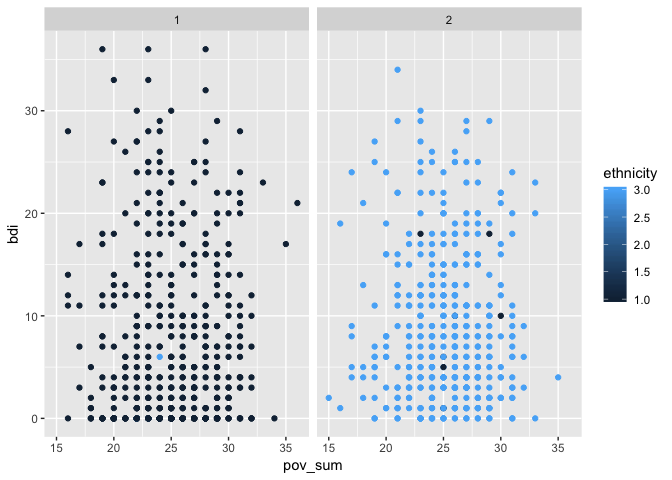
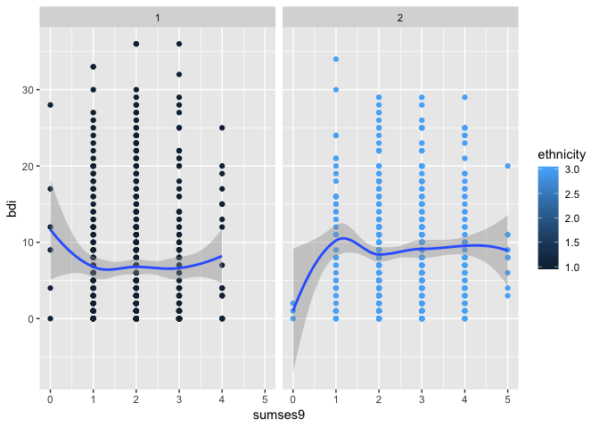
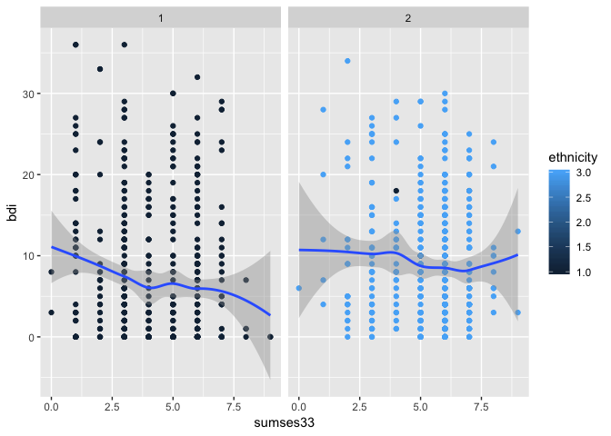
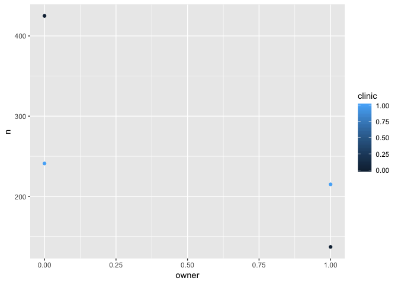
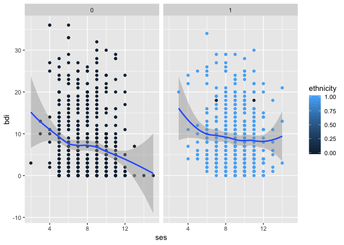

prelim drak
================
Tatini Mal-Sarkar
11/14/2018

``` r
drak = read_csv("/Users/tatinimal-sarkar/Documents/mph2/practicum/thesis/data/KerryDataRequestV2_visit1_c.csv") %>% 
  select(-ASSIST_Tobacco_Score:-opioids_preg_any,
         -AQ1a:-AQ14b,
         -pdiq1_afr:-pdiq13_xho,
         -leq1_1_afr:-leq51_2_xho,
         -ipvq1_afr:-ipvq17_xho,
         -epdsq1_afr:-epdsq10_xho,
         -bdiq1_afr:-bdiq25_2_xho,
         -srqq1_afr:-srqq20_xho)
```

    ## Parsed with column specification:
    ## cols(
    ##   .default = col_character(),
    ##   shortpid = col_integer(),
    ##   mother_age_at_enrolment = col_double(),
    ##   SESaQ1 = col_integer(),
    ##   SESaQ2 = col_integer(),
    ##   SESaQ3_1 = col_integer(),
    ##   SESaQ3_2 = col_integer(),
    ##   SESaQ4_1 = col_integer(),
    ##   SESaQ4_2 = col_integer(),
    ##   SESaQ5 = col_integer(),
    ##   SESaQ6_1 = col_integer(),
    ##   SESaQ6_2 = col_integer(),
    ##   SESaQ7 = col_integer(),
    ##   SESaQ8_1 = col_integer(),
    ##   SESaQ8_2 = col_integer(),
    ##   SESaQ9_1 = col_integer(),
    ##   SESaQ9_2 = col_integer(),
    ##   SESaQ9_3 = col_integer(),
    ##   SESaQ9_4 = col_integer(),
    ##   SESaQ9_5 = col_integer(),
    ##   SESaQ9_6 = col_integer()
    ##   # ... with 421 more columns
    ## )

    ## See spec(...) for full column specifications.

Model 1
=======

No mediator
-----------

``` r
nomed_mod <- 'pov =~ SESaQ13_1 + SESaQ14 + SESaQ15_1 + SESaQ20_1 + SESaQ21 + SESaQ31_1 + SESaQ32 + SESaQ34_1 + sumses9 + sumses33
depf1 =~ bdiq2 + bdiq3 + bdiq4 + bdiq5 + bdiq6 + bdiq7 + bdiq8 + bdiq10 + bdiq12 + bdiq13 + bdiq14 + bdiq15 + bdiq17 + bdiq20 + bdiq21
depf2 =~ bdiq22_1 + bdiq23_1 + bdiq24_1 + bdiq25_1

depf1 ~ pov
depf2 ~ pov '

nomed_mod_fit_1 <- sem(nomed_mod, data = drak, missing = 'fiml.x')
summary(nomed_mod_fit_1)
```

    ## lavaan 0.6-3 ended normally after 91 iterations
    ## 
    ##   Optimization method                           NLMINB
    ##   Number of free parameters                         90
    ## 
    ##   Number of observations                          1036
    ##   Number of missing patterns                        25
    ## 
    ##   Estimator                                         ML
    ##   Model Fit Test Statistic                    2194.900
    ##   Degrees of freedom                               374
    ##   P-value (Chi-square)                           0.000
    ## 
    ## Parameter Estimates:
    ## 
    ##   Information                                 Observed
    ##   Observed information based on                Hessian
    ##   Standard Errors                             Standard
    ## 
    ## Latent Variables:
    ##                    Estimate  Std.Err  z-value  P(>|z|)
    ##   pov =~                                              
    ##     SESaQ13_1         1.000                           
    ##     SESaQ14          -0.382    0.061   -6.215    0.000
    ##     SESaQ15_1         0.521    0.133    3.923    0.000
    ##     SESaQ20_1         0.386    0.064    5.989    0.000
    ##     SESaQ21           0.292    0.049    5.915    0.000
    ##     SESaQ31_1        -1.844    0.126  -14.669    0.000
    ##     SESaQ32          -0.560    0.098   -5.738    0.000
    ##     SESaQ34_1         0.388    0.050    7.832    0.000
    ##     sumses9          -0.857    0.078  -11.030    0.000
    ##     sumses33         -2.793    0.201  -13.872    0.000
    ##   depf1 =~                                            
    ##     bdiq2             1.000                           
    ##     bdiq3             1.099    0.067   16.442    0.000
    ##     bdiq4             1.311    0.075   17.515    0.000
    ##     bdiq5             0.924    0.059   15.723    0.000
    ##     bdiq6             1.346    0.080   16.815    0.000
    ##     bdiq7             1.138    0.068   16.859    0.000
    ##     bdiq8             1.480    0.087   17.077    0.000
    ##     bdiq10            1.273    0.088   14.459    0.000
    ##     bdiq12            1.164    0.070   16.654    0.000
    ##     bdiq13            1.265    0.073   17.210    0.000
    ##     bdiq14            1.125    0.065   17.437    0.000
    ##     bdiq15            1.097    0.069   16.018    0.000
    ##     bdiq17            0.965    0.068   14.160    0.000
    ##     bdiq20            1.060    0.072   14.680    0.000
    ##     bdiq21            1.057    0.087   12.144    0.000
    ##   depf2 =~                                            
    ##     bdiq22_1          1.000                           
    ##     bdiq23_1          0.734    0.054   13.486    0.000
    ##     bdiq24_1          0.729    0.049   14.731    0.000
    ##     bdiq25_1          0.491    0.044   11.205    0.000
    ## 
    ## Regressions:
    ##                    Estimate  Std.Err  z-value  P(>|z|)
    ##   depf1 ~                                             
    ##     pov               0.016    0.032    0.481    0.631
    ##   depf2 ~                                             
    ##     pov              -0.045    0.017   -2.686    0.007
    ## 
    ## Covariances:
    ##                    Estimate  Std.Err  z-value  P(>|z|)
    ##  .depf1 ~~                                            
    ##    .depf2             0.026    0.004    7.240    0.000
    ## 
    ## Intercepts:
    ##                    Estimate  Std.Err  z-value  P(>|z|)
    ##    .SESaQ13_1         1.725    0.029   59.069    0.000
    ##    .SESaQ14           4.356    0.024  180.460    0.000
    ##    .SESaQ15_1         3.295    0.055   59.451    0.000
    ##    .SESaQ20_1         1.627    0.026   63.027    0.000
    ##    .SESaQ21           0.442    0.020   22.420    0.000
    ##    .SESaQ31_1         2.560    0.033   77.346    0.000
    ##    .SESaQ32           2.434    0.040   61.176    0.000
    ##    .SESaQ34_1         1.748    0.019   89.883    0.000
    ##    .sumses9           2.232    0.028   79.775    0.000
    ##    .sumses33          4.779    0.055   86.904    0.000
    ##    .bdiq2             0.357    0.022   16.501    0.000
    ##    .bdiq3             0.405    0.023   17.281    0.000
    ##    .bdiq4             0.588    0.025   23.376    0.000
    ##    .bdiq5             0.404    0.020   19.859    0.000
    ##    .bdiq6             0.457    0.027   16.822    0.000
    ##    .bdiq7             0.378    0.023   16.418    0.000
    ##    .bdiq8             0.525    0.029   17.876    0.000
    ##    .bdiq10            0.582    0.031   18.758    0.000
    ##    .bdiq12            0.500    0.024   21.106    0.000
    ##    .bdiq13            0.490    0.025   19.867    0.000
    ##    .bdiq14            0.333    0.022   15.261    0.000
    ##    .bdiq15            0.585    0.023   25.001    0.000
    ##    .bdiq17            0.618    0.024   25.667    0.000
    ##    .bdiq20            0.690    0.025   27.352    0.000
    ##    .bdiq21            0.774    0.032   24.349    0.000
    ##    .bdiq22_1          0.089    0.009   10.046    0.000
    ##    .bdiq23_1          0.058    0.007    7.976    0.000
    ##    .bdiq24_1          0.046    0.007    7.007    0.000
    ##    .bdiq25_1          0.048    0.007    7.168    0.000
    ##     pov               0.000                           
    ##    .depf1             0.000                           
    ##    .depf2             0.000                           
    ## 
    ## Variances:
    ##                    Estimate  Std.Err  z-value  P(>|z|)
    ##    .SESaQ13_1         0.657    0.032   20.699    0.000
    ##    .SESaQ14           0.570    0.025   22.360    0.000
    ##    .SESaQ15_1         3.102    0.137   22.582    0.000
    ##    .SESaQ20_1         0.656    0.029   22.404    0.000
    ##    .SESaQ21           0.378    0.017   22.286    0.000
    ##    .SESaQ31_1         0.366    0.034   10.932    0.000
    ##    .SESaQ32           1.562    0.070   22.433    0.000
    ##    .SESaQ34_1         0.357    0.016   22.116    0.000
    ##    .sumses9           0.643    0.030   21.179    0.000
    ##    .sumses33          1.366    0.092   14.822    0.000
    ##    .bdiq2             0.310    0.015   21.251    0.000
    ##    .bdiq3             0.359    0.017   21.177    0.000
    ##    .bdiq4             0.356    0.017   20.590    0.000
    ##    .bdiq5             0.280    0.013   21.363    0.000
    ##    .bdiq6             0.450    0.022   20.901    0.000
    ##    .bdiq7             0.324    0.015   20.906    0.000
    ##    .bdiq8             0.510    0.025   20.801    0.000
    ##    .bdiq10            0.713    0.033   21.704    0.000
    ##    .bdiq12            0.346    0.016   20.970    0.000
    ##    .bdiq13            0.351    0.017   20.663    0.000
    ##    .bdiq14            0.271    0.013   20.608    0.000
    ##    .bdiq15            0.356    0.017   21.120    0.000
    ##    .bdiq17            0.437    0.020   21.698    0.000
    ##    .bdiq20            0.462    0.021   21.553    0.000
    ##    .bdiq21            0.849    0.038   22.109    0.000
    ##    .bdiq22_1          0.044    0.003   14.870    0.000
    ##    .bdiq23_1          0.035    0.002   17.283    0.000
    ##    .bdiq24_1          0.024    0.002   15.082    0.000
    ##    .bdiq25_1          0.036    0.002   20.471    0.000
    ##     pov               0.225    0.029    7.759    0.000
    ##    .depf1             0.173    0.017   10.133    0.000
    ##    .depf2             0.037    0.004    9.872    0.000

With mediator
-------------

``` r
med_mod <- 'pov =~ SESaQ13_1 + SESaQ14 + SESaQ15_1 + SESaQ20_1 + SESaQ21 + SESaQ31_1 + SESaQ32 + SESaQ34_1 + sumses9 + sumses33
trauf1 =~ MPSSQ2 + MPSSQ3 + MPSSQ4 + MPSSQ5 + MPSSQ6 + MPSSQ7 + MPSSQ8 + MPSSQ9 + MPSSQ10 + MPSSQ11 + MPSSQ12 + MPSSQ13 + MPSSQ14 + MPSSQ15 + MPSSQ16 + MPSSQ17 + MPSSQ18
trauf2 =~ ipvq1 + ipvq2 + ipvq3 + ipvq4 + ipvq5 + ipvq6 + ipvq7 + ipvq8 + ipvq9 + ipvq10 + ipvq11 + ipvq12 + ipvq13 + ipvq14 + ipvq15
depf1 =~ bdiq2 + bdiq3 + bdiq4 + bdiq5 + bdiq6 + bdiq7 + bdiq8 + bdiq10 + bdiq12 + bdiq13 + bdiq14 + bdiq15 + bdiq17 + bdiq20 + bdiq21
depf2 =~ bdiq22_1 + bdiq23_1 + bdiq24_1 + bdiq25_1

depf1 ~ trauf1 + trauf2 + pov
depf2 ~ trauf1 + trauf2 + pov
trauf1 ~ pov
trauf2 ~ pov '

med_mod_fit_1 <- sem(med_mod, data = drak, missing = 'fiml.x')
summary(med_mod_fit_1)
```

    ## lavaan 0.6-3 ended normally after 136 iterations
    ## 
    ##   Optimization method                           NLMINB
    ##   Number of free parameters                        192
    ## 
    ##   Number of observations                          1036
    ##   Number of missing patterns                        59
    ## 
    ##   Estimator                                         ML
    ##   Model Fit Test Statistic                    6169.287
    ##   Degrees of freedom                              1760
    ##   P-value (Chi-square)                           0.000
    ## 
    ## Parameter Estimates:
    ## 
    ##   Information                                 Observed
    ##   Observed information based on                Hessian
    ##   Standard Errors                             Standard
    ## 
    ## Latent Variables:
    ##                    Estimate  Std.Err  z-value  P(>|z|)
    ##   pov =~                                              
    ##     SESaQ13_1         1.000                           
    ##     SESaQ14          -0.378    0.061   -6.204    0.000
    ##     SESaQ15_1         0.533    0.132    4.032    0.000
    ##     SESaQ20_1         0.379    0.064    5.924    0.000
    ##     SESaQ21           0.285    0.049    5.832    0.000
    ##     SESaQ31_1        -1.829    0.124  -14.748    0.000
    ##     SESaQ32          -0.556    0.097   -5.741    0.000
    ##     SESaQ34_1         0.387    0.049    7.872    0.000
    ##     sumses9          -0.848    0.077  -11.038    0.000
    ##     sumses33         -2.781    0.200  -13.927    0.000
    ##   trauf1 =~                                           
    ##     MPSSQ2            1.000                           
    ##     MPSSQ3            1.008    0.070   14.359    0.000
    ##     MPSSQ4            0.950    0.069   13.668    0.000
    ##     MPSSQ5            0.961    0.070   13.800    0.000
    ##     MPSSQ6            1.025    0.072   14.276    0.000
    ##     MPSSQ7            0.925    0.066   13.956    0.000
    ##     MPSSQ8            1.054    0.067   15.642    0.000
    ##     MPSSQ9            1.086    0.067   16.268    0.000
    ##     MPSSQ10           1.084    0.069   15.661    0.000
    ##     MPSSQ11           1.102    0.070   15.750    0.000
    ##     MPSSQ12           1.034    0.068   15.174    0.000
    ##     MPSSQ13           0.982    0.067   14.638    0.000
    ##     MPSSQ14           0.995    0.063   15.864    0.000
    ##     MPSSQ15           0.969    0.067   14.462    0.000
    ##     MPSSQ16           1.029    0.065   15.895    0.000
    ##     MPSSQ17           0.968    0.065   14.878    0.000
    ##     MPSSQ18           0.579    0.073    7.943    0.000
    ##   trauf2 =~                                           
    ##     ipvq1             1.000                           
    ##     ipvq2             0.864    0.039   22.426    0.000
    ##     ipvq3             0.877    0.038   22.980    0.000
    ##     ipvq4             0.920    0.038   24.135    0.000
    ##     ipvq5            -0.396    0.022  -18.036    0.000
    ##     ipvq6             0.939    0.042   22.540    0.000
    ##     ipvq7             0.941    0.041   23.203    0.000
    ##     ipvq8             0.739    0.033   22.406    0.000
    ##     ipvq9             0.697    0.031   22.229    0.000
    ##     ipvq10            0.409    0.023   18.159    0.000
    ##     ipvq11           -0.338    0.021  -15.734    0.000
    ##     ipvq12            0.400    0.024   16.826    0.000
    ##     ipvq13            0.418    0.025   16.966    0.000
    ##     ipvq14            0.214    0.015   14.173    0.000
    ##     ipvq15           -0.249    0.016  -15.677    0.000
    ##   depf1 =~                                            
    ##     bdiq2             1.000                           
    ##     bdiq3             1.098    0.066   16.558    0.000
    ##     bdiq4             1.303    0.074   17.574    0.000
    ##     bdiq5             0.918    0.058   15.765    0.000
    ##     bdiq6             1.343    0.079   16.917    0.000
    ##     bdiq7             1.130    0.067   16.896    0.000
    ##     bdiq8             1.472    0.086   17.137    0.000
    ##     bdiq10            1.266    0.087   14.492    0.000
    ##     bdiq12            1.159    0.069   16.730    0.000
    ##     bdiq13            1.259    0.073   17.285    0.000
    ##     bdiq14            1.119    0.064   17.495    0.000
    ##     bdiq15            1.092    0.068   16.078    0.000
    ##     bdiq17            0.962    0.068   14.221    0.000
    ##     bdiq20            1.052    0.072   14.698    0.000
    ##     bdiq21            1.054    0.086   12.187    0.000
    ##   depf2 =~                                            
    ##     bdiq22_1          1.000                           
    ##     bdiq23_1          0.751    0.055   13.736    0.000
    ##     bdiq24_1          0.734    0.049   15.083    0.000
    ##     bdiq25_1          0.504    0.044   11.381    0.000
    ## 
    ## Regressions:
    ##                    Estimate  Std.Err  z-value  P(>|z|)
    ##   depf1 ~                                             
    ##     trauf1            0.001    0.028    0.043    0.966
    ##     trauf2            0.176    0.022    8.132    0.000
    ##     pov               0.031    0.034    0.916    0.360
    ##   depf2 ~                                             
    ##     trauf1           -0.004    0.013   -0.357    0.721
    ##     trauf2            0.094    0.011    8.640    0.000
    ##     pov              -0.035    0.017   -2.084    0.037
    ##   trauf1 ~                                            
    ##     pov               0.423    0.104    4.084    0.000
    ##   trauf2 ~                                            
    ##     pov              -0.082    0.054   -1.517    0.129
    ## 
    ## Covariances:
    ##                    Estimate  Std.Err  z-value  P(>|z|)
    ##  .depf1 ~~                                            
    ##    .depf2             0.017    0.003    5.637    0.000
    ## 
    ## Intercepts:
    ##                    Estimate  Std.Err  z-value  P(>|z|)
    ##    .SESaQ13_1         1.725    0.029   59.068    0.000
    ##    .SESaQ14           4.356    0.024  180.460    0.000
    ##    .SESaQ15_1         3.295    0.055   59.451    0.000
    ##    .SESaQ20_1         1.627    0.026   63.027    0.000
    ##    .SESaQ21           0.442    0.020   22.419    0.000
    ##    .SESaQ31_1         2.560    0.033   77.342    0.000
    ##    .SESaQ32           2.434    0.040   61.177    0.000
    ##    .SESaQ34_1         1.748    0.019   89.882    0.000
    ##    .sumses9           2.232    0.028   79.776    0.000
    ##    .sumses33          4.779    0.055   86.908    0.000
    ##    .MPSSQ2            1.229    0.058   21.330    0.000
    ##    .MPSSQ3            1.294    0.059   21.808    0.000
    ##    .MPSSQ4            1.623    0.058   27.791    0.000
    ##    .MPSSQ5            1.502    0.058   25.783    0.000
    ##    .MPSSQ6            1.476    0.060   24.482    0.000
    ##    .MPSSQ7            1.062    0.056   19.023    0.000
    ##    .MPSSQ8            1.219    0.057   21.299    0.000
    ##    .MPSSQ9            1.260    0.057   22.196    0.000
    ##    .MPSSQ10           1.263    0.059   21.471    0.000
    ##    .MPSSQ11           1.283    0.059   21.631    0.000
    ##    .MPSSQ12           1.296    0.058   22.504    0.000
    ##    .MPSSQ13           1.335    0.056   23.696    0.000
    ##    .MPSSQ14           1.161    0.053   21.800    0.000
    ##    .MPSSQ15           1.188    0.056   21.065    0.000
    ##    .MPSSQ16           1.159    0.055   21.092    0.000
    ##    .MPSSQ17           1.115    0.055   20.290    0.000
    ##    .MPSSQ18           1.933    0.058   33.361    0.000
    ##    .ipvq1             1.716    0.031   55.163    0.000
    ##    .ipvq2             1.442    0.027   53.799    0.000
    ##    .ipvq3             1.410    0.026   53.941    0.000
    ##    .ipvq4             1.369    0.026   52.509    0.000
    ##    .ipvq5             1.649    0.016  106.213    0.000
    ##    .ipvq6             1.666    0.029   58.333    0.000
    ##    .ipvq7             1.515    0.028   54.841    0.000
    ##    .ipvq8             1.276    0.022   56.913    0.000
    ##    .ipvq9             1.246    0.021   58.780    0.000
    ##    .ipvq10            1.124    0.015   73.426    0.000
    ##    .ipvq11            1.688    0.015  111.376    0.000
    ##    .ipvq12            1.138    0.016   70.429    0.000
    ##    .ipvq13            1.156    0.017   69.196    0.000
    ##    .ipvq14            1.055    0.010  103.076    0.000
    ##    .ipvq15            1.879    0.011  171.353    0.000
    ##    .bdiq2             0.357    0.022   16.499    0.000
    ##    .bdiq3             0.405    0.023   17.279    0.000
    ##    .bdiq4             0.588    0.025   23.374    0.000
    ##    .bdiq5             0.404    0.020   19.857    0.000
    ##    .bdiq6             0.457    0.027   16.820    0.000
    ##    .bdiq7             0.378    0.023   16.416    0.000
    ##    .bdiq8             0.525    0.029   17.873    0.000
    ##    .bdiq10            0.582    0.031   18.755    0.000
    ##    .bdiq12            0.500    0.024   21.104    0.000
    ##    .bdiq13            0.490    0.025   19.864    0.000
    ##    .bdiq14            0.333    0.022   15.259    0.000
    ##    .bdiq15            0.585    0.023   24.998    0.000
    ##    .bdiq17            0.618    0.024   25.665    0.000
    ##    .bdiq20            0.690    0.025   27.350    0.000
    ##    .bdiq21            0.774    0.032   24.347    0.000
    ##    .bdiq22_1          0.089    0.009   10.038    0.000
    ##    .bdiq23_1          0.058    0.007    7.970    0.000
    ##    .bdiq24_1          0.046    0.007    6.997    0.000
    ##    .bdiq25_1          0.048    0.007    7.163    0.000
    ##     pov               0.000                           
    ##    .trauf1            0.000                           
    ##    .trauf2            0.000                           
    ##    .depf1             0.000                           
    ##    .depf2             0.000                           
    ## 
    ## Variances:
    ##                    Estimate  Std.Err  z-value  P(>|z|)
    ##    .SESaQ13_1         0.654    0.032   20.644    0.000
    ##    .SESaQ14           0.570    0.025   22.362    0.000
    ##    .SESaQ15_1         3.099    0.137   22.575    0.000
    ##    .SESaQ20_1         0.657    0.029   22.411    0.000
    ##    .SESaQ21           0.379    0.017   22.295    0.000
    ##    .SESaQ31_1         0.369    0.033   11.100    0.000
    ##    .SESaQ32           1.562    0.070   22.433    0.000
    ##    .SESaQ34_1         0.357    0.016   22.118    0.000
    ##    .sumses9           0.644    0.030   21.204    0.000
    ##    .sumses33          1.359    0.092   14.775    0.000
    ##    .MPSSQ2            0.530    0.042   12.603    0.000
    ##    .MPSSQ3            0.592    0.047   12.701    0.000
    ##    .MPSSQ4            0.627    0.049   12.788    0.000
    ##    .MPSSQ5            0.610    0.048   12.778    0.000
    ##    .MPSSQ6            0.610    0.048   12.685    0.000
    ##    .MPSSQ7            0.555    0.043   12.762    0.000
    ##    .MPSSQ8            0.441    0.036   12.389    0.000
    ##    .MPSSQ9            0.379    0.031   12.158    0.000
    ##    .MPSSQ10           0.467    0.038   12.382    0.000
    ##    .MPSSQ11           0.461    0.037   12.355    0.000
    ##    .MPSSQ12           0.485    0.039   12.505    0.000
    ##    .MPSSQ13           0.503    0.040   12.620    0.000
    ##    .MPSSQ14           0.364    0.030   12.288    0.000
    ##    .MPSSQ15           0.521    0.041   12.680    0.000
    ##    .MPSSQ16           0.384    0.031   12.291    0.000
    ##    .MPSSQ17           0.466    0.037   12.596    0.000
    ##    .MPSSQ18           0.912    0.071   12.800    0.000
    ##    .ipvq1             0.492    0.024   20.686    0.000
    ##    .ipvq2             0.364    0.018   20.746    0.000
    ##    .ipvq3             0.314    0.016   20.283    0.000
    ##    .ipvq4             0.272    0.014   19.724    0.000
    ##    .ipvq5             0.150    0.007   20.480    0.000
    ##    .ipvq6             0.396    0.019   20.448    0.000
    ##    .ipvq7             0.339    0.017   20.137    0.000
    ##    .ipvq8             0.242    0.012   20.535    0.000
    ##    .ipvq9             0.217    0.011   20.531    0.000
    ##    .ipvq10            0.157    0.007   21.722    0.000
    ##    .ipvq11            0.158    0.008   20.745    0.000
    ##    .ipvq12            0.188    0.009   21.863    0.000
    ##    .ipvq13            0.200    0.009   21.802    0.000
    ##    .ipvq14            0.085    0.004   22.186    0.000
    ##    .ipvq15            0.076    0.004   19.828    0.000
    ##    .bdiq2             0.308    0.015   21.236    0.000
    ##    .bdiq3             0.357    0.017   21.165    0.000
    ##    .bdiq4             0.357    0.017   20.617    0.000
    ##    .bdiq5             0.281    0.013   21.378    0.000
    ##    .bdiq6             0.449    0.021   20.894    0.000
    ##    .bdiq7             0.325    0.016   20.933    0.000
    ##    .bdiq8             0.511    0.025   20.823    0.000
    ##    .bdiq10            0.714    0.033   21.714    0.000
    ##    .bdiq12            0.345    0.016   20.979    0.000
    ##    .bdiq13            0.351    0.017   20.675    0.000
    ##    .bdiq14            0.272    0.013   20.632    0.000
    ##    .bdiq15            0.356    0.017   21.127    0.000
    ##    .bdiq17            0.436    0.020   21.700    0.000
    ##    .bdiq20            0.463    0.021   21.570    0.000
    ##    .bdiq21            0.849    0.038   22.110    0.000
    ##    .bdiq22_1          0.045    0.003   15.481    0.000
    ##    .bdiq23_1          0.034    0.002   17.267    0.000
    ##    .bdiq24_1          0.024    0.002   15.485    0.000
    ##    .bdiq25_1          0.036    0.002   20.438    0.000
    ##     pov               0.228    0.029    7.804    0.000
    ##    .trauf1            0.624    0.077    8.130    0.000
    ##    .trauf2            0.506    0.039   12.839    0.000
    ##    .depf1             0.159    0.016   10.181    0.000
    ##    .depf2             0.031    0.003    9.587    0.000

Model 2
=======

This model excludes PTSD from trauma.

No mediator
-----------

``` r
nomed_mod <- 'pov =~ SESaQ13_1 + SESaQ14 + SESaQ15_1 + SESaQ20_1 + SESaQ21 + SESaQ31_1 + SESaQ32 + SESaQ34_1 + sumses9 + sumses33
depf1 =~ bdiq2 + bdiq3 + bdiq4 + bdiq5 + bdiq6 + bdiq7 + bdiq8 + bdiq10 + bdiq12 + bdiq13 + bdiq14 + bdiq15 + bdiq17 + bdiq20 + bdiq21
depf2 =~ bdiq22_1 + bdiq23_1 + bdiq24_1 + bdiq25_1

depf1 ~ pov
depf2 ~ pov '

nomed_mod_fit_2 <- sem(nomed_mod, data = drak, missing = 'fiml.x')
summary(nomed_mod_fit_2)
```

    ## lavaan 0.6-3 ended normally after 91 iterations
    ## 
    ##   Optimization method                           NLMINB
    ##   Number of free parameters                         90
    ## 
    ##   Number of observations                          1036
    ##   Number of missing patterns                        25
    ## 
    ##   Estimator                                         ML
    ##   Model Fit Test Statistic                    2194.900
    ##   Degrees of freedom                               374
    ##   P-value (Chi-square)                           0.000
    ## 
    ## Parameter Estimates:
    ## 
    ##   Information                                 Observed
    ##   Observed information based on                Hessian
    ##   Standard Errors                             Standard
    ## 
    ## Latent Variables:
    ##                    Estimate  Std.Err  z-value  P(>|z|)
    ##   pov =~                                              
    ##     SESaQ13_1         1.000                           
    ##     SESaQ14          -0.382    0.061   -6.215    0.000
    ##     SESaQ15_1         0.521    0.133    3.923    0.000
    ##     SESaQ20_1         0.386    0.064    5.989    0.000
    ##     SESaQ21           0.292    0.049    5.915    0.000
    ##     SESaQ31_1        -1.844    0.126  -14.669    0.000
    ##     SESaQ32          -0.560    0.098   -5.738    0.000
    ##     SESaQ34_1         0.388    0.050    7.832    0.000
    ##     sumses9          -0.857    0.078  -11.030    0.000
    ##     sumses33         -2.793    0.201  -13.872    0.000
    ##   depf1 =~                                            
    ##     bdiq2             1.000                           
    ##     bdiq3             1.099    0.067   16.442    0.000
    ##     bdiq4             1.311    0.075   17.515    0.000
    ##     bdiq5             0.924    0.059   15.723    0.000
    ##     bdiq6             1.346    0.080   16.815    0.000
    ##     bdiq7             1.138    0.068   16.859    0.000
    ##     bdiq8             1.480    0.087   17.077    0.000
    ##     bdiq10            1.273    0.088   14.459    0.000
    ##     bdiq12            1.164    0.070   16.654    0.000
    ##     bdiq13            1.265    0.073   17.210    0.000
    ##     bdiq14            1.125    0.065   17.437    0.000
    ##     bdiq15            1.097    0.069   16.018    0.000
    ##     bdiq17            0.965    0.068   14.160    0.000
    ##     bdiq20            1.060    0.072   14.680    0.000
    ##     bdiq21            1.057    0.087   12.144    0.000
    ##   depf2 =~                                            
    ##     bdiq22_1          1.000                           
    ##     bdiq23_1          0.734    0.054   13.486    0.000
    ##     bdiq24_1          0.729    0.049   14.731    0.000
    ##     bdiq25_1          0.491    0.044   11.205    0.000
    ## 
    ## Regressions:
    ##                    Estimate  Std.Err  z-value  P(>|z|)
    ##   depf1 ~                                             
    ##     pov               0.016    0.032    0.481    0.631
    ##   depf2 ~                                             
    ##     pov              -0.045    0.017   -2.686    0.007
    ## 
    ## Covariances:
    ##                    Estimate  Std.Err  z-value  P(>|z|)
    ##  .depf1 ~~                                            
    ##    .depf2             0.026    0.004    7.240    0.000
    ## 
    ## Intercepts:
    ##                    Estimate  Std.Err  z-value  P(>|z|)
    ##    .SESaQ13_1         1.725    0.029   59.069    0.000
    ##    .SESaQ14           4.356    0.024  180.460    0.000
    ##    .SESaQ15_1         3.295    0.055   59.451    0.000
    ##    .SESaQ20_1         1.627    0.026   63.027    0.000
    ##    .SESaQ21           0.442    0.020   22.420    0.000
    ##    .SESaQ31_1         2.560    0.033   77.346    0.000
    ##    .SESaQ32           2.434    0.040   61.176    0.000
    ##    .SESaQ34_1         1.748    0.019   89.883    0.000
    ##    .sumses9           2.232    0.028   79.775    0.000
    ##    .sumses33          4.779    0.055   86.904    0.000
    ##    .bdiq2             0.357    0.022   16.501    0.000
    ##    .bdiq3             0.405    0.023   17.281    0.000
    ##    .bdiq4             0.588    0.025   23.376    0.000
    ##    .bdiq5             0.404    0.020   19.859    0.000
    ##    .bdiq6             0.457    0.027   16.822    0.000
    ##    .bdiq7             0.378    0.023   16.418    0.000
    ##    .bdiq8             0.525    0.029   17.876    0.000
    ##    .bdiq10            0.582    0.031   18.758    0.000
    ##    .bdiq12            0.500    0.024   21.106    0.000
    ##    .bdiq13            0.490    0.025   19.867    0.000
    ##    .bdiq14            0.333    0.022   15.261    0.000
    ##    .bdiq15            0.585    0.023   25.001    0.000
    ##    .bdiq17            0.618    0.024   25.667    0.000
    ##    .bdiq20            0.690    0.025   27.352    0.000
    ##    .bdiq21            0.774    0.032   24.349    0.000
    ##    .bdiq22_1          0.089    0.009   10.046    0.000
    ##    .bdiq23_1          0.058    0.007    7.976    0.000
    ##    .bdiq24_1          0.046    0.007    7.007    0.000
    ##    .bdiq25_1          0.048    0.007    7.168    0.000
    ##     pov               0.000                           
    ##    .depf1             0.000                           
    ##    .depf2             0.000                           
    ## 
    ## Variances:
    ##                    Estimate  Std.Err  z-value  P(>|z|)
    ##    .SESaQ13_1         0.657    0.032   20.699    0.000
    ##    .SESaQ14           0.570    0.025   22.360    0.000
    ##    .SESaQ15_1         3.102    0.137   22.582    0.000
    ##    .SESaQ20_1         0.656    0.029   22.404    0.000
    ##    .SESaQ21           0.378    0.017   22.286    0.000
    ##    .SESaQ31_1         0.366    0.034   10.932    0.000
    ##    .SESaQ32           1.562    0.070   22.433    0.000
    ##    .SESaQ34_1         0.357    0.016   22.116    0.000
    ##    .sumses9           0.643    0.030   21.179    0.000
    ##    .sumses33          1.366    0.092   14.822    0.000
    ##    .bdiq2             0.310    0.015   21.251    0.000
    ##    .bdiq3             0.359    0.017   21.177    0.000
    ##    .bdiq4             0.356    0.017   20.590    0.000
    ##    .bdiq5             0.280    0.013   21.363    0.000
    ##    .bdiq6             0.450    0.022   20.901    0.000
    ##    .bdiq7             0.324    0.015   20.906    0.000
    ##    .bdiq8             0.510    0.025   20.801    0.000
    ##    .bdiq10            0.713    0.033   21.704    0.000
    ##    .bdiq12            0.346    0.016   20.970    0.000
    ##    .bdiq13            0.351    0.017   20.663    0.000
    ##    .bdiq14            0.271    0.013   20.608    0.000
    ##    .bdiq15            0.356    0.017   21.120    0.000
    ##    .bdiq17            0.437    0.020   21.698    0.000
    ##    .bdiq20            0.462    0.021   21.553    0.000
    ##    .bdiq21            0.849    0.038   22.109    0.000
    ##    .bdiq22_1          0.044    0.003   14.870    0.000
    ##    .bdiq23_1          0.035    0.002   17.283    0.000
    ##    .bdiq24_1          0.024    0.002   15.082    0.000
    ##    .bdiq25_1          0.036    0.002   20.471    0.000
    ##     pov               0.225    0.029    7.759    0.000
    ##    .depf1             0.173    0.017   10.133    0.000
    ##    .depf2             0.037    0.004    9.872    0.000

With mediator
-------------

``` r
med_mod <- 'pov =~ SESaQ13_1 + SESaQ14 + SESaQ15_1 + SESaQ20_1 + SESaQ21 + SESaQ31_1 + SESaQ32 + SESaQ34_1 + sumses9 + sumses33
trauf2 =~ ipvq1 + ipvq2 + ipvq3 + ipvq4 + ipvq5 + ipvq6 + ipvq7 + ipvq8 + ipvq9 + ipvq10 + ipvq11 + ipvq12 + ipvq13 + ipvq14 + ipvq15
depf1 =~ bdiq2 + bdiq3 + bdiq4 + bdiq5 + bdiq6 + bdiq7 + bdiq8 + bdiq10 + bdiq12 + bdiq13 + bdiq14 + bdiq15 + bdiq17 + bdiq20 + bdiq21
depf2 =~ bdiq22_1 + bdiq23_1 + bdiq24_1 + bdiq25_1

depf1 ~ trauf2 + pov
depf2 ~ trauf2 + pov
trauf2 ~ pov '

med_mod_fit_2 <- sem(med_mod, data = drak, missing = 'fiml.x')
summary(med_mod_fit_2)
```

    ## lavaan 0.6-3 ended normally after 123 iterations
    ## 
    ##   Optimization method                           NLMINB
    ##   Number of free parameters                        138
    ## 
    ##   Number of observations                          1036
    ##   Number of missing patterns                        39
    ## 
    ##   Estimator                                         ML
    ##   Model Fit Test Statistic                    4761.901
    ##   Degrees of freedom                               896
    ##   P-value (Chi-square)                           0.000
    ## 
    ## Parameter Estimates:
    ## 
    ##   Information                                 Observed
    ##   Observed information based on                Hessian
    ##   Standard Errors                             Standard
    ## 
    ## Latent Variables:
    ##                    Estimate  Std.Err  z-value  P(>|z|)
    ##   pov =~                                              
    ##     SESaQ13_1         1.000                           
    ##     SESaQ14          -0.377    0.061   -6.162    0.000
    ##     SESaQ15_1         0.523    0.133    3.946    0.000
    ##     SESaQ20_1         0.382    0.064    5.937    0.000
    ##     SESaQ21           0.288    0.049    5.863    0.000
    ##     SESaQ31_1        -1.842    0.125  -14.693    0.000
    ##     SESaQ32          -0.561    0.097   -5.769    0.000
    ##     SESaQ34_1         0.387    0.049    7.832    0.000
    ##     sumses9          -0.855    0.077  -11.049    0.000
    ##     sumses33         -2.781    0.200  -13.902    0.000
    ##   trauf2 =~                                           
    ##     ipvq1             1.000                           
    ##     ipvq2             0.864    0.039   22.426    0.000
    ##     ipvq3             0.877    0.038   22.980    0.000
    ##     ipvq4             0.920    0.038   24.135    0.000
    ##     ipvq5            -0.396    0.022  -18.036    0.000
    ##     ipvq6             0.939    0.042   22.539    0.000
    ##     ipvq7             0.941    0.041   23.203    0.000
    ##     ipvq8             0.739    0.033   22.405    0.000
    ##     ipvq9             0.697    0.031   22.229    0.000
    ##     ipvq10            0.409    0.023   18.159    0.000
    ##     ipvq11           -0.338    0.021  -15.733    0.000
    ##     ipvq12            0.400    0.024   16.826    0.000
    ##     ipvq13            0.418    0.025   16.967    0.000
    ##     ipvq14            0.214    0.015   14.173    0.000
    ##     ipvq15           -0.249    0.016  -15.676    0.000
    ##   depf1 =~                                            
    ##     bdiq2             1.000                           
    ##     bdiq3             1.098    0.066   16.557    0.000
    ##     bdiq4             1.303    0.074   17.574    0.000
    ##     bdiq5             0.918    0.058   15.764    0.000
    ##     bdiq6             1.343    0.079   16.916    0.000
    ##     bdiq7             1.130    0.067   16.894    0.000
    ##     bdiq8             1.472    0.086   17.136    0.000
    ##     bdiq10            1.266    0.087   14.492    0.000
    ##     bdiq12            1.160    0.069   16.729    0.000
    ##     bdiq13            1.259    0.073   17.286    0.000
    ##     bdiq14            1.119    0.064   17.495    0.000
    ##     bdiq15            1.092    0.068   16.080    0.000
    ##     bdiq17            0.962    0.068   14.223    0.000
    ##     bdiq20            1.052    0.072   14.699    0.000
    ##     bdiq21            1.054    0.086   12.189    0.000
    ##   depf2 =~                                            
    ##     bdiq22_1          1.000                           
    ##     bdiq23_1          0.751    0.055   13.737    0.000
    ##     bdiq24_1          0.734    0.049   15.082    0.000
    ##     bdiq25_1          0.504    0.044   11.384    0.000
    ## 
    ## Regressions:
    ##                    Estimate  Std.Err  z-value  P(>|z|)
    ##   depf1 ~                                             
    ##     trauf2            0.177    0.022    8.185    0.000
    ##     pov               0.031    0.031    0.991    0.322
    ##   depf2 ~                                             
    ##     trauf2            0.093    0.011    8.638    0.000
    ##     pov              -0.037    0.016   -2.340    0.019
    ##   trauf2 ~                                            
    ##     pov              -0.090    0.054   -1.657    0.098
    ## 
    ## Covariances:
    ##                    Estimate  Std.Err  z-value  P(>|z|)
    ##  .depf1 ~~                                            
    ##    .depf2             0.017    0.003    5.635    0.000
    ## 
    ## Intercepts:
    ##                    Estimate  Std.Err  z-value  P(>|z|)
    ##    .SESaQ13_1         1.725    0.029   59.069    0.000
    ##    .SESaQ14           4.356    0.024  180.460    0.000
    ##    .SESaQ15_1         3.295    0.055   59.451    0.000
    ##    .SESaQ20_1         1.627    0.026   63.027    0.000
    ##    .SESaQ21           0.442    0.020   22.421    0.000
    ##    .SESaQ31_1         2.560    0.033   77.346    0.000
    ##    .SESaQ32           2.434    0.040   61.176    0.000
    ##    .SESaQ34_1         1.748    0.019   89.883    0.000
    ##    .sumses9           2.232    0.028   79.776    0.000
    ##    .sumses33          4.779    0.055   86.903    0.000
    ##    .ipvq1             1.716    0.031   55.164    0.000
    ##    .ipvq2             1.442    0.027   53.799    0.000
    ##    .ipvq3             1.410    0.026   53.941    0.000
    ##    .ipvq4             1.369    0.026   52.509    0.000
    ##    .ipvq5             1.649    0.016  106.214    0.000
    ##    .ipvq6             1.666    0.029   58.333    0.000
    ##    .ipvq7             1.515    0.028   54.841    0.000
    ##    .ipvq8             1.276    0.022   56.914    0.000
    ##    .ipvq9             1.246    0.021   58.780    0.000
    ##    .ipvq10            1.124    0.015   73.426    0.000
    ##    .ipvq11            1.688    0.015  111.376    0.000
    ##    .ipvq12            1.138    0.016   70.430    0.000
    ##    .ipvq13            1.156    0.017   69.196    0.000
    ##    .ipvq14            1.055    0.010  103.076    0.000
    ##    .ipvq15            1.879    0.011  171.353    0.000
    ##    .bdiq2             0.357    0.022   16.499    0.000
    ##    .bdiq3             0.405    0.023   17.278    0.000
    ##    .bdiq4             0.588    0.025   23.374    0.000
    ##    .bdiq5             0.404    0.020   19.857    0.000
    ##    .bdiq6             0.457    0.027   16.819    0.000
    ##    .bdiq7             0.378    0.023   16.416    0.000
    ##    .bdiq8             0.525    0.029   17.873    0.000
    ##    .bdiq10            0.582    0.031   18.755    0.000
    ##    .bdiq12            0.500    0.024   21.103    0.000
    ##    .bdiq13            0.490    0.025   19.864    0.000
    ##    .bdiq14            0.333    0.022   15.259    0.000
    ##    .bdiq15            0.585    0.023   24.997    0.000
    ##    .bdiq17            0.618    0.024   25.665    0.000
    ##    .bdiq20            0.690    0.025   27.349    0.000
    ##    .bdiq21            0.774    0.032   24.347    0.000
    ##    .bdiq22_1          0.089    0.009   10.040    0.000
    ##    .bdiq23_1          0.058    0.007    7.970    0.000
    ##    .bdiq24_1          0.046    0.007    6.998    0.000
    ##    .bdiq25_1          0.048    0.007    7.164    0.000
    ##     pov               0.000                           
    ##    .trauf2            0.000                           
    ##    .depf1             0.000                           
    ##    .depf2             0.000                           
    ## 
    ## Variances:
    ##                    Estimate  Std.Err  z-value  P(>|z|)
    ##    .SESaQ13_1         0.656    0.032   20.678    0.000
    ##    .SESaQ14           0.570    0.026   22.366    0.000
    ##    .SESaQ15_1         3.102    0.137   22.580    0.000
    ##    .SESaQ20_1         0.657    0.029   22.410    0.000
    ##    .SESaQ21           0.378    0.017   22.291    0.000
    ##    .SESaQ31_1         0.364    0.034   10.859    0.000
    ##    .SESaQ32           1.561    0.070   22.430    0.000
    ##    .SESaQ34_1         0.357    0.016   22.117    0.000
    ##    .sumses9           0.643    0.030   21.180    0.000
    ##    .sumses33          1.371    0.092   14.882    0.000
    ##    .ipvq1             0.492    0.024   20.685    0.000
    ##    .ipvq2             0.364    0.018   20.746    0.000
    ##    .ipvq3             0.314    0.015   20.283    0.000
    ##    .ipvq4             0.272    0.014   19.724    0.000
    ##    .ipvq5             0.150    0.007   20.480    0.000
    ##    .ipvq6             0.396    0.019   20.448    0.000
    ##    .ipvq7             0.339    0.017   20.137    0.000
    ##    .ipvq8             0.242    0.012   20.535    0.000
    ##    .ipvq9             0.217    0.011   20.531    0.000
    ##    .ipvq10            0.157    0.007   21.722    0.000
    ##    .ipvq11            0.158    0.008   20.745    0.000
    ##    .ipvq12            0.188    0.009   21.863    0.000
    ##    .ipvq13            0.200    0.009   21.802    0.000
    ##    .ipvq14            0.085    0.004   22.186    0.000
    ##    .ipvq15            0.076    0.004   19.828    0.000
    ##    .bdiq2             0.308    0.015   21.236    0.000
    ##    .bdiq3             0.357    0.017   21.166    0.000
    ##    .bdiq4             0.357    0.017   20.617    0.000
    ##    .bdiq5             0.281    0.013   21.379    0.000
    ##    .bdiq6             0.449    0.021   20.895    0.000
    ##    .bdiq7             0.325    0.016   20.935    0.000
    ##    .bdiq8             0.511    0.025   20.823    0.000
    ##    .bdiq10            0.714    0.033   21.714    0.000
    ##    .bdiq12            0.345    0.016   20.979    0.000
    ##    .bdiq13            0.351    0.017   20.675    0.000
    ##    .bdiq14            0.272    0.013   20.632    0.000
    ##    .bdiq15            0.356    0.017   21.130    0.000
    ##    .bdiq17            0.436    0.020   21.700    0.000
    ##    .bdiq20            0.463    0.021   21.570    0.000
    ##    .bdiq21            0.849    0.038   22.111    0.000
    ##    .bdiq22_1          0.045    0.003   15.473    0.000
    ##    .bdiq23_1          0.034    0.002   17.279    0.000
    ##    .bdiq24_1          0.024    0.002   15.486    0.000
    ##    .bdiq25_1          0.036    0.002   20.436    0.000
    ##     pov               0.226    0.029    7.780    0.000
    ##    .trauf2            0.506    0.039   12.839    0.000
    ##    .depf1             0.159    0.016   10.181    0.000
    ##    .depf2             0.032    0.003    9.594    0.000

Model 3
=======

This model has even fewer variables on poverty than Model 1. Trauma here is only IPV, not PTSD.

No mediator
-----------

``` r
nomed_mod <- 'pov =~ sumses9 + ethnicity + SESaQ31_1 + sumses33 + SESaQ34_1
depf1 =~ bdiq2 + bdiq3 + bdiq4 + bdiq5 + bdiq6 + bdiq7 + bdiq8 + bdiq10 + bdiq12 + bdiq13 + bdiq14 + bdiq15 + bdiq17 + bdiq20 + bdiq21
depf2 =~ bdiq22_1 + bdiq23_1 + bdiq24_1 + bdiq25_1

depf1 ~ pov
depf2 ~ pov '

nomed_mod_fit_3 <- sem(nomed_mod, data = drak, missing = 'fiml.x')
summary(nomed_mod_fit_3)
```

    ## lavaan 0.6-3 ended normally after 81 iterations
    ## 
    ##   Optimization method                           NLMINB
    ##   Number of free parameters                         75
    ## 
    ##   Number of observations                          1036
    ##   Number of missing patterns                        18
    ## 
    ##   Estimator                                         ML
    ##   Model Fit Test Statistic                    1148.031
    ##   Degrees of freedom                               249
    ##   P-value (Chi-square)                           0.000
    ## 
    ## Parameter Estimates:
    ## 
    ##   Information                                 Observed
    ##   Observed information based on                Hessian
    ##   Standard Errors                             Standard
    ## 
    ## Latent Variables:
    ##                    Estimate  Std.Err  z-value  P(>|z|)
    ##   pov =~                                              
    ##     sumses9           1.000                           
    ##     ethnicity         1.186    0.119   10.004    0.000
    ##     SESaQ31_1         2.307    0.188   12.247    0.000
    ##     sumses33          3.463    0.285   12.133    0.000
    ##     SESaQ34_1        -0.472    0.066   -7.170    0.000
    ##   depf1 =~                                            
    ##     bdiq2             1.000                           
    ##     bdiq3             1.099    0.067   16.446    0.000
    ##     bdiq4             1.311    0.075   17.520    0.000
    ##     bdiq5             0.924    0.059   15.725    0.000
    ##     bdiq6             1.345    0.080   16.816    0.000
    ##     bdiq7             1.138    0.067   16.863    0.000
    ##     bdiq8             1.481    0.087   17.084    0.000
    ##     bdiq10            1.273    0.088   14.459    0.000
    ##     bdiq12            1.164    0.070   16.655    0.000
    ##     bdiq13            1.264    0.073   17.211    0.000
    ##     bdiq14            1.125    0.065   17.441    0.000
    ##     bdiq15            1.097    0.068   16.017    0.000
    ##     bdiq17            0.964    0.068   14.157    0.000
    ##     bdiq20            1.059    0.072   14.679    0.000
    ##     bdiq21            1.057    0.087   12.143    0.000
    ##   depf2 =~                                            
    ##     bdiq22_1          1.000                           
    ##     bdiq23_1          0.737    0.055   13.508    0.000
    ##     bdiq24_1          0.730    0.049   14.767    0.000
    ##     bdiq25_1          0.492    0.044   11.220    0.000
    ## 
    ## Regressions:
    ##                    Estimate  Std.Err  z-value  P(>|z|)
    ##   depf1 ~                                             
    ##     pov              -0.027    0.040   -0.667    0.505
    ##   depf2 ~                                             
    ##     pov               0.069    0.021    3.217    0.001
    ## 
    ## Covariances:
    ##                    Estimate  Std.Err  z-value  P(>|z|)
    ##  .depf1 ~~                                            
    ##    .depf2             0.026    0.004    7.276    0.000
    ## 
    ## Intercepts:
    ##                    Estimate  Std.Err  z-value  P(>|z|)
    ##    .sumses9           2.232    0.028   79.774    0.000
    ##    .ethnicity         1.907    0.031   61.615    0.000
    ##    .SESaQ31_1         2.560    0.033   77.314    0.000
    ##    .sumses33          4.779    0.055   86.897    0.000
    ##    .SESaQ34_1         1.748    0.019   89.881    0.000
    ##    .bdiq2             0.357    0.022   16.502    0.000
    ##    .bdiq3             0.405    0.023   17.281    0.000
    ##    .bdiq4             0.588    0.025   23.376    0.000
    ##    .bdiq5             0.404    0.020   19.860    0.000
    ##    .bdiq6             0.457    0.027   16.822    0.000
    ##    .bdiq7             0.378    0.023   16.419    0.000
    ##    .bdiq8             0.525    0.029   17.877    0.000
    ##    .bdiq10            0.582    0.031   18.758    0.000
    ##    .bdiq12            0.500    0.024   21.107    0.000
    ##    .bdiq13            0.490    0.025   19.867    0.000
    ##    .bdiq14            0.333    0.022   15.261    0.000
    ##    .bdiq15            0.585    0.023   25.001    0.000
    ##    .bdiq17            0.618    0.024   25.667    0.000
    ##    .bdiq20            0.690    0.025   27.352    0.000
    ##    .bdiq21            0.774    0.032   24.349    0.000
    ##    .bdiq22_1          0.089    0.009   10.043    0.000
    ##    .bdiq23_1          0.058    0.007    7.974    0.000
    ##    .bdiq24_1          0.046    0.007    7.004    0.000
    ##    .bdiq25_1          0.048    0.007    7.167    0.000
    ##     pov               0.000                           
    ##    .depf1             0.000                           
    ##    .depf2             0.000                           
    ## 
    ## Variances:
    ##                    Estimate  Std.Err  z-value  P(>|z|)
    ##    .sumses9           0.659    0.031   21.443    0.000
    ##    .ethnicity         0.782    0.037   21.157    0.000
    ##    .SESaQ31_1         0.343    0.039    8.827    0.000
    ##    .sumses33          1.342    0.099   13.512    0.000
    ##    .SESaQ34_1         0.358    0.016   22.043    0.000
    ##    .bdiq2             0.310    0.015   21.250    0.000
    ##    .bdiq3             0.359    0.017   21.177    0.000
    ##    .bdiq4             0.356    0.017   20.589    0.000
    ##    .bdiq5             0.280    0.013   21.364    0.000
    ##    .bdiq6             0.451    0.022   20.902    0.000
    ##    .bdiq7             0.324    0.015   20.906    0.000
    ##    .bdiq8             0.509    0.024   20.799    0.000
    ##    .bdiq10            0.713    0.033   21.704    0.000
    ##    .bdiq12            0.346    0.016   20.971    0.000
    ##    .bdiq13            0.351    0.017   20.664    0.000
    ##    .bdiq14            0.271    0.013   20.606    0.000
    ##    .bdiq15            0.356    0.017   21.121    0.000
    ##    .bdiq17            0.437    0.020   21.699    0.000
    ##    .bdiq20            0.462    0.021   21.554    0.000
    ##    .bdiq21            0.849    0.038   22.110    0.000
    ##    .bdiq22_1          0.044    0.003   14.947    0.000
    ##    .bdiq23_1          0.035    0.002   17.269    0.000
    ##    .bdiq24_1          0.024    0.002   15.113    0.000
    ##    .bdiq25_1          0.036    0.002   20.465    0.000
    ##     pov               0.148    0.023    6.474    0.000
    ##    .depf1             0.173    0.017   10.135    0.000
    ##    .depf2             0.036    0.004    9.841    0.000

With mediator
-------------

``` r
med_mod <- 'pov =~ sumses9 + ethnicity + SESaQ31_1 + sumses33 + SESaQ34_1
trauf2 =~ ipvq1 + ipvq2 + ipvq3 + ipvq4 + ipvq5 + ipvq6 + ipvq7 + ipvq8 + ipvq9 + ipvq10 + ipvq11 + ipvq12 + ipvq13 + ipvq14 + ipvq15
depf1 =~ bdiq2 + bdiq3 + bdiq4 + bdiq5 + bdiq6 + bdiq7 + bdiq8 + bdiq10 + bdiq12 + bdiq13 + bdiq14 + bdiq15 + bdiq17 + bdiq20 + bdiq21
depf2 =~ bdiq22_1 + bdiq23_1 + bdiq24_1 + bdiq25_1

depf1 ~ trauf2 + pov
depf2 ~ trauf2 + pov
trauf2 ~ pov '

med_mod_fit_3 <- sem(med_mod, data = drak, missing = 'fiml.x')
summary(med_mod_fit_3)
```

    ## lavaan 0.6-3 ended normally after 111 iterations
    ## 
    ##   Optimization method                           NLMINB
    ##   Number of free parameters                        123
    ## 
    ##   Number of observations                          1036
    ##   Number of missing patterns                        32
    ## 
    ##   Estimator                                         ML
    ##   Model Fit Test Statistic                    3582.065
    ##   Degrees of freedom                               696
    ##   P-value (Chi-square)                           0.000
    ## 
    ## Parameter Estimates:
    ## 
    ##   Information                                 Observed
    ##   Observed information based on                Hessian
    ##   Standard Errors                             Standard
    ## 
    ## Latent Variables:
    ##                    Estimate  Std.Err  z-value  P(>|z|)
    ##   pov =~                                              
    ##     sumses9           1.000                           
    ##     ethnicity         1.191    0.119   10.029    0.000
    ##     SESaQ31_1         2.310    0.189   12.245    0.000
    ##     sumses33          3.453    0.284   12.146    0.000
    ##     SESaQ34_1        -0.471    0.066   -7.163    0.000
    ##   trauf2 =~                                           
    ##     ipvq1             1.000                           
    ##     ipvq2             0.864    0.039   22.429    0.000
    ##     ipvq3             0.877    0.038   22.986    0.000
    ##     ipvq4             0.920    0.038   24.140    0.000
    ##     ipvq5            -0.396    0.022  -18.039    0.000
    ##     ipvq6             0.938    0.042   22.538    0.000
    ##     ipvq7             0.941    0.041   23.204    0.000
    ##     ipvq8             0.739    0.033   22.404    0.000
    ##     ipvq9             0.697    0.031   22.231    0.000
    ##     ipvq10            0.409    0.023   18.157    0.000
    ##     ipvq11           -0.337    0.021  -15.728    0.000
    ##     ipvq12            0.400    0.024   16.827    0.000
    ##     ipvq13            0.418    0.025   16.972    0.000
    ##     ipvq14            0.214    0.015   14.172    0.000
    ##     ipvq15           -0.249    0.016  -15.677    0.000
    ##   depf1 =~                                            
    ##     bdiq2             1.000                           
    ##     bdiq3             1.098    0.066   16.563    0.000
    ##     bdiq4             1.303    0.074   17.580    0.000
    ##     bdiq5             0.918    0.058   15.766    0.000
    ##     bdiq6             1.342    0.079   16.918    0.000
    ##     bdiq7             1.130    0.067   16.899    0.000
    ##     bdiq8             1.472    0.086   17.145    0.000
    ##     bdiq10            1.265    0.087   14.491    0.000
    ##     bdiq12            1.159    0.069   16.732    0.000
    ##     bdiq13            1.259    0.073   17.287    0.000
    ##     bdiq14            1.119    0.064   17.501    0.000
    ##     bdiq15            1.092    0.068   16.080    0.000
    ##     bdiq17            0.962    0.068   14.220    0.000
    ##     bdiq20            1.052    0.072   14.697    0.000
    ##     bdiq21            1.054    0.086   12.188    0.000
    ##   depf2 =~                                            
    ##     bdiq22_1          1.000                           
    ##     bdiq23_1          0.753    0.055   13.751    0.000
    ##     bdiq24_1          0.735    0.049   15.101    0.000
    ##     bdiq25_1          0.505    0.044   11.394    0.000
    ## 
    ## Regressions:
    ##                    Estimate  Std.Err  z-value  P(>|z|)
    ##   depf1 ~                                             
    ##     trauf2            0.178    0.022    8.214    0.000
    ##     pov              -0.053    0.039   -1.350    0.177
    ##   depf2 ~                                             
    ##     trauf2            0.092    0.011    8.561    0.000
    ##     pov               0.055    0.020    2.746    0.006
    ##   trauf2 ~                                            
    ##     pov               0.151    0.068    2.219    0.026
    ## 
    ## Covariances:
    ##                    Estimate  Std.Err  z-value  P(>|z|)
    ##  .depf1 ~~                                            
    ##    .depf2             0.018    0.003    5.690    0.000
    ## 
    ## Intercepts:
    ##                    Estimate  Std.Err  z-value  P(>|z|)
    ##    .sumses9           2.232    0.028   79.776    0.000
    ##    .ethnicity         1.907    0.031   61.615    0.000
    ##    .SESaQ31_1         2.560    0.033   77.314    0.000
    ##    .sumses33          4.779    0.055   86.897    0.000
    ##    .SESaQ34_1         1.748    0.019   89.881    0.000
    ##    .ipvq1             1.716    0.031   55.163    0.000
    ##    .ipvq2             1.442    0.027   53.799    0.000
    ##    .ipvq3             1.410    0.026   53.940    0.000
    ##    .ipvq4             1.369    0.026   52.508    0.000
    ##    .ipvq5             1.649    0.016  106.214    0.000
    ##    .ipvq6             1.666    0.029   58.333    0.000
    ##    .ipvq7             1.515    0.028   54.841    0.000
    ##    .ipvq8             1.276    0.022   56.913    0.000
    ##    .ipvq9             1.246    0.021   58.779    0.000
    ##    .ipvq10            1.124    0.015   73.426    0.000
    ##    .ipvq11            1.688    0.015  111.374    0.000
    ##    .ipvq12            1.138    0.016   70.429    0.000
    ##    .ipvq13            1.156    0.017   69.196    0.000
    ##    .ipvq14            1.055    0.010  103.076    0.000
    ##    .ipvq15            1.879    0.011  171.354    0.000
    ##    .bdiq2             0.357    0.022   16.499    0.000
    ##    .bdiq3             0.405    0.023   17.279    0.000
    ##    .bdiq4             0.588    0.025   23.374    0.000
    ##    .bdiq5             0.404    0.020   19.857    0.000
    ##    .bdiq6             0.457    0.027   16.820    0.000
    ##    .bdiq7             0.378    0.023   16.416    0.000
    ##    .bdiq8             0.525    0.029   17.874    0.000
    ##    .bdiq10            0.582    0.031   18.755    0.000
    ##    .bdiq12            0.500    0.024   21.104    0.000
    ##    .bdiq13            0.490    0.025   19.864    0.000
    ##    .bdiq14            0.333    0.022   15.259    0.000
    ##    .bdiq15            0.585    0.023   24.998    0.000
    ##    .bdiq17            0.618    0.024   25.665    0.000
    ##    .bdiq20            0.690    0.025   27.350    0.000
    ##    .bdiq21            0.774    0.032   24.347    0.000
    ##    .bdiq22_1          0.089    0.009   10.037    0.000
    ##    .bdiq23_1          0.058    0.007    7.968    0.000
    ##    .bdiq24_1          0.046    0.007    6.996    0.000
    ##    .bdiq25_1          0.047    0.007    7.162    0.000
    ##     pov               0.000                           
    ##    .trauf2            0.000                           
    ##    .depf1             0.000                           
    ##    .depf2             0.000                           
    ## 
    ## Variances:
    ##                    Estimate  Std.Err  z-value  P(>|z|)
    ##    .sumses9           0.659    0.031   21.444    0.000
    ##    .ethnicity         0.781    0.037   21.130    0.000
    ##    .SESaQ31_1         0.341    0.039    8.806    0.000
    ##    .sumses33          1.351    0.099   13.687    0.000
    ##    .SESaQ34_1         0.358    0.016   22.046    0.000
    ##    .ipvq1             0.492    0.024   20.686    0.000
    ##    .ipvq2             0.364    0.018   20.746    0.000
    ##    .ipvq3             0.314    0.015   20.282    0.000
    ##    .ipvq4             0.272    0.014   19.722    0.000
    ##    .ipvq5             0.150    0.007   20.480    0.000
    ##    .ipvq6             0.396    0.019   20.449    0.000
    ##    .ipvq7             0.339    0.017   20.137    0.000
    ##    .ipvq8             0.242    0.012   20.536    0.000
    ##    .ipvq9             0.217    0.011   20.531    0.000
    ##    .ipvq10            0.157    0.007   21.723    0.000
    ##    .ipvq11            0.158    0.008   20.745    0.000
    ##    .ipvq12            0.188    0.009   21.864    0.000
    ##    .ipvq13            0.200    0.009   21.801    0.000
    ##    .ipvq14            0.085    0.004   22.186    0.000
    ##    .ipvq15            0.076    0.004   19.828    0.000
    ##    .bdiq2             0.308    0.014   21.235    0.000
    ##    .bdiq3             0.357    0.017   21.165    0.000
    ##    .bdiq4             0.357    0.017   20.616    0.000
    ##    .bdiq5             0.281    0.013   21.379    0.000
    ##    .bdiq6             0.449    0.021   20.897    0.000
    ##    .bdiq7             0.325    0.016   20.935    0.000
    ##    .bdiq8             0.510    0.025   20.820    0.000
    ##    .bdiq10            0.714    0.033   21.715    0.000
    ##    .bdiq12            0.345    0.016   20.980    0.000
    ##    .bdiq13            0.351    0.017   20.677    0.000
    ##    .bdiq14            0.272    0.013   20.631    0.000
    ##    .bdiq15            0.356    0.017   21.131    0.000
    ##    .bdiq17            0.437    0.020   21.701    0.000
    ##    .bdiq20            0.463    0.021   21.571    0.000
    ##    .bdiq21            0.849    0.038   22.111    0.000
    ##    .bdiq22_1          0.045    0.003   15.523    0.000
    ##    .bdiq23_1          0.034    0.002   17.271    0.000
    ##    .bdiq24_1          0.024    0.002   15.505    0.000
    ##    .bdiq25_1          0.036    0.002   20.432    0.000
    ##     pov               0.149    0.023    6.476    0.000
    ##    .trauf2            0.505    0.039   12.836    0.000
    ##    .depf1             0.159    0.016   10.184    0.000
    ##    .depf2             0.031    0.003    9.570    0.000

Model 4
=======

This model only uses IPV and extends poverty.

No mediator
-----------

``` r
nomed_mod <- 'pov =~ SESaQ3_1 + sumses9 + SESaQ13_1 + SESaQ14 + SESaQ15_1 + SESaQ20_1 + SESaQ21 + SESaQ31_1 + sumses33 + SESaQ34_1 + ethnicity
depf1 =~ bdiq2 + bdiq3 + bdiq4 + bdiq5 + bdiq6 + bdiq7 + bdiq8 + bdiq10 + bdiq12 + bdiq13 + bdiq14 + bdiq15 + bdiq17 + bdiq20 + bdiq21
depf2 =~ bdiq22_1 + bdiq23_1 + bdiq24_1 + bdiq25_1

depf1 ~ pov
depf2 ~ pov '

nomed_mod_fit_4 <- sem(nomed_mod, data = drak, missing = 'fiml.x')
summary(nomed_mod_fit_4)
```

    ## lavaan 0.6-3 ended normally after 117 iterations
    ## 
    ##   Optimization method                           NLMINB
    ##   Number of free parameters                         93
    ## 
    ##   Number of observations                          1036
    ##   Number of missing patterns                        25
    ## 
    ##   Estimator                                         ML
    ##   Model Fit Test Statistic                    2788.114
    ##   Degrees of freedom                               402
    ##   P-value (Chi-square)                           0.000
    ## 
    ## Parameter Estimates:
    ## 
    ##   Information                                 Observed
    ##   Observed information based on                Hessian
    ##   Standard Errors                             Standard
    ## 
    ## Latent Variables:
    ##                    Estimate  Std.Err  z-value  P(>|z|)
    ##   pov =~                                              
    ##     SESaQ3_1          1.000                           
    ##     sumses9           1.922    0.168   11.419    0.000
    ##     SESaQ13_1        -2.433    0.208  -11.689    0.000
    ##     SESaQ14           0.707    0.126    5.619    0.000
    ##     SESaQ15_1        -1.258    0.287   -4.382    0.000
    ##     SESaQ20_1        -0.857    0.134   -6.409    0.000
    ##     SESaQ21          -0.610    0.102   -5.989    0.000
    ##     SESaQ31_1         3.641    0.278   13.116    0.000
    ##     sumses33          5.385    0.431   12.506    0.000
    ##     SESaQ34_1        -0.880    0.110   -8.004    0.000
    ##     ethnicity         2.345    0.214   10.954    0.000
    ##   depf1 =~                                            
    ##     bdiq2             1.000                           
    ##     bdiq3             1.099    0.067   16.439    0.000
    ##     bdiq4             1.311    0.075   17.512    0.000
    ##     bdiq5             0.924    0.059   15.724    0.000
    ##     bdiq6             1.346    0.080   16.815    0.000
    ##     bdiq7             1.139    0.068   16.860    0.000
    ##     bdiq8             1.480    0.087   17.074    0.000
    ##     bdiq10            1.274    0.088   14.460    0.000
    ##     bdiq12            1.165    0.070   16.653    0.000
    ##     bdiq13            1.265    0.074   17.210    0.000
    ##     bdiq14            1.125    0.065   17.434    0.000
    ##     bdiq15            1.097    0.069   16.016    0.000
    ##     bdiq17            0.965    0.068   14.158    0.000
    ##     bdiq20            1.060    0.072   14.677    0.000
    ##     bdiq21            1.057    0.087   12.141    0.000
    ##   depf2 =~                                            
    ##     bdiq22_1          1.000                           
    ##     bdiq23_1          0.738    0.055   13.518    0.000
    ##     bdiq24_1          0.728    0.049   14.797    0.000
    ##     bdiq25_1          0.493    0.044   11.243    0.000
    ## 
    ## Regressions:
    ##                    Estimate  Std.Err  z-value  P(>|z|)
    ##   depf1 ~                                             
    ##     pov               0.009    0.067    0.141    0.888
    ##   depf2 ~                                             
    ##     pov               0.141    0.037    3.851    0.000
    ## 
    ## Covariances:
    ##                    Estimate  Std.Err  z-value  P(>|z|)
    ##  .depf1 ~~                                            
    ##    .depf2             0.026    0.004    7.223    0.000
    ## 
    ## Intercepts:
    ##                    Estimate  Std.Err  z-value  P(>|z|)
    ##    .SESaQ3_1          2.376    0.015  155.209    0.000
    ##    .sumses9           2.233    0.028   79.803    0.000
    ##    .SESaQ13_1         1.725    0.029   59.056    0.000
    ##    .SESaQ14           4.356    0.024  180.458    0.000
    ##    .SESaQ15_1         3.294    0.055   59.449    0.000
    ##    .SESaQ20_1         1.627    0.026   63.028    0.000
    ##    .SESaQ21           0.442    0.020   22.414    0.000
    ##    .SESaQ31_1         2.560    0.033   77.336    0.000
    ##    .sumses33          4.780    0.055   86.919    0.000
    ##    .SESaQ34_1         1.748    0.019   89.877    0.000
    ##    .ethnicity         1.906    0.031   61.617    0.000
    ##    .bdiq2             0.357    0.022   16.501    0.000
    ##    .bdiq3             0.405    0.023   17.281    0.000
    ##    .bdiq4             0.588    0.025   23.376    0.000
    ##    .bdiq5             0.404    0.020   19.859    0.000
    ##    .bdiq6             0.457    0.027   16.822    0.000
    ##    .bdiq7             0.378    0.023   16.418    0.000
    ##    .bdiq8             0.525    0.029   17.876    0.000
    ##    .bdiq10            0.582    0.031   18.757    0.000
    ##    .bdiq12            0.500    0.024   21.106    0.000
    ##    .bdiq13            0.490    0.025   19.867    0.000
    ##    .bdiq14            0.333    0.022   15.261    0.000
    ##    .bdiq15            0.585    0.023   25.000    0.000
    ##    .bdiq17            0.618    0.024   25.667    0.000
    ##    .bdiq20            0.690    0.025   27.352    0.000
    ##    .bdiq21            0.774    0.032   24.349    0.000
    ##    .bdiq22_1          0.089    0.009   10.042    0.000
    ##    .bdiq23_1          0.058    0.007    7.973    0.000
    ##    .bdiq24_1          0.046    0.007    7.002    0.000
    ##    .bdiq25_1          0.048    0.007    7.166    0.000
    ##     pov               0.000                           
    ##    .depf1             0.000                           
    ##    .depf2             0.000                           
    ## 
    ## Variances:
    ##                    Estimate  Std.Err  z-value  P(>|z|)
    ##    .SESaQ3_1          0.188    0.009   20.899    0.000
    ##    .sumses9           0.614    0.029   20.843    0.000
    ##    .SESaQ13_1         0.572    0.031   18.549    0.000
    ##    .SESaQ14           0.576    0.026   22.474    0.000
    ##    .SESaQ15_1         3.081    0.137   22.532    0.000
    ##    .SESaQ20_1         0.651    0.029   22.341    0.000
    ##    .SESaQ21           0.378    0.017   22.269    0.000
    ##    .SESaQ31_1         0.439    0.033   13.348    0.000
    ##    .sumses33          1.604    0.097   16.529    0.000
    ##    .SESaQ34_1         0.351    0.016   22.044    0.000
    ##    .ethnicity         0.703    0.036   19.452    0.000
    ##    .bdiq2             0.310    0.015   21.251    0.000
    ##    .bdiq3             0.359    0.017   21.178    0.000
    ##    .bdiq4             0.356    0.017   20.590    0.000
    ##    .bdiq5             0.280    0.013   21.363    0.000
    ##    .bdiq6             0.450    0.022   20.900    0.000
    ##    .bdiq7             0.324    0.015   20.905    0.000
    ##    .bdiq8             0.510    0.025   20.801    0.000
    ##    .bdiq10            0.713    0.033   21.703    0.000
    ##    .bdiq12            0.346    0.016   20.970    0.000
    ##    .bdiq13            0.351    0.017   20.662    0.000
    ##    .bdiq14            0.271    0.013   20.607    0.000
    ##    .bdiq15            0.356    0.017   21.119    0.000
    ##    .bdiq17            0.437    0.020   21.697    0.000
    ##    .bdiq20            0.462    0.021   21.553    0.000
    ##    .bdiq21            0.849    0.038   22.109    0.000
    ##    .bdiq22_1          0.044    0.003   14.954    0.000
    ##    .bdiq23_1          0.035    0.002   17.246    0.000
    ##    .bdiq24_1          0.024    0.002   15.210    0.000
    ##    .bdiq25_1          0.036    0.002   20.451    0.000
    ##     pov               0.052    0.007    7.032    0.000
    ##    .depf1             0.173    0.017   10.130    0.000
    ##    .depf2             0.036    0.004    9.835    0.000

``` r
med_mod <- 'pov =~ SESaQ3_1 + sumses9 + SESaQ13_1 + SESaQ14 + SESaQ15_1 + SESaQ20_1 + SESaQ21 + SESaQ31_1 + sumses33 + SESaQ34_1 + ethnicity
trauf2 =~ ipvq1 + ipvq2 + ipvq3 + ipvq4 + ipvq5 + ipvq6 + ipvq7 + ipvq8 + ipvq9 + ipvq10 + ipvq11 + ipvq12 + ipvq13 + ipvq14 + ipvq15
depf1 =~ bdiq2 + bdiq3 + bdiq4 + bdiq5 + bdiq6 + bdiq7 + bdiq8 + bdiq10 + bdiq12 + bdiq13 + bdiq14 + bdiq15 + bdiq17 + bdiq20 + bdiq21
depf2 =~ bdiq22_1 + bdiq23_1 + bdiq24_1 + bdiq25_1

depf1 ~ trauf2 + pov
depf2 ~ trauf2 + pov
trauf2 ~ pov '

med_mod_fit_4 <- sem(med_mod, data = drak, missing = 'fiml.x')
summary(med_mod_fit_4)
```

    ## lavaan 0.6-3 ended normally after 150 iterations
    ## 
    ##   Optimization method                           NLMINB
    ##   Number of free parameters                        141
    ## 
    ##   Number of observations                          1036
    ##   Number of missing patterns                        41
    ## 
    ##   Estimator                                         ML
    ##   Model Fit Test Statistic                    5390.015
    ##   Degrees of freedom                               939
    ##   P-value (Chi-square)                           0.000
    ## 
    ## Parameter Estimates:
    ## 
    ##   Information                                 Observed
    ##   Observed information based on                Hessian
    ##   Standard Errors                             Standard
    ## 
    ## Latent Variables:
    ##                    Estimate  Std.Err  z-value  P(>|z|)
    ##   pov =~                                              
    ##     SESaQ3_1          1.000                           
    ##     sumses9           1.923    0.169   11.415    0.000
    ##     SESaQ13_1        -2.448    0.210  -11.687    0.000
    ##     SESaQ14           0.696    0.126    5.534    0.000
    ##     SESaQ15_1        -1.275    0.288   -4.427    0.000
    ##     SESaQ20_1        -0.844    0.134   -6.312    0.000
    ##     SESaQ21          -0.599    0.102   -5.887    0.000
    ##     SESaQ31_1         3.638    0.278   13.111    0.000
    ##     sumses33          5.371    0.430   12.488    0.000
    ##     SESaQ34_1        -0.882    0.110   -8.009    0.000
    ##     ethnicity         2.364    0.216   10.960    0.000
    ##   trauf2 =~                                           
    ##     ipvq1             1.000                           
    ##     ipvq2             0.864    0.039   22.432    0.000
    ##     ipvq3             0.877    0.038   22.987    0.000
    ##     ipvq4             0.920    0.038   24.140    0.000
    ##     ipvq5            -0.396    0.022  -18.038    0.000
    ##     ipvq6             0.938    0.042   22.538    0.000
    ##     ipvq7             0.941    0.041   23.206    0.000
    ##     ipvq8             0.739    0.033   22.404    0.000
    ##     ipvq9             0.697    0.031   22.232    0.000
    ##     ipvq10            0.408    0.023   18.155    0.000
    ##     ipvq11           -0.337    0.021  -15.726    0.000
    ##     ipvq12            0.400    0.024   16.824    0.000
    ##     ipvq13            0.418    0.025   16.971    0.000
    ##     ipvq14            0.214    0.015   14.171    0.000
    ##     ipvq15           -0.249    0.016  -15.676    0.000
    ##   depf1 =~                                            
    ##     bdiq2             1.000                           
    ##     bdiq3             1.098    0.066   16.557    0.000
    ##     bdiq4             1.303    0.074   17.573    0.000
    ##     bdiq5             0.918    0.058   15.766    0.000
    ##     bdiq6             1.343    0.079   16.917    0.000
    ##     bdiq7             1.130    0.067   16.897    0.000
    ##     bdiq8             1.472    0.086   17.136    0.000
    ##     bdiq10            1.266    0.087   14.492    0.000
    ##     bdiq12            1.160    0.069   16.730    0.000
    ##     bdiq13            1.259    0.073   17.286    0.000
    ##     bdiq14            1.119    0.064   17.495    0.000
    ##     bdiq15            1.092    0.068   16.078    0.000
    ##     bdiq17            0.962    0.068   14.219    0.000
    ##     bdiq20            1.052    0.072   14.694    0.000
    ##     bdiq21            1.054    0.086   12.185    0.000
    ##   depf2 =~                                            
    ##     bdiq22_1          1.000                           
    ##     bdiq23_1          0.753    0.055   13.761    0.000
    ##     bdiq24_1          0.732    0.048   15.117    0.000
    ##     bdiq25_1          0.506    0.044   11.414    0.000
    ## 
    ## Regressions:
    ##                    Estimate  Std.Err  z-value  P(>|z|)
    ##   depf1 ~                                             
    ##     trauf2            0.177    0.022    8.161    0.000
    ##     pov              -0.045    0.065   -0.690    0.490
    ##   depf2 ~                                             
    ##     trauf2            0.091    0.011    8.470    0.000
    ##     pov               0.114    0.034    3.306    0.001
    ##   trauf2 ~                                            
    ##     pov               0.314    0.115    2.720    0.007
    ## 
    ## Covariances:
    ##                    Estimate  Std.Err  z-value  P(>|z|)
    ##  .depf1 ~~                                            
    ##    .depf2             0.017    0.003    5.656    0.000
    ## 
    ## Intercepts:
    ##                    Estimate  Std.Err  z-value  P(>|z|)
    ##    .SESaQ3_1          2.376    0.015  155.212    0.000
    ##    .sumses9           2.233    0.028   79.804    0.000
    ##    .SESaQ13_1         1.725    0.029   59.057    0.000
    ##    .SESaQ14           4.356    0.024  180.457    0.000
    ##    .SESaQ15_1         3.295    0.055   59.449    0.000
    ##    .SESaQ20_1         1.627    0.026   63.027    0.000
    ##    .SESaQ21           0.442    0.020   22.415    0.000
    ##    .SESaQ31_1         2.560    0.033   77.335    0.000
    ##    .sumses33          4.780    0.055   86.918    0.000
    ##    .SESaQ34_1         1.748    0.019   89.877    0.000
    ##    .ethnicity         1.906    0.031   61.618    0.000
    ##    .ipvq1             1.716    0.031   55.163    0.000
    ##    .ipvq2             1.442    0.027   53.799    0.000
    ##    .ipvq3             1.409    0.026   53.940    0.000
    ##    .ipvq4             1.369    0.026   52.508    0.000
    ##    .ipvq5             1.649    0.016  106.215    0.000
    ##    .ipvq6             1.666    0.029   58.333    0.000
    ##    .ipvq7             1.515    0.028   54.841    0.000
    ##    .ipvq8             1.276    0.022   56.913    0.000
    ##    .ipvq9             1.246    0.021   58.779    0.000
    ##    .ipvq10            1.124    0.015   73.426    0.000
    ##    .ipvq11            1.688    0.015  111.374    0.000
    ##    .ipvq12            1.138    0.016   70.429    0.000
    ##    .ipvq13            1.156    0.017   69.196    0.000
    ##    .ipvq14            1.055    0.010  103.076    0.000
    ##    .ipvq15            1.879    0.011  171.354    0.000
    ##    .bdiq2             0.357    0.022   16.499    0.000
    ##    .bdiq3             0.405    0.023   17.278    0.000
    ##    .bdiq4             0.588    0.025   23.374    0.000
    ##    .bdiq5             0.404    0.020   19.857    0.000
    ##    .bdiq6             0.457    0.027   16.819    0.000
    ##    .bdiq7             0.378    0.023   16.416    0.000
    ##    .bdiq8             0.525    0.029   17.873    0.000
    ##    .bdiq10            0.582    0.031   18.755    0.000
    ##    .bdiq12            0.500    0.024   21.103    0.000
    ##    .bdiq13            0.490    0.025   19.864    0.000
    ##    .bdiq14            0.333    0.022   15.259    0.000
    ##    .bdiq15            0.585    0.023   24.997    0.000
    ##    .bdiq17            0.618    0.024   25.665    0.000
    ##    .bdiq20            0.690    0.025   27.349    0.000
    ##    .bdiq21            0.774    0.032   24.347    0.000
    ##    .bdiq22_1          0.089    0.009   10.036    0.000
    ##    .bdiq23_1          0.058    0.007    7.967    0.000
    ##    .bdiq24_1          0.045    0.007    6.994    0.000
    ##    .bdiq25_1          0.047    0.007    7.161    0.000
    ##     pov               0.000                           
    ##    .trauf2            0.000                           
    ##    .depf1             0.000                           
    ##    .depf2             0.000                           
    ## 
    ## Variances:
    ##                    Estimate  Std.Err  z-value  P(>|z|)
    ##    .SESaQ3_1          0.188    0.009   20.904    0.000
    ##    .sumses9           0.614    0.029   20.845    0.000
    ##    .SESaQ13_1         0.569    0.031   18.387    0.000
    ##    .SESaQ14           0.577    0.026   22.479    0.000
    ##    .SESaQ15_1         3.079    0.137   22.527    0.000
    ##    .SESaQ20_1         0.653    0.029   22.351    0.000
    ##    .SESaQ21           0.379    0.017   22.277    0.000
    ##    .SESaQ31_1         0.441    0.033   13.312    0.000
    ##    .sumses33          1.614    0.098   16.508    0.000
    ##    .SESaQ34_1         0.351    0.016   22.041    0.000
    ##    .ethnicity         0.699    0.036   19.298    0.000
    ##    .ipvq1             0.492    0.024   20.686    0.000
    ##    .ipvq2             0.364    0.018   20.745    0.000
    ##    .ipvq3             0.314    0.015   20.282    0.000
    ##    .ipvq4             0.272    0.014   19.723    0.000
    ##    .ipvq5             0.150    0.007   20.480    0.000
    ##    .ipvq6             0.396    0.019   20.450    0.000
    ##    .ipvq7             0.339    0.017   20.137    0.000
    ##    .ipvq8             0.242    0.012   20.537    0.000
    ##    .ipvq9             0.217    0.011   20.531    0.000
    ##    .ipvq10            0.158    0.007   21.723    0.000
    ##    .ipvq11            0.158    0.008   20.746    0.000
    ##    .ipvq12            0.188    0.009   21.864    0.000
    ##    .ipvq13            0.200    0.009   21.801    0.000
    ##    .ipvq14            0.085    0.004   22.186    0.000
    ##    .ipvq15            0.076    0.004   19.828    0.000
    ##    .bdiq2             0.308    0.015   21.236    0.000
    ##    .bdiq3             0.357    0.017   21.165    0.000
    ##    .bdiq4             0.357    0.017   20.617    0.000
    ##    .bdiq5             0.281    0.013   21.378    0.000
    ##    .bdiq6             0.449    0.021   20.895    0.000
    ##    .bdiq7             0.325    0.016   20.934    0.000
    ##    .bdiq8             0.511    0.025   20.821    0.000
    ##    .bdiq10            0.714    0.033   21.714    0.000
    ##    .bdiq12            0.345    0.016   20.979    0.000
    ##    .bdiq13            0.351    0.017   20.675    0.000
    ##    .bdiq14            0.272    0.013   20.632    0.000
    ##    .bdiq15            0.356    0.017   21.130    0.000
    ##    .bdiq17            0.436    0.020   21.699    0.000
    ##    .bdiq20            0.463    0.021   21.570    0.000
    ##    .bdiq21            0.849    0.038   22.111    0.000
    ##    .bdiq22_1          0.045    0.003   15.528    0.000
    ##    .bdiq23_1          0.034    0.002   17.255    0.000
    ##    .bdiq24_1          0.024    0.002   15.579    0.000
    ##    .bdiq25_1          0.036    0.002   20.420    0.000
    ##     pov               0.052    0.007    7.028    0.000
    ##    .trauf2            0.503    0.039   12.831    0.000
    ##    .depf1             0.159    0.016   10.181    0.000
    ##    .depf2             0.031    0.003    9.560    0.000

``` r
nomed_mod <- 'pov =~ sumses9 + ethnicity + SESaQ31_1 + sumses33 + SESaQ34_1
depf1 =~ bdiq2 + bdiq3 + bdiq4 + bdiq5 + bdiq6 + bdiq7 + bdiq8 + bdiq10 + bdiq12 + bdiq13 + bdiq14 + bdiq15 + bdiq17 + bdiq20 + bdiq21 + bdiq22_1 + bdiq23_1 + bdiq24_1 + bdiq25_1

depf1 ~ pov '

nomed_mod_fit <- sem(nomed_mod, data = drak, missing = 'fiml.x')
summary(nomed_mod_fit)
```

    ## lavaan 0.6-3 ended normally after 70 iterations
    ## 
    ##   Optimization method                           NLMINB
    ##   Number of free parameters                         73
    ## 
    ##   Number of observations                          1036
    ##   Number of missing patterns                        18
    ## 
    ##   Estimator                                         ML
    ##   Model Fit Test Statistic                    1715.399
    ##   Degrees of freedom                               251
    ##   P-value (Chi-square)                           0.000
    ## 
    ## Parameter Estimates:
    ## 
    ##   Information                                 Observed
    ##   Observed information based on                Hessian
    ##   Standard Errors                             Standard
    ## 
    ## Latent Variables:
    ##                    Estimate  Std.Err  z-value  P(>|z|)
    ##   pov =~                                              
    ##     sumses9           1.000                           
    ##     ethnicity         1.165    0.117    9.940    0.000
    ##     SESaQ31_1         2.317    0.190   12.199    0.000
    ##     sumses33          3.461    0.285   12.149    0.000
    ##     SESaQ34_1        -0.466    0.066   -7.100    0.000
    ##   depf1 =~                                            
    ##     bdiq2             1.000                           
    ##     bdiq3             1.095    0.067   16.396    0.000
    ##     bdiq4             1.301    0.075   17.429    0.000
    ##     bdiq5             0.926    0.059   15.752    0.000
    ##     bdiq6             1.356    0.080   16.902    0.000
    ##     bdiq7             1.134    0.067   16.817    0.000
    ##     bdiq8             1.475    0.087   17.040    0.000
    ##     bdiq10            1.276    0.088   14.483    0.000
    ##     bdiq12            1.165    0.070   16.664    0.000
    ##     bdiq13            1.261    0.073   17.184    0.000
    ##     bdiq14            1.122    0.064   17.412    0.000
    ##     bdiq15            1.093    0.068   15.979    0.000
    ##     bdiq17            0.971    0.068   14.236    0.000
    ##     bdiq20            1.059    0.072   14.678    0.000
    ##     bdiq21            1.056    0.087   12.136    0.000
    ##     bdiq22_1          0.165    0.023    7.152    0.000
    ##     bdiq23_1          0.143    0.019    7.534    0.000
    ##     bdiq24_1          0.097    0.017    5.769    0.000
    ##     bdiq25_1          0.111    0.017    6.473    0.000
    ## 
    ## Regressions:
    ##                    Estimate  Std.Err  z-value  P(>|z|)
    ##   depf1 ~                                             
    ##     pov              -0.015    0.040   -0.366    0.715
    ## 
    ## Intercepts:
    ##                    Estimate  Std.Err  z-value  P(>|z|)
    ##    .sumses9           2.232    0.028   79.773    0.000
    ##    .ethnicity         1.907    0.031   61.615    0.000
    ##    .SESaQ31_1         2.560    0.033   77.309    0.000
    ##    .sumses33          4.779    0.055   86.895    0.000
    ##    .SESaQ34_1         1.748    0.019   89.881    0.000
    ##    .bdiq2             0.357    0.022   16.501    0.000
    ##    .bdiq3             0.405    0.023   17.281    0.000
    ##    .bdiq4             0.588    0.025   23.376    0.000
    ##    .bdiq5             0.404    0.020   19.859    0.000
    ##    .bdiq6             0.457    0.027   16.822    0.000
    ##    .bdiq7             0.378    0.023   16.419    0.000
    ##    .bdiq8             0.525    0.029   17.876    0.000
    ##    .bdiq10            0.582    0.031   18.757    0.000
    ##    .bdiq12            0.500    0.024   21.106    0.000
    ##    .bdiq13            0.490    0.025   19.866    0.000
    ##    .bdiq14            0.333    0.022   15.260    0.000
    ##    .bdiq15            0.585    0.023   25.000    0.000
    ##    .bdiq17            0.618    0.024   25.667    0.000
    ##    .bdiq20            0.690    0.025   27.351    0.000
    ##    .bdiq21            0.774    0.032   24.348    0.000
    ##    .bdiq22_1          0.089    0.009   10.057    0.000
    ##    .bdiq23_1          0.058    0.007    7.989    0.000
    ##    .bdiq24_1          0.046    0.007    7.023    0.000
    ##    .bdiq25_1          0.048    0.007    7.179    0.000
    ##     pov               0.000                           
    ##    .depf1             0.000                           
    ## 
    ## Variances:
    ##                    Estimate  Std.Err  z-value  P(>|z|)
    ##    .sumses9           0.659    0.031   21.447    0.000
    ##    .ethnicity         0.789    0.037   21.292    0.000
    ##    .SESaQ31_1         0.336    0.040    8.336    0.000
    ##    .sumses33          1.341    0.102   13.152    0.000
    ##    .SESaQ34_1         0.359    0.016   22.051    0.000
    ##    .bdiq2             0.310    0.015   21.266    0.000
    ##    .bdiq3             0.361    0.017   21.212    0.000
    ##    .bdiq4             0.361    0.017   20.662    0.000
    ##    .bdiq5             0.280    0.013   21.369    0.000
    ##    .bdiq6             0.446    0.021   20.872    0.000
    ##    .bdiq7             0.326    0.016   20.948    0.000
    ##    .bdiq8             0.513    0.025   20.844    0.000
    ##    .bdiq10            0.713    0.033   21.710    0.000
    ##    .bdiq12            0.346    0.016   20.988    0.000
    ##    .bdiq13            0.353    0.017   20.704    0.000
    ##    .bdiq14            0.272    0.013   20.648    0.000
    ##    .bdiq15            0.358    0.017   21.158    0.000
    ##    .bdiq17            0.435    0.020   21.690    0.000
    ##    .bdiq20            0.462    0.021   21.571    0.000
    ##    .bdiq21            0.850    0.038   22.118    0.000
    ##    .bdiq22_1          0.077    0.003   22.529    0.000
    ##    .bdiq23_1          0.051    0.002   22.509    0.000
    ##    .bdiq24_1          0.042    0.002   22.579    0.000
    ##    .bdiq25_1          0.043    0.002   22.565    0.000
    ##     pov               0.149    0.023    6.482    0.000
    ##    .depf1             0.173    0.017   10.134    0.000

``` r
med_mod <- 'pov =~ sumses9 + ethnicity + SESaQ31_1 + sumses33 + SESaQ34_1
trauf2 =~ ipvq1 + ipvq2 + ipvq3 + ipvq4 + ipvq5 + ipvq6 + ipvq7 + ipvq8 + ipvq9 + ipvq10 + ipvq11 + ipvq12 + ipvq13 + ipvq14 + ipvq15
depf1 =~ bdiq2 + bdiq3 + bdiq4 + bdiq5 + bdiq6 + bdiq7 + bdiq8 + bdiq10 + bdiq12 + bdiq13 + bdiq14 + bdiq15 + bdiq17 + bdiq20 + bdiq21 + bdiq22_1 + bdiq23_1 + bdiq24_1 + bdiq25_1

depf1 ~ trauf2 + pov
trauf2 ~ pov '

med_mod_fit <- sem(med_mod, data = drak, missing = 'fiml.x')
summary(med_mod_fit)
```

    ## lavaan 0.6-3 ended normally after 98 iterations
    ## 
    ##   Optimization method                           NLMINB
    ##   Number of free parameters                        120
    ## 
    ##   Number of observations                          1036
    ##   Number of missing patterns                        32
    ## 
    ##   Estimator                                         ML
    ##   Model Fit Test Statistic                    4194.279
    ##   Degrees of freedom                               699
    ##   P-value (Chi-square)                           0.000
    ## 
    ## Parameter Estimates:
    ## 
    ##   Information                                 Observed
    ##   Observed information based on                Hessian
    ##   Standard Errors                             Standard
    ## 
    ## Latent Variables:
    ##                    Estimate  Std.Err  z-value  P(>|z|)
    ##   pov =~                                              
    ##     sumses9           1.000                           
    ##     ethnicity         1.174    0.118    9.982    0.000
    ##     SESaQ31_1         2.321    0.190   12.202    0.000
    ##     sumses33          3.449    0.283   12.169    0.000
    ##     SESaQ34_1        -0.465    0.065   -7.099    0.000
    ##   trauf2 =~                                           
    ##     ipvq1             1.000                           
    ##     ipvq2             0.863    0.038   22.433    0.000
    ##     ipvq3             0.876    0.038   22.959    0.000
    ##     ipvq4             0.920    0.038   24.154    0.000
    ##     ipvq5            -0.395    0.022  -18.022    0.000
    ##     ipvq6             0.938    0.042   22.528    0.000
    ##     ipvq7             0.941    0.041   23.214    0.000
    ##     ipvq8             0.739    0.033   22.429    0.000
    ##     ipvq9             0.698    0.031   22.248    0.000
    ##     ipvq10            0.409    0.022   18.192    0.000
    ##     ipvq11           -0.337    0.021  -15.731    0.000
    ##     ipvq12            0.400    0.024   16.820    0.000
    ##     ipvq13            0.417    0.025   16.929    0.000
    ##     ipvq14            0.214    0.015   14.172    0.000
    ##     ipvq15           -0.249    0.016  -15.662    0.000
    ##   depf1 =~                                            
    ##     bdiq2             1.000                           
    ##     bdiq3             1.093    0.066   16.530    0.000
    ##     bdiq4             1.289    0.074   17.481    0.000
    ##     bdiq5             0.919    0.058   15.804    0.000
    ##     bdiq6             1.353    0.079   17.041    0.000
    ##     bdiq7             1.122    0.067   16.846    0.000
    ##     bdiq8             1.463    0.086   17.107    0.000
    ##     bdiq10            1.265    0.087   14.519    0.000
    ##     bdiq12            1.158    0.069   16.757    0.000
    ##     bdiq13            1.252    0.073   17.264    0.000
    ##     bdiq14            1.113    0.064   17.476    0.000
    ##     bdiq15            1.085    0.068   16.039    0.000
    ##     bdiq17            0.968    0.068   14.322    0.000
    ##     bdiq20            1.049    0.071   14.693    0.000
    ##     bdiq21            1.051    0.086   12.190    0.000
    ##     bdiq22_1          0.168    0.023    7.322    0.000
    ##     bdiq23_1          0.146    0.019    7.727    0.000
    ##     bdiq24_1          0.099    0.017    5.957    0.000
    ##     bdiq25_1          0.113    0.017    6.644    0.000
    ## 
    ## Regressions:
    ##                    Estimate  Std.Err  z-value  P(>|z|)
    ##   depf1 ~                                             
    ##     trauf2            0.187    0.022    8.611    0.000
    ##     pov              -0.041    0.039   -1.065    0.287
    ##   trauf2 ~                                            
    ##     pov               0.150    0.068    2.216    0.027
    ## 
    ## Intercepts:
    ##                    Estimate  Std.Err  z-value  P(>|z|)
    ##    .sumses9           2.232    0.028   79.775    0.000
    ##    .ethnicity         1.907    0.031   61.615    0.000
    ##    .SESaQ31_1         2.560    0.033   77.309    0.000
    ##    .sumses33          4.779    0.055   86.895    0.000
    ##    .SESaQ34_1         1.748    0.019   89.881    0.000
    ##    .ipvq1             1.716    0.031   55.164    0.000
    ##    .ipvq2             1.442    0.027   53.798    0.000
    ##    .ipvq3             1.410    0.026   53.939    0.000
    ##    .ipvq4             1.369    0.026   52.506    0.000
    ##    .ipvq5             1.649    0.016  106.210    0.000
    ##    .ipvq6             1.666    0.029   58.331    0.000
    ##    .ipvq7             1.515    0.028   54.839    0.000
    ##    .ipvq8             1.276    0.022   56.912    0.000
    ##    .ipvq9             1.246    0.021   58.778    0.000
    ##    .ipvq10            1.124    0.015   73.425    0.000
    ##    .ipvq11            1.688    0.015  111.369    0.000
    ##    .ipvq12            1.138    0.016   70.428    0.000
    ##    .ipvq13            1.156    0.017   69.195    0.000
    ##    .ipvq14            1.055    0.010  103.074    0.000
    ##    .ipvq15            1.879    0.011  171.300    0.000
    ##    .bdiq2             0.357    0.022   16.499    0.000
    ##    .bdiq3             0.405    0.023   17.278    0.000
    ##    .bdiq4             0.588    0.025   23.374    0.000
    ##    .bdiq5             0.404    0.020   19.857    0.000
    ##    .bdiq6             0.457    0.027   16.819    0.000
    ##    .bdiq7             0.378    0.023   16.416    0.000
    ##    .bdiq8             0.524    0.029   17.872    0.000
    ##    .bdiq10            0.582    0.031   18.754    0.000
    ##    .bdiq12            0.500    0.024   21.102    0.000
    ##    .bdiq13            0.490    0.025   19.862    0.000
    ##    .bdiq14            0.333    0.022   15.257    0.000
    ##    .bdiq15            0.585    0.023   24.997    0.000
    ##    .bdiq17            0.618    0.024   25.665    0.000
    ##    .bdiq20            0.690    0.025   27.348    0.000
    ##    .bdiq21            0.774    0.032   24.346    0.000
    ##    .bdiq22_1          0.089    0.009   10.056    0.000
    ##    .bdiq23_1          0.058    0.007    7.988    0.000
    ##    .bdiq24_1          0.046    0.007    7.022    0.000
    ##    .bdiq25_1          0.048    0.007    7.178    0.000
    ##     pov               0.000                           
    ##    .trauf2            0.000                           
    ##    .depf1             0.000                           
    ## 
    ## Variances:
    ##                    Estimate  Std.Err  z-value  P(>|z|)
    ##    .sumses9           0.659    0.031   21.449    0.000
    ##    .ethnicity         0.786    0.037   21.247    0.000
    ##    .SESaQ31_1         0.333    0.040    8.365    0.000
    ##    .sumses33          1.355    0.101   13.464    0.000
    ##    .SESaQ34_1         0.359    0.016   22.057    0.000
    ##    .ipvq1             0.492    0.024   20.675    0.000
    ##    .ipvq2             0.364    0.018   20.737    0.000
    ##    .ipvq3             0.315    0.016   20.288    0.000
    ##    .ipvq4             0.272    0.014   19.702    0.000
    ##    .ipvq5             0.150    0.007   20.479    0.000
    ##    .ipvq6             0.396    0.019   20.447    0.000
    ##    .ipvq7             0.339    0.017   20.124    0.000
    ##    .ipvq8             0.241    0.012   20.518    0.000
    ##    .ipvq9             0.217    0.011   20.514    0.000
    ##    .ipvq10            0.157    0.007   21.713    0.000
    ##    .ipvq11            0.158    0.008   20.742    0.000
    ##    .ipvq12            0.188    0.009   21.861    0.000
    ##    .ipvq13            0.200    0.009   21.806    0.000
    ##    .ipvq14            0.085    0.004   22.184    0.000
    ##    .ipvq15            0.076    0.004   19.826    0.000
    ##    .bdiq2             0.308    0.014   21.252    0.000
    ##    .bdiq3             0.359    0.017   21.206    0.000
    ##    .bdiq4             0.363    0.018   20.710    0.000
    ##    .bdiq5             0.280    0.013   21.393    0.000
    ##    .bdiq6             0.444    0.021   20.866    0.000
    ##    .bdiq7             0.328    0.016   20.995    0.000
    ##    .bdiq8             0.514    0.025   20.877    0.000
    ##    .bdiq10            0.714    0.033   21.726    0.000
    ##    .bdiq12            0.345    0.016   21.005    0.000
    ##    .bdiq13            0.353    0.017   20.732    0.000
    ##    .bdiq14            0.273    0.013   20.688    0.000
    ##    .bdiq15            0.358    0.017   21.182    0.000
    ##    .bdiq17            0.434    0.020   21.694    0.000
    ##    .bdiq20            0.464    0.021   21.597    0.000
    ##    .bdiq21            0.849    0.038   22.121    0.000
    ##    .bdiq22_1          0.076    0.003   22.521    0.000
    ##    .bdiq23_1          0.051    0.002   22.500    0.000
    ##    .bdiq24_1          0.042    0.002   22.572    0.000
    ##    .bdiq25_1          0.043    0.002   22.558    0.000
    ##     pov               0.149    0.023    6.482    0.000
    ##    .trauf2            0.505    0.039   12.841    0.000
    ##    .depf1             0.158    0.015   10.191    0.000

``` r
drak %>% 
  mutate(pov_sum = SESaQ3_1 + sumses9 + SESaQ13_1 + SESaQ14 + SESaQ15_1 + SESaQ20_1 + SESaQ21 + SESaQ31_1 + sumses33 + SESaQ34_1,
         bdi = bdiq2 + bdiq3 + bdiq4 + bdiq5 + bdiq6 + bdiq7 + bdiq8 + bdiq10 + bdiq12 + bdiq13 + bdiq14 + bdiq15 + bdiq17 + bdiq20 + bdiq21 + bdiq22_1 + bdiq23_1 + bdiq24_1 + bdiq25_1) %>% 
  group_by(Clinic) %>% 
  ggplot(aes(x = pov_sum, y = bdi, color = ethnicity)) + 
    geom_point() +
  facet_grid(~ Clinic)
```

    ## Warning: Removed 62 rows containing missing values (geom_point).



``` r
drak_lm = drak %>% 
  mutate(pov_sum = SESaQ3_1 + sumses9 + SESaQ13_1 + SESaQ14 + SESaQ15_1 + SESaQ20_1 + SESaQ21 + SESaQ31_1 + sumses33 + SESaQ34_1,
         bdi = bdiq2 + bdiq3 + bdiq4 + bdiq5 + bdiq6 + bdiq7 + bdiq8 + bdiq10 + bdiq12 + bdiq13 + bdiq14 + bdiq15 + bdiq17 + bdiq20 + bdiq21 + bdiq22_1 + bdiq23_1 + bdiq24_1 + bdiq25_1)

fit = lm(bdi ~ pov_sum + ethnicity + Clinic, data = drak_lm) 

fit %>% 
  broom::tidy() %>% 
  knitr::kable(digits = 3)
```

| term        |  estimate|  std.error|  statistic|  p.value|
|:------------|---------:|----------:|----------:|--------:|
| (Intercept) |     3.585|      2.167|      1.655|    0.098|
| pov\_sum    |    -0.008|      0.072|     -0.113|    0.910|
| ethnicity   |    -1.608|      1.087|     -1.479|    0.139|
| Clinic      |     5.133|      2.174|      2.362|    0.018|

``` r
fit_2 = lm(bdi ~ sumses33, data = drak_lm)

fit_2 %>% 
  broom::tidy() %>% 
  knitr::kable(digits = 3)
```

| term        |  estimate|  std.error|  statistic|  p.value|
|:------------|---------:|----------:|----------:|--------:|
| (Intercept) |     9.602|      0.714|     13.456|    0.000|
| sumses33    |    -0.367|      0.140|     -2.627|    0.009|

``` r
drak %>% 
  mutate(bdi = bdiq2 + bdiq3 + bdiq4 + bdiq5 + bdiq6 + bdiq7 + bdiq8 + bdiq10 + bdiq12 + bdiq13 + bdiq14 + bdiq15 + bdiq17 + bdiq20 + bdiq21 + bdiq22_1 + bdiq23_1 + bdiq24_1 + bdiq25_1) %>% 
  group_by(Clinic) %>% 
  ggplot(aes(x = sumses9, y = bdi, color = ethnicity)) + 
    geom_point() +
    geom_smooth() +
  facet_grid(~ Clinic)
```

    ## `geom_smooth()` using method = 'loess' and formula 'y ~ x'

    ## Warning: Removed 20 rows containing non-finite values (stat_smooth).

    ## Warning in simpleLoess(y, x, w, span, degree = degree, parametric =
    ## parametric, : pseudoinverse used at 2

    ## Warning in simpleLoess(y, x, w, span, degree = degree, parametric =
    ## parametric, : neighborhood radius 1

    ## Warning in simpleLoess(y, x, w, span, degree = degree, parametric =
    ## parametric, : reciprocal condition number 0

    ## Warning in predLoess(object$y, object$x, newx = if
    ## (is.null(newdata)) object$x else if (is.data.frame(newdata))
    ## as.matrix(model.frame(delete.response(terms(object)), : pseudoinverse used
    ## at 2

    ## Warning in predLoess(object$y, object$x, newx = if
    ## (is.null(newdata)) object$x else if (is.data.frame(newdata))
    ## as.matrix(model.frame(delete.response(terms(object)), : neighborhood radius
    ## 1

    ## Warning in predLoess(object$y, object$x, newx = if
    ## (is.null(newdata)) object$x else if (is.data.frame(newdata))
    ## as.matrix(model.frame(delete.response(terms(object)), : reciprocal
    ## condition number 0

    ## Warning in simpleLoess(y, x, w, span, degree = degree, parametric =
    ## parametric, : pseudoinverse used at 2

    ## Warning in simpleLoess(y, x, w, span, degree = degree, parametric =
    ## parametric, : neighborhood radius 1

    ## Warning in simpleLoess(y, x, w, span, degree = degree, parametric =
    ## parametric, : reciprocal condition number 0

    ## Warning in simpleLoess(y, x, w, span, degree = degree, parametric =
    ## parametric, : There are other near singularities as well. 1

    ## Warning in predLoess(object$y, object$x, newx = if
    ## (is.null(newdata)) object$x else if (is.data.frame(newdata))
    ## as.matrix(model.frame(delete.response(terms(object)), : pseudoinverse used
    ## at 2

    ## Warning in predLoess(object$y, object$x, newx = if
    ## (is.null(newdata)) object$x else if (is.data.frame(newdata))
    ## as.matrix(model.frame(delete.response(terms(object)), : neighborhood radius
    ## 1

    ## Warning in predLoess(object$y, object$x, newx = if
    ## (is.null(newdata)) object$x else if (is.data.frame(newdata))
    ## as.matrix(model.frame(delete.response(terms(object)), : reciprocal
    ## condition number 0

    ## Warning in predLoess(object$y, object$x, newx = if
    ## (is.null(newdata)) object$x else if (is.data.frame(newdata))
    ## as.matrix(model.frame(delete.response(terms(object)), : There are other
    ## near singularities as well. 1

    ## Warning: Removed 20 rows containing missing values (geom_point).



``` r
drak %>% 
  mutate(bdi = bdiq2 + bdiq3 + bdiq4 + bdiq5 + bdiq6 + bdiq7 + bdiq8 + bdiq10 + bdiq12 + bdiq13 + bdiq14 + bdiq15 + bdiq17 + bdiq20 + bdiq21 + bdiq22_1 + bdiq23_1 + bdiq24_1 + bdiq25_1) %>% 
  group_by(Clinic) %>% 
  ggplot(aes(x = sumses33, y = bdi, color = ethnicity)) + 
    geom_point() +
    geom_smooth() +
  facet_grid(~ Clinic)
```

    ## `geom_smooth()` using method = 'loess' and formula 'y ~ x'

    ## Warning: Removed 21 rows containing non-finite values (stat_smooth).

    ## Warning: Removed 21 rows containing missing values (geom_point).



Recoding ethnicity to 0 (Black) and 1 (Coloured). Recoding clinic to 0 (Mbekweni) and 1 (TC Newman). Recode everything as SES, not poverty (sumses9, SESaQ31\_1, sumses33, SESaQ34\_1). Filtered out moms whose housing is "Other" Recoding housing to 0 (shack, wendy house/backyard dwelling) and 1 (house or flat). Recoding owner to 0 (informal, rent) and 1 (own). Hypothesis: increase SES, decrease BDI

``` r
drak_clean = drak %>% 
  mutate(ethnicity = as.numeric(ethnicity > 1),
         clinic = as.numeric(Clinic > 1),
         bdi = bdiq2 + bdiq3 + bdiq4 + bdiq5 + bdiq6 + bdiq7 + bdiq8 + bdiq10 + bdiq12 + bdiq13 + bdiq14 + bdiq15 + bdiq17 + bdiq20 + bdiq21 + bdiq22_1 + bdiq23_1 + bdiq24_1 + bdiq25_1,
         revsum9 = 5 - sumses9) %>% 
  filter(SESaQ31_1 != 6,
         SESaQ34_1 != 4) %>% 
  mutate(housing = as.numeric(SESaQ31_1 > 2),
         owner = as.numeric(SESaQ34_1 == 1),
         ses = revsum9 + housing + owner + sumses33) %>% 
  select(-Clinic)
  
  drak_clean %>% 
    group_by(clinic, owner) %>% 
    summarize(n = n()) %>% 
    ggplot(aes(x = owner, y = n, color = clinic)) +
    geom_point()
```



``` r
drak_clean %>% 
  group_by(clinic) %>% 
  ggplot(aes(x = ses, y = bdi, color = ethnicity)) + 
    geom_point() +
    geom_smooth() +
    facet_grid(~ clinic)
```

    ## `geom_smooth()` using method = 'loess' and formula 'y ~ x'

    ## Warning: Removed 26 rows containing non-finite values (stat_smooth).

    ## Warning: Removed 26 rows containing missing values (geom_point).



I want to stratify this by clinic!

``` r
nomed_mod_cl <- 'ses =~ revsum9 + housing + owner + sumses33 
depf1 =~ bdiq2 + bdiq3 + bdiq4 + bdiq5 + bdiq6 + bdiq7 + bdiq8 + bdiq10 + bdiq12 + bdiq13 + bdiq14 + bdiq15 + bdiq17 + bdiq20 + bdiq21 + bdiq22_1 + bdiq23_1 + bdiq24_1 + bdiq25_1

depf1 ~ ses '

nomed_mod_fit_cl <- sem(nomed_mod_cl, data = drak_clean, missing = 'fiml.x', group = "clinic")
summary(nomed_mod_fit_cl)
```

    ## lavaan 0.6-3 ended normally after 120 iterations
    ## 
    ##   Optimization method                           NLMINB
    ##   Number of free parameters                        140
    ## 
    ##   Number of observations per group         
    ##   0                                                562
    ##   1                                                456
    ##   Number of missing patterns per group     
    ##   0                                                 14
    ##   1                                                  5
    ## 
    ##   Estimator                                         ML
    ##   Model Fit Test Statistic                    1622.401
    ##   Degrees of freedom                               458
    ##   P-value (Chi-square)                           0.000
    ## 
    ## Chi-square for each group:
    ## 
    ##   0                                            894.117
    ##   1                                            728.283
    ## 
    ## Parameter Estimates:
    ## 
    ##   Information                                 Observed
    ##   Observed information based on                Hessian
    ##   Standard Errors                             Standard
    ## 
    ## 
    ## Group 1 [0]:
    ## 
    ## Latent Variables:
    ##                    Estimate  Std.Err  z-value  P(>|z|)
    ##   ses =~                                              
    ##     revsum9           1.000                           
    ##     housing          -1.264    0.145   -8.739    0.000
    ##     owner            -0.304    0.063   -4.840    0.000
    ##     sumses33         -3.921    0.435   -9.017    0.000
    ##   depf1 =~                                            
    ##     bdiq2             1.000                           
    ##     bdiq3             1.139    0.089   12.839    0.000
    ##     bdiq4             1.466    0.106   13.894    0.000
    ##     bdiq5             0.942    0.080   11.801    0.000
    ##     bdiq6             1.343    0.097   13.777    0.000
    ##     bdiq7             1.255    0.094   13.373    0.000
    ##     bdiq8             1.567    0.117   13.384    0.000
    ##     bdiq10            1.225    0.103   11.854    0.000
    ##     bdiq12            1.229    0.092   13.427    0.000
    ##     bdiq13            1.287    0.091   14.146    0.000
    ##     bdiq14            1.197    0.085   14.143    0.000
    ##     bdiq15            1.276    0.092   13.928    0.000
    ##     bdiq17            1.011    0.087   11.663    0.000
    ##     bdiq20            1.299    0.099   13.165    0.000
    ##     bdiq21            1.282    0.122   10.521    0.000
    ##     bdiq22_1          0.056    0.020    2.792    0.005
    ##     bdiq23_1          0.040    0.013    3.028    0.002
    ##     bdiq24_1          0.018    0.008    2.336    0.019
    ##     bdiq25_1          0.014    0.006    2.171    0.030
    ## 
    ## Regressions:
    ##                    Estimate  Std.Err  z-value  P(>|z|)
    ##   depf1 ~                                             
    ##     ses               0.115    0.063    1.832    0.067
    ## 
    ## Intercepts:
    ##                    Estimate  Std.Err  z-value  P(>|z|)
    ##    .revsum9           2.978    0.035   85.689    0.000
    ##    .housing           0.562    0.021   26.869    0.000
    ##    .owner             0.244    0.018   13.460    0.000
    ##    .sumses33          4.323    0.076   56.623    0.000
    ##    .bdiq2             0.360    0.029   12.340    0.000
    ##    .bdiq3             0.429    0.032   13.295    0.000
    ##    .bdiq4             0.612    0.037   16.758    0.000
    ##    .bdiq5             0.379    0.029   13.054    0.000
    ##    .bdiq6             0.404    0.034   11.898    0.000
    ##    .bdiq7             0.416    0.033   12.598    0.000
    ##    .bdiq8             0.571    0.041   13.850    0.000
    ##    .bdiq10            0.488    0.038   12.964    0.000
    ##    .bdiq12            0.483    0.032   14.970    0.000
    ##    .bdiq13            0.423    0.031   13.485    0.000
    ##    .bdiq14            0.331    0.029   11.256    0.000
    ##    .bdiq15            0.467    0.032   14.788    0.000
    ##    .bdiq17            0.442    0.032   13.991    0.000
    ##    .bdiq20            0.529    0.035   15.270    0.000
    ##    .bdiq21            0.642    0.045   14.193    0.000
    ##    .bdiq22_1          0.038    0.008    4.674    0.000
    ##    .bdiq23_1          0.016    0.005    3.027    0.002
    ##    .bdiq24_1          0.005    0.003    1.739    0.082
    ##    .bdiq25_1          0.004    0.003    1.418    0.156
    ##     ses               0.000                           
    ##    .depf1             0.000                           
    ## 
    ## Variances:
    ##                    Estimate  Std.Err  z-value  P(>|z|)
    ##    .revsum9           0.554    0.035   15.986    0.000
    ##    .housing           0.051    0.017    3.054    0.002
    ##    .owner             0.173    0.010   16.534    0.000
    ##    .sumses33          1.394    0.179    7.777    0.000
    ##    .bdiq2             0.299    0.019   15.843    0.000
    ##    .bdiq3             0.350    0.022   15.752    0.000
    ##    .bdiq4             0.364    0.024   15.227    0.000
    ##    .bdiq5             0.312    0.020   15.984    0.000
    ##    .bdiq6             0.322    0.021   15.231    0.000
    ##    .bdiq7             0.329    0.021   15.447    0.000
    ##    .bdiq8             0.510    0.033   15.495    0.000
    ##    .bdiq10            0.525    0.033   15.991    0.000
    ##    .bdiq12            0.312    0.020   15.472    0.000
    ##    .bdiq13            0.253    0.017   15.019    0.000
    ##    .bdiq14            0.226    0.015   15.073    0.000
    ##    .bdiq15            0.266    0.018   15.082    0.000
    ##    .bdiq17            0.375    0.023   15.970    0.000
    ##    .bdiq20            0.369    0.024   15.488    0.000
    ##    .bdiq21            0.847    0.052   16.187    0.000
    ##    .bdiq22_1          0.036    0.002   16.666    0.000
    ##    .bdiq23_1          0.016    0.001   16.662    0.000
    ##    .bdiq24_1          0.005    0.000   16.658    0.000
    ##    .bdiq25_1          0.004    0.000   16.675    0.000
    ##     ses               0.122    0.025    4.823    0.000
    ##    .depf1             0.177    0.023    7.736    0.000
    ## 
    ## 
    ## Group 2 [1]:
    ## 
    ## Latent Variables:
    ##                    Estimate  Std.Err  z-value  P(>|z|)
    ##   ses =~                                              
    ##     revsum9           1.000                           
    ##     housing          -2.203    0.680   -3.239    0.001
    ##     owner             0.457    0.155    2.941    0.003
    ##     sumses33         -5.062    1.091   -4.642    0.000
    ##   depf1 =~                                            
    ##     bdiq2             1.000                           
    ##     bdiq3             1.052    0.099   10.644    0.000
    ##     bdiq4             1.052    0.098   10.708    0.000
    ##     bdiq5             0.889    0.084   10.598    0.000
    ##     bdiq6             1.301    0.127   10.202    0.000
    ##     bdiq7             0.963    0.092   10.526    0.000
    ##     bdiq8             1.365    0.125   10.949    0.000
    ##     bdiq10            1.254    0.144    8.712    0.000
    ##     bdiq12            1.054    0.103   10.187    0.000
    ##     bdiq13            1.109    0.109   10.144    0.000
    ##     bdiq14            0.992    0.093   10.652    0.000
    ##     bdiq15            0.751    0.093    8.058    0.000
    ##     bdiq17            0.783    0.097    8.050    0.000
    ##     bdiq20            0.602    0.094    6.425    0.000
    ##     bdiq21            0.660    0.115    5.753    0.000
    ##     bdiq22_1          0.315    0.045    7.064    0.000
    ##     bdiq23_1          0.267    0.039    6.885    0.000
    ##     bdiq24_1          0.206    0.036    5.664    0.000
    ##     bdiq25_1          0.230    0.037    6.170    0.000
    ## 
    ## Regressions:
    ##                    Estimate  Std.Err  z-value  P(>|z|)
    ##   depf1 ~                                             
    ##     ses               0.024    0.104    0.228    0.819
    ## 
    ## Intercepts:
    ##                    Estimate  Std.Err  z-value  P(>|z|)
    ##    .revsum9           2.515    0.043   58.603    0.000
    ##    .housing           0.697    0.022   32.416    0.000
    ##    .owner             0.471    0.023   20.169    0.000
    ##    .sumses33          5.327    0.072   74.087    0.000
    ##    .bdiq2             0.357    0.033   10.873    0.000
    ##    .bdiq3             0.386    0.035   10.998    0.000
    ##    .bdiq4             0.557    0.034   16.177    0.000
    ##    .bdiq5             0.432    0.029   14.939    0.000
    ##    .bdiq6             0.522    0.045   11.700    0.000
    ##    .bdiq7             0.333    0.032   10.407    0.000
    ##    .bdiq8             0.478    0.043   11.216    0.000
    ##    .bdiq10            0.694    0.051   13.488    0.000
    ##    .bdiq12            0.518    0.035   14.584    0.000
    ##    .bdiq13            0.555    0.038   14.448    0.000
    ##    .bdiq14            0.331    0.032   10.204    0.000
    ##    .bdiq15            0.726    0.034   21.245    0.000
    ##    .bdiq17            0.840    0.035   23.693    0.000
    ##    .bdiq20            0.877    0.035   24.849    0.000
    ##    .bdiq21            0.932    0.044   21.174    0.000
    ##    .bdiq22_1          0.150    0.017    8.948    0.000
    ##    .bdiq23_1          0.108    0.015    7.417    0.000
    ##    .bdiq24_1          0.097    0.014    6.984    0.000
    ##    .bdiq25_1          0.101    0.014    7.159    0.000
    ##     ses               0.000                           
    ##    .depf1             0.000                           
    ## 
    ## Variances:
    ##                    Estimate  Std.Err  z-value  P(>|z|)
    ##    .revsum9           0.793    0.054   14.658    0.000
    ##    .housing           0.000    0.037    0.004    0.997
    ##    .owner             0.240    0.016   15.097    0.000
    ##    .sumses33          1.233    0.211    5.832    0.000
    ##    .bdiq2             0.313    0.023   13.824    0.000
    ##    .bdiq3             0.363    0.026   13.872    0.000
    ##    .bdiq4             0.342    0.025   13.823    0.000
    ##    .bdiq5             0.239    0.017   13.822    0.000
    ##    .bdiq6             0.604    0.043   14.010    0.000
    ##    .bdiq7             0.301    0.022   13.904    0.000
    ##    .bdiq8             0.494    0.036   13.641    0.000
    ##    .bdiq10            0.923    0.064   14.418    0.000
    ##    .bdiq12            0.375    0.027   13.931    0.000
    ##    .bdiq13            0.452    0.032   14.025    0.000
    ##    .bdiq14            0.304    0.022   13.814    0.000
    ##    .bdiq15            0.431    0.030   14.562    0.000
    ##    .bdiq17            0.463    0.032   14.560    0.000
    ##    .bdiq20            0.503    0.034   14.807    0.000
    ##    .bdiq21            0.805    0.054   14.889    0.000
    ##    .bdiq22_1          0.109    0.007   14.704    0.000
    ##    .bdiq23_1          0.083    0.006   14.732    0.000
    ##    .bdiq24_1          0.080    0.005   14.856    0.000
    ##    .bdiq25_1          0.081    0.005   14.827    0.000
    ##     ses               0.043    0.022    1.993    0.046
    ##    .depf1             0.180    0.027    6.702    0.000

Mediation analysis

``` r
model <- 'ses =~ revsum9 + housing + ethnicity + owner + sumses33
depf1 =~ bdiq2 + bdiq3 + bdiq4 + bdiq5 + bdiq6 + bdiq7 + bdiq8 + bdiq10 + bdiq12 + bdiq13 + bdiq14 + bdiq15 + bdiq17 + bdiq20 + bdiq21 + bdiq22_1 + bdiq23_1 + bdiq24_1 + bdiq25_1
trauf =~ ipvq1 + ipvq2 + ipvq3 + ipvq4 + ipvq5 + ipvq6 + ipvq7 + ipvq8 + ipvq9 + ipvq10 + ipvq11 + ipvq12 + ipvq13 + ipvq14 + ipvq15

depf1 ~ b*trauf + c*ses
trauf ~ a*ses

indirect := a*b
total := c + (a*b)
'

fit <- sem(model, drak_clean, "bootstrap")
```

    ## Warning in lav_partable_check(lavpartable, categorical =
    ## lavoptions$categorical, : lavaan WARNING: parameter table does not contain
    ## thresholds

    ## Warning in lav_samplestats_from_data(lavdata = lavdata, missing = lavoptions$missing, : lavaan WARNING: number of observations (799) too small to compute Gamma

    ## Warning in lav_model_vcov(lavmodel = lavmodel, lavsamplestats = lavsamplestats, : lavaan WARNING:
    ##     The variance-covariance matrix of the estimated parameters (vcov)
    ##     does not appear to be positive definite! The smallest eigenvalue
    ##     (= -3.221134e-17) is smaller than zero. This may be a symptom that
    ##     the model is not identified.

``` r
summary(fit)
```

    ## lavaan 0.6-3 ended normally after 76 iterations
    ## 
    ##   Optimization method                           NLMINB
    ##   Number of free parameters                        120
    ## 
    ##                                                   Used       Total
    ##   Number of observations                           799        1018
    ## 
    ##   Estimator                                       DWLS      Robust
    ##   Model Fit Test Statistic                    1936.556    1553.205
    ##   Degrees of freedom                               699         699
    ##   P-value (Chi-square)                           0.000       0.000
    ##   Scaling correction factor                                  1.732
    ##   Shift parameter                                          434.887
    ##     for simple second-order correction (Mplus variant)
    ## 
    ## Parameter Estimates:
    ## 
    ##   Information                                 Expected
    ##   Information saturated (h1) model        Unstructured
    ##   Standard Errors                           Robust.sem
    ## 
    ## Latent Variables:
    ##                    Estimate  Std.Err  z-value  P(>|z|)
    ##   ses =~                                              
    ##     revsum9           1.000                           
    ##     housing          -0.886    0.087  -10.147    0.000
    ##     ethnicity        -0.582    0.066   -8.856    0.000
    ##     owner            -0.226    0.053   -4.299    0.000
    ##     sumses33         -4.181    0.442   -9.450    0.000
    ##   depf1 =~                                            
    ##     bdiq2             1.000                           
    ##     bdiq3             1.116    0.092   12.126    0.000
    ##     bdiq4             1.228    0.116   10.539    0.000
    ##     bdiq5             0.944    0.094   10.091    0.000
    ##     bdiq6             1.451    0.127   11.439    0.000
    ##     bdiq7             1.072    0.102   10.486    0.000
    ##     bdiq8             1.467    0.140   10.464    0.000
    ##     bdiq10            1.245    0.132    9.399    0.000
    ##     bdiq12            1.234    0.128    9.649    0.000
    ##     bdiq13            1.258    0.121   10.377    0.000
    ##     bdiq14            1.136    0.102   11.185    0.000
    ##     bdiq15            1.099    0.114    9.635    0.000
    ##     bdiq17            1.000    0.124    8.061    0.000
    ##     bdiq20            1.024    0.110    9.275    0.000
    ##     bdiq21            1.045    0.124    8.458    0.000
    ##     bdiq22_1          0.182    0.035    5.198    0.000
    ##     bdiq23_1          0.155    0.032    4.807    0.000
    ##     bdiq24_1          0.098    0.025    3.879    0.000
    ##     bdiq25_1          0.116    0.028    4.082    0.000
    ##   trauf =~                                            
    ##     ipvq1             1.000                           
    ##     ipvq2             0.807    0.051   15.825    0.000
    ##     ipvq3             0.860    0.056   15.378    0.000
    ##     ipvq4             0.842    0.054   15.551    0.000
    ##     ipvq5            -0.414    0.022  -18.553    0.000
    ##     ipvq6             0.836    0.059   14.286    0.000
    ##     ipvq7             0.840    0.061   13.673    0.000
    ##     ipvq8             0.627    0.059   10.629    0.000
    ##     ipvq9             0.615    0.058   10.543    0.000
    ##     ipvq10            0.307    0.046    6.646    0.000
    ##     ipvq11           -0.336    0.026  -13.122    0.000
    ##     ipvq12            0.431    0.055    7.868    0.000
    ##     ipvq13            0.457    0.054    8.529    0.000
    ##     ipvq14            0.165    0.039    4.201    0.000
    ##     ipvq15           -0.250    0.024  -10.232    0.000
    ## 
    ## Regressions:
    ##                    Estimate  Std.Err  z-value  P(>|z|)
    ##   depf1 ~                                             
    ##     trauf      (b)    0.161    0.030    5.350    0.000
    ##     ses        (c)    0.094    0.049    1.934    0.053
    ##   trauf ~                                             
    ##     ses        (a)   -0.164    0.083   -1.969    0.049
    ## 
    ## Intercepts:
    ##                    Estimate  Std.Err  z-value  P(>|z|)
    ##    .revsum9           2.747    0.032   85.198    0.000
    ##    .housing           0.645    0.017   38.040    0.000
    ##    .ethnicity         0.472    0.018   26.700    0.000
    ##    .owner             0.312    0.016   19.007    0.000
    ##    .sumses33          4.767    0.062   76.738    0.000
    ##    .bdiq2             0.372    0.024   15.377    0.000
    ##    .bdiq3             0.446    0.028   16.182    0.000
    ##    .bdiq4             0.658    0.029   22.544    0.000
    ##    .bdiq5             0.451    0.024   18.709    0.000
    ##    .bdiq6             0.493    0.031   15.716    0.000
    ##    .bdiq7             0.409    0.027   15.318    0.000
    ##    .bdiq8             0.584    0.035   16.929    0.000
    ##    .bdiq10            0.637    0.036   17.649    0.000
    ##    .bdiq12            0.551    0.028   19.593    0.000
    ##    .bdiq13            0.514    0.027   18.835    0.000
    ##    .bdiq14            0.359    0.025   14.201    0.000
    ##    .bdiq15            0.636    0.027   23.196    0.000
    ##    .bdiq17            0.677    0.028   24.260    0.000
    ##    .bdiq20            0.746    0.029   25.504    0.000
    ##    .bdiq21            0.844    0.037   22.896    0.000
    ##    .bdiq22_1          0.096    0.010    9.225    0.000
    ##    .bdiq23_1          0.066    0.009    7.530    0.000
    ##    .bdiq24_1          0.055    0.008    6.820    0.000
    ##    .bdiq25_1          0.054    0.008    6.737    0.000
    ##    .ipvq1             1.726    0.035   49.314    0.000
    ##    .ipvq2             1.427    0.030   47.995    0.000
    ##    .ipvq3             1.422    0.030   47.268    0.000
    ##    .ipvq4             1.365    0.029   46.951    0.000
    ##    .ipvq5             1.676    0.017  101.143    0.000
    ##    .ipvq6             1.680    0.032   52.048    0.000
    ##    .ipvq7             1.528    0.031   49.041    0.000
    ##    .ipvq8             1.272    0.025   50.891    0.000
    ##    .ipvq9             1.257    0.024   51.855    0.000
    ##    .ipvq10            1.121    0.017   66.886    0.000
    ##    .ipvq11            1.712    0.016  106.824    0.000
    ##    .ipvq12            1.159    0.020   59.389    0.000
    ##    .ipvq13            1.179    0.020   58.226    0.000
    ##    .ipvq14            1.055    0.012   91.070    0.000
    ##    .ipvq15            1.884    0.011  165.918    0.000
    ##     ses               0.000                           
    ##    .depf1             0.000                           
    ##    .trauf             0.000                           
    ## 
    ## Variances:
    ##                    Estimate  Std.Err  z-value  P(>|z|)
    ##    .revsum9           0.691    0.038   17.958    0.000
    ##    .housing           0.120    0.010   11.650    0.000
    ##    .ethnicity         0.202    0.007   27.823    0.000
    ##    .owner             0.208    0.006   32.324    0.000
    ##    .sumses33          0.638    0.166    3.851    0.000
    ##    .bdiq2             0.303    0.026   11.857    0.000
    ##    .bdiq3             0.402    0.031   13.039    0.000
    ##    .bdiq4             0.434    0.035   12.269    0.000
    ##    .bdiq5             0.317    0.024   12.969    0.000
    ##    .bdiq6             0.441    0.036   12.133    0.000
    ##    .bdiq7             0.382    0.031   12.496    0.000
    ##    .bdiq8             0.599    0.046   13.061    0.000
    ##    .bdiq10            0.787    0.053   14.859    0.000
    ##    .bdiq12            0.382    0.031   12.479    0.000
    ##    .bdiq13            0.337    0.033   10.218    0.000
    ##    .bdiq14            0.299    0.027   10.893    0.000
    ##    .bdiq15            0.402    0.029   13.879    0.000
    ##    .bdiq17            0.458    0.032   14.232    0.000
    ##    .bdiq20            0.511    0.034   14.956    0.000
    ##    .bdiq21            0.906    0.048   19.061    0.000
    ##    .bdiq22_1          0.082    0.008   10.699    0.000
    ##    .bdiq23_1          0.058    0.007    8.545    0.000
    ##    .bdiq24_1          0.051    0.007    7.452    0.000
    ##    .bdiq25_1          0.049    0.007    7.427    0.000
    ##    .ipvq1             0.421    0.038   11.100    0.000
    ##    .ipvq2             0.343    0.031   10.989    0.000
    ##    .ipvq3             0.311    0.029   10.635    0.000
    ##    .ipvq4             0.280    0.027   10.349    0.000
    ##    .ipvq5             0.124    0.007   16.509    0.000
    ##    .ipvq6             0.442    0.036   12.197    0.000
    ##    .ipvq7             0.382    0.036   10.560    0.000
    ##    .ipvq8             0.280    0.026   10.779    0.000
    ##    .ipvq9             0.258    0.023   10.998    0.000
    ##    .ipvq10            0.172    0.024    7.164    0.000
    ##    .ipvq11            0.142    0.008   16.827    0.000
    ##    .ipvq12            0.200    0.023    8.613    0.000
    ##    .ipvq13            0.211    0.022    9.697    0.000
    ##    .ipvq14            0.092    0.022    4.135    0.000
    ##    .ipvq15            0.068    0.006   11.289    0.000
    ##     ses               0.140    0.026    5.297    0.000
    ##    .depf1             0.149    0.024    6.303    0.000
    ##    .trauf             0.554    0.053   10.384    0.000
    ## 
    ## Defined Parameters:
    ##                    Estimate  Std.Err  z-value  P(>|z|)
    ##     indirect         -0.026    0.013   -1.996    0.046
    ##     total             0.068    0.050    1.361    0.174

Tried doing this a different way. Recoding ethnicity to 0 (Black) and 1 (Coloured). Recoding clinic to 0 (Mbekweni) and 1 (TC Newman). Recode everything as poverty, not SES (sumses9, SESaQ31\_1, sumses33, SESaQ34\_1). Filtered out moms whose housing is "Other" Recoding housing to 1 (shack, wendy house/backyard dwelling) and 0 (house or flat). Recoding owner to 1 (informal, rent) and 0 (own). Hypothesis: increase poverty, increase BDI

``` r
drak_clean_pov = drak %>% 
  mutate(ethnicity = as.numeric(ethnicity > 1),
         clinic = as.numeric(Clinic > 1),
         bdi = bdiq2 + bdiq3 + bdiq4 + bdiq5 + bdiq6 + bdiq7 + bdiq8 + bdiq10 + bdiq12 + bdiq13 + bdiq14 + bdiq15 + bdiq17 + bdiq20 + bdiq21 + bdiq22_1 + bdiq23_1 + bdiq24_1 + bdiq25_1,
         revsum33 = 9 - sumses33) %>% 
  filter(SESaQ31_1 != 6,
         SESaQ34_1 != 4) %>% 
  mutate(housing = as.numeric(SESaQ31_1 < 3),
         owner = as.numeric(SESaQ34_1 > 1),
         ses = sumses9 + housing + owner + revsum33) %>% 
  select(-Clinic)
```

``` r
nomed_mod_cl <- 'pov =~ sumses9 + housing + owner + revsum33 
depf1 =~ bdiq2 + bdiq3 + bdiq4 + bdiq5 + bdiq6 + bdiq7 + bdiq8 + bdiq10 + bdiq12 + bdiq13 + bdiq14 + bdiq15 + bdiq17 + bdiq20 + bdiq21 + bdiq22_1 + bdiq23_1 + bdiq24_1 + bdiq25_1

depf1 ~ pov '

nomed_mod_fit_cl <- sem(nomed_mod_cl, data = drak_clean_pov, missing = 'fiml.x', group = "clinic")
summary(nomed_mod_fit_cl)
```

    ## lavaan 0.6-3 ended normally after 124 iterations
    ## 
    ##   Optimization method                           NLMINB
    ##   Number of free parameters                        140
    ## 
    ##   Number of observations per group         
    ##   0                                                562
    ##   1                                                456
    ##   Number of missing patterns per group     
    ##   0                                                 14
    ##   1                                                  5
    ## 
    ##   Estimator                                         ML
    ##   Model Fit Test Statistic                    1622.401
    ##   Degrees of freedom                               458
    ##   P-value (Chi-square)                           0.000
    ## 
    ## Chi-square for each group:
    ## 
    ##   0                                            894.117
    ##   1                                            728.283
    ## 
    ## Parameter Estimates:
    ## 
    ##   Information                                 Observed
    ##   Observed information based on                Hessian
    ##   Standard Errors                             Standard
    ## 
    ## 
    ## Group 1 [0]:
    ## 
    ## Latent Variables:
    ##                    Estimate  Std.Err  z-value  P(>|z|)
    ##   pov =~                                              
    ##     sumses9           1.000                           
    ##     housing          -1.264    0.145   -8.738    0.000
    ##     owner            -0.304    0.063   -4.840    0.000
    ##     revsum33         -3.921    0.435   -9.017    0.000
    ##   depf1 =~                                            
    ##     bdiq2             1.000                           
    ##     bdiq3             1.139    0.089   12.839    0.000
    ##     bdiq4             1.466    0.106   13.894    0.000
    ##     bdiq5             0.942    0.080   11.801    0.000
    ##     bdiq6             1.343    0.097   13.777    0.000
    ##     bdiq7             1.255    0.094   13.373    0.000
    ##     bdiq8             1.567    0.117   13.384    0.000
    ##     bdiq10            1.225    0.103   11.854    0.000
    ##     bdiq12            1.229    0.092   13.427    0.000
    ##     bdiq13            1.287    0.091   14.146    0.000
    ##     bdiq14            1.197    0.085   14.144    0.000
    ##     bdiq15            1.276    0.092   13.928    0.000
    ##     bdiq17            1.011    0.087   11.663    0.000
    ##     bdiq20            1.299    0.099   13.165    0.000
    ##     bdiq21            1.282    0.122   10.521    0.000
    ##     bdiq22_1          0.056    0.020    2.792    0.005
    ##     bdiq23_1          0.040    0.013    3.028    0.002
    ##     bdiq24_1          0.018    0.008    2.336    0.019
    ##     bdiq25_1          0.014    0.006    2.171    0.030
    ## 
    ## Regressions:
    ##                    Estimate  Std.Err  z-value  P(>|z|)
    ##   depf1 ~                                             
    ##     pov              -0.115    0.063   -1.832    0.067
    ## 
    ## Intercepts:
    ##                    Estimate  Std.Err  z-value  P(>|z|)
    ##    .sumses9           2.022    0.035   58.169    0.000
    ##    .housing           0.438    0.021   20.917    0.000
    ##    .owner             0.756    0.018   41.754    0.000
    ##    .revsum33          4.677    0.076   61.255    0.000
    ##    .bdiq2             0.360    0.029   12.340    0.000
    ##    .bdiq3             0.429    0.032   13.295    0.000
    ##    .bdiq4             0.612    0.037   16.758    0.000
    ##    .bdiq5             0.379    0.029   13.054    0.000
    ##    .bdiq6             0.404    0.034   11.898    0.000
    ##    .bdiq7             0.416    0.033   12.598    0.000
    ##    .bdiq8             0.571    0.041   13.850    0.000
    ##    .bdiq10            0.488    0.038   12.964    0.000
    ##    .bdiq12            0.483    0.032   14.970    0.000
    ##    .bdiq13            0.423    0.031   13.485    0.000
    ##    .bdiq14            0.331    0.029   11.256    0.000
    ##    .bdiq15            0.467    0.032   14.788    0.000
    ##    .bdiq17            0.442    0.032   13.991    0.000
    ##    .bdiq20            0.529    0.035   15.270    0.000
    ##    .bdiq21            0.642    0.045   14.193    0.000
    ##    .bdiq22_1          0.038    0.008    4.674    0.000
    ##    .bdiq23_1          0.016    0.005    3.027    0.002
    ##    .bdiq24_1          0.005    0.003    1.739    0.082
    ##    .bdiq25_1          0.004    0.003    1.418    0.156
    ##     pov               0.000                           
    ##    .depf1             0.000                           
    ## 
    ## Variances:
    ##                    Estimate  Std.Err  z-value  P(>|z|)
    ##    .sumses9           0.554    0.035   15.986    0.000
    ##    .housing           0.051    0.017    3.054    0.002
    ##    .owner             0.173    0.010   16.534    0.000
    ##    .revsum33          1.394    0.179    7.777    0.000
    ##    .bdiq2             0.299    0.019   15.843    0.000
    ##    .bdiq3             0.350    0.022   15.752    0.000
    ##    .bdiq4             0.364    0.024   15.228    0.000
    ##    .bdiq5             0.312    0.020   15.984    0.000
    ##    .bdiq6             0.322    0.021   15.231    0.000
    ##    .bdiq7             0.329    0.021   15.447    0.000
    ##    .bdiq8             0.510    0.033   15.495    0.000
    ##    .bdiq10            0.525    0.033   15.991    0.000
    ##    .bdiq12            0.312    0.020   15.472    0.000
    ##    .bdiq13            0.253    0.017   15.019    0.000
    ##    .bdiq14            0.226    0.015   15.073    0.000
    ##    .bdiq15            0.266    0.018   15.082    0.000
    ##    .bdiq17            0.375    0.023   15.970    0.000
    ##    .bdiq20            0.369    0.024   15.488    0.000
    ##    .bdiq21            0.847    0.052   16.187    0.000
    ##    .bdiq22_1          0.036    0.002   16.666    0.000
    ##    .bdiq23_1          0.016    0.001   16.662    0.000
    ##    .bdiq24_1          0.005    0.000   16.658    0.000
    ##    .bdiq25_1          0.004    0.000   16.675    0.000
    ##     pov               0.122    0.025    4.823    0.000
    ##    .depf1             0.177    0.023    7.736    0.000
    ## 
    ## 
    ## Group 2 [1]:
    ## 
    ## Latent Variables:
    ##                    Estimate  Std.Err  z-value  P(>|z|)
    ##   pov =~                                              
    ##     sumses9           1.000                           
    ##     housing          -2.203    0.680   -3.239    0.001
    ##     owner             0.457    0.155    2.941    0.003
    ##     revsum33         -5.062    1.090   -4.642    0.000
    ##   depf1 =~                                            
    ##     bdiq2             1.000                           
    ##     bdiq3             1.052    0.099   10.644    0.000
    ##     bdiq4             1.052    0.098   10.708    0.000
    ##     bdiq5             0.889    0.084   10.598    0.000
    ##     bdiq6             1.301    0.127   10.202    0.000
    ##     bdiq7             0.963    0.092   10.526    0.000
    ##     bdiq8             1.365    0.125   10.949    0.000
    ##     bdiq10            1.254    0.144    8.712    0.000
    ##     bdiq12            1.054    0.103   10.187    0.000
    ##     bdiq13            1.109    0.109   10.144    0.000
    ##     bdiq14            0.992    0.093   10.652    0.000
    ##     bdiq15            0.751    0.093    8.058    0.000
    ##     bdiq17            0.783    0.097    8.050    0.000
    ##     bdiq20            0.602    0.094    6.425    0.000
    ##     bdiq21            0.660    0.115    5.753    0.000
    ##     bdiq22_1          0.315    0.045    7.064    0.000
    ##     bdiq23_1          0.267    0.039    6.885    0.000
    ##     bdiq24_1          0.206    0.036    5.664    0.000
    ##     bdiq25_1          0.230    0.037    6.170    0.000
    ## 
    ## Regressions:
    ##                    Estimate  Std.Err  z-value  P(>|z|)
    ##   depf1 ~                                             
    ##     pov              -0.024    0.104   -0.228    0.819
    ## 
    ## Intercepts:
    ##                    Estimate  Std.Err  z-value  P(>|z|)
    ##    .sumses9           2.485    0.043   57.923    0.000
    ##    .housing           0.303    0.022   14.067    0.000
    ##    .owner             0.529    0.023   22.608    0.000
    ##    .revsum33          3.673    0.072   51.079    0.000
    ##    .bdiq2             0.357    0.033   10.873    0.000
    ##    .bdiq3             0.386    0.035   10.999    0.000
    ##    .bdiq4             0.557    0.034   16.177    0.000
    ##    .bdiq5             0.432    0.029   14.939    0.000
    ##    .bdiq6             0.522    0.045   11.700    0.000
    ##    .bdiq7             0.333    0.032   10.407    0.000
    ##    .bdiq8             0.478    0.043   11.216    0.000
    ##    .bdiq10            0.694    0.051   13.488    0.000
    ##    .bdiq12            0.518    0.035   14.584    0.000
    ##    .bdiq13            0.555    0.038   14.448    0.000
    ##    .bdiq14            0.331    0.032   10.204    0.000
    ##    .bdiq15            0.726    0.034   21.245    0.000
    ##    .bdiq17            0.840    0.035   23.693    0.000
    ##    .bdiq20            0.877    0.035   24.849    0.000
    ##    .bdiq21            0.932    0.044   21.174    0.000
    ##    .bdiq22_1          0.150    0.017    8.948    0.000
    ##    .bdiq23_1          0.108    0.015    7.417    0.000
    ##    .bdiq24_1          0.097    0.014    6.984    0.000
    ##    .bdiq25_1          0.101    0.014    7.159    0.000
    ##     pov               0.000                           
    ##    .depf1             0.000                           
    ## 
    ## Variances:
    ##                    Estimate  Std.Err  z-value  P(>|z|)
    ##    .sumses9           0.793    0.054   14.658    0.000
    ##    .housing           0.000    0.037    0.004    0.997
    ##    .owner             0.240    0.016   15.097    0.000
    ##    .revsum33          1.233    0.211    5.831    0.000
    ##    .bdiq2             0.313    0.023   13.824    0.000
    ##    .bdiq3             0.363    0.026   13.872    0.000
    ##    .bdiq4             0.342    0.025   13.823    0.000
    ##    .bdiq5             0.239    0.017   13.822    0.000
    ##    .bdiq6             0.604    0.043   14.010    0.000
    ##    .bdiq7             0.301    0.022   13.904    0.000
    ##    .bdiq8             0.494    0.036   13.641    0.000
    ##    .bdiq10            0.923    0.064   14.418    0.000
    ##    .bdiq12            0.375    0.027   13.931    0.000
    ##    .bdiq13            0.452    0.032   14.025    0.000
    ##    .bdiq14            0.304    0.022   13.814    0.000
    ##    .bdiq15            0.431    0.030   14.562    0.000
    ##    .bdiq17            0.463    0.032   14.560    0.000
    ##    .bdiq20            0.503    0.034   14.807    0.000
    ##    .bdiq21            0.805    0.054   14.889    0.000
    ##    .bdiq22_1          0.109    0.007   14.704    0.000
    ##    .bdiq23_1          0.083    0.006   14.732    0.000
    ##    .bdiq24_1          0.080    0.005   14.856    0.000
    ##    .bdiq25_1          0.081    0.005   14.827    0.000
    ##     pov               0.043    0.022    1.993    0.046
    ##    .depf1             0.180    0.027    6.702    0.000

Dummy variables for SES (categorical; reference = 0 &lt;= ses &lt;= 4; group 1 = 4 &lt; ses &lt;= 8; group 2 = 8 &lt; ses &lt;= 12; group 3 = 12 &lt; ses &lt;= 16)

``` r
drak_clean_cat = drak_clean %>% 
  mutate(ses1 = ifelse(ses > 4 & ses <= 8, 1, 0),
         ses2 = ifelse(ses > 8 & ses <= 12, 1, 0),
         ses3 = ifelse(ses > 12 & ses <= 16, 1, 0)) 

model <- 'ses =~ ses1 + ses2 + ses3
depf1 =~ bdiq2 + bdiq3 + bdiq4 + bdiq5 + bdiq6 + bdiq7 + bdiq8 + bdiq10 + bdiq12 + bdiq13 + bdiq14 + bdiq15 + bdiq17 + bdiq20 + bdiq21 + bdiq22_1 + bdiq23_1 + bdiq24_1 + bdiq25_1
trauf =~ ipvq1 + ipvq2 + ipvq3 + ipvq4 + ipvq5 + ipvq6 + ipvq7 + ipvq8 + ipvq9 + ipvq10 + ipvq11 + ipvq12 + ipvq13 + ipvq14 + ipvq15

depf1 ~ b*trauf + c*ses
trauf ~ a*ses

indirect := a*b
total := c + (a*b)
'

fit <- sem(model, drak_clean_cat, "bootstrap")
```

    ## Warning in lav_partable_check(lavpartable, categorical =
    ## lavoptions$categorical, : lavaan WARNING: parameter table does not contain
    ## thresholds

    ## Warning in lavaan::lavaan(model = model, data = drak_clean_cat, ordered =
    ## "bootstrap", : lavaan WARNING: the optimizer warns that a solution has NOT
    ## been found!

``` r
summary(fit)
```

    ## lavaan 0.6-3 did NOT end normally after 8244 iterations
    ## ** WARNING ** Estimates below are most likely unreliable
    ## 
    ##   Optimization method                           NLMINB
    ##   Number of free parameters                        114
    ## 
    ##                                                   Used       Total
    ##   Number of observations                           799        1018
    ## 
    ##   Estimator                                       DWLS
    ##   Model Fit Test Statistic                          NA
    ##   Degrees of freedom                                NA
    ##   P-value                                           NA
    ## 
    ## Parameter Estimates:
    ## 
    ##   Information                                 Expected
    ##   Information saturated (h1) model        Unstructured
    ##   Standard Errors                           Robust.sem
    ## 
    ## Latent Variables:
    ##                    Estimate  Std.Err  z-value  P(>|z|)
    ##   ses =~                                              
    ##     ses1              1.000                           
    ##     ses2            107.130       NA                  
    ##     ses3              0.029       NA                  
    ##   depf1 =~                                            
    ##     bdiq2             1.000                           
    ##     bdiq3             1.114       NA                  
    ##     bdiq4             1.226       NA                  
    ##     bdiq5             0.948       NA                  
    ##     bdiq6             1.455       NA                  
    ##     bdiq7             1.072       NA                  
    ##     bdiq8             1.462       NA                  
    ##     bdiq10            1.254       NA                  
    ##     bdiq12            1.236       NA                  
    ##     bdiq13            1.260       NA                  
    ##     bdiq14            1.133       NA                  
    ##     bdiq15            1.102       NA                  
    ##     bdiq17            1.006       NA                  
    ##     bdiq20            1.028       NA                  
    ##     bdiq21            1.048       NA                  
    ##     bdiq22_1          0.184       NA                  
    ##     bdiq23_1          0.158       NA                  
    ##     bdiq24_1          0.099       NA                  
    ##     bdiq25_1          0.118       NA                  
    ##   trauf =~                                            
    ##     ipvq1             1.000                           
    ##     ipvq2             0.807       NA                  
    ##     ipvq3             0.859       NA                  
    ##     ipvq4             0.841       NA                  
    ##     ipvq5            -0.415       NA                  
    ##     ipvq6             0.839       NA                  
    ##     ipvq7             0.844       NA                  
    ##     ipvq8             0.632       NA                  
    ##     ipvq9             0.617       NA                  
    ##     ipvq10            0.310       NA                  
    ##     ipvq11           -0.339       NA                  
    ##     ipvq12            0.434       NA                  
    ##     ipvq13            0.456       NA                  
    ##     ipvq14            0.167       NA                  
    ##     ipvq15           -0.252       NA                  
    ## 
    ## Regressions:
    ##                    Estimate  Std.Err  z-value  P(>|z|)
    ##   depf1 ~                                             
    ##     trauf      (b)    0.158       NA                  
    ##     ses        (c)    0.072       NA                  
    ##   trauf ~                                             
    ##     ses        (a)    0.037       NA                  
    ## 
    ## Intercepts:
    ##                    Estimate  Std.Err  z-value  P(>|z|)
    ##    .ses1              0.442       NA                  
    ##    .ses2              0.524       NA                  
    ##    .ses3              0.013       NA                  
    ##    .bdiq2             0.372       NA                  
    ##    .bdiq3             0.446       NA                  
    ##    .bdiq4             0.658       NA                  
    ##    .bdiq5             0.451       NA                  
    ##    .bdiq6             0.493       NA                  
    ##    .bdiq7             0.409       NA                  
    ##    .bdiq8             0.584       NA                  
    ##    .bdiq10            0.637       NA                  
    ##    .bdiq12            0.551       NA                  
    ##    .bdiq13            0.514       NA                  
    ##    .bdiq14            0.359       NA                  
    ##    .bdiq15            0.636       NA                  
    ##    .bdiq17            0.677       NA                  
    ##    .bdiq20            0.746       NA                  
    ##    .bdiq21            0.844       NA                  
    ##    .bdiq22_1          0.096       NA                  
    ##    .bdiq23_1          0.066       NA                  
    ##    .bdiq24_1          0.055       NA                  
    ##    .bdiq25_1          0.054       NA                  
    ##    .ipvq1             1.726       NA                  
    ##    .ipvq2             1.427       NA                  
    ##    .ipvq3             1.422       NA                  
    ##    .ipvq4             1.365       NA                  
    ##    .ipvq5             1.676       NA                  
    ##    .ipvq6             1.680       NA                  
    ##    .ipvq7             1.528       NA                  
    ##    .ipvq8             1.272       NA                  
    ##    .ipvq9             1.257       NA                  
    ##    .ipvq10            1.121       NA                  
    ##    .ipvq11            1.712       NA                  
    ##    .ipvq12            1.159       NA                  
    ##    .ipvq13            1.179       NA                  
    ##    .ipvq14            1.055       NA                  
    ##    .ipvq15            1.884       NA                  
    ##     ses               0.000                           
    ##    .depf1             0.000                           
    ##    .trauf             0.000                           
    ## 
    ## Variances:
    ##                    Estimate  Std.Err  z-value  P(>|z|)
    ##    .ses1              0.249       NA                  
    ##    .ses2             25.101       NA                  
    ##    .ses3              0.012       NA                  
    ##    .bdiq2             0.304       NA                  
    ##    .bdiq3             0.403       NA                  
    ##    .bdiq4             0.436       NA                  
    ##    .bdiq5             0.317       NA                  
    ##    .bdiq6             0.441       NA                  
    ##    .bdiq7             0.383       NA                  
    ##    .bdiq8             0.603       NA                  
    ##    .bdiq10            0.784       NA                  
    ##    .bdiq12            0.382       NA                  
    ##    .bdiq13            0.337       NA                  
    ##    .bdiq14            0.302       NA                  
    ##    .bdiq15            0.402       NA                  
    ##    .bdiq17            0.457       NA                  
    ##    .bdiq20            0.511       NA                  
    ##    .bdiq21            0.905       NA                  
    ##    .bdiq22_1          0.082       NA                  
    ##    .bdiq23_1          0.058       NA                  
    ##    .bdiq24_1          0.050       NA                  
    ##    .bdiq25_1          0.049       NA                  
    ##    .ipvq1             0.424       NA                  
    ##    .ipvq2             0.345       NA                  
    ##    .ipvq3             0.314       NA                  
    ##    .ipvq4             0.284       NA                  
    ##    .ipvq5             0.124       NA                  
    ##    .ipvq6             0.441       NA                  
    ##    .ipvq7             0.381       NA                  
    ##    .ipvq8             0.278       NA                  
    ##    .ipvq9             0.258       NA                  
    ##    .ipvq10            0.171       NA                  
    ##    .ipvq11            0.142       NA                  
    ##    .ipvq12            0.200       NA                  
    ##    .ipvq13            0.213       NA                  
    ##    .ipvq14            0.092       NA                  
    ##    .ipvq15            0.068       NA                  
    ##     ses              -0.002       NA                  
    ##    .depf1             0.150       NA                  
    ##    .trauf             0.554       NA                  
    ## 
    ## Defined Parameters:
    ##                    Estimate  Std.Err  z-value  P(>|z|)
    ##     indirect          0.006                           
    ##     total             0.078
